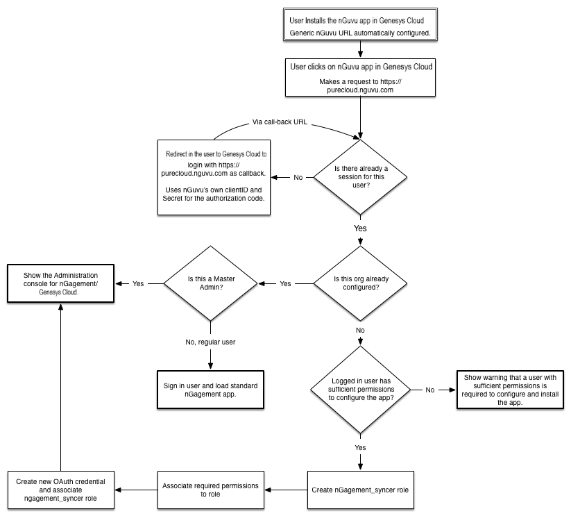

At nGuvu, we've recently launched the integration of nGagement with Purecloud. nGagement is a gamification solution for contact centers that automatically awards points to agents by looking at their different performance metrics and schedules. The platform supports features such as Agent vs Agent challenges, contests, quiz, leaderboard, quality monitoring, etc. Thanks to Purecloud's API and notifications, nGagement can provide points calculations in real-time.

In this blog post, we will present the different steps we've included in our configuration flow when adding nGagement on Purecloud. Our main objective for this flow was to reduce the number of manual steps involved for the customer (hence reducing the chances of errors or misconfigurations) and provide full transparency with the different actions we are taking on their org. 

nGagement requires different type of access and permissions to the customer's Purecloud org. We are presenting here the on-boarding flow that we've used to simplify as much as possible the interactions with the user. Obviously your flow and requirements will vary but this blog post should give you a good starting point on how you can configure new customers' org with very few manual steps involved.

In this post we will present:

1. How to use your own authorization code to gather information about the user.
2. How to create a new role and associate permissions.  
3. How to programatically create an OAuth client credential.


## Overview
Here is an overall view of the on-boarding flow that we are using:



### 1. Obtaining an access token

When a user launches our app from the Purecloud UI, a GET call will be made to our app entry point: /purecloud/status on our Flask server which looks like:

```{"language":"python"}
@app.route('/purecloud/status', methods=['GET'])
@login_purecloud_required
def status():

	#Check if the org is already configured
	if company.is_org_configured(session['org_id']):
		return render_template('manage.html', title='nGagement - Manage your company', master_admin = session['master_admin'], name = session['name'])
	else:
		return render_template('not_configured.html', title='nGagement - Manage your company', master_admin = session['master_admin'], name = session['name'])
```

Since ***@login_purecloud_required*** is specified in this route, we will check (see code sample below) if the session of the user (our own session implementation, not the Purecloud one) contains an access_token. If so this means we've already got an authorization_code and there is no need to obtain a new one from Purecloud.

If the session does not have an access_token, we will check if the request has 'code' as one of its arguments (if not present, we will get one from Purecloud). This code would have been generated from a previous redirect to the login page of Purecloud and sent back to nGagement through the call-back.

```{"language":"python"}
def login_purecloud_required(f):
	@wraps(f)
	def decorated_function(*args, **kwargs):
		if not session.get('access_token'):
			session.pop("status", None)
			session.pop("access_token", None)

			code = request.args.get('code')
			if code:
				access_token = purecloud.getTokenFromCode(code)
				session['access_token'] = access_token
				session['status'] = "Valid"
				return f(*args, **kwargs)
			else:
				return redirect("https://login.mypurecloud.com/oauth/authorize?client_id=" + PURECLOUD_MASTER_CLIENT_ID + "&response_type=code&redirect_uri=" + SERVER_URL + "/purecloud/oauth/callback", code=302)
		else:
			return f(*args, **kwargs)

	return decorated_function

```

**Important:** As long as your own Purecloud organization (the one you got with your Dev account) is located in the same region as the Purecloud Org you are trying to authenticate with, you can use your own Code Authorization Client ID and Client Secret. You do not need to obtain a new Code Authorization from each customer you are trying to integrate with.
 
 
 In the code sample below we use our own Cliend ID and Client Secret as well as the code previously obtained in the callback to obtain an access_token:
 
```{"language":"python "}
def get_token_from_code(code):
	# Prepare for POST /oauth/token request
	requestHeaders = {
		'Authorization': 'Basic ' + base64.b64encode(PURECLOUD_MASTER_CLIENT_ID + ':' + PURECLOUD_MASTER_CLIENT_SECRET),
		'Content-Type': 'application/x-www-form-urlencoded'
	}
	requestBody = {
		'grant_type': 'authorization_code',
		'code': code,
		'redirect_uri': SERVER_URL + '/oauth/callback'
	}

	# Get token
	response = requests.post('https://login.mypurecloud.com/oauth/token', data=requestBody, headers=requestHeaders)

	# Check response
	if response.status_code == 200:
		responseJson = response.json()
		return responseJson['access_token']
	else:
		print 'Failure: ' + str(response.status_code) + ' - ' + response.reason
		return None
```

This access_token is used in all the following calls in order to execute API calls to Purecloud on behalf of the logged in user.
 

With this token, you can now query the Purecloud API and get details about this user. Here is an example of how you can query using the **users** API with an expand parameter in order to verify if the logged in user possesses the required roles to configure your application. In this example, we are looking for the **Master Admin** role.


```{"language":"python"}
def get_logged_in_user_details():

	requestHeaders = {
		'Authorization': 'Bearer ' + session['access_token']
	}
	
	response = requests.get('https://api.mypurecloud.com/api/v2/users/me?expand=organization,authorization', headers=requestHeaders)

	if response.status_code == 200:
	
		#Check if we know this Org
		responseJson = response.json()
		session['org_id'] = responseJson['organization']['id']
		session['user_id'] = responseJson['id']
		session['name'] = responseJson['name']

		roles = responseJson['authorization']['roles']
		session['master_admin'] = any(x for x in roles if x['name'] == "Master Admin")
	else:
		print 'Failure: ' + str(response.status_code) + ' - ' + response.reason
	
	return
```

### 2. Creating a new role and associate permissions

If you need to call Purecloud's API directly from your backend, you will need to create an OAuth client credential. For sake of transparency with the customer and in order to restrict our exposure, we prefer to create a new role with the strict minimum permissions required for our service and then apply this role to our client credential. 

The steps to create a new role and associate permissions are:

1. Using a POST call on the "https://api.mypurecloud.com/api/v2/authorization/roles" API, you can create a new role and obtain the generated role ID. Make sure your role does not already exist.
2. Then you execute a PUT on the same API and you pass your required permissions in the form of permission policies.

```{"language":"python"}
def update_nguvu_role_permissions(token, permissions, role_name, role_id):

	requestHeaders = {
		'Authorization': 'Bearer ' + token,
		'Content-Type': 'application/json'
	}

	requestBody = {
	   "name": role_name,
	   "permissionPolicies" : [
	   		{
	   			'domain' : 'analytics',
	   			'entityName' : 'userObservation',
	   			'actionSet': ['view']
		   },
	   		{
	   			'domain' : 'wfm',
	   			'entityName' : 'schedule',
	   			'actionSet': ['administer']
		   },
	   		{
	   			'domain' : 'wfm',
	   			'entityName' : 'activityCode',
	   			'actionSet': ['administer']
		   },
		   ],
	   'permissions': []
	   }

	full_url = 'https://api.mypurecloud.com/api/v2/authorization/roles/' + role_id

	response = requests.put(full_url, data=json.dumps(requestBody), headers=requestHeaders)

	# Check response
	if response.status_code == 200:
		return response.json()['id']
	else:
		print 'Failure: ' + str(response.status_code) + ' - ' + response.reason
		return None
```


### 3. Create OAuth client credential

Provided that your logged in user has the sufficient permissions, creating OAuth client credential programmatically is relatively straight forward. In the example below we create the new OAuth by supplying the role ID previously created, hence applying only the required permissions. We then save the client ID and secret for this Purecloud Org and use it for querying the Purecloud API from our backend to periodically gather performance data from the agents.

```{"language":"python"}
def create_client_credentials(token, role_id):

	requestHeaders = {
		'Authorization': 'Bearer ' + token,
		'Content-Type': 'application/json'
	}

	requestBody = {
	   "name": "nguvu_syncer",
	   "description": "",
	   "accessTokenValiditySeconds": 86400,
	   "registeredRedirectUri": [],
	   "secret": "",
	   "roleIds": [role_id],
	   "authorizedGrantType": "CLIENT_CREDENTIALS"
	   }

	response = requests.post('https://api.mypurecloud.com/api/v2/oauth/clients', data=json.dumps(requestBody), headers=requestHeaders)

	# Check response
	if response.status_code == 200:
		return response.json()['id'], response.json()['secret']
	else:
		print 'Failure: ' + str(response.status_code) + ' - ' + response.reason
		return None
```

### Conclusion

Although your flow and requirements will vary, hopefully these examples will be helpful for developing your own on-boarding flow.  

Another important part of the flow is the associated UI. We think that transparency with the customer is key and this is why we are explaining exactly in our configuration UI what are the different actions that we will be taking during the configuration of the application. We believe that creating our own role with only the required permissions makes it simpler for both our customers and us to understand the permissions we have on their system. 

Thanks for your time.
