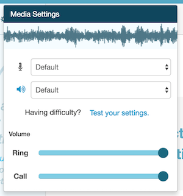
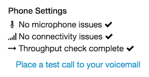
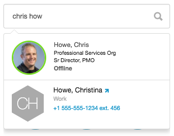
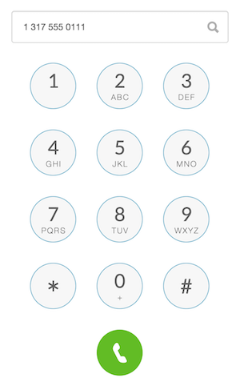
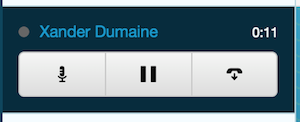
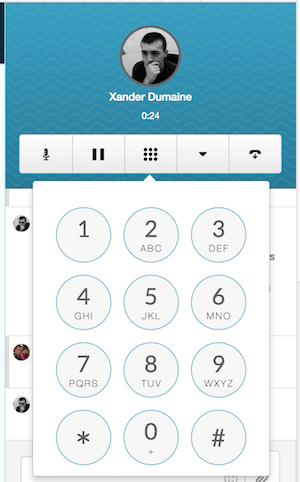

Last year, &Yet [wrote a great series](https://blog.andyet.com/2016/01/21/att-webrtc-ux-series/) of blog posts with AT&T about WebRTC UX. We love to see this kind of focus in the [WebRTC](https://webrtc.org/) community, because it shows an intersection of classic technology and modern web experience.

Many of those posts, however, focus on the UX of video chat; just one feature possible with WebRTC. [PureCloud](https://www.mypurecloud.com/) offers a WebRTC soft phone for a complete telephony experience. This includes support for auto answer, ACD, IVR, DTMF, and more. This is great opportunity to experiment with redefining the experience of a classic office desk fixture: the phone.

Now that the phone lives entirely in the browser, the call controls can exist in multiple places. The controls can be centralized, seamlessly integrated with the application, built into a toolbar for another application, or anything else. The call controls within PureCloud are just REST requests to our [Public API](https://developer.mypurecloud.com/), and the call audio path is WebRTC.

There are a few sections into which we can break up the experience:

## Before Calling

In the realm of video chat, many apps have a "hair check" screen for verifying settings and preparing the user. With a WebRTC phone, the user has to be able to verify all of her settings before receiving an incoming call, or before making an outgoing call. Establishing and answering a call (especially in contact centers) has to be as fast as possible.

Device selection is the first step. The user has to be able to use her preferred microphone for audio input. Headsets are common for achieving high quality audio, and it shouldn't be left up to the browser to select the default (which is often the built-in microphone). The same applies to the audio output device. The user almost definitely does not want the call audio blasting through speakers in an office - use that headset.

The next step is microphone verification. Once a user selects her preferred microphone, the application should provide immediate feedback that the microphone actually works. There are a number of technical ways to achieve this, but it's important to show to the user that the microphone is functional and the application is receiving audio from it.

PureCloud has a few helpful additions to make the user experience even better:

Volume controls allow the user to set the ringer volume and the audio volume discretely. Since both ringer and call audio are connected by an audio element or the WebAudio API directly, the volume for each is adjustable. This allows the user to tweak her experience for comfort. Remember, a phone ringing all day can be exhausting!

A complete troubleshooter allows the user to verify that her microphone works, that her network will allow a WebRTC connection, and that her bandwidth is sufficient. [test.webrtc.org](https://test.webrtc.org/) has an awesome suite of tests that [we adapted into a library](https://github.com/MyPureCloud/webrtc-troubleshooter) for easier drop-in use in your WebRTC application.

### Placing and Receiving Calls

Since you're building a phone app in the browser, you can augment dialing. Users may call a number, a person, or any other type of entity. Can you tie this in with searching, [external contacts](https://help.mypurecloud.com/articles/about-external-contacts/), or [internal profiles](https://help.mypurecloud.com/articles/default-profile-layout/)? PureCloud provides all of the above in a unified search + dial pad.

If you're using traditional telephony, you'll need to also provide a dial pad for regular ol' numbers. Interestingly, this dial pad should also provide the traditional contextual buttons with letters and numbers. Users may need to dial numbers corresponding to standard letter groupings (Like 1-800-General-Now!).

If your app supports incoming calls, make sure it's clear, easy, and fast to answer. You may use audible alerts, an always-on-top answer button, or even native browser notifications, in case the app is not in focus when the call arrives.

## During the call

First off the bat: All of those settings for changing devices and volume? Those should work during the call too. No excuses.

Call controls critical for a complete telephony experience. Mute, hold, hangup, transfer, add participant, and more, are all expected by business users. DTMF support is also necessary. In the absence of a physical phone to press buttons for navigating IVRs or entering conference room numbers, for example, your application must again make use of that dial pad.

*Note: PureCloud uses our Public API for all call controls and DTMF, and reflects the state on the WebRTC connection (i.e., removing/adding an audio stream when muted/held/resumed). This allows us to isolate control and state from audio path. Fortunately, this is all orthogonal to the UX, so you can implement it however works best for you.*

Phone calls allow users to speak with low friction. For business users and contact center agents alike, the phone is a natural extension for communication, and the experience must be smooth.

---

*This post was originally published on [blog.xdumaine.com](https://blog.xdumaine.com/webrtc-phone-ux/)*
