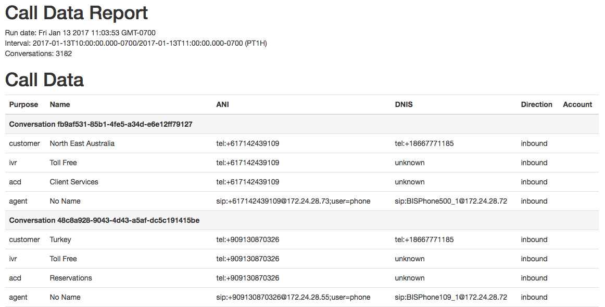
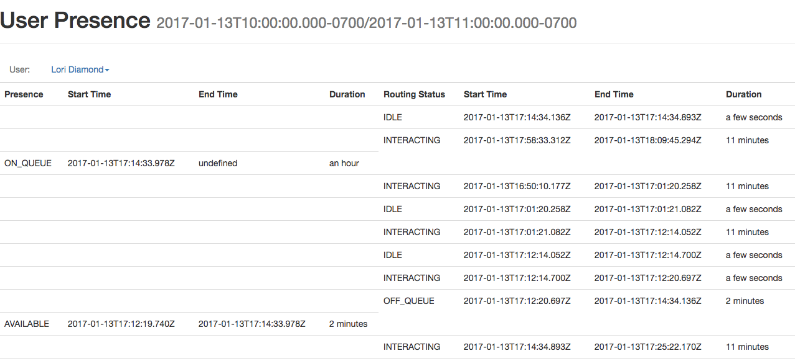

The Open Data Exporter is an open source configurable node.js service that executes PureCloud API requests, performs data calculations and transformations, and exports the data into templates. This application serves as a starting point for building data export integrations. Common use cases include:

* Providing historical data to an external WFM system
* Generating contact reports to import into an external CRM system
* Generating contact center reports to email to supervisors

## Features

* Robust templating support powered by [doT](http://olado.github.io/doT/)
* Make PureCloud Platform API requests without writing any code
* All post-processing data calculations are fully configurable and programmable
* Ability to execute multiple queries and multiple transformations and use the resulting data in one or more templates
* Write output to dynamically determined locations and files

## Resources

* Open source project: [https://github.com/MyPureCloud/open-data-exporter](https://github.com/MyPureCloud/open-data-exporter)
* Project documentation: [https://github.com/MyPureCloud/open-data-exporter/wiki](https://github.com/MyPureCloud/open-data-exporter/wiki)

## How it Works

The Open Data Exporter processes the [configuration file](https://github.com/MyPureCloud/open-data-exporter/wiki/Configuration-Files) provided when it is run. The configuration file provides the necessary information to instruct the app to make API requests, process the output, and export the data using a template.

### Organizational Structure

The configuration file contains data for:

* PureCloud - settings for connecting to PureCloud
* requests - settings for how and which API requests should be made
* transforms - settings for how API responses should be manipulated
* templates - settings to define templates that will be used to format the data for ouput
* exports - settings to control where output files are placed
* configurations - a grouping of references to settings defined in sections above to instruct the app when and where to use them
* jobs - settings for groupings and scheduling of configurations

### App Execution

When the app is run, it will load the configuration file and create cron tasks (within the app) to execute the desired configurations on the desired interval. When a configuration is invoked, the following actions are taken:

1. API requests are made
2. Transforms are applied to the responses
3. Transformed data is used to execute templates to generate output content
4. The output content is exported

### Templates and Extensions

The app uses [doT](http://olado.github.io/doT/) to process templates. Refer to the doT documentation to learn more about the template syntax and feature support.

Extensions are node modules that can be called from within the template to manipulate data. Common use cases for extensions are to provide real-time date calculations, format values, or perform complex logic to control conditionals in the template. This is a very powerful and extensible feature of the doT engine that allows for complex and intricate templates. 

For more information, see the [Deep Dive | Templating](https://github.com/MyPureCloud/open-data-exporter/wiki/Deep-Dive-%7C-Templating) wiki page in the repo.

## Pre-built Configurations

The project contains some pre-built configurations. Each configuration serves as an example of utilizing various features and output formats.

### Example: Abandon Report

This report retrieves conversation data where an ACD segment was abandoned and writes out detail information to a flat file. The file is formatted with several lines of header information followed by rows of pipe-delimited data identifying abandonded calls. 

For more information about this report, see this report's [configuration documentation](https://github.com/MyPureCloud/open-data-exporter/wiki/Example-%7C-Abandon-Report).

**Sample Output**

~~~
ABANDONED CONVERSATIONS
Run date: Fri Jan 13 2017 10:56:45 GMT-0700
Company: Genesys
Interval: 2017-01-13T10:40:00.000-0700/2017-01-13T10:50:00.000-0700
Job: Abandons job
Configuration: Abandons Configuration
Conversation ID|Queue|Customer Name|ANI
e84f837d-d780-45af-bbdf-cad1c9c9faf9|Product Sales|Australia|tel:+610209985555
bb899c5d-a1c5-4a76-91c5-f3bbc45729d4|Help Desk|Spencer TN|tel:+19319465555
1b0d0b4c-444f-45b0-abb4-298b58499c9a|Personal Advocates|Georgia|tel:+99598462065555
e3f27875-1092-4810-bd71-90153d4198f0|Product Sales|Luxembourg|tel:+352945555
9552f212-2e63-4985-b21f-c1d219edcc11|Help Desk|Australia|tel:+610525175555
~~~

### Example: Call Detail Report

This example illustrates using the results of one request to make additional requests. Specifically, the results from an analytics conversation detail query are used to generate a list of conversations to request individually for the purpose of retrieving participant data that is not available in the analytics data. The configuration adds the participant data to the analytics data, and the output template display the value of the custom participant attribute `accountNumber`.

This example outputs a HTML file, as opposed to a flat text file. The report configuration could be customized to distribute this report by uploading it to a web server, integrating with an email provider to send it as an email, or any method of integraton possible from a node.js application.

For more information about this report, see this report's [configuration documentation](https://github.com/MyPureCloud/open-data-exporter/wiki/Example-%7C-Call-Detail-Report)

**Sample Output**

### Example: Presence Report

This report retrieves user presence and routing status detail data and writes it out to a user-centric report. The configuration illustrates aggregating user information to display it in a webpage-style report.

This example outputs a HTML file, as opposed to a flat text file. The report configuration could be customized to distribute this report by uploading it to a web server, integrating with an email provider to send it as an email, or any method of integraton possible from a node.js application. 

For more information about this report, see this report's [configuration documentation](https://github.com/MyPureCloud/open-data-exporter/wiki/Example-%7C-Presence-Report)

**Sample Output**

