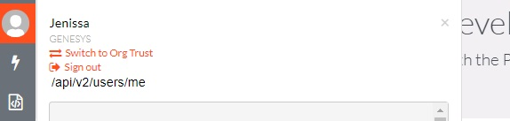
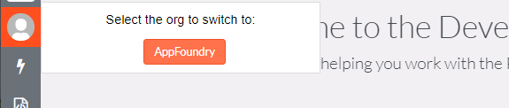

[Authorized organizations](https://help.mypurecloud.com/articles/about-authorized-organizations/) are a best practice when accessing other organizations besides a user's home organization. A use case would be a Genesys partner with their PureCloud org that needs access to one of their customer's orgs to do setup and configuration. You can create a new user in the customer org for that person. Still, they have to remember not only the password to the other organization but also the organization's name and specify the name when logging in. 

## Logging in

The user utilizes their standard credentials when organization authorization is set up. Still, after logging in, they are presented with a list of organizations that they have access to and can select the organization from that list. This flow works for the PureCloud app and can be used in custom applications; this blog walks through the steps the custom application needs to take to handle.

The process of logging in is exactly the same for authorized organizations as it is for a regular organization. The organization selected is part of the login process and is handled by PureCloud. After you initiate the OAuth flow, you end up with an access token that works with the organization the user selected during login.

## Validating organization
Expand on the current user's organization information using [GET /api/v2/users/me?expand=organization](https://developer.mypurecloud.com/api/rest/v2/users/index.html#getUsersMe); the organization details show the organization the user selected on login. If you are restricting access in your application to specific organizations, this might cause a problem because if you expect only users from the partner organization to log in, you'll get the id of the customer organization now. To determine if the user is logged into an organization that isn't their home organization. Now, you want to expand on _token_ details for the user ```GET /api/v2/users/me?expand=organization,token```

The token details look similar to the following code.

```json
{
```{"language":"json"}
"token": {
    "organization": {
      "id": "2a3a43e5-e89c-406e-badf-e79288bd4ab0",
      "name": "customerorgname"
    },
    "homeOrganization": {
      "id": "4b70ee8c-24d8-43ad-9464-520f6b20fa1f",
      "name": "partnerorgname"
    },
    "OAuthClient": {
      "id": "08a2a69c-1ed5-4719-9094-96a7d55ba07c",
      "name": "MyCustomAppName",
      "organization": {
        "id": "4b70ee8c-24d8-43ad-9464-520f6b20fa1f"
      }
    }
  }
```

Here you can see that organization and home organization have different values; if I were logged into my home organization, the values would be the same. These details can be used to validate if the user has access to your application instead of using an organization.id, you can use token.homeOrganization.id to validate your user's organization.

## Switching back to home organization

When logged into an organization that isn't the user's home org, you might want to provide the option to switch back to their home organization. This is done in the PureCloud client and Developer Tools by providing a button in the top right corner to switch.



Here in the Developer Tools, we show clearly that the user is not logged into their home organization and then provide the home button to switch them back to their home organization.

This switch is done by doing a browser redirect back to _login.<purecloudenvironment>.com_ and specifying in the query string ```target=<homeorgid>``` 

```https://login.${env}/oauth/authorize?client_id=${oauthConfig.clientId}&response_type=token&redirect_uri=${oauthConfig.redirect}&target=${me.token.homeOrganization.id}```

## Organization switching in practice

[This commit](https://github.com/MyPureCloud/developer-tools/commit/4be0f43901ee32e0f8aaec0e949b468f7891f2ef) to GitHub is where switching was added to the Developer Tools.

The two key points here are where we check if we are in a trusted org in ```app/components/header-bar.js```

```json
{
```{"language":"js"}
isInTrustedOrg: computed('purecloud.me', function() {
    let me = this.get('purecloud').get('me');
        if(!me){
        return false;
    }
        if(me.token && me.token.organization && me.token.homeOrganization){
        return me.token.organization.id !== me.token.homeOrganization.id;
    }    
    
    return false;
}),
```

and then in the same file where we switch back to the home org

```json
{
```{"language":"js"}
switchToHomeOrg(){
    let oauthConfig = config.oauthProps[purecloudEnvironment()];
        let env = purecloudEnvironmentTld();
    let me = this.get('purecloud').get('me');
        let redirect = `https://login.${env}/oauth/authorize?client_id=${oauthConfig.clientId}&response_type=token&redirect_uri=${oauthConfig.redirect}&target=${me.token.homeOrganization.id}`;

    window.location.replace(redirect);
}           
```

## Taking it a step further

So far, we have reproduced the functionality in the PureCloud client where when we log in, we can select the organization we want to use, and if we aren't in our home organization, we can switch back to it. This took a couple of iterations to get the correct API call; first, I found ```GET /api/v2/orgauthorization/trustees``` but that required permission from the ```authorization:orgTrustee:view``` in the home organization, which did not list users who were part of a trust, but did list trusts that my user did not have access to. That had me wondering if we were in our home organization. Can we use the same logic to switch into a trustor organization?

I viewed ```GET /api/v2/orgauthorization/trustors/{trustorOrgId}/users```, which gives me a list of trusted users in an organization. The specific API call required the ```authorization:orgTrusteeUser:view``` permission in the trustor organization, which I did not have in my dev setup. So I looked beyond the Organization Authorization category and found ```GET /api/v2/users/{userId}/trustors``` which I figured would work if I used my own user's id, but that required the ```authorization:orgTrustor:view``` permission which my users might or might not have. Finally, I remembered the trusty old ```GET /api/v2/users/me``` which conveniently has a ```trustors``` expands on it, so calling ```GET /api/v2/users/me?expand=trustors``` gives me the organizations which have trusted my user. Now I can use that call which happens when the Developer Tools bootstraps and determine my trust from there

```json
{
```{"language":"js"}
getTrustedOrgs: Ember.observer('purecloud.me', function() {
    this.orgTrusts.clear();

    let me = this.get('purecloud').get('me');

    if(!me || !me.trustors){
        return false;
    }
    
    me.trustors.forEach((trust)=>{
        if(trust.enabled){
            this.orgTrusts.pushObject(trust.organization);
        }
    });

    this.set("isTrustedOrg", me.trustors.length > 0);
            
})
```

Now when my user is logged into their home organization, I can provide a list of buttons to switch to an organization they trust.



The move to add this logic happened in a couple of commits. Still, the result is that everything is encapsulated in a single service which can be found [here](https://github.com/MyPureCloud/developer-tools/blob/master/app/services/orgauthorization-service.js). Hopefully, now you have a better understanding of organization authorization and how to put that logic into your application.