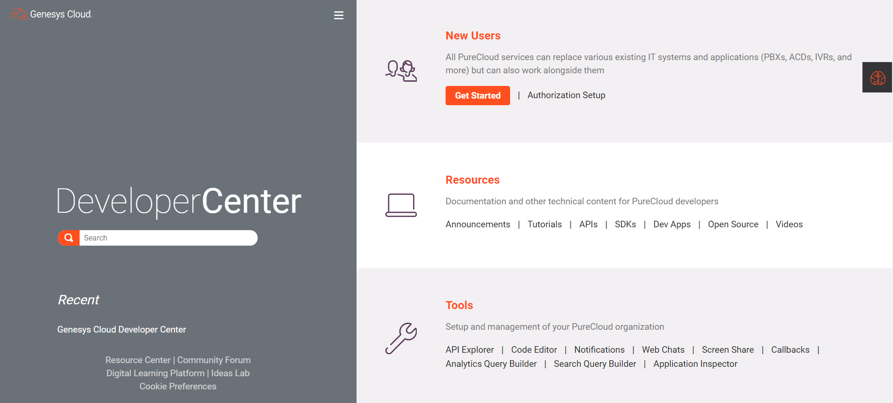

Every developer has written a "Hello, world" program when learning to program. A hello world application is a program that demonstrates basic functionality as a proof of concept. Even as programming languages, software architectures, and physical (and digital!) infrastructures change, the concept is consistent: new developers learn the basics of the environment and create a sample application demonstrating that they've learned the fundamentals.

Engaging the development community to drive growth and adoption of the PureCloud platform is one of Genesys' key goals. The [PureCloud Developer Center](/) follows these guidelines to deliver quality resources and enable the developer community:

* Documentation by developers **for** developers
* Built for daily use **not** as a documentation reference
* Built by our platform developers **for** developers
* Automation in deployment **and** updates
* Accountability: The developer of the API **is the author** of the documentation

But there's always room for improvement. We wanted to streamline the onboarding process, so developers can get up and running — and building — fast. Last month, we released a completely redesigned and refreshed PureCloud Developer Center with a focus on the developer experience; our primary goal is a frictionless experience for our builders and accelerate their time to 'Hello, world'.

The Developer Center offers traditional resources such as [API](/api/) and [SDK](/api/rest/client-libraries/) documentation, [open source code](/opensource/) examples and step-by-step [tutorial](/api/tutorials/) projects. Our API and SDK reference material are authored by Genesys development staff as a part of the definition of 'done' in-line within

their code. The concept of 'for us, by us' is ingrained within our development staff. For example, when we update an API endpoint or add data to a payload, the documentation is included in the pull request that's reviewed by development management and peers.

Most importantly, builders leveraging the Developer Center are treated to easy-to-use Developer Tools that enable them to extend the platform using their own innovation. 

* **[API Explorer](/developer-tools/#/api-explorer)** Execute any platform API call against a PureCloud organization 
* **[Code Editor](/developer-tools/#/codeeditor)** Run your code leveraging our platform SDK against a PureCloud organization 
* **[Notifications](/developer-tools/#/notificationtester)** Subscribe to our platform notifications and stay up-to-date on platform events, changes and real-time events 
* **[Web Chats and Callbacks](/developer-tools/#/webchat)** Test interaction flows using these easy-to-use methods to generate test customer interactions 
* **[Analytics and Search Query Builders](/developer-tools/#/analytics-query-builder)** Create your own platform queries against a PureCloud organization in a matter of minutes

**Note:** Developer Tools require an active PureCloud account to access them.

These tools are built for ease-of-use... they're so easy, in fact, even a non-developer like myself can use them!

The Developer Center also offers a forum curated by a team of Developer Evangelists — Genesys empoyees and contributors to the core platform of PureCloud. You can use the forum to engage with these experts on best practices, functional capabilities and common issues. But the forum also has an active community of builders who might answer your question before we do!

Check out the new and improved PureCloud Developer Center. If you've never made an API call, I'll bet you can use our "Get Started" guide and do it in under two minutes!
