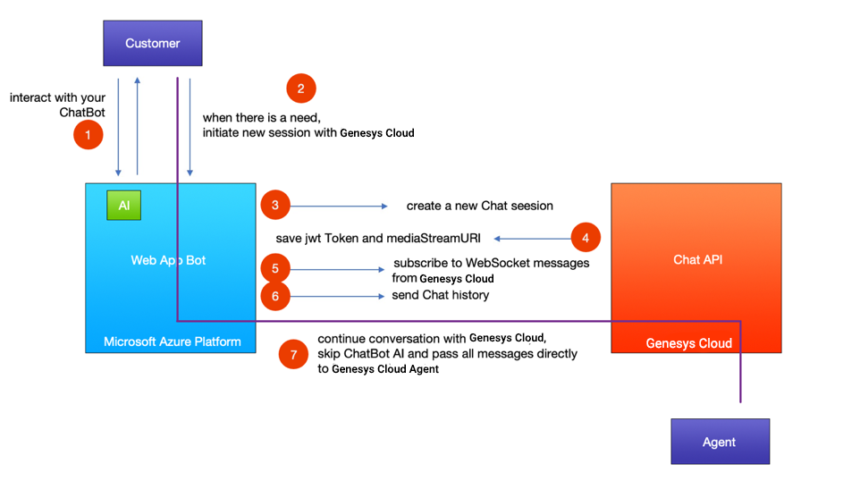

PureCloud will be introducting [Guest Chat APIs](/api/webchat/guestchat.html) in an upcoming update. They are currently in beta as of this writing. Using these Guest Chat APIs and a little bit of development you can create a fully functional Chat Bot integrated with PureCloud. This will provide a seamless experience for the end Customer (capability: switching between the Bot engine and a real Agent) along with access to multiple channels like Skype, Facebook Messenger, Slack and more.


<iframe width="987" height="564" src="https://www.youtube.com/embed/ZmQDvkmd0gg" frameborder="0" allow="accelerometer; autoplay; encrypted-media; gyroscope; picture-in-picture" allowfullscreen style="margin: 30px auto; display: block;"></iframe>

This solution was built with the help of the Microsoft Bot Framework (hosted in Azure) used as the Web App Bot resource. Microsofts Bot Framework is capable of hosting a C# or NodeJS service that implements for the actual Bot logic. Artificial Intelligence (AI) / Dialog Recognition is built using the [Bot Framework SDK v4](https://docs.microsoft.com/en-us/azure/bot-service/?view=azure-bot-service-4.0). 
The Bot connection to PureCloud is also handled from the same service, thanks to the Guest Chat API from PureCloud. Source code is available for free and you can clone it from this [BitBucket Repo](https://bitbucket.org/eccemea/mypurecloud-bot/src/master/).

## Requirements
  
* Enable the new Chat API in your PureCloud organization
* Use alpha UI to be able to respond to the incoming messages from the Chat 
* [Git](https://git-scm.com) required to edit / push your own version of the Bot
* A Bitbucket / Github account
* A queue to transfer your chat requests to
* Create a Web Chat Deployment in your PureCloud organization. Please follow this [documentation](https://help.mypurecloud.com/articles/add-web-chat-deployment/) ink in case this is not present in your org
* If you want to use the Microsoft Azure Platform, create an account here: (https://portal.azure.com) 

You can find more details about Microsoft Bot Service on this page [link](https://azure.microsoft.com/en-us/services/bot-service)

## Architecture

Below is a simplified scheme of this architecture:


## Integration Details

At the beginning, the customer talks to the Bot engine directly. All answers are processed by the Bot SDK inside function onTurn() located in bot.js:

```{"language":"javascript"}
// Listen for incoming activities and route them to your bot main dialog.
server.post('/api/messages', (req, res) => {
  adapter.processActivity(req, res, async (context) => {
    // route to main dialog.
    await bot.onTurn(adapter, context);
  });
});
```

This is the place where all logic / AI should take place. One additional line is required to save history for conversation between Customer and Bot. Once the call is transferred to PureCloud, we will push it as a single message.

```{"language":"javascript"}
this.conversationState.history.push('Bot:\t\t My response');
```

Once you need to transfer the customer to a real Person (PureCloud agent), we will redirect requests to the "startChat()" function. It's important to pass the current context of the call since that service will send messages back to the customer every time it will receive message in PureCloud.

```{"language":"javascript"}
switch (turnContext.activity.text) {
  case 'transfer':
    pc.startChat(_adapter, TurnContext.getConversationReference(turnContext.activity), this.conversationState);
    this.conversationState.history.push('[...]');
    await turnContext.sendActivity(`Bot response');
    userProfile.purecloud = true;
    break;
```

To initiate a Chat session with PureCloud we use the Guest Chat API (Beta available). Two HTTPs requests are needed to properly start the Chat Session.

First, you need to create a Chat Session to your PureCloud organization (you should include your environment as well as your deploymentId, organizationId and queue name where Chat should be directed):

```{"language":"javascript"}
let myBody = {
  "organizationId": organizationId,
  "deploymentId": deploymentId,
  "routingTarget": {
    "targetType": "QUEUE",
    "targetAddress": queueName
  },
  "memberInfo": {
    "displayName": "<Name>",
    "profileImageUrl": "<imageUrl>",
    "customFields": {
      "firstName": "<FirstName>",
      "lastName": "<LastName>"
      }
    }
  };
  let options = {
  url: 'https://api.' + env + '/api/v2/webchat/guest/conversations',
  method: 'POST',
  headers: {
    'Content-Type': 'application/json'
  },
  body: JSON.stringify(myBody)
};
```

A successful response looks like the following:

```{"language":"json"}
{
  "id": "c4c2e5a6-f01e-48ed-960a-68d48c3e0d05",
  "jwt": "eyJhbGciOi...",
  "eventStreamUri": "wss://carrierpigeon.mypurecloud.com/v1/token/eyJhbGciOi[...]",
  "member": {
  "id": "8dd184ac-c481-4d67-bb33-bd6976b1b5f0"
}
```

Once you open a WebSocket connection to the eventStreamUri, all of the relevant events for the conversation will start coming to you and the Chat Session will start being processed by PureCloud.

```{"language":"javascript"}
webSocket = new WebSocket(info.eventStreamUri);
 webSocket.on('open', function () {
 //Connection is open. Start the subscription(s)
 });
```

A Jwt Token is used to send new messages to the PureCloud Chat via `POST /api/v2/webchat/guest/conversations/{conversationId}/members/{memberId}/messages`.

From that moment on, you should verify if PureCloud chat variable is set to true for all incoming messages and skip the Bot logic for responses and route messages directly to the PureCloud Chat.

For Production usage, this flag as well as the conversation history with a Bot should be saved in a Database connected directly with a current Bot conversationId tied to the Customer. Bot is active for entire live conversation. It is a middleware, works like a proxy between Customer and PureCloud Agent.

## Current Limitations

* Sources available in Bitbucket use global variables and share history entries for all incoming interactions
* Current implementation uses PureCloud Deployment without Authentication

