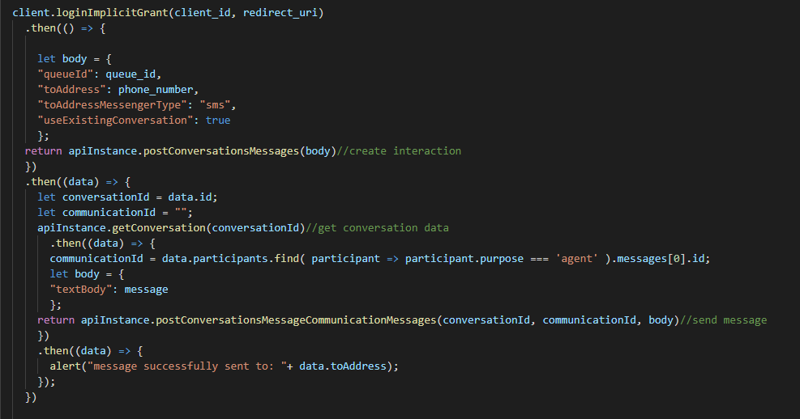

One of the most convenient communication means today is through SMS messaging. With PureCloud an organization can handle inbound and outbound SMS messaging after very few and easy configurations. To set up SMS messaging, first [Purchase SMS Number](https://help.mypurecloud.com/articles/purchase-sms-numbers/), and for SMS pricing details, see [ACD messaging and SMS pricing](https://help.mypurecloud.com/articles/acd-messaging-pricing/). It is also important that SMS and messaging features are enabled. Contact your designated Customer Success Manager or email CloudSales@genesys.com if the features are not available.

## Inbound SMS messaging
Inbound messaging uses Automate Call Distribution (ACD) to route message interaction. For a step by step instruction on how to set up the advance message routing, see below instructions:
1.	Create a simple queue 
2.	[Configure message flows in Architect](https://help.mypurecloud.com/?p=150191)
3.	[Add an inbound message route](https://help.mypurecloud.com/articles/add-inbound-message-route/)

## Outbound SMS messaging
For an agent to receive credit on the outbound SMS messages, the message must be sent on behalf of queue. To set up a queue for outbound SMS message, assign the purchased SMS number as an Outbound SMS Number:
… Picture
Create a new interaction by selecting Send Message, select the queue and providing the number you wish to contact.
… picture

### Automate Outbound SMS with Platform API
For the sample code to work, a queue and Outbound SMS Number must already be set up. The below sample code will create interaction from the assigned queue and and send message using the Platform API.

