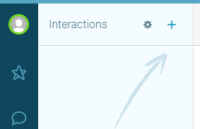

One convenient means of communication today is through messaging. With PureCloud ACD and SMS messaging feature an organization can handle inbound and outbound SMS messaging after a few configuration and allow communication without the holding time. If SMS and messaging features are enabled, contact your designated Customer Success Manager or email CloudSales@genesys.com if the features are not available. 

To start setting up SMS messaging, we need to first [Purchase an SMS Number](https://help.mypurecloud.com/articles/purchase-sms-numbers/) (to see SMS pricing details, go to [ACD messaging and SMS pricing](https://help.mypurecloud.com/articles/acd-messaging-pricing/)). The number will be use as inbound and outbound number. 

## Inbound SMS Messaging
Inbound messaging uses Automate Call Distribution (ACD messaging) to route message interactions to a specified queue. For a step by step instruction on how to set up the advance message routing, see below instructions:
1.	[Create a queue](https://help.mypurecloud.com/articles/create-queues-2/).
2.	[Configure message flows in Architect](https://help.mypurecloud.com/?p=150191).
3.	[Add an inbound message route](https://help.mypurecloud.com/articles/add-inbound-message-route/) using the purchased number.

## Outbound SMS Messaging
For an agent to receive credit on the outbound SMS messages, the message is sent on behalf of a queue. To set up a queue for outbound SMS message, first assign the purchased SMS number as an Outbound SMS Number.

**Admin > Contact Center > Queues > Message > Outbound SMS Number**  
  


Second, start a conversation by selecting the **+** in the interactions, select the queue and provide the number you wish to contact.  
  
  

You can also check the article [Send an SMS message](https://help.mypurecloud.com/articles/send-an-sms-message/), to learn a way to start a new interaction window with PureCloud for Chrome, PureCloud for Firefox, PureCloud for Salesforce, and PureCloud for Zendesk.

### Automate Outbound SMS with Platform API
For the sample code to work, a queue and Outbound SMS Number must already be set up. The below sample code will create interaction from the assigned queue and send message using the Platform API.  

```javascript
client.loginImplicitGrant(client_id, redirect_uri)
.then(() => { 
    
  let body = {
  "queueId": queue_id,
  "toAddress": phone_number,
  "toAddressMessengerType": "sms",
  "useExistingConversation": true
  };                
return apiInstance.postConversationsMessages(body)//create interaction         
})
.then((data) => {       
  let conversationId = data.id;
  let communicationId = "";  
  apiInstance.getConversation(conversationId)//get conversation data
    .then((data) => {
    communicationId = data.participants.find( participant => participant.purpose === 'agent' ).messages[0].id;
    let body = {
    "textBody": message
    };           
  return apiInstance.postConversationsMessageCommunicationMessages(conversationId, communicationId, body)//send message
  })
  .then((data) => {
    alert("message successfully sent to: "+ data.toAddress);
  }); 
})
```

**Important:** Check [Javascript SDK](https://developer.mypurecloud.com/api/rest/client-libraries/javascript/), [API Explorer](https://developer.mypurecloud.com/developer-tools/#/api-explorer) and [API Resources](https://developer.mypurecloud.com/api/rest/v2/) for more information regarding Platform API.
