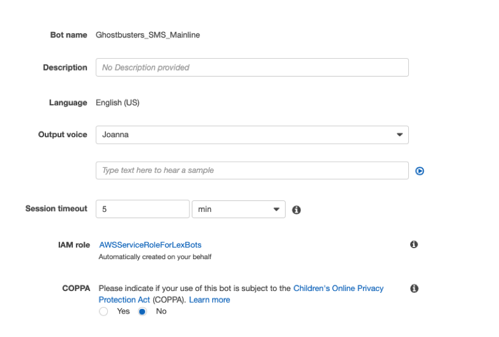
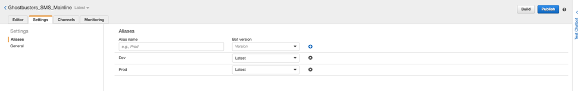
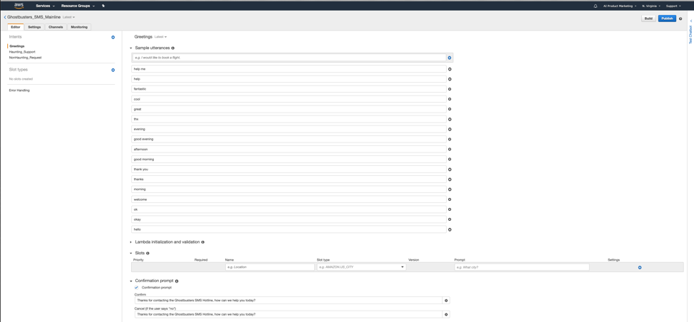
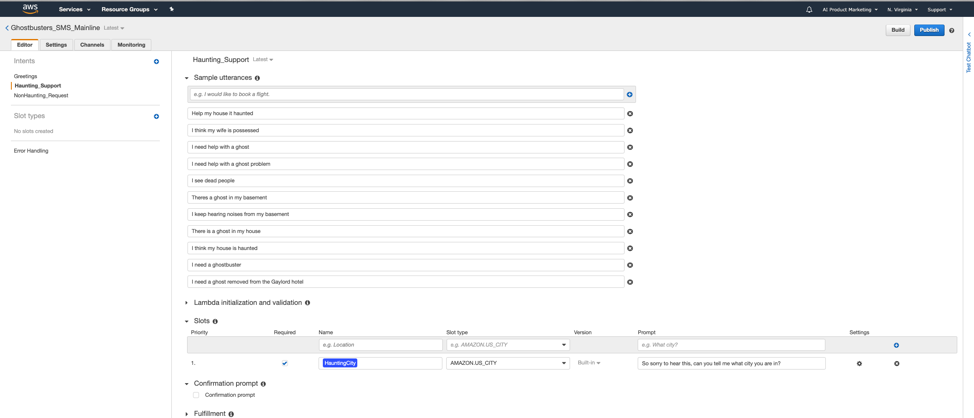
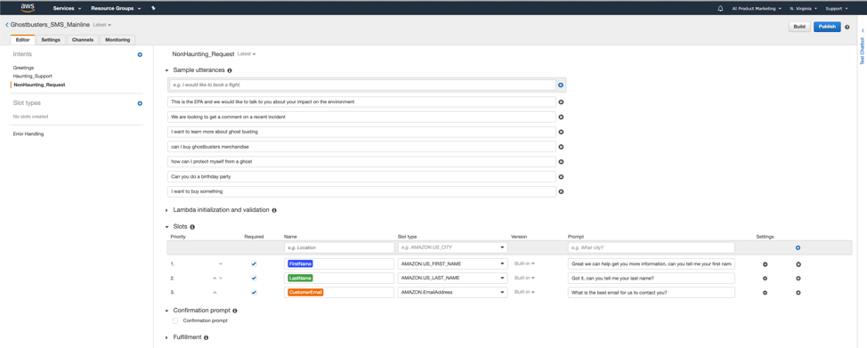
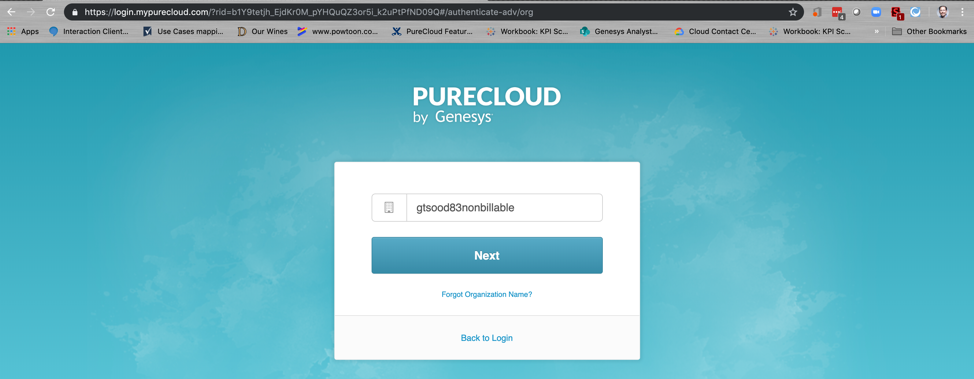
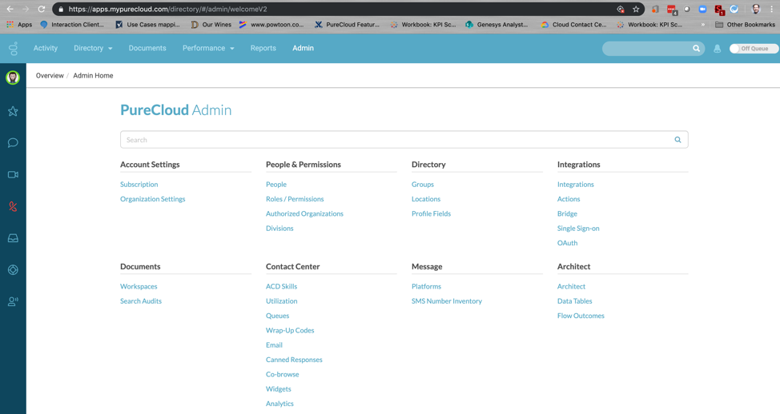
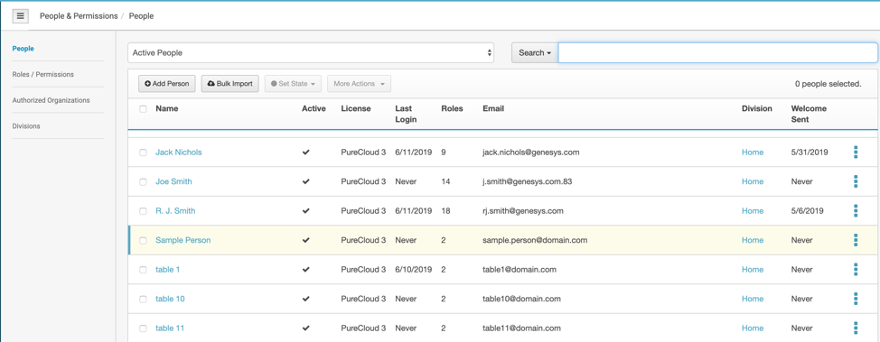
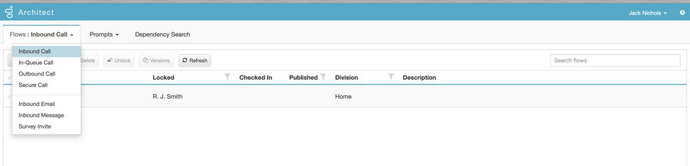
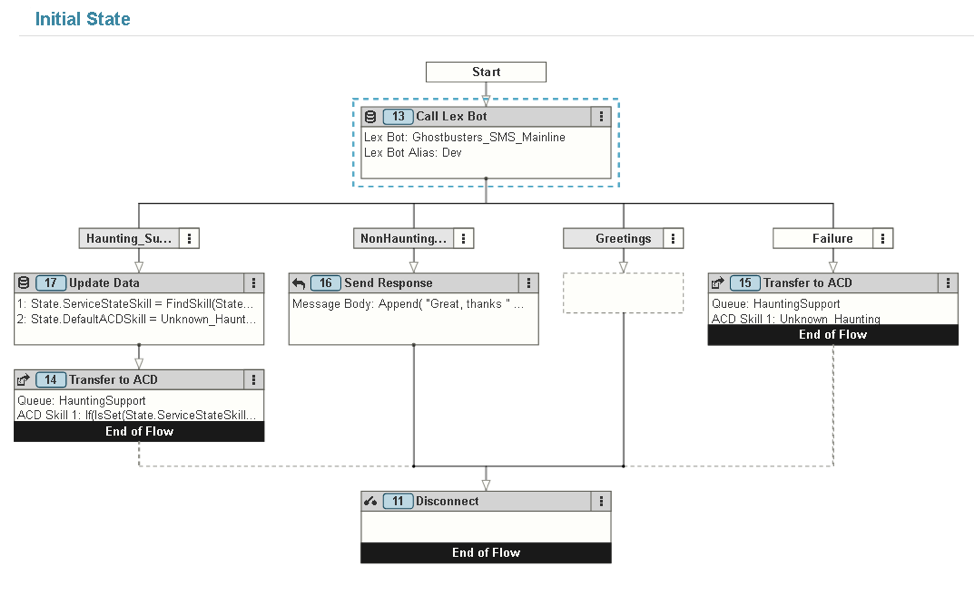

Since we released our PureCloud and Amazon Lex integration last year we have spent a lot of time with customers to explain the integration, talking about about how to best use the technology to solve their use cases, and honestly helping dispel the myths around the technology.  Thus we decided for our Genesys Xperience19 conference this year we wanted to show how easy it is to create an interaction flow in PureCloud integrated with a bot built with Amazon Lex. What better way to showcase this than to build a bot for one of our favorite 80’s small businesses, the Ghostbusters! 

Like any growing business the Ghostbusters are dealing with some of the common issues:
* trying to keep up with the growing ways people want to communicate with them
* trying to make sure they can address the most urgent communications first
* and trying to manage a national business with different regional franchises.

In this workshop we are going to show you how easy it is to create an SMS bot that will handle basic interaction steering based on intent, data collection, and hand-off of the interaction from the bot to a human. This will help the Ghostbusters improve their customer experience and get them on their digital transformation journey.

 
Example customer-to-bot conversation use case and blended AI handing the conversation to a live Ghostbuster in the right state:

::: 
**Customer:** Hello

**GhostBusters_SMSBot:**  Thanks for contacting the Ghostbusters SMS Hotline, how can we help you today?

**Customer:** Theres a ghost in my basement

**GhostBusters_SMSBot:**  So sorry to hear this, can you tell me what state you are in?

**Customer:** Indiana

**<Hand the interaction from the GhostBusters_SMSBot to a human Ghostbuster in Indiana>**
:::

## Workshop Steps

Part 1 - Setting up the Amazon Lex Bot

* In part 1 we will utilize Amazon Lex to build a simple SMS bot that will take inbound SMS requests and identify if the intent of the request is urgent or non-urgent for routing. From there we will collect the needed customer information to continue to route the request to the correct end department.

Part 2 - Integrating your Amazon Lex bots into your PureCloud organization

* In Part 2 we will learn how to integrate Amazon Lex with PureCloud for use in architect flows. 
* _Note for the in person workshop this part will already be done_

Part 3 - Setting up the PureCloud Inbound SMS Flow

* In Part 3 we will setup an inbound PureCloud SMS Messaging flow integrated with your Lex bot for inbound message processing.

Part 4 -  Ways to expand the logic and use case

## Part 1 - Setting up your Amazon Lex Bot

To setup your Amazon Lex bot for this workshop you will need to login to your AWS account via the the [AWS Admin console](https://console.aws.amazon.com/console/home).

* _Note for live Xperience 19 workshop attendees use the AWS account and credentials at your table to login._

Create the new bot your Amazon Web Services account.

* Login to your Amazon services console
* Open the Amazon Lex service console
* From the Amazon Lex console, create a Custom bot with these settings (you can see these in the "Settings" tab later)

| Setting | Value |
| ------ | ------ |
| Bot Name | Ghostcustomers_SMS_Mainline_Group_{GroupNumber} |
| Output Voice | Joanna |
| Session Timeout | 5 minutes |
| IAM Role | Accept the Default AWSServiceRoleForLexBots |
| COPPA | NO |



2. Update the bots Error handling settings to something more human friendly.

	* Make sure you are on the “Editor” tab and navigate to the “Error Handling” settings.
	* Clarification prompts: **Thanks for contacting the Ghostbusters SMS Hotline, how can we help you today?**
	* Maximum number of retries: **1**
	*  Hang-up phrase: (one phrase) **Connecting…**

3. Setup the bot Aliases to support a development and product bot version

	* Click on the “Settings” tab for your bot.
	* Setup the following two Aliases

| Alias Name | Bot Version |
| ------ | ------ |
| Development | Latest |
| Production | Latest |



4. Now it’s time to create our intents for the bot, for this we will create 3 main intents for the bot:
	* **Greetings** – _We will use this for the common greetings that people will send to ensure the bot does hit error paths due to common courtesy responses._
	* **Haunting_Support** – _The Haunting_Support intent will be utilized to identify utterances that would be related to live haunting issues that the Ghostbusters needs to immediately respond to._
	* **NonHaunting_Request** – _Other items outside of immediate haunting requests we will capture information and route to a general requests queue for the Ghostbusters to address in a non-time sensitive manner._
 
 
### Greetings Intent
 
1. Next to Intent click the (+) and when prompted click on “create intent”.

2. When asked to name your intent you should name it “Greetings_Group_{groupnumber}”

	* _Note to use a string for the groupnumber, example Group_Ten_

3. This will provide you with a new blank intent for Greetings for you to setup Sample utterances to help the NLU identify phrases that would help identify the when a user should hit the Greetings intent.

4. For the Sample utterances we will want to populate 10+ common greeting utterances for the best results. Below is a table of 10 you can add, but you can add additional ones.

| Utterances | Utterances | Utterances |
| ------ | ------ | ------ |
| Thank You | Thanks | Good Morning |
| Morning | Afternoon | Good Afternoon |
| Evening | Good Evening | Welcome |
| Ok | Okay | Hello |
| Help | Great | Cool |
| Fantastic | Thx | TY |

5. We will want to setup a confirmation prompt to respond back to the user if we capture a greeting. We will:

	*  Check the box for “Confirmation prompt”
	* Confirm: Thanks for contacting the Ghostbusters SMS Hotline, how can we help you today?
	* Cancel: Thanks for contacting the Ghostbusters SMS Hotline, how can we help you today?

6. Lastly you will want to click on the “Save Intent” at the bottom of the screen to ensure you save all of the configuration you just setup.
 
 
 
### Haunting_Support Intent
 
1. Next to Intent click the (+) and when prompted click on “create intent”.

2. When asked to name your intent you should name it “Haunting_Support_Group_{groupnumber}”

3. This will provide you with a new blank intent for Greetings for you to setup Sample utterances to help the NLU identify phrases that would help identify the when a user should hit the Greetings intent.

4. For the Sample utterances we will want to populate 10+ common greeting utterances for the best results. Below is a table of 10 you can add, but you can add additional ones.

| Utterances | Utterances | Utterances |
| ------ | ------ | ------ |
| Help my house is haunted | I need help with a ghost | Help me with a ghost problem |
| I need help with a ghost problem | Help with a ghost | I see dead people |
| Theres a ghost in my basement | I keep hearing noises in my basement | There is a ghost in my house |
| There is a ghost in my basement | There is a ghost in my attic | I need a ghostbuster |
| Send a ghostbuster | I think my house is haunted | There is a ghost in the gaylord hotel |
 
5. For this Intent we will want to capture some information on the state where the haunting is happening so we will want to setup a slot to capture this information

	* Slot Name: **HauntState**
	* Slot Type: **AMAZON.US_STATE**
	* Slot Prompt: **So sorry to hear this, can you tell me what state you are in?**

6. Lastly you will want to click on the “Save Intent” at the bottom of the screen to ensure you save all of the configuration you just setup.

 
 
### NonHaunting_Request Intent
 
1. Next to Intent click the (+) and when prompted click on “create intent”.

2. When asked to name your intent you should name it “NonHaunting_Request_Group_{groupnumber}”

3. This will provide you with a new blank intent for Greetings for you to setup Sample utterances to help the NLU identify phrases that would help identify the when a user should hit the Greetings intent.

4. For the Sample utterances we will want to populate 10+ common greeting utterances for the best results. Below is a table of 10 you can add, but you can add additional ones.

| Utterances | Utterances | Utterances |
| ------ | ------ | ------ |
| Can I buy merchandise | I want to buy something | Can I buy ghostbusters merchandise |
| We are looking to get more information on ghostbusting | How can I learn more about ghosts | How can I learn more about ghostbusting |
|How do I protect myself from a ghost | How do I protect my house from a ghost | Do you perform at birthday parties |
| Are you EPA certified | Can you comment for the news | I need information |
 
5. For this Intent we will want to capture some information from the customer so we can have someone reach back out to them on their request so we will want to setup a few slots to capture this information

:::
Slot Name: **FirstName**

Slot Type: **AMAZON.FIRST_NAME**

Slot Prompt: **Great, we can help get you more information, can you tell me your first name?**

**Press Enter**

-----------------------

Slot Name: **LastName**

Slot Type: **AMAZON.LAST_NAME**

Slot Prompt: **Got it, can you tell me your last name?**

**Press Enter**

-----------------------

Slot Name: **CustomerEmail**

Slot Type: **AMAZON.EmailAddress**

Slot Prompt: **What is the best email for us to contact you on?**

**Press Enter**
:::

6. Lastly you will want to click on the “Save Intent” at the bottom of the screen to ensure you save all of the configuration you just setup.



## Part 2 -  Integrating your Amazon Lex bots into your PureCloud organization

As this part of the in in person Xperience19 workshop has already been completed for you. To learn more about this you can go to [Integrating PureCloud with Amazon Lex](https://help.mypurecloud.com/articles/about-the-amazon-lex-integration/)


## Part 3 - Setting up the PureCloud Inbound SMS Flow

In this part of the workshop we are going to access PureCloud, build out an inbound SMS flow and and integrate your bot into the flow for use.

### Login to PureCloud and setup your user skills for the lab

For this part first we need to access your PureCloud organization that we will build the new SMS flow in. Once in the organization will then add a skill that we will use for testing the routing of a haunting SMS to your team queue. _Note you should login to your own organization if not part of the in person Xperience19 workshop_

1.) First we need to login to PureCloud by navigating in a chrome browser to (https://login.mypurecloud.com)
Next we will need to make sure we are accessing the correct organization:
* Click on the “change organization” on the right side of the screen
* Once on the organization page you will need to input the lab organization name provided in the workshop. Then click “Next”




3.) Now that you are on the login page for the correct organization please login with the user credentials that have been supplied to your group as part of the workshop.

4.) Once you are logged in its now time for us to  add some additional skills to your user.
* Click on the “Admin” menu at the top of your screen
* Once you are in the admin menu you will want to select the “People” option under People and Permissions.
* This will bring up a list of users and you will want to select the user you logged into PureCloud with for your team from the list.
* This will bring you to the main setup page for your user and you will need to navigate over to the “ACD Skills” menu so we can add the skills.
* Once on the ACD Skills menu you will want to click into the box the reads “Select Skill” and type in a US State. When it shows up in the list click on the state name to add the skill. 
* Lastly, once the skills have been added to the user make sure to click “Save” to save the new skills for the user.




### Access PureCloud Architect flow builder to start building our new flow.

We need to now launch Architect and get to the Inbound Messaging Flows.
* Click on the “Admin” menu at the top of the screen
* In the admin screen search for “Architect” to find the architect tool link and click on it when it comes up.
* This will launch a new browser tab with PureCloud architect running in it.
* Once in Architect move your cursor over to the top left of the menu over the “Flows” menu and click on the “Inbound Message” to navigate to the inbound message flows.

2.) Next you need to find the flow in the list that matches your table number and click on it to go into the flow editor mode.



### Build your SMS Flow
Now the last step is to build the flow

1. Add a Call Lex Bot action to the Initial State of the flow. Select your published Lex Bot from the “Bot Name” drop box and the current published version from the “Bot Alias” drop box. You’ll see 3 output paths for the defined intents: Haunting_Support, NonHaunting_Request, and Greetings. A 4th path, “Failure”, is always added.

2. The intent output slots will appear in the Call Lex Bot action on the right side when you choose the Bot Alias. Create Architect variables by changing the selectors from “No value” to “Variable”. Name the variables as:

| Intent | Slot | Variable Name |
| ------ | ------ | ------ |
| Haunting_Support | HauntingState | State.ServiceState |
| NonHaunting_Request | CustomerEmail | State.customeremail |
| NonHaunting_Request | FirstName | State.customerfname |
| NonHaunting_Request | LastName | State.customerlname |
| Greetings | <no slot defined> | <no variable needed> |

3. Under Haunting_Support output branch, add an Update Data action. Add two Update Statements, each of type “ACD Skill”. Populate your two new variables as follows:

| UPDATE STATEMENT | VARIABLE NAME | EXPRESSION TYPE | VALUE TO ASSIGN |
| ------ | ------ | ------ | ------ |
| Update Statement 1 | State.ServiceStateSkill | Expression | FindSkill(State.ServiceState) |
| Update Statement 2 | State.DefaultACDSkill | Literal | Unknown_Haunting |

The “FindSkill” method will attempt to match the ServiceState string retrieved from your Bot to an ACD Skill with the same name. This can fail, for example, if your skill name or bot string has a misspelling or typo. The DefaultACDSkill will be used in case the lookup fails (which should never occur).

4. Below the Update Data action on the same intent branch (Haunting_Support), add a Transfer to ACD action. For the Queue, select “HauntingSupport”. Add an ACD Skill, select “Expression” from the type selector, and enter:

```
If(IsSet(State.ServiceStateSkill), State.ServiceStateSkill, State.DefaultACDSkill)**
```
	
This uses the ServiceStateSkill set by the FindSkill method above, if it succeeded. Otherwise, the default is used. Checking for variable SET or NOT_SET status is a general good practice for guarding against flow errors.

5. Under the NonHaunting_Request intent branch, add a Send Response action. Select “Expression” for the message body, and set the value to:

```
Append("Great, thanks " , State.customerfname, " ", State.customerlname, ", a Ghostbuster analyst will contact you in the next 24 hours at ", State.customeremail, ".")
```

This sends a response echoing the collected slot data back to the customer. In a real production flow, you would want to create a real customer follow-up action. Examples include using a Data Action from Architect to schedule the contact, or using a Fulfillment hook Lambda function in your Bot to log the appropriate next step.

6. Add no action under the Greetings intent. This intent simply informs the customer the Bot is ready to get an utterance about a haunting or other business request.

7. Under the Failure branch, add a Transfer to ACD action. Set the Queue (Literal value) to **HauntingSupport**. Add an ACD Skill, type = Literal, and set to **Unknown_Haunting**. In case the Bot fails to fulfill an intent successfully with all required slots, this will ensure the message is routed to an agent.

8. Add a Disconnect action to the bottom of the flow.

9. Save and Publish the flow.

**The Architect Flow that integrates with your Lex Bot will look like this when finished**



