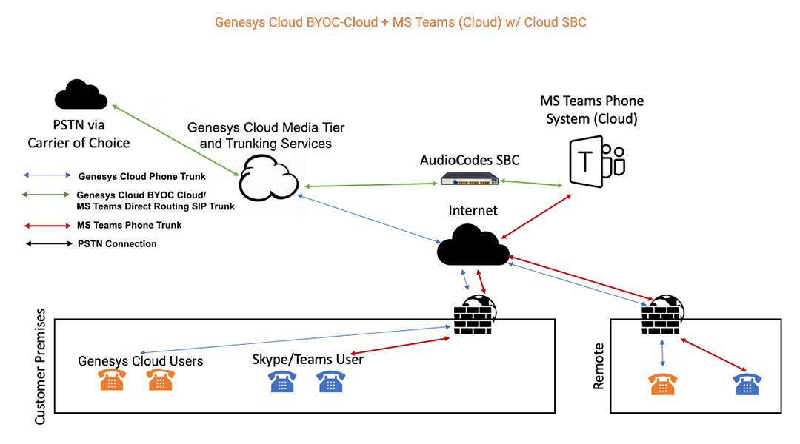
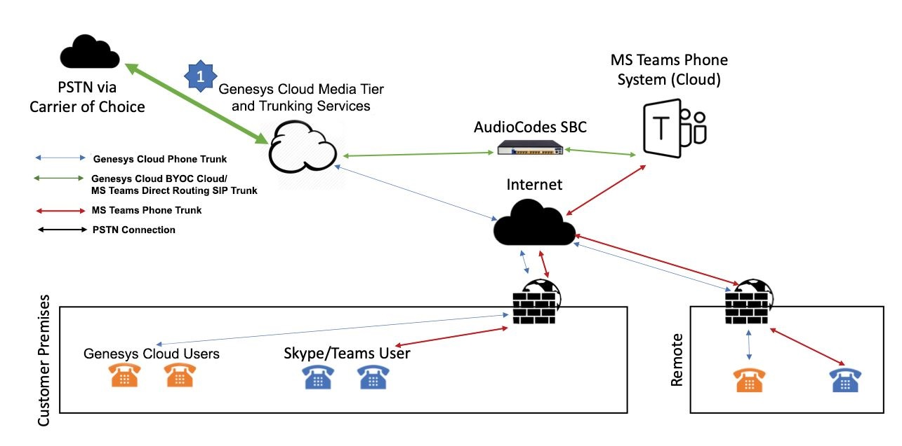
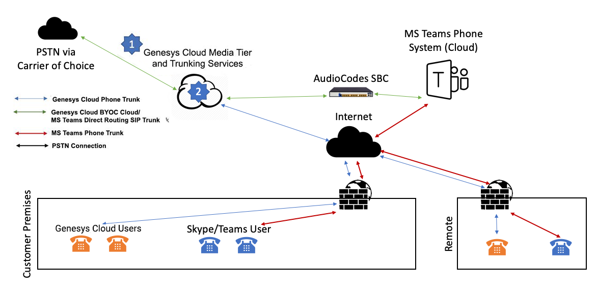
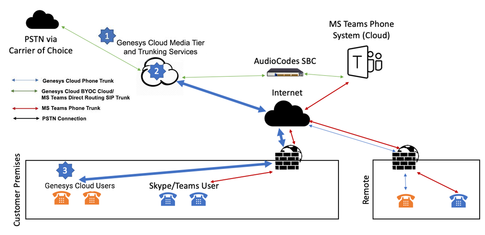
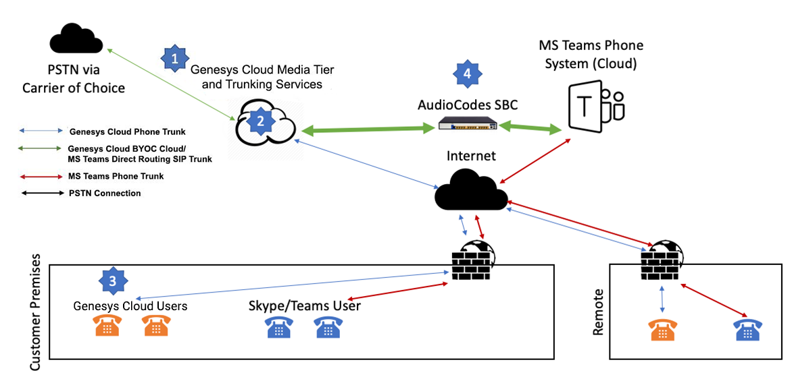

[Microsoft Teams](https://products.office.com/en-us/microsoft-teams/group-chat-software) (also called MS Teams) is a collaboration and business communications platform that provides chat, video, and calling capabilities as well as integrations with other Microsoft cloud productivity tools like OneDrive, Office365, and Sharepoint.  Microsoft [announced in 2017](https://www.microsoft.com/en-us/microsoft-365/blog/2017/09/25/a-new-vision-for-intelligent-communications-in-office-365/) that Skype for Business would eventually be replaced by MS Teams as the go-to product for business communication, including telephony as well as collaboration tools.  Since then, Microsoft has continued to provide additional details over time as MS Teams capabilities have been iterated and enhanced.  MS Teams is [reportedly](https://www.cnbc.com/2019/07/11/microsoft-teams-passes-slack-in-daily-users-rajesh-jha-explains-why.html) now more widely used than Slack, another leading collaboration app. 

In planning for the impending EOL of Skype and customers’ future adoption of MS Teams, Genesys has entered into an agreement with Microsoft to build integrations between Genesys’ products and MS Teams; more, a [blog post](https://www.microsoft.com/en-us/microsoft-365/blog/2019/07/11/microsoft-teams-reaches-13-million-daily-active-users-introduces-4-new-ways-for-teams-to-work-better-together/) from Microsoft on July 11th, 2019 references Genesys as one of only a select few Contact Center vendors to do so thus far. 

The overall integration between Genesys Cloud and MS Teams is being built with two main areas of focus: **(1) telephony and call flow integration**, and **(2) application-level integration**.  This post will cover information on the telephony connections, and a subsequent post will discuss the application-level and API integration details. 

## Telephony and Call Flow Integration Architecture 

Due to the established practices of Contact Center and telephony hosting models, there are multiple possible configurations and combinations for the Carrier, Genesys Cloud, and MS Teams/Office 365 that need to be considered as a part of the overall perspective of customer-focused solutions.  The following is a table that outlines the currently recognized possible scenarios (with a legend and additional details beneath):

_Table of Possible Carrier/PSTN Source, Genesys Cloud Hosting, and MS Teams Hosting Configurations_

* Carrier/PSTN Source – represents where the call is sourced from the PSTN 
	* Genesys Cloud (PCV) - Genesys Cloud Voice as carrier [link](https://help.mypurecloud.com/articles/about-purecloud-voice/) 
	* MS Teams (Calling Plans) - Microsoft O365 as carrier [link](https://docs.microsoft.com/en-us/microsoftteams/calling-plans-for-office-365) 
* Genesys Cloud – represents how Genesys Cloud is hosted 
	* BYOC-Cloud [link](https://help.mypurecloud.com/articles/about-byoc-cloud/) 
	* BYOC-Premises [link](https://help.mypurecloud.com/articles/about-byoc-premises/) 
* MS Teams – represents how MS Teams is hosted 
	* Phone System (Cloud) [link](https://products.office.com/en-us/microsoft-teams/voice-calling) 
	* Direct Routing (Premises) [link](https://docs.microsoft.com/en-us/microsoftteams/direct-routing-landing-page)

_Note that the term ‘Direct Routing’ is also used by Microsoft to represent a BYOC-equivalent offering which can be somewhat confusing; read through the details provided on the link to learn more_

The items that are struck through are not possible due to competing carrier and/or hosting requirements. 

While the end goal is provide support for all possible configurations of cloud- and/or premises-based hosting, the initial telephony integrations will be focused on Genesys Cloud Voice (PCV) and Genesys Cloud BYOC-Cloud options combined with a cloud-based MS Teams hosting model (rows 1 and 2 in the table above).  Telephony architecture diagrams for these configurations are represented below:

Microsoft requires that [all intermediary SBCs be certified for Direct Routing](https://docs.microsoft.com/en-us/microsoftteams/direct-routing-border-controllers) and to start Genesys Cloud’s AWS-based SBCs/edges will not be certified; this means we’ll be relying on our partners at [AudioCodes](https://www.audiocodes.com/) to provide an Azure-based, Microsoft-certified SBC for the initial implementation and potentially expanding to other providers over time.  Over the coming months, we will work with Microsoft to certify our edges and ultimately look to provide a direct connection to MS Teams’ Phone System for customers that prefer this solution as shown below:

The benefit of all the referenced configurations is that transferring calls between applications will be possible without requiring callers to be sent back to the PSTN, ensuring a smoother and more efficient caller experience while controlling potential telephony costs.

## Example Scenario: Inbound Call to Genesys Cloud Agent and Transfer to Remote MS Teams User

Let’s take an example where a Genesys Cloud Agent wants to help a customer by connecting them with a business user within their broader organization: 

1.)	Inbound Call to Genesys Cloud from BYOC-Cloud Carrier
2.) Genesys Cloud IVR Flow Selection and Agent Routing Through ACD Queue
3.) Genesys Cloud Identifies Agent from Queue and Connects Customer Through to Genesys Cloud Agent 
4.) Genesys Cloud Agent Searches for and Identifies an MS Teams User 
5.) Genesys Cloud Agent Consults with MS Teams User 
6.) Genesys Cloud Agent Transfers Call to MS Teams User and Disconnect

### Step 1: Inbound Call to Genesys Cloud from BYOC-Cloud Carrier 
**Suzy** is looking for information on her taxes from the prior year.  She calls into B&L Financial Services and reaches a Genesys Cloud IVR.

### Step 2: Genesys Cloud IVR Flow Selection and Agent Routing Through ACD Queue 
Suzy selects option #3 related to tax inquiries and is routed to a Genesys Cloud ‘Tax’ queue.

### Step 3: Genesys Cloud Identifies Agent from Queue and Connects Customer Through to Genesys Cloud Agent
**Ben** is the Agent located in B&L’s offices that is assigned to Suzy’s call, and they begin talking about Suzy’s questions. Ben and Suzy discuss for a few moments, and Ben discovers Suzy has an intricate question about capital gains that he cannot answer.  Ben decides he needs to bring in help from a tax specialist, and he knows **Alex** in Accounting (who works from home) will be able to help.

### Step 4: Genesys Cloud Agent Searches for and Identifies an MS Teams User 
Ben places Suzy on hold for a few moments.  Meanwhile, Ben searches for ‘Alex’ within Genesys Cloud and retrieves a listing of all relevant users.  Ben selects the correct Alex from the list and opts to [Consult](https://help.mypurecloud.com/articles/transfer-call/) with Alex prior to bringing Suzy into the call with Alex. 

### Step 5: Genesys Cloud Agent Consults with MS Teams User 
Ben tells Alex that Suzy has a question about capital gains impact on her taxes and provides additional context for her inquiry.  Alex agrees to accept the call transfer and help Suzy with her question. 

### Step 6: Genesys Cloud Agent Transfers Call to MS Teams User and Disconnects 
Ben transfers the call to all participants, lets Suzy know that Alex will be helping her going forward, Alex confirms he is on the line and Ben disconnects from the call.  Alex helps answer Suzy’s questions going forward without Ben.

The above example is a very real, tangible scenario that happens every day in customers’ organizations and we are building the integration to support situations exactly like this.  And because Genesys is building the integration directly, rich features of Genesys Cloud like call recording settings and interaction analytics will be supported in the same way they are today for calls that traverse bidirectionally between Genesys Cloud and MS Teams users. 

## Long Term Plan

Above I mentioned the ability for Genesys Cloud users to search for, see presence, and transfer calls to MS Teams users represents the initial first phase of integration between the two platforms.  As Microsoft continues to develop the capabilities of MS Teams, we plan to enhance the integration over time to increase the value that shared Microsoft and Genesys customer derive from both products. 

Subsequent phases of integration could include: 

* IVR/queue flow awareness 
* Status synchronization
* Chat and video collaboration/synchronization 
* Team/group synchronization 
* Document collaboration 
* Embedding either platforms’ UI within the other to enable additional capabilities (similar to the [Genesys Cloud Embeddable Framework](https://developer.mypurecloud.com/api/embeddable-framework/index.html) approach) 

As we continue to build the connections between the applications we intend to work closely with Microsoft and Genesys Cloud customers to understand what aspects of integration are most important and work towards the best user experience and unified solution possible.  Stay tuned for more information and progress updates! 