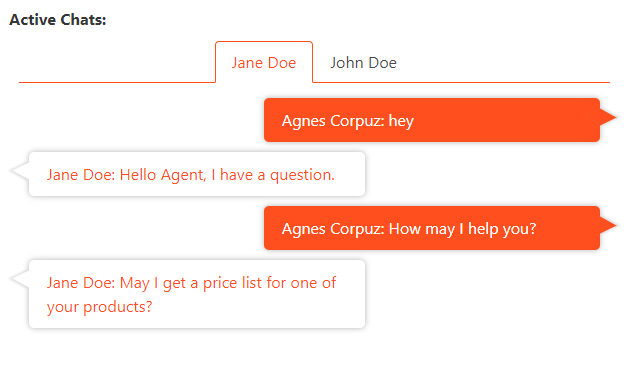
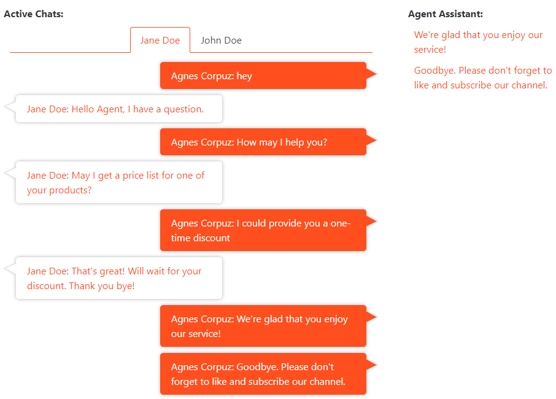

Last year, Genesys released the [Agent Chat API](https://developer.mypurecloud.com/api/webchat/agentchat.html). One use case for this API is an agent chat assistant that will actively listen to the chat interaction and suggest responses based on keywords. Sending messages and the typing indicator features of the Chat API will be convenient in this scenario.

## Connecting to an interaction
Before we can use the Agent Chat API, first, we need to be connected to a chat interaction. We need to use the Notifications API to create a channel then subscribe to incoming chat conversations. This will enable us to actively listen to each chat message and look for keywords to suggest a response.



## Sending messages and typing indicators
When the customer is typing, we can use the Agent Chat API's typing indicator feature to show that in the view.

```
POST /api/v2/conversations/chats/{conversationId}/communications/{communicationId}/typing
```

Depending on the keywords that we would like to configure a suggested reponse, those suggestions can be seen at the side of the conversation. When the agent clicks on one of the suggested responses, the send message feature of the Agent Chat API will be used. The bodyType can either be 'standard' or 'notices', where notices are just hints to a UI to display text specifically or highlighted.

```
POST /api/v2/conversations/chats/{conversationId}/communications/{communicationId}/messages

{
  "body" : "This is the text I'd like to send, limited to 4,000 characters"
  "bodyType" : "standard"
}
```
  



**Important:** If you are going to use the Developer Tools to test, make sure to use either of the following widget deployment versions: Version 1.1, Third Party and	Version 2. To know more about widgets for web chat, visit this [link](https://help.mypurecloud.com/articles/about-widgets-for-web-chat/).

For a detailed step by step coding process, check out the JavaScript tutorial [here](https://developer.mypurecloud.com/api/tutorials/agent-chat-assistant/?language=javascript&step=1).