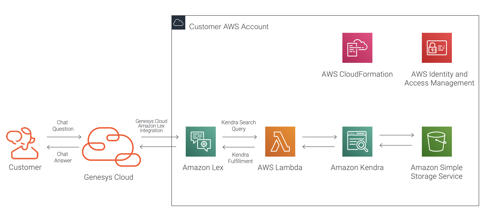
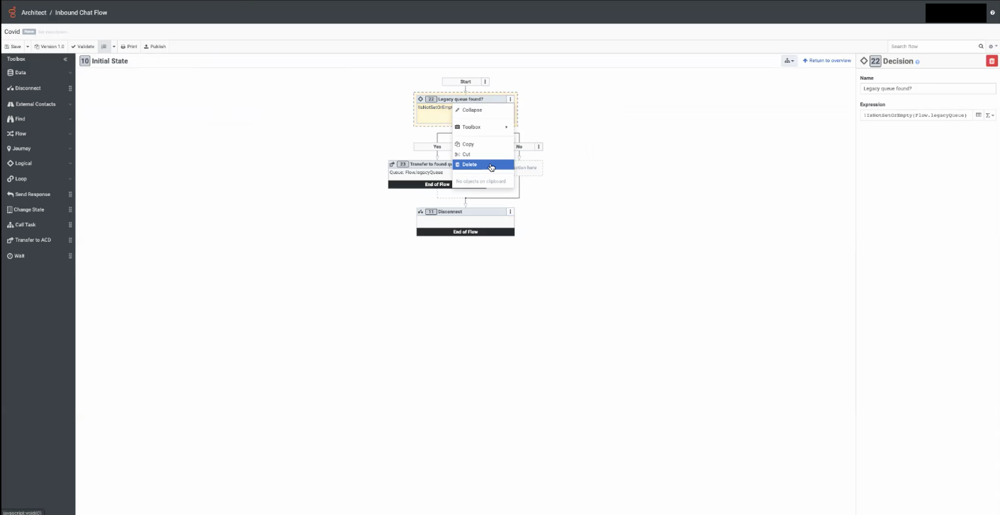
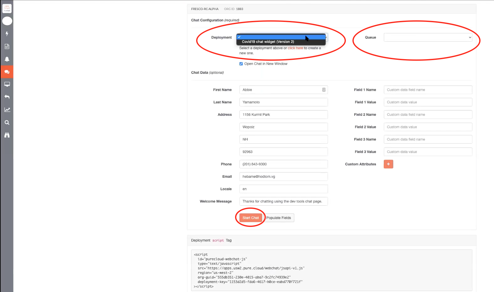
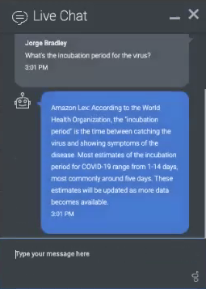
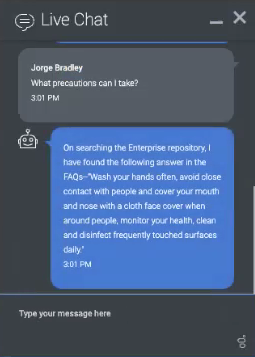

##  Solution overview
This blog post provides instructions for deploying the Lex-Kendra chatbot on Genesys Cloud. The Lex-Kendra chatbot is part of the AWS Contact Center Intelligence (CCI) accelerator. This integrated solution enhances the capabilities of Genesys Cloud with a conversational AI capability from AWS. Both Genesys Cloud and the Lex-Kendra solution components reside natively on AWS Cloud.

Genesys Cloud uses the Genesys Cloud Lex integration to provide customers with a standard Amazon Lex chatbot. The Lex-Kendra chatbot solution combines this basic Lex chatbot with Amazon Kendra to create a Lex-Kendra self-service chatbot. This combination enables an Amazon Lex flow to invoke an AWS Lambda function to call Amazon Kendra after a customer initiates a chat and enters a triggering question. Amazon Kendra uses natural language processing and machine learning abilities to process the customer's question and search an informational database stored in Amazon S3. Amazon Kendra and AWS Lambda then route the discovered answer back into the customer chat. All of this occurs without live agent assistance.

### Solution components:

* **Genesys Cloud** - The Genesys cloud-based contact center platform. Genesys Cloud is the platform for the Lex-Kendra chatbot solution.
* **Lex Chatbot** - Amazon Lex is an AWS service for building conversational interfaces for applications using voice and text, including the Lex chatbot. You can call the Lex chatbot into inbound chat flows with Architect, the Genesys Cloud flow designer.
* **Genesys App Foundry** - The Genesys App Foundry is an app marketplace for solutions that run on the Genesys Cloud platform. You get the Amazon Lex integration used in the solution from the Genesys App Foundry.
* **AWS Cloud** - Amazon Web Services (AWS) is Amazon's cloud platform. AWS is the platform for Genesys Cloud and the Lex-Kendra chatbot solution.
* **AWS CCI** - AWS Contact Center Intelligence (CCI) is a set of integrated contact center partner solutions powered by AWS AI to improve the customer experience and accelerate operational efficiencies. The Lex-Kendra chatbot is part of the AWS CCI self-service accelerator.
* **Amazon Kendra** - Amazon Kendra is an enterprise search service powered by machine learning that delivers natural language search capabilities. The Lex-Kendra chatbot uses Kendra to search for answers to the customer's questions.
* **Amazon S3** - Amazon Simple Storage Service (S3) is an object storage service. Amazon S3 hosts the document repository searched by Kendra.
* **AWS CloudFormation** - AWS CloudFormation provides a template for you to model and provision AWS and third-party application resources in your cloud environment. An AWS CloudFormation template for the Lex-Kendra chatbot is used to deploy the AWS components of the solution.
* **AWS IAM** - AWS Identity and Access Management (IAM) manages access to AWS services and resources. You set up the permissions to allow and deny access to AWS resources for the Lex-Kendra chatbot solution in AWS IAM.
* **AWS Lambda** - AWS Lambda is a compute service in AWS. AWS Lambda executes Kendra fulfillment and other operations for the solution.

## Plan the solution
This solution requires permissions and configuration with both Genesys Cloud and AWS. It also requires installation from the Genesys AppFoundry.
### Specialized knowledge
Implementing this solution requires experience in several areas or a willingness to learn:
* Administrator-level knowledge of Genesys Cloud and the Genesys AppFoundry
* AWS Cloud Practitioner-level knowledge of AWS CloudFormation, AWS IAM, Amazon Lex, Amazon S3, and AWS Lambda
* Conceptual-level knowledge of Amazon Kendra

### Genesys Cloud account requirements

This solution requires a Genesys Cloud license. For more information on licensing, see [Genesys Cloud Pricing](https://www.genesys.com/pricing "Opens the pricing article").

Before you can obtain the Amazon Lex integration from the Genesys App Foundry, you must contact Genesys Cloud Sales to update your subscription to allow premium applications. For more information, see [What are premium applications](https://help.mypurecloud.com/?p=173966 "Opens the premium applications article").

A recommended Genesys Cloud role for the solutions engineer is Master Admin. For more information on Genesys Cloud roles and permissions, see the [Roles and permissions overview](https://help.mypurecloud.com/?p=24360 "Opens the Roles and permissions overview article").

### AWS account requirements
The solutions engineer requires an AWS account and administrator level credentials that allow:
* Working with AWS CloudFormation templates
* Working with AWS IAM permissions
* Creating an Amazon S3 bucket to store the document repository
* Creating an AWS Lambda function, Amazon Kendra indexes, and an Amazon Lex bot

## Deployment steps

The deployment file repository for the Lex-Kendra chatbot solution is located in the [aws-lex-kendra](https://github.com/MyPureCloud/aws-lex-kendra "Opens the Amazon Lex integration FAQs article") GitHub repository of Genesys Cloud Labs.

The Lex-Kendra chatbot deployment has the following stages:
* Create an Amazon S3 bucket and upload the FAQ document.
* Deploy the AWS CloudFormation template.
* Create a queue in Genesys Cloud.
* Install and activate the Lex integration app on Genesys Cloud.
* Call the Lex-Kendra chatbot on inbound chat flows with Genesys Cloud Architect.
* Create a Genesys web chat widget and test the Lex-Kendra solution.
* Deploy the Lex-Kendra chatbot to your website.

### Create an Amazon S3 bucket and upload the FAQ document
1. Create an Amazon S3 bucket to serve as the document repository and copy the bucket name for later use. For more information, see [Creating a bucket](https://docs.aws.amazon.com/AmazonS3/latest/gsg/CreatingABucket.html "Opens the Amazon Creating a bucket article").
2. Download an FAQ file in .csv format from the [aws-lex-kendra](https://github.com/MyPureCloud/aws-lex-kendra "Opens the Amazon Lex integration FAQs article") GitHub repository.

**Note**: Genesys supplies a sample FAQ file (WHO_COVID_FAQ.csv) for your use. The source for this information is the World Health Organization [Q&A on coronaviruses (COVID-19)](https://www.who.int/emergencies/diseases/novel-coronavirus-2019/question-and-answers-hub/q-a-detail/q-a-coronaviruses "Opens the Q&A on coronaviruses article"). Check the WHO page for the latest and most complete COVID-19 information.
3. Upload the FAQ file to your S3 bucket. You can use the supplied file or create your own using the repo file as a model.

### Deploy the AWS CloudFormation template

The AWS CloudFormation template creates an AWS stack for the Lex-Kendra chatbot. The stack completes several operations for the solutions engineer:
* Creates an IAM role for Genesys Cloud in your AWS account.
* Creates the Lex chatbot.
* Creates the Kendra FAQ index.
* Creates a search intent to integrate Amazon Lex and Amazon Kendra.

To deploy the template, complete the following:
1. Log into AWS console.
2. Click the [CloudFormation template](https://console.aws.amazon.com/cloudformation/home?region=us-east-1#/stacks/create/template?stackName=lex-kendra&templateURL=https://aws-quickstart.s3.amazonaws.com/quickstart-quantiphi-lex-kendra-backend/templates/lex_bot_kendra_master.template.yaml "Opens the CloudFormation template"). This opens the CloudFormation template in your AWS account.
3. Click **Next**.
4. In the **S3 bucket with documents** field, paste the S3 bucket name from the earlier procedure.
5. In the **Assuming Account ID** field, enter 765628985471. This is Genesys Cloud’s production account ID.
6. In the **Organization's ID** field, enter your Genesys Cloud organization ID. To obtain your ID, see [FAQ: How do I find my organization ID?](https://help.mypurecloud.com/?p=78571 "Opens the FAQ")
7. Click **Next**.
8. On the Configure stack options screen, click **Next**.
9. On the Review Lex-Kendra screen, click the acknowledgements at the bottom of the page and click **Create stack**.

**Note**: The stack creation process can take up to 30 minutes. You can complete the procedures *Create a queue in Genesys Cloud* and *Install the Amazon Lex integration from Genesys AppFoundry* while the stack builds.

10. After enough time has elapsed for the stack creation to complete, in the Amazon Lex console under **CloudFormation > Stacks**, confirm the Lex-Kendra stacks exist.
11. In the Amazon Lex console under **CloudFormation > Stacks**, click the **Resources** tab.
12. Copy the **AssumeIAMRrole** Physical ID for use in the upcoming *Configure and activate the Lex integration in Genesys Cloud* procedure.
### Create a queue in Genesys Cloud
The Lex-Kendra solution requires a queue in Genesys Cloud. You can create a new queue or use an existing queue. This queue receives the customer chat stream if the transfer-to-ACD function is invoked by the solution.

Complete the following procedure to create a new queue:

1. From the Genesys Cloud admin menu, create a queue using the default settings. For more information, see the *Create a queue* section and the *Add members to the queue* section in [Create and configure queues](https://help.mypurecloud.com/?p=18650 "Opens the Create a flow article").
2. Record the queue name for use in a later procedure.

### Install and activate the Lex integration app on Genesys Cloud
You need to complete the following procedures in Genesys Cloud:

1. [Install the Amazon Lex integration from Genesys AppFoundry](https://help.mypurecloud.com/?p=168115 "Opens the Install the Amazon Lex integration from Genesys AppFoundry article")
2. [Configure and activate the Lex integration in Genesys Cloud](https://help.mypurecloud.com/?p=168149 "Opens the activate the Lex integration article")

**Note**: In the *Configure and activate the Lex integration in PureCloud* procedure, a Change Credentials dialog prompts you for the customer AWS role that Genesys Cloud is authorized to access. Paste the **AssumeIAMRrole** Physical ID you copied from the AWS console into this dialog.

**Note**: The Lex-Kendra chatbot deployment requires an AWS region that supports an Amazon Lex endpoint. Amazon provides this information in [Amazon Lex endpoints and quotas](https://docs.aws.amazon.com/general/latest/gr/lex.html "Opens the Amazon Lex integration FAQs article").

### Use Architect to call the Lex-Kendra chatbot on inbound chat flows

This blueprint gives the minimum steps required to get the Lex-Kendra chatbot up and running on an inbound chat flow. It will create a new data action to initially deflect all messages to the Lex-Kendra chatbot. To learn more about additional options and the flow design capabilities of Architect, see the *Additional resources* section.

1. From the Genesys Cloud admin menu, create an inbound chat flow in the normal manner. For more information, see the *Create an inbound chat flow* section in [Create a flow](https://help.mypurecloud.com/?p=3792 "Opens the Create a flow article").
2. From the Architect / Inbound Chat Flow screen, delete any existing actions to begin with a clean flow.

3. On the menu to the right of the Start component, click **Toolbox > Data > Call Lexbot**.
4. On the right side of the screen, under the **Bot Name** menu, select the name that you chose in the earlier procedure.
5. Under the **Bot alias** menu, select the appropriate name.
Architect populates the defined intents of the Lexbot, including a Kendra search intent.
6. Set the flow to return to the initial state after the Lexbot is called:

    a. On the menu to the right of the Disconnect component, click **Toolbox > Change State**.

    b. On the right side of the screen, under the **State** menu, select **Initial State**.

7. Set the Not Satisfied component and the Failure component to transfer to an ACD queue:

    a. On the menu to the right of the Disconnect component, click **Toolbox > Transfer to ACD**.

    b. On the right side of the screen, under the **Queue** menu, select the appropriate queue.

    c. On the menu to the right of the Failure component, click **Toolbox > Transfer to ACD**.

    d. On the right side of the screen, under the **Queue** menu, select the appropriate queue.

8. On the top left of the screen, click **Save**. The remaining flow components are preset for the Lex chatbot.

9. On the top left of the screen, click **Publish**.
### Create a Genesys web chat widget and test the Lex-Kendra solution
You need to complete the following procedures in Genesys Cloud and the Genesys Cloud Developer Center Web Chat developer tool:
#### Create a Genesys web chat widget
1. From the Genesys Cloud admin menu, create a Genesys Widget Version 2 in the normal manner. For more information, see the *Version 2* section in [Create a widget for web chat](https://help.mypurecloud.com/?p=195772 "Opens the widget for web chat article").

**Note:** In the Create a widget for web chat procedure, in the **Route to Flow** menu, choose the flow you created in the earlier procedure.

2. After you save the widget, the saved page displays a Deployment Key string. Copy the Deployment Key string for later use.
3. From your browser, go to the Genesys Cloud Developer Center and open the Web Chat developer tool. For more information, see [Web Chat developer tool quick start](https://developer.mypurecloud.com/gettingstarted/developer-tools-web-chats.html "Opens the Web Chat developer tool quick start article").

**Note:** The Web Chat developer tool populates with menu options for the widget and queue you created earlier through shared authentication between Genesys Cloud and the developer tools. If the menu is not populated, use the Deployment Key string you copied earlier.

4. From the Web Chat developer tool, under the **Deployment** menu, select the chat widget you created.
5. Under the **Queue** menu, select the appropriate queue.

You have have completed the configuration for the Lex-Kendra chatbot solution. Proceed to the next section to test the solution before you deploy it to your website.
#### Test the Lex-Kendra solution
1. Click **Start Chat** to test your Lex-Kendra chatbot solution.
2. Type in test questions to trigger a specific bot response.

To help formulate test questions to elicit a specific response, you can use the AWS console to examine the Kendra_Search_Intent and also the .CSV file you uploaded to the S3 bucket. See the sample questions below for examples of a standard Lex response and a response from a Kendra interaction.

**Sample Question 1**

The question "What is the incubation period for the virus?" elicits a standard Lex intent. You can confirm this is a standard Lex intent by observing the response begins with the term "Amazon Lex". The bot icon in the text stream also confirms the response is from the bot.

**Sample Question 2**

The question "What precautions can I take?" does not elicit a standard Lex intent, as there is no Lex intent preconfigured for that question. This question triggers a Kendra search and the response comes from a search of the document you uploaded into your S3 bucket. You can confirm this is a Lex-Kendra response by observing the response begins with the term "On searching the Enterprise repository".

### Deploy the Lex-Kendra chatbot to your website

The Web Chat developer tool generates the script needed to deploy the Lex-Kendra chatbot on your website. The generated script is directly under the **Start Chat** button. For more information on deploying the widget, see [Widget - Version 2](https://developer.mypurecloud.com/api/webchat/widget-version2.html "Opens the Deploy widgets article").

### Troubleshooting
For troubleshooting information, see the [Amazon Lex integration FAQs](https://help.mypurecloud.com/?p=162340 "Opens the Amazon Lex integration FAQs article") and [Troubleshoot the Amazon Lex integration](https://help.mypurecloud.com/?p=162342 "Opens the Amazon Lex troubleshooting article").
### Additional resources
* [About the Amazon Lex integration](https://help.mypurecloud.com/?p=162338 "Opens the Amazon Lex article") (Genesys Cloud Resource Center)
* [Call Lex Bot action in inbound chat flows](https://help.mypurecloud.com/?p=160620 "Opens the Call Lex Bot action article") (Genesys Cloud Resource Center)
* [About Architect](https://help.mypurecloud.com/?p=53682 "Opens the Architect article") (Genesys Cloud Resource Center)
* [Widget - Version 2](https://developer.mypurecloud.com/api/webchat/widget-version2.html "Opens the Widgets article") (Genesys Cloud Developer Center)
* [AMAZON.KendraSearchIntent](https://docs.aws.amazon.com/en_us/lex/latest/dg/built-in-intent-kendra-search.html "Opens the Amazon Lex Developer Guide") (Amazon Lex Developer Guide)
* [Amazon Kendra Overview](https://aws.amazon.com/kendra/ "Opens the Amazon Kendra Overview") (Amazon AWS)
* [Working with Amazon S3 Buckets](https://docs.aws.amazon.com/AmazonS3/latest/dev/UsingBucket.html "Opens the Amazon Simple Storage Service Developer Guide") (Amazon Simple Storage Service Developer Guide)
