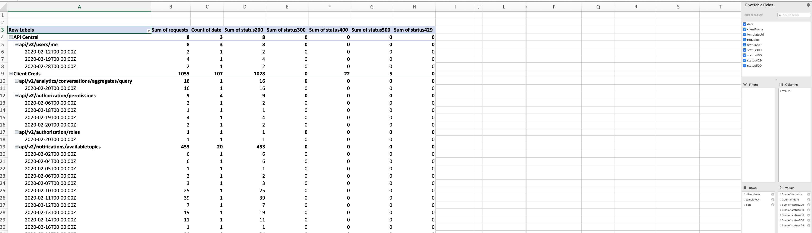

Greetings. I hope everyone continues to stay safe and healthy in these challenging times. Last week, I was pulled into an emergency situation with a customer where they suddenly 
found themselves being rate-limited while making calls to one of our APIs. They had put retry logic in their integration so they could handle rate-limiting and even though they had 
been occasionally rate-limited before, it was not problematic or noticeable enough for it to cause a business impact. Their integration had been built and tested early in their 
Genesys Cloud implementation and had run without problems. However, as they ramped up their call volumes the rate-limiting errors began to manifest themselves more often, getting to
to the point where it was introducing unacceptable latency and errors. We helped the customer resolve this issue by having them introduce a caching layer into their integration 
which significantly reduced the number of calls out to the Genesys Cloud API.

However, much of this pain could have been avoided if the customer had been monitoring their Genesys Cloud API usage over time and seen the changes in API invocation patterns and 
errors. One of the more common challenges we have seen with customer integrations to Genesys Cloud is that our customers fail to monitor their API consumption over time. If call 
volumes and behavior change within one of their call centers they are often blindsided with a corresponding increase in API calls. 

One of the ways for you to avoid these kinds of situations is to periodically monitor all of your OAuth2 clients using the Genesys Cloud *Usage API*. Learning the "ins and out" of this 
API to understand the total number of requests made to Genesys Cloud APIs, and any API failures, allows you to understand growth patterns in your integrations 
and identify errors before they cripple your call center operations.

In this blog post, I want to explore the Genesys Cloud *Usage API* and demonstrate how to: 

* *Usage API* mechanics
* Retrieve total Genesys Cloud API calls broken out by OAuth2 
* Retrieve total Genesys Cloud API calls grouped by OAuth2 client and the endpoints the client calls
* Break out Genesys Cloud API calls into time buckets of day, week, and month
* Combine other tools to help transform your API usage data into a csv format suitable for analysis by Microsoft Excel

## Usage API Mechanics
The *Usage API* can be used to query API invocation data over a long-period of time. Because of the amount processing that can take place and the length of time it can 
take for the processing to be completed, the execution of *Usage API* queries occurs in two parts:

1. Submitting a query request to the *Usage API*
2. Checking the *Usage API* to see if the query is complete and retrieving the results

To submit a query request, you need to call the *POST /api/v2/usage/query* endpoint, passing in the *Usage API* query you want to execute in the body of the POST. 
We will get into the particulars of submitting a query later on in this article. The processing of querying data is asynchronous, so a successful call to 
*POST /api/v2/usage/query* will result in a JSON payload being passed back to the caller with a token (called ```executionId```) representing the query being executed. 
The body of the query response will look like something like this:

```json
{
 "executionId": "9f32b7cf-7418-4cc1-b4e7-a37f7cd870e1",
 "resultsUri": "/api/v2/usage/query/9f32b7cf-7418-4cc1-b4e7-a37f7cd870e1/results"
}
```

To retrieve the query, you need to present the ```executionId``` value to the *Usage API* using the ```GET /api/v2/usage/query/{executionId}/results``` endpoint. If the query 
is still running you will get back a JSON payload indicating the query is running:

```json
{
  "queryStatus": "Running"
}
```

If the query is completed, you will get a query payload back with the ```queryStatus``` equal to ```Complete```. The payload will also contain the query results for the query being 
submitted. Let's go ahead and walk through how to build a *Usage API* query.

## Components of a Usage API Query
There are 4 components that are part of a *Usage API* query:

1. `interval`. The `interval` field is a *required* field that defines the time period that you are seeking API usage data. This value is a date range and follows the ISO-8601 date format (YYYY-MM-DDThh:mm:ss). For example, if you wanted a API usage query to look at all of the API data for the first 6 months of 2020, you would set the `interval` value to be `2020-01/2020-06`.

*Note*:  The data format does not need to be fully qualified down to the hour or second.  Instead it just has to be an interval.  So for instance, if you wanted all of the data for the entire year of 2019 through June 30th, 2020, you could use the interval `2020/2019-06-30`.

2. `granularity`. The `granularity` field is an optional field that allows you to break your query down into time buckets of `Day`, `Week`, or `Month`. If you do not set this value, any results returned will represent total values for the time period specified in the `interval` field.

3. `groupBy`. The `groupBy` field is an optional array field used to partition results into different dimensions. The best way to think about this field is to think of its behavior as the equivalent to a SQL Group By command. For example if you want to see the total counts returned categorized by `OAuthClientId` and `TemplateUri` (the API endpoint being invoked by the OAuth2 Client), you set the value of this field to be `["OAuthClientId","TemplateURI"]`. 

4. `metrics`. The `metrics` field is an optional array field that lets you define what metrics fields you want returned in your query. The available fields are `Status200`, `Status300`, `Status400`, `Status500`, `Status429`, and `Requests`. If no values are provided for this field all the metrics values will be returned. 

Now that we have walked through all of the components involved in a *Usage API* query lets go ahead and build a few example queries.

## Retrieving total Genesys Cloud API calls broken out by OAuth2 client
Let's start with the simplest type of query, asking the *Usage API* for a breakdown of all of the metrics for all API calls within the month of February 2020. We are going to use our [API Explorer](/developer-tools/#/api-explorer) to invoke the *Usage API* endpoints. Our API Explorer tool lets you invoke all of the Genesys 
Cloud APIs against your organization right within the web browser using the permissions assigned to your user id. 

To see this API in action, go to the API Explorer, navigate to the Usage API of the API Explorer (left hand side of the tool) and click on the Usage box. In there you will find a 
link called *POST Query organization API Usage*. The image below shows the navigation bar on the left hand side of the API Explorer.


You can then execute your query based on the data shown below,in the API Explorer.


Once the call is made you will get the ```executionId``` back of the submitted query.


If you take the ```executionId``` returned above and now call the *GET /api/v2/usage/query/{executionId}/results* endpoint you will get back one of two results. 

*Note*: Remember the data you are querying on is 24 hours old and updated once a day. This means you should not pull the *GET /api/v2/usage/query/{executionId}/results* endpoint aggressively after you have issue a query.  Once every 1-2 minutes should be more then adequate for many queries.  If you are overly aggressive (e.g. polling the endpoint every 20ms, you can end up rate limiting the OAuth2 client) 

For the above query your returned payload from the *Usage API* call would look something like this:

```json
{
  "results": [
    {
      "clientId": "e7de8a75-86bb-43eb-9063-38699f8c21af",
      "clientName": "Prince Implicit Grant",
      "organizationId": "",
      "userId": "",
      "templateUri": "",
      "httpMethod": "",
      "status200": 57,
      "status300": 0,
      "status400": 0,
      "status500": 0,
      "status429": 0,
      "requests": 57
    },
    {
      "clientId": "257acb58-bf3e-4e01-afd2-ae00a848fe",
      "clientName": "Github Pages (implicit)",
      "organizationId": "",
      "userId": "",
      "templateUri": "",
      "httpMethod": "",
      "status200": 10,
      "status300": 0,
      "status400": 0,
      "status500": 0,
      "status429": 0,
      "requests": 10
    },
    {
      "clientId": "739d8216-307f-42c1-ac51-5dc1112f83114",
      "clientName": "Mikes Implicit Grant Example",
      "organizationId": "",
      "userId": "",
      "templateUri": "",
      "httpMethod": "",
      "status200": 8,
      "status300": 0,
      "status400": 0,
      "status500": 0,
      "status429": 0,
      "requests": 8
    },
    ...  Data truncated for conciseness
  ],
  "queryStatus": "Complete"
}
```

In the query above you can see that the *Usage API* return count metrics for the total number of requests along with the individual values for all 200x, 300x, 400x, 500x HTTP status codes. The *Usage API* also breaks HTTP 429 status codes into its own metric bucket because the HTTP status codes represent rate-limiting errors and are one of the most common errors are customers look for when putting examining API usage data. When only the the `interval` field is set in the query, the default grouping for the query will be at the OAuth2 client level. 

There are a three things that you need to remember with data retrieved from the *Usage API*:

1. All data is 24 hours old. The Usage API does not provide real-time API statistics.
2. The data statistics are usually updated at midnight in the Genesys Cloud region you are retrieving the data from. 
3. Currently, you can query back to 2018 for your API data. How far back you can query API data may change in the future.

## Retrieving total Genesys Cloud API calls grouped by OAuth2 client and the endpoints the client calls
Remember, a single OAuth2 client can call multiple Genesys Cloud APIs. The *Usage API* allows you to breakdown the metrics returned into more fine-grained numbers via 
the `groupBy` field. To further refine our query to show endpoints called by each OAuth2 client lets add the `groupBy` field to the query:

```json
{
   "interval": "2020-02-01/2020-02-28",
   "groupBy": ["OAuthClientId","TemplateUri"]
}
```

Now if I execute this query against my organization, my results will look like this:

```json
{
  "results": [
    {
      "clientId": "7333af06-c0b3-2349b-af45-72f4a14037cc",
      "clientName": "Client Creds",
      "organizationId": "",
      "userId": "",
      "templateUri": "api/v2/users/{userId}/presences/{sourceId}",
      "httpMethod": "",
      "status200": 54,
      "status300": 0,
      "status400": 0,
      "status500": 0,
      "status429": 0,
      "requests": 54
    },
    {
      "clientId": "7de3af44-c0b3-4f9b-af45-72f4a14037cc",
      "clientName": "Client Creds",
      "organizationId": "",
      "userId": "",
      "templateUri": "api/v2/routing/queues",
      "httpMethod": "",
      "status200": 13,
      "status300": 0,
      "status400": 0,
      "status500": 0,
      "status429": 0,
      "requests": 13
    },
    {
      "clientId": "e7de8a75-62bb-43eb-9063-38509f8121af",
      "clientName": "Prince Implicit Grant",
      "organizationId": "",
      "userId": "",
      "templateUri": "api/v2/conversations/{conversationId}",
      "httpMethod": "",
      "status200": 5,
      "status300": 0,
      "status400": 0,
      "status500": 0,
      "status429": 0,
      "requests": 5
    },
    .... Rest of the content removed for conciseness.
```
Whoa! Now we get a lot more data back from our API requests. That is because each entry returned from the above query represents the total count of HTTP status codes and requests 
by OAuth2 client and the individual Genesys Cloud APIs invoked by the client.

## Breaking out API calls by Days, Week, and Month
The last thing we are going to look at is how we can further refine the API usage numbers retrieved by breaking the returned data down into time buckets. This is done via the `granularity` field. 
This field will allow you to break your numbers down into time buckets of `Day`,`Week`, or `Month`. Let's continue to build out our query using the *Usage API* to 
show all API usage for the month of Feb. 2020, broken out by OAuth2 Client and the URI called by the OAuth2 client. The query issued would 
look this:

```json
{
  "interval": "2020-02-01/2020-02-28",
  "granularity": "Day",
  "groupBy": [
    "OAuthClientId",
    "TemplateUri"
  ]
}
```

The results from this query look this:

```json
[
  ....  Data truncated for conciseness
  {
      "clientId": "7de3af06-c0b3-4f9b-af45-72f4a14037cc",
      "clientName": "Client Creds",
      "organizationId": "",
      "userId": "",
      "templateUri": "api/v2/notifications/availabletopics",
      "httpMethod": "",
      "status200": 6,
      "status300": 0,
      "status400": 0,
      "status500": 0,
      "status429": 0,
      "requests": 6,
      "date": "2020-02-02T00:00:00Z"
    }, 
    {
      "clientId": "7de3af06-c0b3-4f9b-af45-72f4a14037cc",
      "clientName": "Client Creds",
      "organizationId": "",
      "userId": "",
      "templateUri": "api/v2/notifications/channels",
      "httpMethod": "",
      "status200": 2,
      "status300": 0,
      "status400": 0,
      "status500": 0,
      "status429": 0,
      "requests": 2,
      "date": "2020-02-27T00:00:00Z"
    }
    .... Data truncated for conciseness
]    
```

So now the data is coming back in an even finer level of detail. Each record contained in the query results is broken down by OAuth Client Name and endpoint (e.g. Template URI) and 
the metrics contained within each record are for a single days worth of activity.

# Combining other tools to help transform your API usage data
Now that you have the data for your API usage extracted out of Genesys Cloud, you are often going to want to conduct some kind of analysis on the results. To keep things simple, 
I often use a tool called [jq](https://stedolan.github.io/jq/) to filter, transform and query my JSON data into a CSV file format that I can import into Microsoft Excel and then 
perform some ad-hoc analysis on. I will save the results from my *Usage API* query to a file called feb2020.csv and then run it through a series of ```jq``` commands. 

```
cat feb2020.json| jq -r '.results | sort_by(.date,.clientName)'| jq -r '. | map({date: .date, clientName: .clientName, templateUri: .templateUri, requests: .requests, status200: .status200, status300: .status300, status400: .status400, status429: .status429, status500: .status500})' | jq -r '(.[0] | keys_unsorted) as $keys | ([$keys] + map([.[ $keys[] ]])) [] | @csv' > feb2020.csv
```

This a big blob of command line text but if you break it apart it is doing the following work:

`cat feb2020.json                                                <-- Display the contents of the file. The data is piped to jq.
| jq -r '.results  |   sort_by(.date,.clientName)'              <-- Extract the results field from the JSON returned and then sort it by date and clientName
| jq -r '. | map({date: .date, clientName: .clientName, .....'  <-- Transform the JSON into a new json body where the date is the first field returned and all the status fields are extracted
| jq -r '(.[0] | keys_unsorted) as $keys | ([$keys] + map([.[ $keys[] ]])) [] | @csv' <-- Build the data into a a CSV 
> feb2020.csv                                                   <-- Redirects the output from jq into a CSV file.
`

Once I have all of the data in a CSV format, I can import it into Excel spreadsheet, build a pivot table and do all sorts of analysis on it. The image below shows the Feb-2020 CSV 
data for org presented in an Excel pivot table.



**Note:** In the additional resources section of this blog post, I have added links to the sample data files I used so you can download them and experiment with them.  I have also include a copy of the jq command I used to transform the data.

# Closing Thoughts
I often tell developers that writing an integration is only half the effort. The other half is operationalizing it so that it can be monitored and tuned as the environment in runs in changes. 
Changes always happen within a call center, it is often just a matter of the velocity of that change and the impact it has on the underlying systems that support it.

Have a plan in place for how you are going to monitor the API usage before deploying an integration. Thinking about your integrations API usage ahead of time can prevent 
a nasty interruption in your business operations in the future.

# Additional Resources
1. [Usage API](/api/rest/v2/usage/)
2. [Developer Tools](/developer-tools/#/api-explorer)
3. [jq](https://stedolan.github.io/jq/) 
4. [Sample JSON output](feb2020.json)
5. [Sample CSV file](feb2020.csv)
7. [JQ Command for Transforming data](jq-transformation.txt)
6. [Sample Excel Pivot Table](feb2020.xls)

