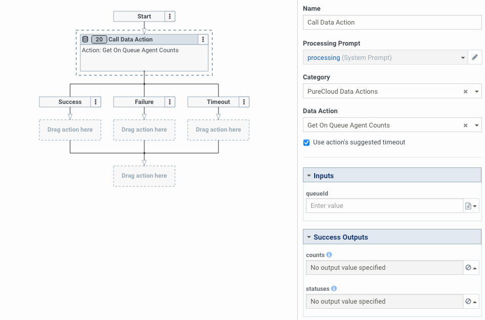
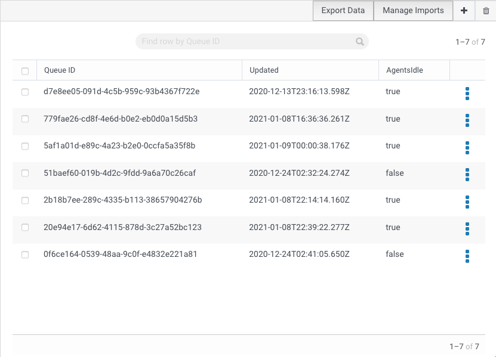
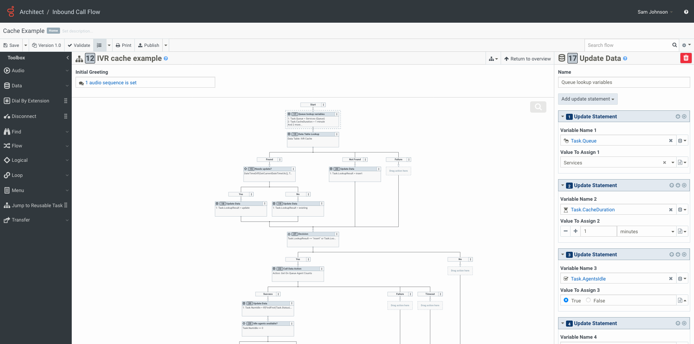

[Genesys Cloud Architect](https://help.mypurecloud.com/articles/about-architect/) is a feature-rich tool for developing call, chat, email, and message flows. One great feature of Architect flows is the ability to [call data actions](https://help.mypurecloud.com/articles/call-data-action/), which allow you to not only interoperate with various third-party systems and services, but also with the Genesys Cloud Platform API. This allows you to extend the functionality of your flows beyond the Architect feature set, providing a richer experience to your customers.

While augmenting your flows with data actions can provide a great customer experience, Architect cannot guarantee that data action execution will succeed. What happens when the service the data action is referencing is unavailable? What if you experience a high volume of interactions, causing the service to rate limit your requests? Correctly handling these scenarios in your flow design can help provide continuity for your business.

In this post, we will:
1. Explore various data action failure scenarios and how to handle them
2. Understand the scalability concerns from data action usage
3. Design and implement a data action response cache to improve flow scalability

## Handling failure scenarios
While data action calls may succeed most of the time, in a distributed cloud-driven world failures can happen. Therefore, it is important to consider various failure modes of the service the data action is communicating with and how you are calling it.  In general failure modes can fall into three different categories:

1.  Failure do handle bad user input. For example, a user entering an incorrect account number and the downstream service rejects it.  
2.  Failure of the service being called.  For example, the downstream services returns an unexpected error, the service times outs or there are network connectivity problems to the service.
3.  Failure due to flow logic in the Call Data Action step or a misconfigured data action.  An example of this might include referencing a potentially unset variable, or out-of-bounds access to a collection.
4.  Failure due to service imposing rate limits.

Using some basic error handling logic within your Architect flow can help in handling these scenarios:

**Handle all output paths of the action.** In Architect, each Call Data Action step has three outputs: `Success`, `Failure`, and `Timeout`. These output paths allow you to perform different logic depending on the result of action execution.  For example, for an account lookup action, you may want to play back account data in the Success path, re-prompt the caller in the Failure path, and go directly to queue in the Timeout path.  Make sure you account for all three of these paths and clearly define the behavior you want to occur. 

**Set guardrails.** When implementing retry logic, whether automated or via caller input, set a reasonable upper-limit on retry requests. This can prevent infinite failure loops, which cause customer frustration and excessive data action requests. This is extremely important.  If you have local deployed edge servers for handling calls, call flows without an upper-limit set of retries can "spike" the CPU on your edge server and impact all customers being serviced by that edge device. 

**Validate input data.** When passing inputs to a data action, first check for validity of the inputs before executing the data action. Accessing unset variables, or out-of-bounds access to a collection, can cause the flow to take the error handling logic, which is generally undesirable. In addition, check that input values match expectations of the data action. For example, if an account number must be 10 digits, check that the input is 10 digits before executing the data action. This can help provide better feedback to the customer and reduce unnecessary requests.

**Configure flow error event handling.** When a fatal flow execution error occurs, the error event handling logic executes. By default, call flow error event handling will play a message and disconnect. Customizing this setting to route to a queue or another task provides a better customer experience when an error occurs.

**Sanitize data action inputs.** When creating your own data action, consider how values passed to the action inputs will be used in the request URL and/or body. Inputs should be escaped where appropriate, and non-required string inputs in a JSON request body should use silent formal notation to maintain proper syntax. [Velocity macros](https://help.mypurecloud.com/articles/velocity-macros-data-actions/) in your data action request configuration allow you to escape inputs, use conditional logic based on input values, handle missing inputs, and more.

**Be flexible in the data action response translation.** When creating your own data actions, the response translation is used to map the response from the service to the data action output contract. If the response translation encounters an error, the data action will take the failure path. Therefore, ensure your response translation can successfully handle all scenarios, such as some properties missing from the response, so that your flow logic has a higher chance of success.

## Designing for scalability
While it is easy to add Call Data Action steps to a flow for retrieving data, doing so should be done with care: Genesys Cloud does not cache data action responses, so each time each interaction encounters a Call Data Action step, the data action will be executed. This can add up to a large number of requests rather quickly--for example, if a call flow executes three data actions for every call, and that flow receives 400 calls in a minute, that flow would be responsible for around 1,200 data action executions per minute, or 20 times per second.

If you expect more than a couple hundred interactions per minute that will call at least one data action each, data action execution may be affected by rate limits in place on the remote service, in addition to [limits in place within Genesys Cloud](/api/rest/v2/organization/limits.html). Rate limits are used in cloud services to increase service availability and reduce the possibility of a single entity causing an outage. For services that do not implement rate limits, high volume could impact the stability of that service.

Genesys Cloud imposes some limits with regards to data action execution. Exceeding these limits will cause data action executions to fail, and without proper handling, your flow could also fail. If you are using the Genesys Cloud Data Actions integration to enhance your flow using actions that invoke the Genesys Cloud Platform API, there are additional limits to be aware of. Some default Genesys Cloud rate limits to keep in mind are:
* 15 concurrent data action executions
* 900 data action executions per minute
* 300 platform API requests per OAuth2 token per minute

**Note:** While you can make make 900 data actions executions per minute, if you are using the data action to call a Genesys Cloud API, you can only make 300 requests per OAuth2 token before the public API starts rate limiting calls for that token.  Sometimes developers will try to get around these rate limits by having multiple OAuth2 clients or generating additional OAuth2 client tokens (each OAuth2 client can have up to 10 active tokens with 300 API call per token limit). In Genesys Cloud rate limits are a signal that you are not using our APIs correctly (e.g. no caching, excessive polling). Individual services within Genesys Cloud can have their own rate limits that are enforced at an organization level. If you try to circumvent the rate limits in the Public API you can inadvertently begin impacting your entire organization's ability as crucial services further in the Genesys Cloud stack will begin rate-limiting.  This could result in a partial or complete outage for your call center.  The best advice I can give, is respect the 300 API call limit per token and use a single token.  Finally, Genesys Cloud does reserve the right shutdown an OAuth2 client that is causing platform instability.

As scary as the above comment sounds, implementing a caching mechanism for data action responses within your call flows will help avoid rate-limiting problems. In the sections below, we will implement the["Get On Queue Agent Counts" Genesys Cloud Data Action](https://appfoundry.mypurecloud.com/filter/genesyscloud/listing/13074443-4ffc-46b6-82c7-c3f4af51861f) from the [Genesys Cloud AppFoundry](https://appfoundry.mypurecloud.com/) in a call flow and cache its response in a data table.

### Caching mechanism design
In our example scenario, we will be using the "Get On Queue Agent Counts" data action to check if there are any idle agents on queue. This data action has a single input, the queue ID, and outputs the number of agents in each routing status.

The goal of the cache is to avoid excessive requests with the same parameters to the action endpoint. To accomplish this we need: 

1. A caching mechanism that has a separate entry for each unique set of request parameters.
2. A mechanism to determine when the cache data is stale and should be reload.  In our example, each entry will include a timestamp.
3. A cache implementation that is performant, highly available, and not subject to rate limiting when used from a flow.

The [data tables](https://help.mypurecloud.com/articles/work-with-data-tables/) feature in Genesys Cloud meets these requirements, so we will be using it as the backing store for the cache. The cache will consist of a single data table, with the key column containing the queue ID as the unique identifier, a second column containing the cache update timestamp, and a third column containing the cached value (a boolean value indicating if any agents are on queue and idle).

In the call flow, before we call the data action, we will now perform a data table lookup to retrieve the cache data matching the data action input. If there is _no_ result found, we will set a lookup result variable indicating we need to populate the cache with data. If a result _is_ found, the column values will be stored in variables. These variables will be the same variables used later in the flow. We will then compare the cache timestamp variable with the current date/time to see if the cache is more than 5 minutes old, and set the lookup result variable indicating such.

If the value of the lookup result variable indicates we need to execute the data action, we will then execute the data action, parse the results, and set the appropriate variables (which will be the same variables set above from the data table lookup). Then, depending on the lookup result, we will use data actions to either update the cache entry or insert a new entry to the data table.

With these pieces in place, we now have a call flow that uses cached data instead of calling a data action when possible, and automatically updates the cached data when it is more than 5 minutes old. In the following sections, we will implement this example solution step-by-step.

### Creating the data table
To create the data table, navigate to _Admin > Architect > Data Tables_ in the Genesys Cloud user interface, and click the _+_ button. Then, configure the data table as follows:

Save the data table. With the new empty data table selected in our admin interface, copy the data table ID from the URL in your browser. This will be needed later when we add data actions to update the cache.

## Deploying your data actions and flows

There are three different mechanisms that are used to deploy flows and data actions:

1. Import the data actions using the Genesys Cloud Admin UI.
2. Import the example flow using the Genesys Cloud Architect UI.
3. Publish the flow using Archy, the command-line tool.

### Importing the data actions
1. Configure the [Genesys Cloud Data Actions integration](https://help.mypurecloud.com/articles/about-genesys-cloud-data-actions-integration/) if not already configured.
2. [Download the "Insert IVR Cache Entry" data action templates](Insert-IVR-Cache-Entry.json)
3. [Download the "Update IVR Cache Entry" data action templates](Update-IVR-Cache-Entry.json)
4. [Download the "Get On Queue Agent Counts" data action templates](Get-On-Queue-Agent-Counts.json)
5. Navigate to _Admin > Integrations > Actions_ and import all 3 data actions.
6. For the _Insert_ and _Update IVR Cache Entry_ actions, update the request URL with the data table ID you noted in the previous section.

5. Save and publish the data actions.

### Importing the example flow using Architect
1. [Download the example flow.](CacheExample.i3InboundFlow)
2. Navigate to _Architect > Flows: Inbound Call_
3. Add a new flow.
4. When the editor opens, import the example flow.
5. Update the `Task.Queue` variable in the first step to reference a queue in your organization.
6. Update the Data Table Lookup step to reference the table you created.
7. Update each Call Data Action step to reference the appropriate action imported in the previous section.

### Importing the example flow using Archy
1. [Download the example flow.](CacheExampleFlow.yaml)
2. [Download Archy](/devapps/archy/)
2. Open the file and adjust object references to match your environment if necessary.
3. Run `archy publish --file /path/to/CacheExampleFlow.yaml`

## Conclusion
Genesys Cloud includes a rich feature set that allows you to enhance your customers' experience. When using data actions, whether they are Genesys Cloud data actions or integrations to third-party services, care should be taken to ensure they are implemented in a robust manner.

Using the guidance and examples above, you can significantly increase the reliability and scalability of your data-action-enabled flows. Adding various forms of error handling can improve reliability during a service outage or due to unexpected input, and adding a caching mechanism can dramatically increase scalability by reducing the number of data action executions.

## Resources
1. [Caching example - Architect call flow](CacheExample.i3InboundFlow)
2. [Caching example - Archy call flow](CacheExampleFlow.yaml)
3. ["Insert IVR Cache Entry" data action templates](Insert-IVR-Cache-Entry.json)
4. ["Update IVR Cache Entry" data action templates](Update-IVR-Cache-Entry.json)
5. ["Get On Queue Agent Counts" data action templates](Get-On-Queue-Agent-Counts.json)
6. [Archy, the Genesys Cloud Call Flow CLI](/devapps/archy/)
7. [More Genesys Cloud Data Actions on the AppFoundry](https://appfoundry.mypurecloud.com/filter/genesyscloud/listing/13074443-4ffc-46b6-82c7-c3f4af51861f)