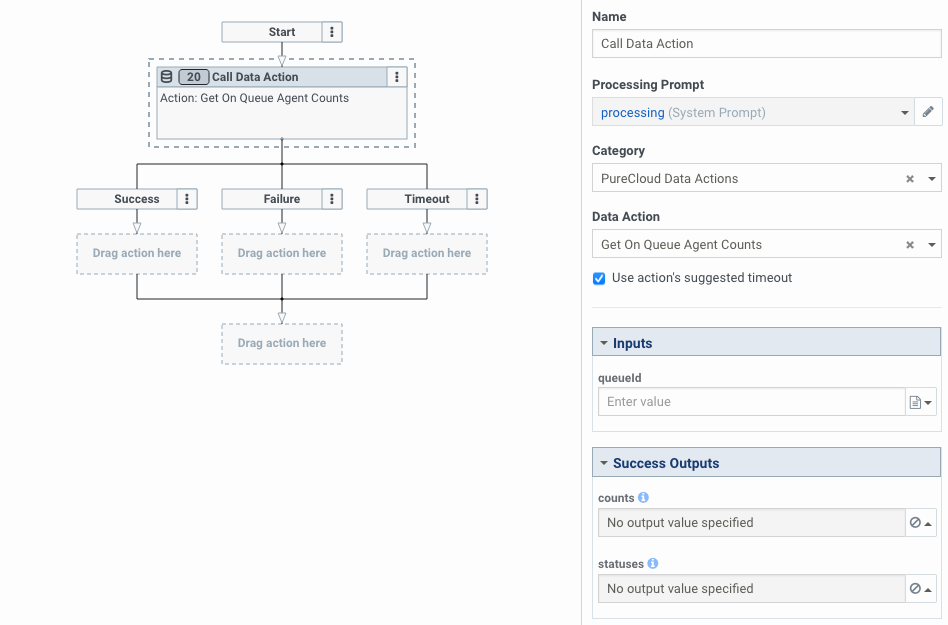
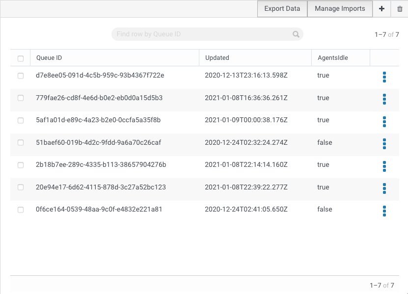
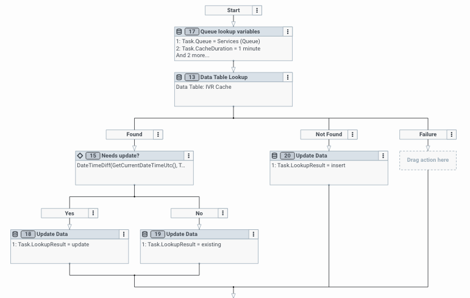
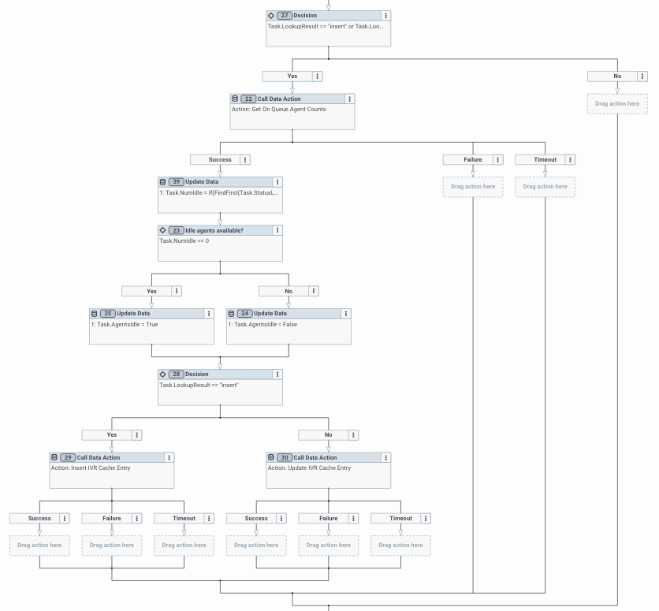
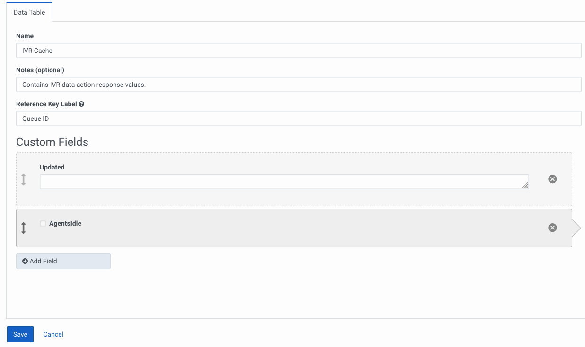
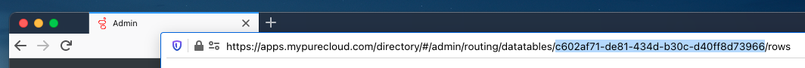
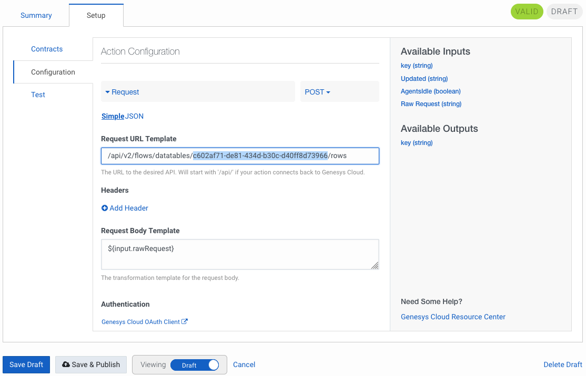
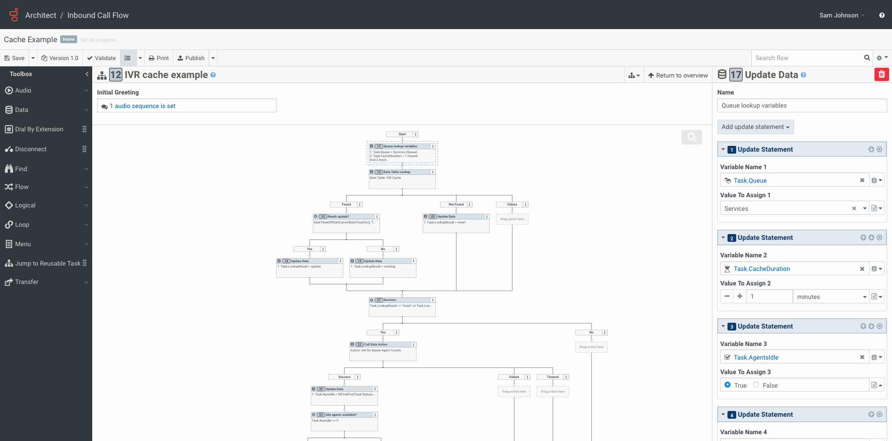

[Genesys Cloud Architect](https://help.mypurecloud.com/articles/about-architect/) is a feature-rich tool for developing voice, chat, email, and message flows. One great feature of Architect flows is the ability to call [data actions](https://help.mypurecloud.com/articles/call-data-action/). Data actions allow you to interoperate with various third-party systems and services and also with the Genesys Cloud Platform API. You can use data actions to extend the functionality of your flows beyond the Architect feature set and provide a richer experience to your customers.

While augmenting your flows with data actions can provide a great customer experience, data actions are still requests to a distributed service, and distributed services can occasionally fail. To prepare your call flows for the possibility of failure, ask yourself these questions:

1. What happens if the service the data action references becomes unavailable?
2. What if you experience a high volume of interactions, which causes the service to rate limit your requests?

Correctly handling these scenarios in your flow design can help provide continuity for your business.

In this post, we will:
1. Explore various data action failure scenarios and how to handle them
2. Understand the scalability concerns from data action usage
3. Design and implement a data action response cache to improve flow scalability using data tables
4. Implement the data table cache in a call flow
5. Deploy the data table and call flows

## Handle failure scenarios
While data action requests succeed most of the time, distributed services can fail. Therefore, it is important to understand the failure modes of the distributed service you are using, as well as how to call the service in a way that minimizes the risk of failure.    

In general, failure modes fall into these categories:

1.  Failure to handle bad user input. For example, a user enters an incorrect account number and the downstream service rejects it.  
2.  Failure of the service to respond. For example, a downstream service returns an unexpected error, the service times out, or there are network connectivity problems.
3.  Failure due to flow logic in the Call Data Action step or a misconfigured data action.  For example, a flow references an unset variable or accesses an out-of-bounds collection.
4.  Failure due to service imposed rate limits.

To handle these scenarios, be sure to include some basic error handling logic in your Architect flow.

**Handle all output paths of the action.** In Architect, each Call Data Action step has three output paths: `Success`, `Failure`, and `Timeout`. These output paths allow you to perform different logic depending on the result of action's execution.  For example, for an account lookup action, you can play back account data in the Success path, re-prompt the caller in the Failure path, and go directly to queue in the Timeout path. Be sure to clearly define the desired behavior for all three output paths.

**Set guardrails.** When you implement retry logic, whether automated or via caller input, it is extremely important that you set a reasonable upper-limit on retry requests. Retry limits prevent infinite failure loops, which cause customer frustration and excessive data action requests. If you have locally deployed edge servers for handling calls, call flows without an upper-limit of retries can "spike" the CPU on your edge server. The resulting performance hit will impact all customers served by the edge device.

**Validate data.** When you pass inputs to a data action, first check the validity of the inputs before you execute the data action. A step that accesses unset variables or an out-of-bounds collection causes the flow to use its error handling logic, which generally results in an undesirable user experience. In addition, verify that the actual input values match the data action requirements. For example, if an account number must be 10 digits, check that the input actually has 10 digits before executing the data action. These principles apply to outputs as well. This verification results in better feedback to the customer and reduces unnecessary requests.

**Configure flow error event handling.** By default, when a fatal flow execution error occurs, the call flow error event handling plays a message and disconnects the call. To provide a better customer experience, customize the error event handling to route the call to a queue or another task.

**Sanitize data action inputs.** When you create your own data action, consider how the values passed to the action inputs will be used in the request URL and/or body. Where appropriate, escape your inputs. Also, to maintain proper syntax, use silent formal notation `$!{variableName}` for non-required string inputs in a JSON request body. Consider using [Velocity macros](https://help.mypurecloud.com/articles/velocity-macros-data-actions/) in your data action request configuration to escape inputs, use conditional logic based on input values, handle missing inputs, and more.

**Be flexible in the data action response translation.** When you create your own data actions, the response translation maps the response from the service to the data action output contract. If the response translation encounters an error, the data action takes the failure path. To give your flow logic a higher chance of success, ensure that your response translation can successfully handle all scenarios, such as when some properties are missing from the response.

## Design for scalability to avoid rate limits
As a developer, it is important to keep rate limits in mind when you call data actions. While it is easy to add Call Data Action steps to a flow in order to retrieve data, do so with care: Genesys Cloud does not cache data action responses. This means that each time an interaction encounters a Call Data Action step, the data action will be executed, and the number of requests can quickly add up. For example, if a call flow executes three data actions for every call, and that flow receives 400 calls in a minute, that flow would be responsible for around 1,200 data action executions per minute, or 20 times per second.

If you expect more than a couple hundred interactions per minute, and each of those interactions calls at least one data action, then the overall data action execution may be affected by rate limits on the remote service and in Genesys Cloud.

If you find this annoying, remember that rate limits in cloud services are a good thing: they increase service availability and reduce the possibility that a single entity could cause an outage. For services that do not implement rate limits, a high volume of requests can affect service stability.

### Where to find current information about Genesys Cloud rate limits

Knowledge is power, so familiarize yourself with Genesys Cloud's rate limits here:

- [Handling rate limits on Genesys Cloud platform API requests](/api/rest/rate_limits.html)
- [Rate Limits by services in Genesys Cloud](/api/rest/v2/organization/limits.html)

**Note:** Genesys Cloud rate limits are subject to change, so plan to review these documents on a regular basis.

### Additional rate limits to be aware of
If you use the Genesys Cloud Data Actions integration to enhance your flow with data actions that invoke the Genesys Cloud Platform API, keep the following default Genesys Cloud rate limits in mind:
* 15 concurrent data action executions
* 900 data action executions per minute
* 300 platform API requests per OAuth2 token per minute

**Important:** Exceeding these limits will cause data action executions to fail, and without proper handling, your flow could also fail.

:::{"alert":"info","title":"Rate Limits with Call Flows, Data Actions and Platform APIs","autoCollapse":false}
While you can perform 900 data actions executions per minute, if you are using a data action to call a Genesys Cloud API, you can only make 300 requests per OAuth2 token before the platform API starts rate limiting requests from that token.  

Some developers try to get around these rate limits by having multiple OAuth2 clients or generating additional OAuth2 client tokens. In Genesys Cloud, hitting rate limits is a signal that you are not using our APIs correctly. For example, you are not using caching, or you are doing excessive polling.

Individual services within Genesys Cloud can have their own rate limits that are enforced at an organization level.

**Important** If you try to circumvent the rate limits in the platform API, you can inadvertently begin impacting your entire organization's ability to use Genesys Cloud, as crucial services further down the Genesys Cloud stack will begin rate-limiting. This could result in a partial or complete outage of your contact center.  

The best advice I can give is to respect the 300 requests per minute limit per token, and to use a single token in your integration. Finally, Genesys Cloud does reserve, per our [Terms of Service](https://help.mypurecloud.com/wp-content/uploads/2020/10/Genesys-Cloud-TCs-Global.pdf), the right to shut down an OAuth2 client that is causing platform instability.
:::

##  Design and implement a data action response cache
Implementing a caching mechanism for data action responses within your call flows will help avoid rate-limiting problems, make your requests more efficient, and make your requests more straightforward to implement.

To illustrate caching, the following scenario shows how to implement the ["Get On Queue Agent Counts" Genesys Cloud Data Action](https://appfoundry.mypurecloud.com/filter/genesyscloud/listing/13074443-4ffc-46b6-82c7-c3f4af51861f) from the [Genesys Cloud AppFoundry](https://appfoundry.mypurecloud.com/) in a call flow and cache its response in a data table.

### Design the data action
The "Get On Queue Agent Counts" data action checks if there are any idle agents on queue. This data action has a single input, the queue ID. The data action outputs the number of agents in each routing status.

The goal of the cache is to avoid excessive requests with the same parameters to the action endpoint. To accomplish this we need:

1. A caching mechanism that has a separate entry for each unique set of request parameters.
2. A mechanism that determines when the cached data is stale and should be reloaded. In our example, each entry will include a time stamp.
3. A cache implementation that is performant, highly available, and not subject to rate limiting when used from a flow.

:::{"alert":"info","title":"Rate Limits with Data Tables","autoCollapse":false}
The limits for reading from a data table are significantly higher than data action execution limits. However, writes to the data table are made through data actions and the Genesys Cloud Platform API. These write calls fall under our Public API rate limits. Honestly, in most cases your cached data can be 1-5 minutes old and you can still achieve your organization's customer experience objectives.
:::

Given this service expectation, the [data tables](https://help.mypurecloud.com/articles/work-with-data-tables/) feature in Genesys Cloud works well as the backing store for the cache. The cache consists of a single data table, with the key column containing the queue ID as the unique identifier, a second column containing the cache update time stamp, and a third column containing the cached value (a Boolean value indicating if any agents are on queue and idle).

In the call flow, before we call the data action, we perform a data table lookup to retrieve the cache data that matches the data action input:
- If _no_ result is found, we set a lookup result variable that indicates that we need to populate the cache with data.
- If a result _is_ found, we store the column values in variables.

These variables will also be used later in the flow.

Next we compare the cache timestamp variable with the current DateTime to see if the cache is more than 5 minutes old. Then we set the lookup result variable accordingly.

If the value of the lookup result variable indicates that we need to execute the data action, we execute it, parse the results, and set the appropriate variables (these are the same variables set by the data table lookup). Then, depending on the lookup result, we use data actions to either update the cache entry or insert a new entry in the data table.

We now have a call flow that uses cached data instead of calling a data action whenever possible, and that automatically updates the cached data when it is more than 5 minutes old.

After we publish this flow, we are ready to implement it. The following sections show how to do this, step-by-step.

### Create the data table

1. In the Genesys Cloud Admin menu, under **Architect**, click **Data Tables**.
2. Click **Add** (the **+** button on the upper right of the page).
3. In the `Name` field, type the name of the IVR cache.
4. In the `Notes` field, type a description of the data table.
5. In the `Reference Key label` field, type the queue ID.
6. Add a custom field called `Updated` that holds the DateTime of the record.
7. Add a custom field called `AgentsIdle` that indicates whether or not there are idle agents.

8. Save the data table.
9. Select the new empty data table and copy the data table's ID from the URL in the browser. We will need this ID later when we add data actions to update the cache.

## Deploy the data actions and flows

The overall process of deploying data actions and flows is:  

1. Import the data actions using the Genesys Cloud Admin UI.
2. Import the example flow using the Genesys Cloud Architect UI.
3. Publish the flow using Archy, the command-line tool.

The following sections provide step-by-step instructions on how to complete each of these steps.

### Import the data actions
1. Configure the [Genesys Cloud Data Actions integration](https://help.mypurecloud.com/articles/about-genesys-cloud-data-actions-integration/) if it is not already configured.
2. [Download the "Insert IVR Cache Entry" data action template](Insert-IVR-Cache-Entry.json).
3. [Download the "Update IVR Cache Entry" data action template](Update-IVR-Cache-Entry.json).
4. [Download the "Get On Queue Agent Counts" data action template](Get-On-Queue-Agent-Counts.json).
5. Navigate to _Admin > Integrations > Actions_ and import all 3 data actions.
6. For the _Insert_ and _Update IVR Cache Entry_ actions, update the request URL with the data table ID you noted in the previous section.

7. Save and publish the data actions.

### Import the example flow using Architect
1. [Download the example flow.](CacheExample.i3InboundFlow)
2. In Architect, from the Flows menu, click **Inbound Call**.
3. Add a new flow and give it a name that is meaningful to you.
4. When the editor opens, import the example flow.
5. Update the `Task.Queue` variable in the first step to reference a queue in your organization.
6. Update the Data Table Lookup step to reference the table you created.
7. Update each Call Data Action step to reference the appropriate action that you imported in the previous section.

### Publish the example flow using Archy
1. [Download the example flow.](CacheExampleFlow.yaml)
2. [Download Archy](/devapps/archy/)
2. Open the file and adjust the object references to match your environment if necessary.
3. Run `archy publish --file /path/to/CacheExampleFlow.yaml`.

## Conclusion
Genesys Cloud includes a rich feature set that allows you to enhance your customers' experience. When using data actions, whether they are Genesys Cloud data actions or integrations to third-party services, implement them in a robust manner to ensure maximum resiliency.  

Using the guidance and examples above, you can significantly increase the reliability and scalability of your data-action-enabled flows. Adding various forms of error handling can improve reliability during a service outage or due to unexpected input, and adding a caching mechanism can dramatically increase scalability by reducing the number of data action executions.

## Resources
1. [Caching example - Architect call flow](CacheExample.i3InboundFlow)
2. [Caching example - Archy call flow](CacheExampleFlow.yaml)
3. ["Insert IVR Cache Entry" data action template](Insert-IVR-Cache-Entry.json)
4. ["Update IVR Cache Entry" data action template](Update-IVR-Cache-Entry.json)
5. ["Get On Queue Agent Counts" data action template](Get-On-Queue-Agent-Counts.json)
6. [Archy, the Genesys Cloud Call Flow CLI](/devapps/archy/)
7. [More Genesys Cloud Data Actions on the AppFoundry](https://appfoundry.mypurecloud.com/filter/genesyscloud/listing/13074443-4ffc-46b6-82c7-c3f4af51861f)
8. [Handling rate limits on Genesys Cloud platform API requests](/api/rest/rate_limits.html)
9. [Rate Limits by services in Genesys Cloud](/api/rest/v2/organization/limits.html)
10. [Genesys Cloud Terms of Service](https://help.mypurecloud.com/wp-content/uploads/2020/10/Genesys-Cloud-TCs-Global.pdf)
