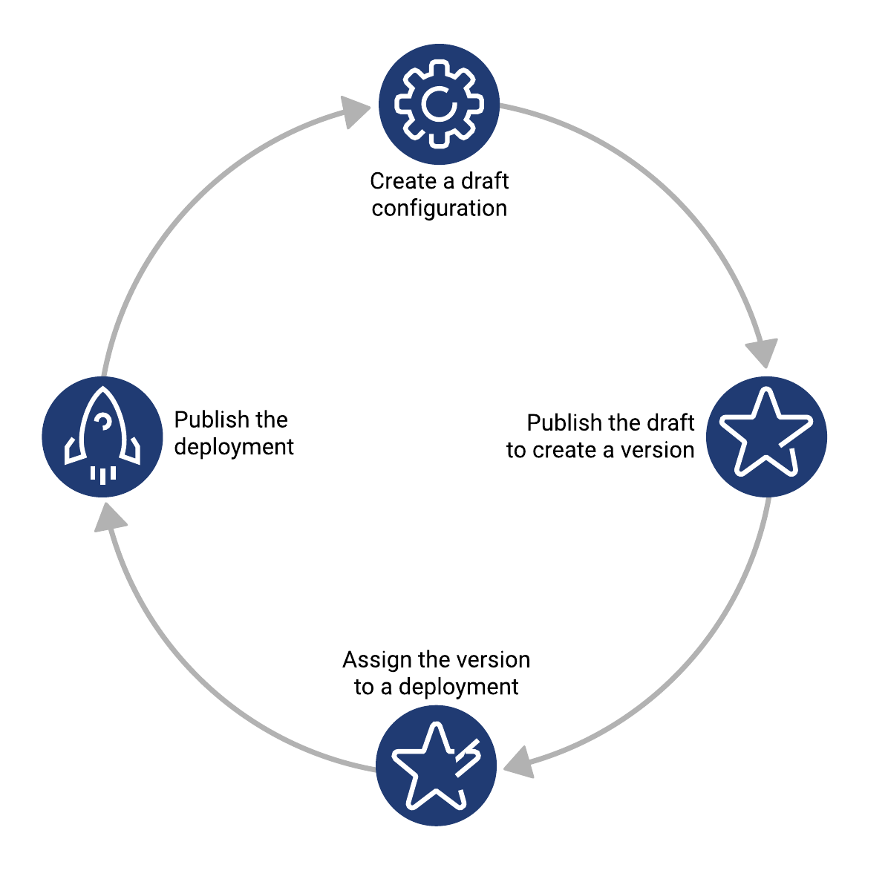
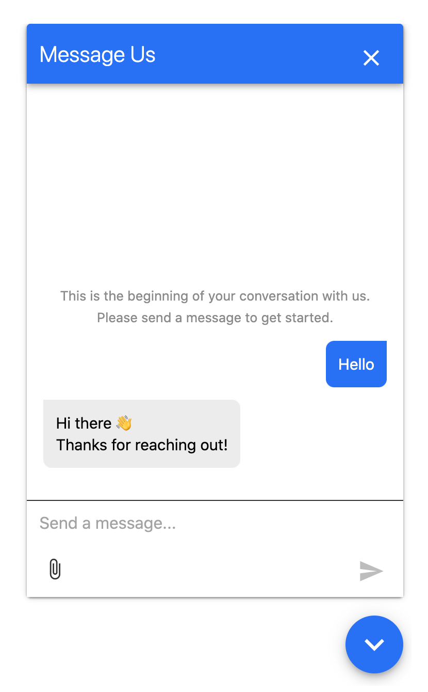

In late 2020, Genesys introduced the Beta release of our new asynchronous messaging channel, web messaging. Until this time, our web chat widget was the overwhelming customer favorite for those who were looking for a Digital solution to fielding their customers’ inquiries, however web chat conversations could only take place over a short moment in time. With the power of web messaging, conversations can now span the course of several days and weeks allowing customers to interact with brands when and where it is convenient for them.

Web messaging is available to Genesys Cloud customers using Genesys Cloud 2 and above, including the Genesys Cloud 1 Digital Upgrade 1.

In this blog we will explore the capabilities of a web messaging configuration and the associated messenger client, which your customers will use to interact with your brand.



## Create your web messaging configuration

The first step to adding a web messaging channel to your organization is to create your configuration. Here you define the foundation of how your messenger client will appear and behave.
    
:::primary
**Note**: Creating a configuration requires the **WebDeployments** > **Configuration** > **Add** permission.
:::

1.	Call **POST /api/v2/webdeployments/configurations**.

    [Sample JSON body](https://developer.mypurecloud.com/api/webmessaging/configure.html#example_messenger_configuration)
2.	Optionally specify a description.
3.	Define the following behaviors and appearance of your configuration:
- **Default language**: At runtime, we attempt to display the appropriate language for the customer. If this cannot be done, we use the default language you specify. Choose from the available language values found [here](https://developer.mypurecloud.com/api/webmessaging/configure.html#languages).
- **Messenger settings**: You can control the appearance of the messenger window your customers use to send messages to your agents by setting these values:
    - **Style**: Make the launcher button and messenger window color match your brand. Define your preferred primary color using a hex code value such as “#FF0000”.
    - **Allow attachments**: Enable your customers to enrich their conversation by sharing image attachments with your agents. Use the **fileTypes** field to specify the types of attachments you want to receive. Acceptable values are `image/jpeg`, `image/png`, and `image/gif`. (Agents can send outbound images by default.)
    - **Journey**: Track how customers navigate your website and build a rich set of journey context data about them. To turn on Genesys Predictive Engagement, in the **journeyEvents** attribute, set the **enabled** field to **true**.
:::primary
**Note**: If you are unsure of this, it is best to set **journeyEvents** to **false**. For more information, check out [About predictive engagement](https://help.mypurecloud.com/articles/about-predictive-engagement/).
:::

## Publish your configuration
After running the POST and receiving a successful response, you will see that the response includes a configuration ID value. At this point, the configuration is saved as a draft. Much like an Architect flow, you need to publish the configuration before it can be properly used.

1.	Call **POST /api/v2/webdeployments/configurations/{configurationId}/versions/draft/publish**. Replace {configurationId} with your configuration’s Id value, which was returned in the previous steps.

Your configuration status automatically changes from Draft to Active. To verify this, call **GET/api/v2/webdeployments/configurations** and check that your configuration ID is listed with Version: 1.

Any subsequent updates become part of the next draft version, which then becomes Version 2 when you publish it.

## Create your messenger deployment

When you create your deployment, you connect your configuration to an inbound messaging flow. You also generate the single snippet that you will deploy on your website. After you deploy the snippet, the launcher for the messenger client window appears on your web pages.

By having two distinct entities, a configuration and a deployment, you can update your configuration at any time while eliminating the need to re-deploy the single snippet to your website. Deploy once, update infinitely!

:::primary
**Note**: Creating a deployment requires the **WebDeployments > Deployment > Add** permission.
:::

1.	Call **POST /api/v2/webdeployments/deployments**.

      [Sample JSON body](https://developer.mypurecloud.com/api/webmessaging/configure.html#example_messenger_deployment)
2.	Specify the ID of the configuration that you created earlier. The DRAFT and Version 1 will still share the same configuration ID.
3.	Specify the version of your configuration ID.
4.	Specify the allowed domains for the deployment. If you deploy the snippet to a domain that you do not specify here, the messenger client window will not appear.
5.	Assign your Architect flow. To retrieve the ID of the Architect flow, use **GET /api/v2/flows**. The flow you choose must be a saved and published inbound message flow.

After you have successfully created your deployment, you will receive an API response with the single snippet. It will look something like this:
```{ "title": "Example single snippet", "language": "JavaScript"}
<script type=\"text/javascript\" charset=\"utf-8\">
(function (g, e, n, es, ys) {
    g['_genesysJs'] = e;
    g[e] = g[e] || function () {
        (g[e].q = g[e].q || []).push(arguments)
    };
    g[e].t = 1 * new Date();
    g[e].c = es;
    ys = document.createElement('script'); ys.async = 1; ys.src = n; ys.charset = 'utf-8'; document.head.appendChild(ys);
})(window, 'Genesys', 'https://YourOrg.com/genesys-bootstrap/genesys.min.js', {
    environment: 'test',
    deploymentId: 'abc123de-f456-ghi7-89jk-l012mno345pq'
});
</script>
```

Copy your snippet and add it to your web page files or deploy it using a Tag Manager tool. The next time you navigate to your specified domain (including sub-domains), you will see the messenger launcher button appear in the bottom-right corner of the page:


When you click this button, the messenger client window appears.



Congratulations on creating your first messenger deployment!

We’ve only begun to scratch the surface on what is possible through web messaging. For a deep dive into enhanced capabilities please check out our [Developer Center documentation](https://developer.mypurecloud.com/api/webmessaging/), which will remain up-to-date with the latest additions to this growing channel. As you become more familiar, we would love to hear your ideas and feedback in order to help create a better messaging and administration experience.

So long, and happy messaging!
