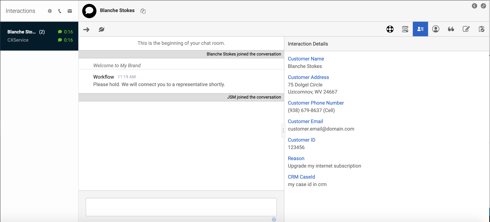
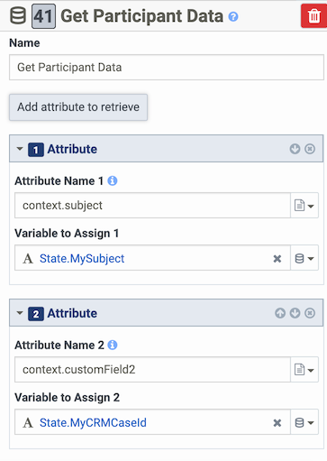
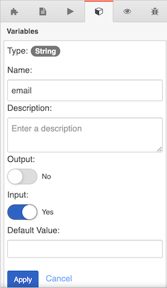
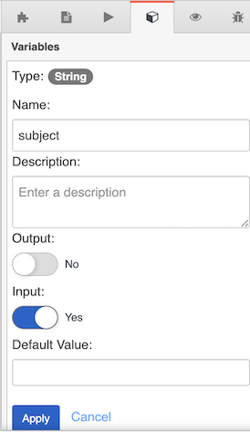

In this blog, I will explain how to retrieve and leverage chat data in Genesys Cloud by using [web chat widget - version 2](/api/webchat/widget-version2.html).

When you expose chat capabilities on your website, you can collect data about your customer and send that information to Genesys Cloud. You can then leverage this data in your Architect Inbound Chat flow to make routing decisions. You can also expose this data as [interaction details](https://rcstaging.wpengine.com/?p=126054) or in an agent [script](https://rcstaging.wpengine.com/?p=54284) to provide more details about the customer's experience to the contact center agent.  

First, let's make sure we're on the same page with some key definitions. In Genesys Cloud:

- A ***conversation*** includes the related touch points between a customer and a bot or agent that occur during a given period of time.
- A ***conversation context*** is the meta data about a conversation.
- ***Participant attributes*** are the details about the participant that are specific to the conversation.

Now, let's review the different ways to collect and send data using web chat widget - version 2.

## Collect and send conversation data

To collect data from a customer during a web chat, you can either use a standard chat registration form which collects the customer's `firstname`, `lastname`, `email` and `subject`, or you can define a [custom registration form](https://all.docs.genesys.com/WID/Current/SDK/WebChat-combined#Customizable_chat_registration_form) to capture data that is tailored to your organization's needs.

Both standard forms and custom forms allow customers to provide information about themselves through familiar UI controls such as text fields, drop-down lists, and checkboxes.  

In addition to data that you capture via a standard or custom form, you can also send ***static*** data to Genesys Cloud. Static data is anything you retrieve from your backend system about the customer's browsing history or the customer's account. For example, the customer's address and the customer's account number are types of static data.  

To send static data to Genesys Cloud, you define the `userData` structure in the [widgets configuration](/api/webchat/widget-version2.html#custom__userdata_). Alternatively, if you use the [WebChat.open command](https://all.docs.genesys.com/WID/Current/SDK/WebChat-combined#open) to open and to start a chat, you can set `userData` as a parameter.

The data you collect in the chat registration form (standard or custom) and any data you define as `userData` are sent to Genesys Cloud as part of the initial **create chat** request. In addition, this data is automatically added as conversation participant attributes for the conversation, which I will explain next.

## Retrieve conversation context data

You can retrieve a conversation context by doing either of the following:

- Use the [Conversations API to get the conversation](/api/rest/v2/conversations/#get-api-v2-conversations--conversationId-)
- Use an [Analytics asynchronous job to get conversation details](/api/rest/v2/conversations/#post-api-v2-analytics-conversations-details-jobs)

:::primary
**Note:** For the [Analytics Query for Conversation Details (synchronous)](/api/rest/v2/conversations/#post-api-v2-analytics-conversations-details-query), a query for conversation details does not bring back participant attributes. If you want to use an analytics query to retrieve information on conversations and you want to get the participant attributes as well, you must use an asynchronous job.
:::

## How Genesys Cloud renames your participant attributes  

There are a few things to remember about the names of participant attributes:

1. When a chat is created, Genesys Cloud (server/cloud side) automatically prepends chat attribute names with `context`. You will find these key/value pairs, starting with the `context` prefix, under the participant attributes on the customer participant.

  For example, if you use `key1` as an attribute name (as part of a registration form or as `userData`), this piece of data will become a participant attribute named `context.key1`.

2. When you use a custom registration form with a set of fields, the "name" attribute of the field defines the keyname of your corresponding participant data.

  For example, if you [use a custom registration form](/api/webchat/widget-version2.html#customize_input_fields_through_configuration_object), `firstname`, `Page`, `Today` are used. The corresponding participant attributes in the Genesys Cloud conversation are `context.firstname`, `context.Page`, and `context.Today`.

3. If you use the standard chat registration form, four input fields are exposed: `FirstName`, `LastName`, `Email`, and `Subject`. The corresponding web chat widget - version 2 attribute names (keynames) are: `firstname`, `lastname`, `email`, `subject`. With the "context." prefix added by Genesys Cloud, these become participant attributes named: `context.firstname`, `context.lastname`, `context.email` and `context.subject`.

## Built-in participant attributes
In addition to whatever participant attributes you define, web chat widget version - 2 also automatically collects and sends the following participant attributes as part of the Genesys Cloud conversation.

:::primary
**Note** These built-in participant attributes are automatically sent regardless of whether you use a  standard chat registration form or a custom chat registration form.
:::

| Name                       | Description                      | Example|
| -------------------------- | -------------------------------- | ---- |
|  `context._genesys_OS`     | operating system of the customer | `Mac OS X`|
|  `context._genesys_browser`| web browser used by the customer | `Chrome`|
| `context._genesys_source`  | device used by the customer      | `web` |
| `context._genesys_url`     | url of the page where the chat was started |  |
| `context._genesys_pageTitle` | title of the page where the chat was started|  |
| `context._genesys_referrer` | value of the [HTTP Referrer header](https://developer.mozilla.org/en-US/docs/Web/HTTP/Headers/Referer) (if any)|        |
{: class="table-striped table-bordered"}

### Participant attributes for queues

If you set a `Queue` as a `targetAddress` in your [widget configuration](/api/webchat/widget-version2.html#create_a_widget_configuration_object), the following participant data will become available to you in your Architect inbound chat flow: `context.genesys.legacyRoutingTargetQueueAddress`.  

If you want to leverage this input in your **Transfer to ACD** action, you will first need to transform the retrieved queue name into a queue object/variable. For information about how to do this see, [Find Queue action](https://rcstaging.wpengine.com/?p=185741).

## What the conversation service returns

We have walked through a description of the participant attributes you can add as well as those that are automatically included with every chat. Now let's look at the what the Conversation service returns when we make a request to [GET /api/v2/conversations/{conversationId}](https://developer.mypurecloud.com/api/rest/v2/conversations/#get-api-v2-conversations--conversationId-).

```{"title":"Conversation service return payload", "language":"json"}
{
  "id": "my_conversation_id",
  "startTime": "2021-01-20T09:25:34.532Z",
  "endTime": "2021-01-20T09:32:03.940Z",
  "participants": [
    {
      "id": "my_customer_participant_id",
      "startTime": "2021-01-20T09:25:34.532Z",
      "endTime": "2021-01-20T09:32:02.388Z",
      "connectedTime": "2021-01-20T09:25:34.532Z",
      "name": "Blanche Stokes",
      "queueId": "my_queue_id",
      "queueName": "CXService",
      "purpose": "customer",
      "wrapupRequired": false,
      "attributes": {
        "context.email": "customer.email@domain.com",
        "context.addressPostalCode": "24667",
        "context.customerId": "123456",
        "context.customField1Label": "Reason",
        "context._genesys_OS": "Mac OS X",
        "context._genesys_browser": "Chrome",
        "context.phoneType": "Cell",
        "context._genesys_referrer": "https://developer.mypurecloud.ie/",
        "context.addressStreet": "75 Dolgel Circle",
        "context.phoneNumber": "(938) 679-8637",
        "context._genesys_source": "web",
        "context.customField2Label": "CRM CaseId",
        "context.addressCity": "Uzicomnov",
        "context.genesys.legacyRoutingTargetQueueAddress": "CXService",
        "context.firstName": "Blanche",
        "context.customField2": "my case id in crm",
        "context.lastName": "Stokes",
        "context.subject": "Test subject",
        "context._genesys_url": "https://developer.mypurecloud.ie/developer-tools/#/webchat",
        "context.addressState": "WV",
        "context._genesys_pageTitle": "Developer Tools",
        "context.customField1": "Upgrade my internet subscription"
      },
      "calls": [],
      "callbacks": [],
      "chats": [
        {
          "state": "disconnected",
          "id": "my_chat_id",
          "segments": [
            {
              "startTime": "2021-01-20T09:25:34.532Z",
              "endTime": "2021-01-20T09:32:02.388Z",
              "type": "Interact",
              "howEnded": "Disconnect",
              "disconnectType": "peer"
            }
          ],
          "held": false,
          "direction": "inbound",
          "disconnectType": "peer",
          "connectedTime": "2021-01-20T09:25:34.539Z",
          "disconnectedTime": "2021-01-20T09:32:02.388Z",
          "provider": "PureCloud Webchat v2",
          "afterCallWorkRequired": false
        }
      ],
      "cobrowsesessions": [],
      "emails": [],
      "messages": [],
      "screenshares": [],
      "socialExpressions": [],
      "videos": []
    },
    {
      ...
    },
    {
      ...
    },
    {
      ...
    }
  ],
  "recordingState": "NONE",
  "divisions": [
    {
      ...
    }
  ],
  "selfUri": "/api/v2/conversations/my_conversation_id"
}
```

## Use your chat data

Now that we've seen how to collect chat data and return it with the API, let's look at how to use chat data in Genesys Cloud. Specifically:

- Agents see it in the [Interaction Details panel](#chat_data_in_the_Interaction_Details_panel).
- You can use chat data with an [Architect inbound chat flow](#Use_chat_attributes_with_an_architect_inbound_chat_flow).
- You can use chat data with [scripts](#use_scripts_for_maximum_flexibility_and_control).


### Chat data in the Interaction Details panel
To populate the [Interaction Details panel](https://rcstaging.wpengine.com/?p=126054) for a chat conversation, Genesys Cloud uses the values of these fields:

- `firstname`
- `lastname`
- `email`
- `addressStreet`
- `addressCity`
- `addressPostalCode`
- `addressState`
- `phoneNumber`
- `phoneType`
- `customerId`

You can also include up to 3 `customField` attributes, along with their corresponding `customField1Label` attributes like this:

- `customField1Label`
- `customField1`
- `customField2Label`
- `customField2`
- `customField3Label`
- `customField3`

The interaction details for a chat conversation includes the following derived attributes:

- `Customer Name`: based on `firstname` and `lastname`
- `Customer Address`: based on `addressStreet`, `addressCity`, `addressPostalCode` and `addressState`
- `Customer Phone Number`: based on `phoneNumber` and `phoneType`
- `Customer Email`: based on `email`
- `Customer ID`: based on `customerId`

The following image shows how the conversation context shown above appears in the Interaction Details panel.



## Use chat attributes with an Architect Inbound Chat flow

As I mentioned earlier, chat-related information can be used with Architect to route inbound chats to the appropriate agent. To retrieve chat data for use with Architect, use a [Get Participant Data action](https://rcstaging.wpengine.com/?p=20576). Be sure to use `context.<<your keyname>>` as the attribute name.



## Use scripts for maximum flexibility and control

For more control over the chat data that you display to agents, use a [script](https://rcstaging.wpengine.com/?p=54284). With a script, you are not limited to a specific set of keynames (unlike with Interaction Details). Instead, you can retrieve and expose any of the chat data that you have collected.

Scripts offers two ways to retrieve chat data attributes:

1.	Use [built-in script variables for chats](#use_built_in_script_variables).
2.	Use [script variables](#use_script_variables).

### Use built in script variables for chats
Built-in variables are already predefined for you. For information on how to use built-in script variables, see [Script built-in variables](https://rcstaging.wpengine.com/?p=70896).

:::primary
**Note**
The `customer email` built-in variable is not supported with web chat widget version 2. To access this variable, use the script variables approach.
:::

|Script built-in variable |Web chat widget - version 2 attribute | Conversation participant attribute|
|-------------------------|------------------- |-----------------------------------|
Chat.Customer Email   | Not supported      | Not supported |
Chat.Customer First Name | firstname | context.firstname |
Chat.Customer Last Name | lastname | context.lastname |
Chat.Customer Street | addressStreet | context.addressStreet |
Chat.Customer City | addressCity | context.addressCity |
Chat.Customer Postal Code | addressPostalCode | context.addressPostalCode |
Chat.Customer State | addressState | context.addressState |
Chat.Customer Phone Number | phoneNumber | context.phoneNumber |
Chat.Customer Phone Type | phoneType | context.phoneType |
Chat.Customer ID | customerId | context.customerId |  |

### Use script variables

To use chat data that is not included in a built-in variable, [add a script variable](https://rcstaging.wpengine.com/?p=35478). With a script variable, you can get all of your chat data, including `email` and other custom chat attributes. Remember to turn on the **Input property** toggle. This allows the value to be assigned from an external source, such as an Architect flow. When the script loads, the script extracts participant attributes with the corresponding variable `Name` from the conversation context and stores their values in the appropriate script variables.





Remember the following points:
- [Genesys Cloud renames your participant attributes](#how_Genesys_Cloud_renames_your_participant_attributes), such as `Name`,`email`,`subject`, `_genesys_pageTitle`. Build your script variables accordingly.
- Scripts do not support attribute names with a "." (dot). Therefore, you cannot use "context.email", which is the name of the participant attribute as it is stored in the Conversation context. Instead, you can specify the variable name as "email" and the script will automatically look for the participant attribute name, "context.email". The same goes for any other participant attributes starting with "context".

:::primary
**Important**
Don't forget to enable chat in your script properties!
:::


## Closing thoughts
This article was written in response to the number of questions we get from our developers who are building with the web chat widget version - 2 chat components and APIs. In first quarter of 2021, Genesys Cloud launched the beta version of our next generation Web Messaging platform. This new Web Messaging platform will become the recommended approach for customers looking to build user-to-agent chat capabilities within their own applications. For more information on our new Web Messaging platform, see [Web messaging and Messenger](https://developer.mypurecloud.com/api/webmessaging).
