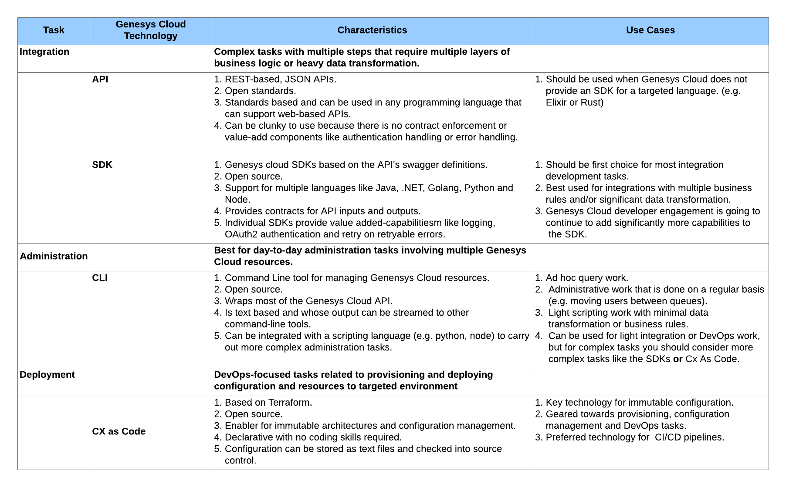

Greetings everyone. I am excited today to introduce the newest tool to the Genesys Cloud developer ecosystem: **CX as Code**. **CX as Code** is a configuration management tool that allows you to define Genesys Cloud configuration objects (e.g. Queues, Skills, Users, etc) in plain old text files and then apply that configuration across multiple Genesys Cloud organizations. It is ideally suited for use in a CI/CD (Continuous Integration/Continuous Deployment) deployment pipeline.

Using the **CX as Code** tool promotes a number of DevOps best practices, including:

1. __Immutable Configuration__. **CX as Code** allows you to define your Genesys Cloud configuration as text files (e.g code) and not use the UI or custom scripts to setup your organization's configuration.  This means you can ensure that your configuration is applied consistently across all of your Genesys Cloud organizations (e.g. dev, test, production). Your core configuration becomes immutable. It takes the human being out of the deployment process and minimizes the risk of **configuration drift**.

2. __Declarative Configuration__. **CX as Code** allows you to describe what you want your Genesys Cloud configuration to look like without knowing how your objects are actually created. With **CX as Code** you are able to describe the relationships that exists between objects (e.g. the users belonging to a queue) without having to worry about which step in the configuration happens first. **CX as Code** figures out the relationships and dependencies and does the work for you. There is nothing stopping you from scripting this type of behavior by using the Genesys Cloud API, but you would have to know how to manage and implement these relationships dependencies. **CX as Code** removes this burden.

3. __Configuration as plain old text__. All configuration managed by **CX as Code** is stored as plain old text files and can be checked into your source control system. This allows you to leverage the versioning and audit capabilities of your source control system and also means that you can deploy the configuration for Genesys Cloud with the application code that depend on the configuration. 

# What is **CX as Code** built on
One of the key lessons our own Genesys Cloud DevOps team has learned is that you should not try to build all of your DevOps tools from scratch. Instead, when feasible, leverage open source frameworks that encompass industry best practices. To this end the **CX as Code** tool is built on top of HashiCorp's Terraform [[1](https://www.terraform.io/)] tool. Terraform is a cloud provisioning tool that was originally designed to provide a common language and framework for cloud-based providers like AWS, Azure and Google Cloud. Terraform exposes provisioning functionality through plugins (called providers) that implement "how" individual cloud objects (called resources) are created, updated and deleted.

The **CX as Code** team has built a Genesys Cloud provider and has registered it in the Terraform provider's registry [[2](https://registry.terraform.io/providers/MyPureCloud/genesyscloud/latest)]. All of the documentation for the Genesys Cloud provider along with all of the objects currently exposed as resources in the provider can be seen in the Genesys Cloud provider's documentation [[3](https://registry.terraform.io/providers/MyPureCloud/genesyscloud/latest/docs)].

**Note: The Terraform registry for **CX as Code** lists all of the Genesys Cloud objects currently available as resources in  the Genesys Cloud Terraform provider. The CX as Code team is still building additional objects so please check back with the registry for additional updates.**

In addition, **CX as Code** is open-source. This means if you want to customize the Genesys Cloud Terraform provider or even offer your own pull requests you are able to do so. Pull requests are welcome by the **CX as Code** team. The **CX as Code** repository can be found in the Genesys Cloud Github repo. [[4](https://github.com/MyPureCloud/terraform-provider-genesyscloud)]

# Installing **CX as Code**
To use **CX as Code** you just simply need to install the Terraform CLI [[5](https://www.terraform.io/downloads.html)]. The Terraform CLI is a single binary that can be installed anywhere on your operating system's path. For example, when I work with Terraform, I setup a Linux server and run the following commands to download the Terraform binaries:

```shell
wget https://releases.hashicorp.com/terraform/0.14.10/terraform_0.14.10_linux_amd64.zip
unzip terraform_0.14.10_linux_amd64.zip
mv terraform /usr/local/bin
```

Once you have Terraform installed, you simply need to setup the Terraform files for your Genesys Cloud organization. In your Terraform file(s) you will define that you want to use the Genesys Cloud Terraform provider. When you run Terraform, Terraform will download the Genesys Cloud provider and then begin setting up the configurations defined inside the Terraform file. 

:::{"alert":"info","title":"Using Vagrant as a Quick CX as Code test bed","autoCollapse":false}
I regularly use another Hashicorp tool called Vagrant [[6](https://www.vagrantup.com/)] to provision virtual machines (VM) to use as a "clean room" when working with new tools. This blog post contains the Vagrant file I used to setup an Ubuntu-based VM to work with Terraform.[[7](Vagrantfile)]

The Vagrant file:

1. Downloads Terraform, unzips it and then installs it into the `/usr/local/bin` directory on the VM. 
2. Downloads the latest copy of the Genesys Cloud CLI. [8](/api/rest/command-line-interface/)] 
3. Copies your Genesys Cloud CLI credentials off of your local machine to the VM host. **Note: It assumes a Linux/OS X environment, so you will have to modify the file for a Windows path.**
4. Mounts a local directory onto your host machine. Again, you will need to modify the Vagrant file to point to the local directory you want to mount.
:::

# **CX as Code** in action
The best way to learn **CX as Code** is to begin playing with it. So with this blog post I have included 4 files that can help you jumpstart your own experimentation. The four files that are included are:

1. [setenv.sh](setenv.sh). The Genesys Cloud Terraform provider needs to have an OAuth2 client credential defined and the AWS region that you want the provider to connect to. You can either provide these directly in your provider file when you configure the Genesys Cloud provider or you can set them as environment variables. This file contains the environment variables that can be set (remember to run the shell script before you run Terraform). 
2. [main.tf](main.tf). Terraform allows you maintain your configuration as a single file or break your configuration into multiple files. I personally like to group related resource definitions into file names that represent them so the `main.tf` file defines only the Terraform version we want to use and the Genesys Cloud Terraform provider.
3. [users.tf](users.tf). The `users.tf` file defines three Genesys Cloud users.
4. [queues.tf](queues.tf). The `queues.tf` file defines four Genesys Cloud queues. Also, the `IRA` queue demonstrates how to assign users to a queue via the `members` property.

I am not going to walkthrough how to run this example in this blog. Instead, I am going to point you to a ~20 minute DevDrop video [[9](https://www.youtube.com/watch?v=ol_8HYSGmGg)] that demonstrates how to run the Terraform files provided above. 

**Note**: The beginning of the DevDrop covers some of the introductory material we already cover in this blog post. The actual demo of the provider begins at ~7:15 in the video.

# How does **CX as Code** fit into the Genesys Cloud ecosystem
Before I close this blog post, I want to spend a little bit of time talking about how **CX as Code** fits into the overall Genesys Cloud ecosystem. Specifically, when should you consider using **CX as Code** vs. using the Genesys Cloud APIs, SDK or CLI? With cloud-based platforms, you are going to usually need to perform three core development tasks: integration, administration and provisioning (e.g. CI/CD).  The table below highlights these three tasks, the Genesys Cloud technologies used to execute them, along with their characteristics and use cases:



This wraps up our introduction to **CX as Code**. I would encourage you to download and try it out. It's an exciting piece of technology and can change the way you think about managing your Genesys Cloud organization. Try it out, don't be afraid to share your feedback, and let's build something great together.

# Additional Resources
1. [Terraform](https://www.terraform.io/)
2. [Genesys Cloud Provider](https://registry.terraform.io/providers/MyPureCloud/genesyscloud/latest)
3. [Genesys Cloud Provider Documentation](https://registry.terraform.io/providers/MyPureCloud/genesyscloud/latest/docs)
4. [Genesys Cloud Github Repository](https://github.com/MyPureCloud/terraform-provider-genesyscloud)]
5. [Terraform CLI](https://www.terraform.io/downloads.html)
6. [Vagrant](https://www.vagrantup.com/)
7. [Vagrantfile with terraform and the Genesys Cloud CLI](https://www.vagrantup.com/)
8. [Genesys Cloud CLI](/api/rest/command-line-interface/)
9. [DevDrop #5: A preview of CX as Code](https://www.youtube.com/watch?v=ol_8HYSGmGg)
