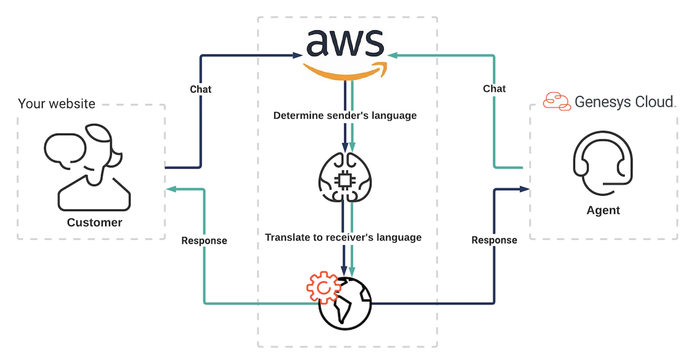
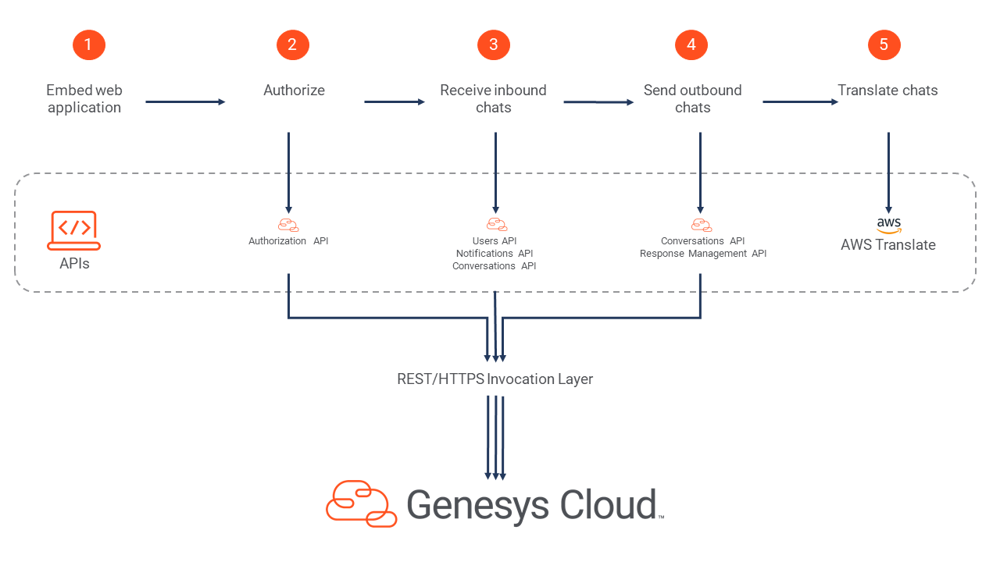
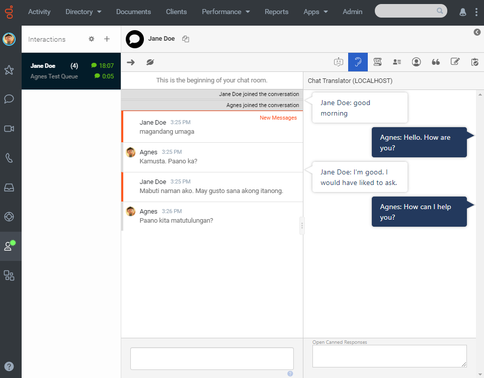
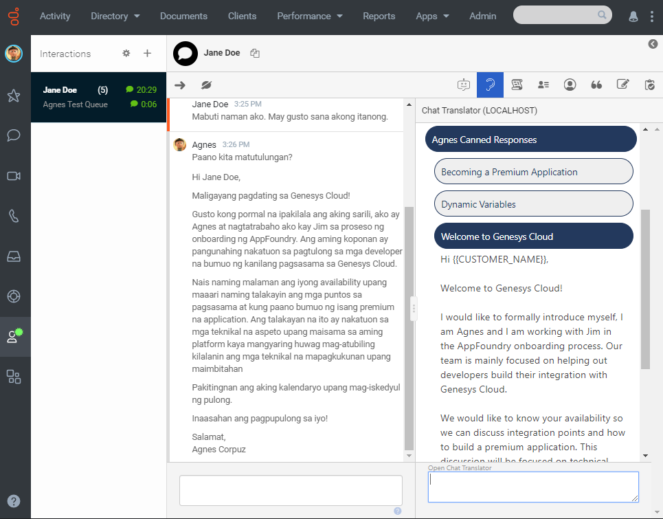

We are excited to announce two new articles in the Developer Center about the Chat Translation application - the [UI Integration Developer Starting Guide](/guides/ui-integration/) and the [AWS Chat Translate Blueprint](/blueprints/chat-translator-blueprint/). The UI Integration Developer Starting Guide provides a walk-through on how to integrate a third-party web application into Genesys Cloud. The guide uses our AWS Chat Translate Blueprint and provides a step-by-step process on how developers can build their own translation application that will take an incoming web chat and translate the customer's message from their native language to the agent's configured language in Genesys Cloud. In this developer starting guide, we also show how to capture inbound chat messages via the Genesys Cloud notification service, call AWS translate to translate messages between customer and agent, and send the translated mesage back to the customer. As a bonus, we show how to integrate, translate and send canned responses to the customer.

