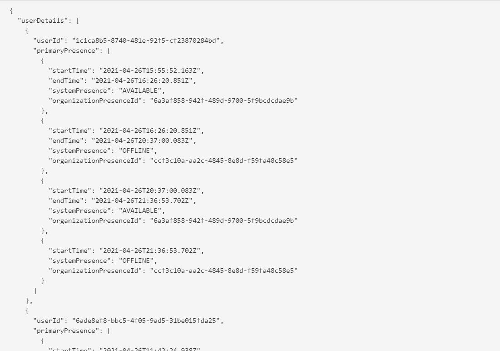
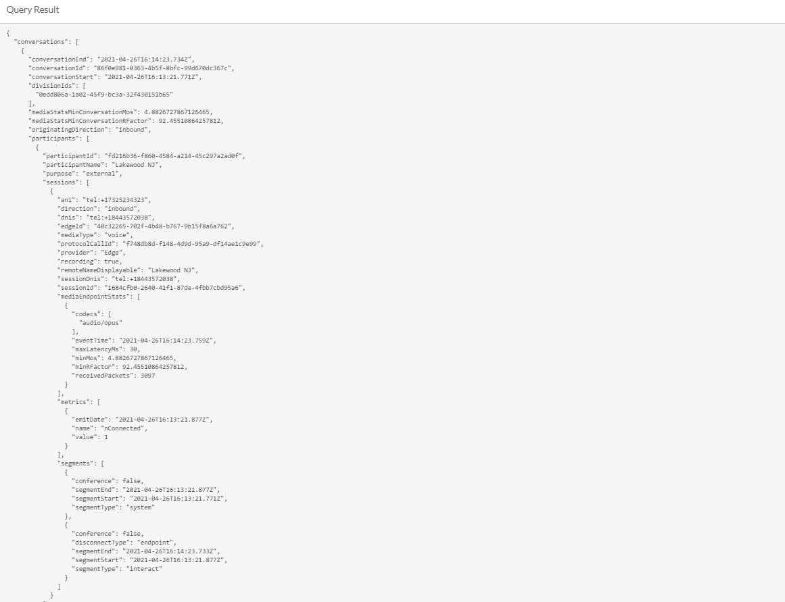
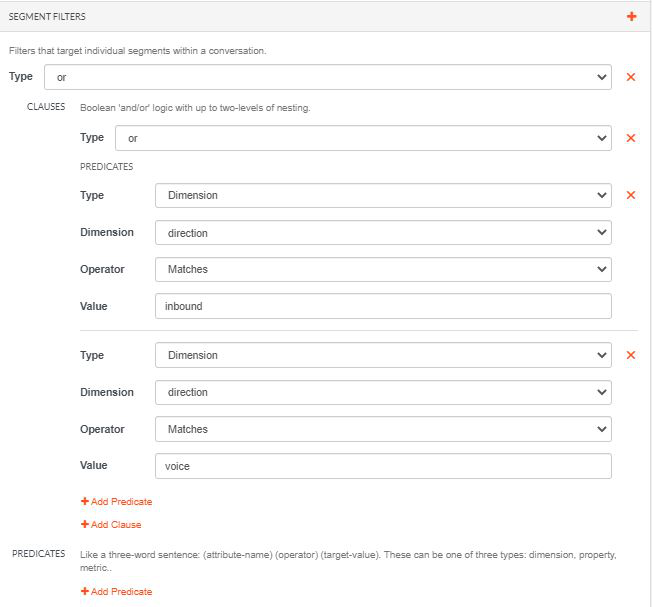
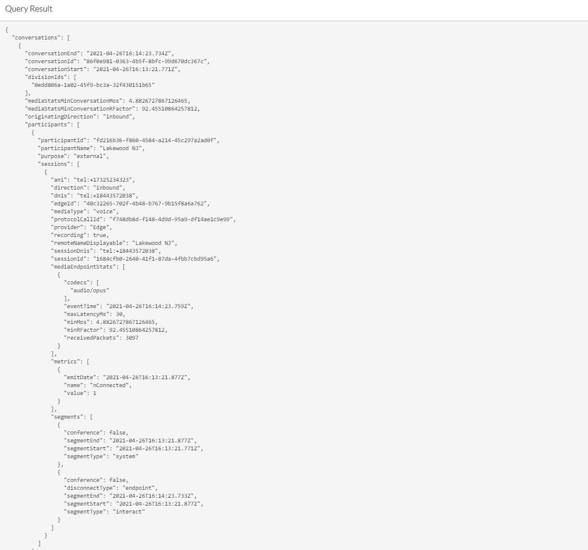
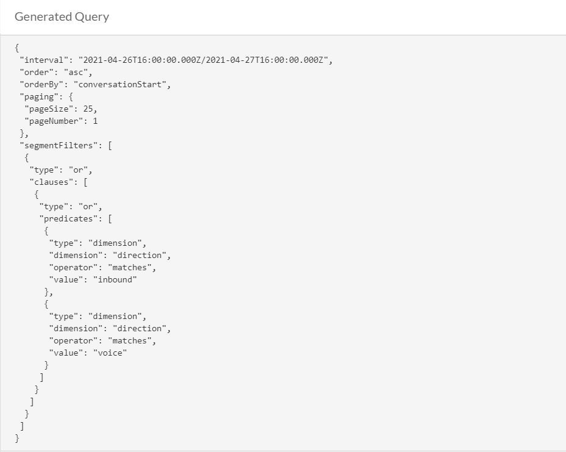
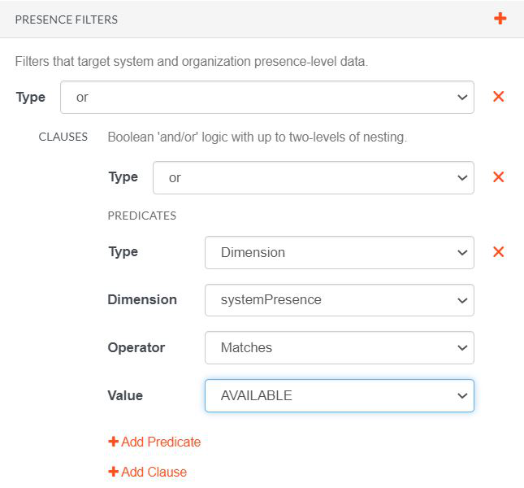
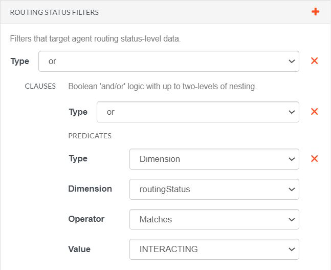
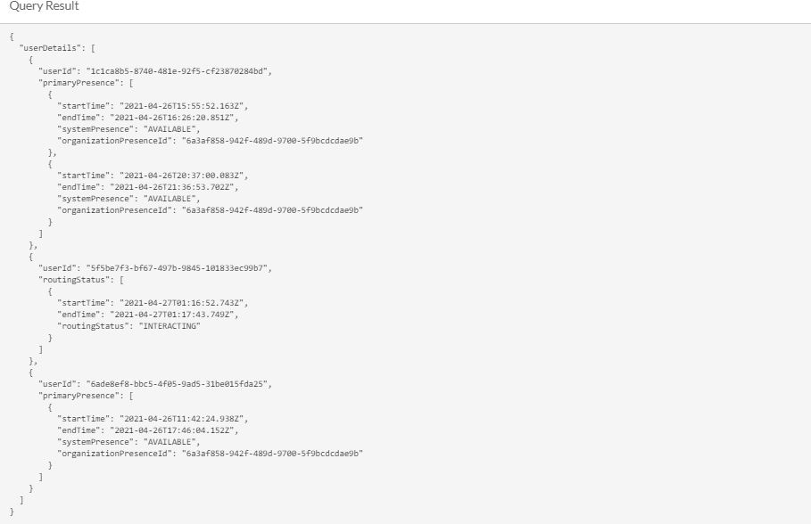

Greetings everyone! Analytics API can be used to know how customers interact with your organization and to get a detailed snapshot on what is going on within your contact center. There are three data perspective of data in Analytics API. 

1. Instantaneous Observations
2. Aggregate Metrics
3. Detailed Records

For this blog, we will focus on how to get detailed records using the Analytics API. 

Instantaneous Observations focus on the real time data. Aggregate Metrics is the KPI that can be used to measure the perfomance of each agent. Detailed Records are Audit style records that capture a very fine-grained level of detail around user (e.g. agent) and customer interactions.

There are other ways to create analytics queries but the Analytics Query Builder developer tool is the simplest tool we can use to generate one.  This tool provides a user interface that simplifies the creation of analytics queries. You can choose the parameters and query type you want to use to generate the query but for this example we will be using user and conversation to fetch query for user and conversation details.

## Standard user query result

This is a generated query for user. This is where you can find all the details about a user's activity during a specific date. If you want to see a detailed record of an agent's activity such as the time when an agent is on queue or availble, this is the query you can use. This can be served as useful reference if you want to optimize agent's productivity time.

## Standard conversation query result

This is a sample result for a conversation query. If you want to extract details such as the name of the participant in the call, the caller's phone number, and any other details. This is where you can generate every specific detail you want to get from a conversation.

 

## Modified results

The user can also modify the search and add specific filter. This is to eliminate unncessary data on the generated query. In this case, we will search for inbound and voice data. To do so, go to Segment filters, in the predicates section, click on `type`, and select `Dimension`. On the dimension select `value`. And on the value field type in `inbound`. For the voice filter add another predicate. Select `dimension` as type and select `direction` for dimension. Type `voice` in the value field.

To search for the available and interacting agents, go to Presence filters, in the predicates section click on `dimension`. Then choose `systemPresence` as the dimension. Set the value dropdown to "available". 

For the Routing Status, go to Routing Status Filters. Select `or` as type. Under the predicates value choose `dimension`, on the dimension choose `Routing Status`. And select `Interacting` as Value.

This is the result when the filters are applied, other data will be filtered out. This will make the result straightforward depending on the user need.

 

 ## Closing Thoughts

Through the use of the Analytics Query Detailed Records Metrics, call center data can improve its efficiency and produce a predictive analysis that can be used on refining the whole call center operations.

## Additional Resources

1. [Analytics Query Builder developer tool quick start](/guides/quickstarts/developer-tools-analytics-query)
2. [Analytics overview](/api/rest/v2/analytics/overview.html#data_perspective)
3. [How to Get Real-Time and Historical Data with the Analytics API](https://www.youtube.com/watch?v=K0K70FWOR4U&list=PL4anLPM52HBAGAxapoCL-mVMiI-M0rcXS&index=4)

