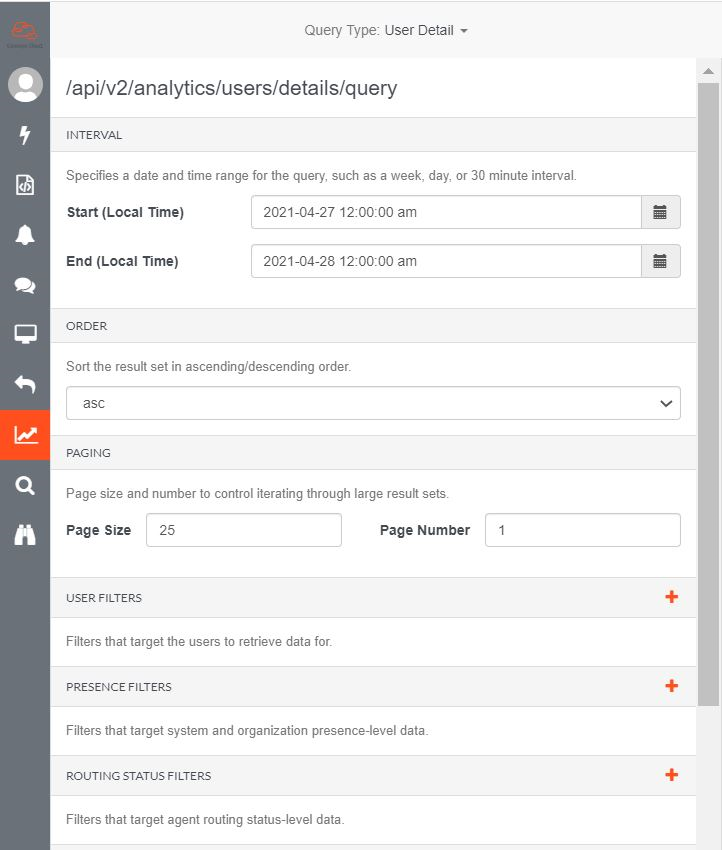

Greetings everyone! There are three data perspective of data in Analytics API. For this blog, we will focus on  how to get detailed records using the Analytics API. 

## Open the Analytics Query Builder

There are three perspective of data in Analytics API. Instantaneous Observations, Aggregate Metrics and Detailed Records. This blog will focus on the detailed records. Detailed Records are Audit style records that capture a very fine-grained level of detail around user (e.g. agent) and customer interactions.

There are other ways to create analytics queries but this is the simplest tool we can use to generate one. The Analytics Query Builder developer tool provides a user interface that simplifies the creation of analytics queries. You can choose the parameters and query type you want to use to generate the query but for this example we will be using user and conversation to fetch query for user and conversation details.

## Standard user query result

This is a generated query for user. This is where you can find all the details about a user's activity during a specific date.

## Standard conversation query result

This is a sample result for conversation query. This is where you can generate every specific detail you want to get from a conversation.

 

## Modified results

The user can also modify the search and add specific filter. In this case, we will search for inbound and voice data. To do so, go to Segment filters, in the predicates section click on type and select Dimension. On the dimension select value. And on the value field type in inbound. For the voice filter add another predicate. Select dimension as type and select direction for dimension. Type voice on the value field.

 

## Additional Resources

* [Analytics Query Builder developer tool quick start](https://developer.mypurecloud.com/gettingstarted/developer-tools-analytics-query.html)
* [Analytics overview](https://developer.mypurecloud.com/api/rest/v2/analytics/overview.html#data_perspective)

