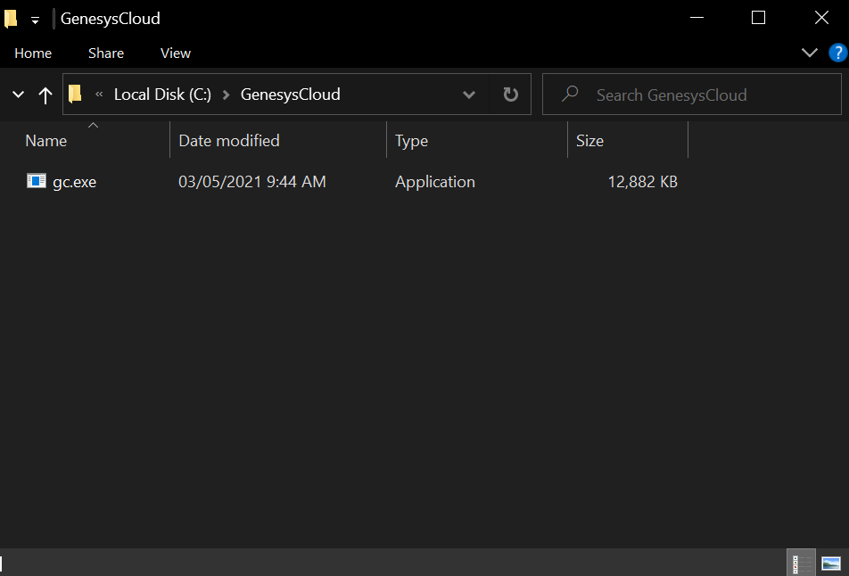
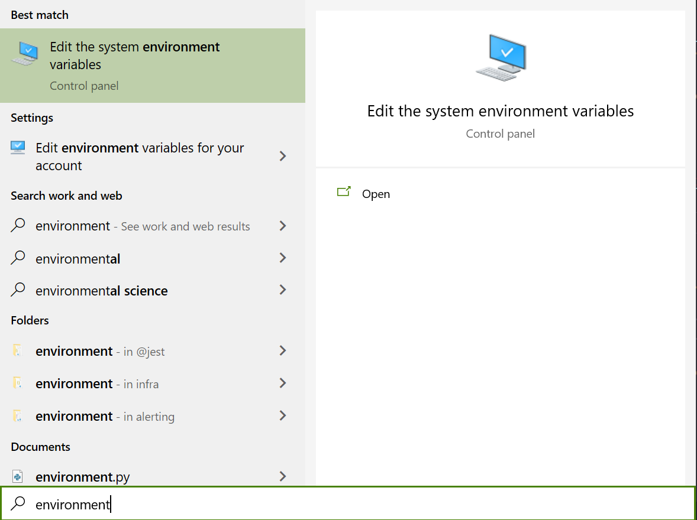
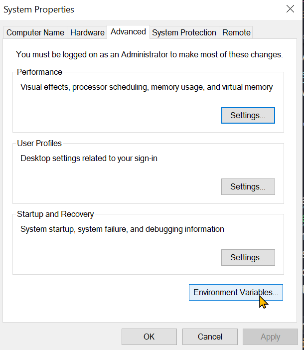
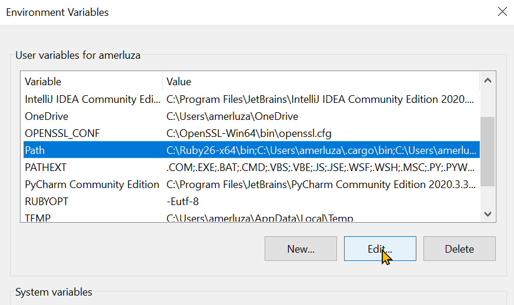
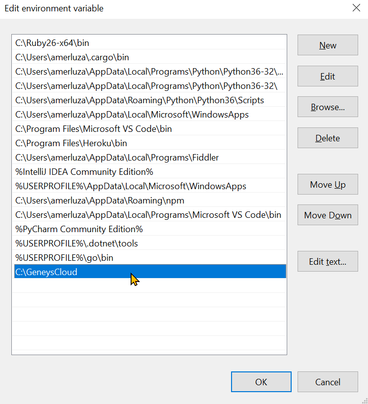
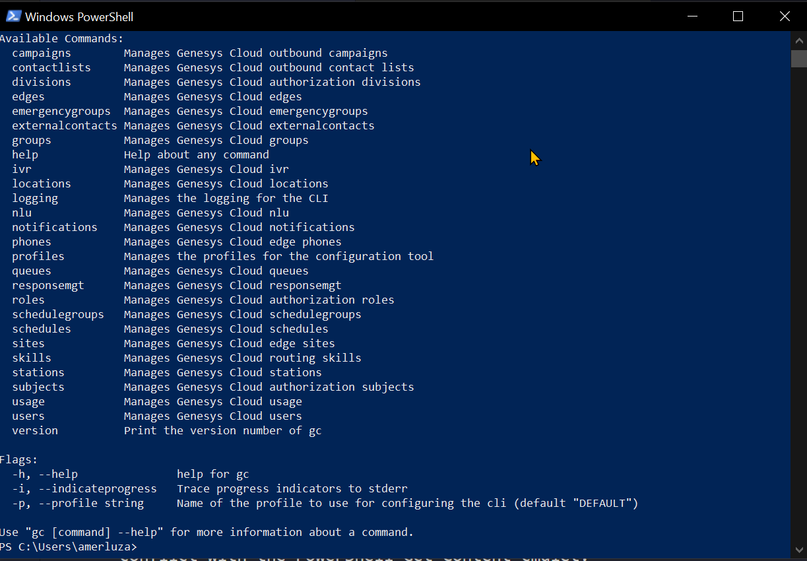

Earlier this year, we announced the Genesys Cloud CLI which is a tool used to perform administrative tasks for your Genesys Cloud organization. In this blog post, I will show you how to setup the CLI then use it with Windows PowerShell.

:::primary
**PowerShell Version**: For maximum compatibility, we will be using PowerShell version 5.1. Most scripts and examples are still expected to work for later versions like PowerShell 7.
:::

:::primary
**GC-CLI version**: CLI beta version 11.0.0 is used at the time of writing. Some commands may be different if you're using another version. To determine which one you're using, run `gc.exe version`. For the latest version, go to our [CLI documentation](https://mypurecloud.github.io/platform-client-sdk-cli/).
:::

## Download the Genesys Cloud CLI

First we need to download the executable from this [page](https://mypurecloud.github.io/platform-client-sdk-cli/). If you are using Windows, then you have to manually place the file in a folder on your PATH.

If you're unsure how to do the latter, then you can follow these steps to setting up the CLI:

1. Create a folder in your C drive and name it `GenesysCloud`. Put the downloaded `gc.exe` file inside the folder.


2. From you Start Menu, search for `Environment variables` then click the result which should open up this window:


3. Click the "Environment Variables" button.


4. In the "User variables" section, select the entry for `Path` then click "Edit..."


:::warning
**Warning**: Be careful with modifying values in the PATH variable. Accidentally modifying/deleting entries may affect other applications dependent on them.
:::

5. Click "New" and enter the directory created earlier: `C:\GenesysCloud`


6. Click OK until you close all the windows. If you already have a PowerShell session open, you may have to restart it to reload the PATH changes.

### Check if it's working

Open up a PowerShell session and enter `gc.exe`. It should show you a result similar to this:



:::primary
**Note**: The reason we use the complete filename `gc.exe` is because of an alias conflict with the PowerShell Get-Content cmdlet.
:::

## Setup an OAuth Client

Before you can start using the CLI, you first need to create an OAuth Client from your organization. For complete steps on how to do this, please refer to this Resource Center [article](https://help.mypurecloud.com/articles/create-an-oauth-client/). Take note of the Client ID and Client Secret as they will be used in generating your CLI profile.

In PowerShell, enter the following command and answer the questions to generate your profile:

```shell
gc.exe profiles new
```

After the profile creation, you are now ready to create PowerShell scripts with the Genesys Cloud CLI. In the succeeding sections, we'll go through some example scripts and common patterns with working with the CLI in PowerShell.

## PowerShell and REST API

The Genesys Cloud CLI consumes the Genesys Cloud API which is a REST API. This means that all request and response bodies will be in the JSON format. Compared to other shells, PowerShell makes this easy for us with built-in cmdlets to work with JSON such as `ConvertFrom-Json` and `ConvertTo-Json`.

Example:

```shell
gc.exe users list | ConvertFrom-Json
```

Result:

```shell
entities   : {@{id=497d62d9-8414-4914-a105-a6eff6dfad1c; name=Agnes Agent; division=; chat=; email=agnes.agent@genesys.com;     
             primaryContactInfo=System.Object[]; addresses=System.Object[]; state=active; username=agnes.agent@genesys.com;     
             version=2; acdAutoAnswer=False; selfUri=/api/v2/users/497d62d9-8414-4914-a105-a6eff6dfad1c},
             @{id=6ade8ef8-bbc5-4f05-9ad5-31be015fda25; name=Agnes Corpuz; division=; chat=;
             email=catherine_agnes.corpuz@genesys.com; primaryContactInfo=System.Object[]; addresses=System.Object[];
             state=active; username=catherine_agnes.corpuz@genesys.com; images=System.Object[]; version=304;
             acdAutoAnswer=False; selfUri=/api/v2/users/6ade8ef8-bbc5-4f05-9ad5-31be015fda25},
             @{id=612b0b9e-8923-402e-b460-bc2dc7a4aa44; name=Agnes Tester; division=; chat=; email=agnes.tester@genesys.com;    
             primaryContactInfo=System.Object[]; addresses=System.Object[]; state=active; username=agnes.tester@genesys.com;    
             images=System.Object[]; version=63; acdAutoAnswer=False;
             selfUri=/api/v2/users/612b0b9e-8923-402e-b460-bc2dc7a4aa44}, @{id=4535df79-af57-4a72-8e72-c46ab84562c3;
             name=Barrera Tester; division=; chat=; email=Barrera1_Tester@genesys.com; primaryContactInfo=System.Object[];      
             addresses=System.Object[]; state=active; username=Barrera1_Tester@genesys.com; images=System.Object[];
             version=78; acdAutoAnswer=False; selfUri=/api/v2/users/4535df79-af57-4a72-8e72-c46ab84562c3}...}
pageSize   : 25
pageNumber : 1
total      : 31
firstUri   : /api/v2/users?pageSize=25&pageNumber=1
selfUri    : /api/v2/users?pageSize=25&pageNumber=1
nextUri    : /api/v2/users?pageSize=25&pageNumber=2
lastUri    : /api/v2/users?pageSize=25&pageNumber=2
pageCount  : 2
```

In the above example, we used the CLI to ask for a list of users. Once the result is available, we pipe it into `ConvertFrom-Json` in order to convert the JSON to a PSCustomObject. If this is your first time working with the Genesys Cloud API, then you might notice that the result we got has pagination data. This is the default result of the API. If you want to learn more about the expected format of API results then you can read more on the [Platform API](/platform/api/) documentation.

If you want to get the entities themselves, in this case the first 25 users, then you can use the `ExpandProperty` flag of the `Select-Object` cmdlet:

```shell
gc.exe users list | ConvertFrom-Json | Select-Object -ExpandProperty entities
```

Aside from the paginated data, the CLI provides us with more options on listing results. For example, if you want to get all the users in the organization without manually collating results from the pages, then you can simply do:

```shell
gc.exe users list -a | ConvertFrom-Json
```

:::primary
**Note**: The `-a` flag means to autopaginate results. To learn more about different flags and options, consult the [gc-cli](https://mypurecloud.github.io/platform-client-sdk-cli/) documentation.
:::

### ConvertFrom-Json and JSON Arrays

In this section, we'll briefly touch on a "gotcha" that needs to be considered when working with different versions of PowerShell.

Consider the following command where we want to list the ids of all the queues in the organization:

```shell
gc.exe routing queues list -a | ConvertFrom-Json | Select-Object id
```

If you're using PowerShell 5.1 you may notice that the result is seemingly empty:

```shell
id
--

```

This command however works as expected in PowerShell 7:

```shell
id
--
a6f03f8d-bb75-4bcf-8304-2d73a0f21572
69c23502-c49b-4adc-8c48-84789a28dd6e
f2d5c5f8-ddd9-49c0-9bb3-852123967e6d
```

This is because in PowerShell 5.1, `ConvertFrom-Json` will not automatically unwrap a JSON if the containing item is an array. In order to explicitly enumerate the array, we can either enclose the command in a parenthesis or pipe the result into a `Write-Output` before any other commands:

```shell
(gc.exe routing queues list -a | ConvertFrom-Json) | Select-Object id
```

```shell
gc.exe routing queues list -a | ConvertFrom-Json | Write-Output | Select-Object id
```

The commands still work in newer versions of PowerShell and so you may see sample and scripts that use any of the patterns described above.

## Piping JSON into the CLI

A lot of commands in the CLI requires input in the form of JSON. Let's go straight into an example where we need to create a new routing skill named `Test Skill`:

```shell
@{
    name = "Test Skill"   
} | ConvertTo-Json |
    gc.exe routing skills create   
```

In this example, we defined a PowerShell HashTable, convert it to JSON, then pipe it as the request body for the command.

If the JSON body is instead available as a file, the CLI provides a way to consume it via the `-f` / `--file` flag.

```shell
gc.exe routing skills create -f new-skill.json
```

## (Optional) Using jq to Manage JSON Transformations

So far, we've only been using native PowerShell cmdlets in handling our data. In this section we'll show how you can use jq, a popular third party tool for working with JSON, in PowerShell. The jq tool is popular with Unix-based shells such as bash, and so similar code may be easier to migrate and use across platforms than having to rewrite it specifically for the shell.

First, you should download the binary from the [website](https://stedolan.github.io/jq/). Similar to how we setup the GC-CLI earlier, you should place the executable in a folder that's within your PATH. Unless you have potential naming conflicts, you can rename the file as `jq.exe`.

The following is an example on how to list all User Ids:

```shell
gc.exe users list -a | jq '.[].id' 
```

## Streaming Output from Notifications API

The `gc.exe notifications channel listen` command is special, in that instead of a singular JSON response, the CLI indefinitely prints JSON events through the specified channel's websocket, into the standard output. If you are not familiar with the Notifications API or websockets in general, then you may want to read this [article](/notificationsalerts/notifications/) if you plan on using notifications for Genesys Cloud.

For PowerShell 5.1, we run once again into a quirk. Take the following simple command:

```shell
gc.exe notifications channels listen "streaming-5-xxxxxxx"
```

As mentioned, the CLI will now be running indefinitely and will print to standard output. Depending on the type of event, each notification may look something like this:

```json
{
  "topicName": "v2.users.e40f28ea-fa86-493f-a5b8-d559c8533c96.activity",
  "version": "2",
  "eventBody": {
    "id": "e40f28ea-fa86-493f-a5b8-d559c8533c96",
      "status": "OFF_QUEUE",
      "startTime": "2021-05-14T09:03:17.067Z"
    },
    "presence": {
      "presenceDefinition": {
        "id": "6a3af858-942f-489d-9700-5f9bcdcdae9b",
        "systemPresence": "AVAILABLE"
      },
      "modifiedDate": "2021-05-14T09:03:17.047Z"
    },
    "outOfOffice": {
      "active": false,
      "modifiedDate": "2018-04-02T01:42:52.505Z"
    },
    "activeQueueIds": [
      "4750048b-1994-41d4-8410-a5760c49a6cd",
      "d3a783a9-547b-4bb8-88df-4bfb43ecc322",
      "264ce314-37b0-4f14-ba8c-521d827043b5",
      "b2d5acbd-04f6-44b0-9029-3fb7d0152017",
      "f2d5c5f8-ddd9-49c0-9bb3-852123967e6d",
      "4b4b22b8-74ce-46d8-b435-90d7dc1b023b",
      "a1fb73fc-1812-451f-81ef-5ccf8b315b58"
    ],
    "dateActiveQueuesChanged": "2021-03-25T04:15:44.913Z"
  },
  "metadata": {
    "CorrelationId": "9e8067c7-8b35-4e54-add9-db24e7d6f086"
  }
}
```

Everything seems to be in order until you try to pipe it down to certain commands. For example, let's try converting the JSON text to a PSCustomObject like what we've always been doing so far:

```shell
gc.exe notifications channels listen "streaming-5-xxxxxxx" | ConvertFrom-Json
```

After entering the command, you will notice that you will stop getting any output. In this case, PowerShell 5.1 tries to collect all the ouputs into memory before piping it out to `ConvertFrom-Json`. Most of the time however, the desired functionality is to pipe down the event as it comes.

In the following script, we manually collect each line as they're printed. Once we get a valid JSON, we then pipe it down to be converted to a PSCustomObject:

<dxui:QuickHit id="Connect-NotificationsChannel" title="Notifications API in PowerShell" />

## Closing Thoughts

After going through the post you should now have everything you need to write your own PowerShell scripts. The next step is to check out the additional resources on the final section.

I should mention that our Quick-Hits repo is open for anyone wanting to contribute their own amazing scripts. So if you've written one and would like to share it with the community, feel free to drop us a PR sometime. ;)

Thanks!

## Additional Resources

1. [Genesys Cloud CLI](https://mypurecloud.github.io/platform-client-sdk-cli/)
2. [Genesys Cloud CLI Recipes](https://github.com/MyPureCloud/quick-hits-cli)
3. [Genesys Cloud CLI Developer Drop](https://www.youtube.com/watch?v=OnYDs5NsLpU&list=PL01cVFOkuN70Rk8xgI8pk_tKMcTW4FesF)
4. [jq](https://stedolan.github.io/jq/)
