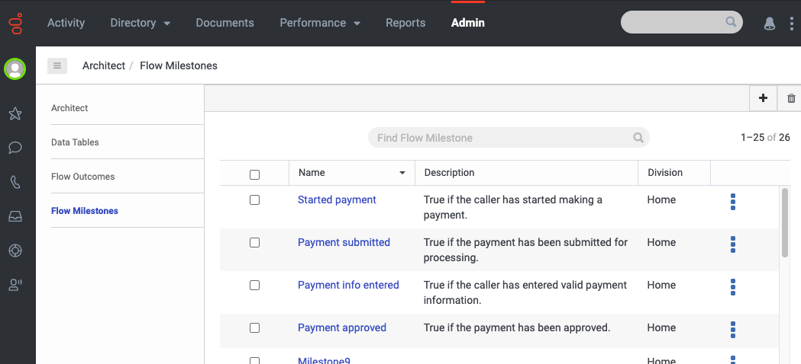
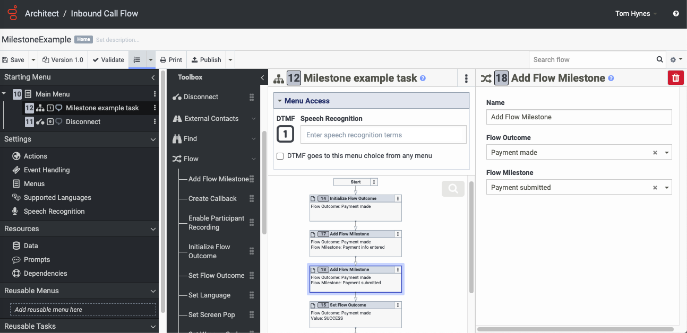

In order to meet the demand for more granular Outcome reporting for both Voice and Digital flows, Architect now supports the concept of Outcome Milestones (or just "Milestones").

## What is a Milestone?

Milestones are points in the flow which emit reporting details. We can use milestones to do more fine-grained reporting than what we can today with entry/exit and flow Outcomes reporting.  Milestones are not scoped to (belong to) Outcomes, but instead are independent entities.  However, when you insert a Milestone into a flow you must *associate* it with an Outcome.

EXAMPLE: If a customer tries to make a payment 3 times and is only successful on the 3rd attempt then flow Outcomes reporting will see this as an overall successful Outcome and will report it as such, whereas Milestones reporting would be able to tell you that there were multiple payment attempts (assuming Milestones were added to the payment process).

## How are Milestones configured and used in flows?

Milestones must be configured in Admin before use:

To use Milestones in flows, simply insert one or more *Add Flow Milestone* actions to the key points in the flow.  What constitutes key points is up to the flow author, but generally they are logical milestones along the way of achieving an Outcome:

Note that an Outcome can be associated with multiple Milestones, and (less typical) a Milestone can be associated with multiple Outcomes.

## How are Milestones reported on?

The data collected from individual milestones can be used to create aggregate analytics views that show volumes of customers moving through the flow or to get the path of a single customer to understand how they traversed the flow.

Two new metrics have been added:

**nFlowMilestone** This gets emitted for every single milestone when that milestone was reached. So you could have multiple occurrences of that for the same milestone in the same flow execution.

**oFlowMilestone** This is the total number of times a milestone occurred in a flow execution. It allows you to determine, for example, that milestone XYZ was reached on average 2 times per flow execution.

For more information refer to [Flow Aggregate query](https://protect-us.mimecast.com/s/zZ-8CDkJ0KfzDw8xu5PqCV?domain=developer.genesys.cloud)

## Can customers subscribe to Milestone stats events?

Yes, indirectly. Customers can subscribe to 2 hawk topics to get flow-related metrics: v2.analytics.flow.{id}.aggregates and v2.analytics.flowoutcome.{id}.aggregates. Both contain milestone data for 30 minute intervals (by default; could also be 15 or 60 minutes based on an org setting).  You will get all flow-related metrics via those topics; there's no way to look at them by milestoneId.
