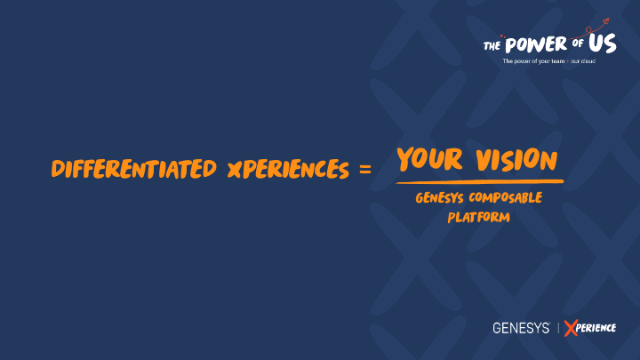
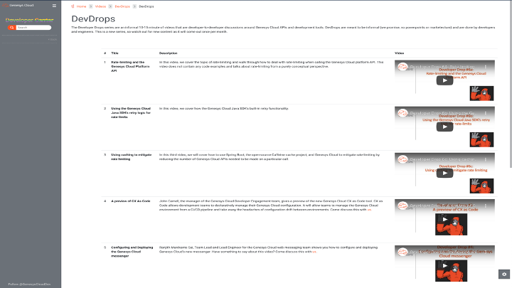
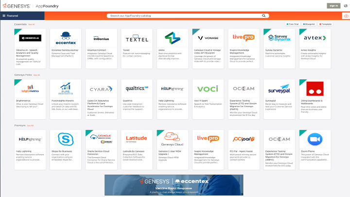
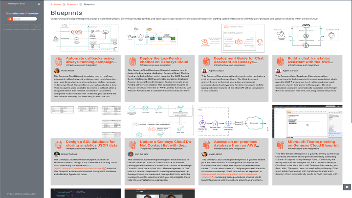

> _On a personal note, Xperience is something I typically look forward to every year as I love being able to meet with our customers and partners. So this year being virtual is a bit bittersweet as it's great to share the information on what we are doing, but I miss those personal conversations and look forward to hopefully being able to meet everyone next year!_

I hope those of you that found this blog from my Xperience session found the session useful. For those that have not watched my breakout session this year, I had the opportunity to present the third session in our Genesys Cloud enterprise series, “Differentiation Through Extension.” In the session I had a specific ask of attendees to really challenge yourself on: “How are you truly differentiating your customer experience?” 

> My thesis of the session was simple: To develop a truly differentiated experience that stand above and sets your company/brand apart, you need to utilize your vision built on a composable CX platform. 

A composable CX platform allows you to extend your services to best optimize your customers’ journey for your industry, processes, vision, and competition. Luckily, our platform was intentionally built from the ground to be an open composable platform giving you all the resources and tools to do so through our Marketplace, API-first development, and open integration points allowing you to connect into your greater CX ecosystem. Quite frankly there are way too many resources and tools to go over in a single blog: Client apps, SDKs in 7 different languages, thousands of APIs, and so on. 

So instead, let’s explore 6 valuable resources and tools to get started on your journey of creating Differentiated Xperiences!

## Developer Center

As chance would have it, you’re already taking advantage of one of those resources–the Developer Center. Here, in the Developer Center, you’ll find technical content for Genesys Cloud developers like new release announcements, blogs, tutorials, how-to guides, access to dev tools, and more. 

One of my favorite new pieces of content on the Developer Center is the The Developer Drops series – informal 10-15 minute videos that are developer-to-developer discussions around Genesys Cloud APIs and development tools.

It’s our hope that the Developer Center will help you stay in-the-know around Genesys Cloud API’s, SDK’s,  dev tools, and inspire you to push your innovation on the platform to new heights–so be sure to bookmark it. 

## AppFoundry

Okay, the Genesys AppFoundry might not exactly be a lesser-known resource. But it is invaluable–and maybe a little underappreciated. The AppFoundry marketplace is a curated selection of integrations, applications, blueprints, and templates (more on those last two later) to easily and quickly extend the platform and differentiate your customer experiences. 

Our growing partner community has built some really amazing and sophisticated apps to help extend your digital, collaboration, knowledge management, artificial intelligence, and omnichannel capabilities–many with 30-day free trials to support your ability to explore and discover. 

* My advice: The Genesys AppFoundry should be your starting point anytime you find yourself thinking _“I want to be able to do [insert ingenious thought].”_

## Resource Center (Integrations)

Hopefully if you are an existing customer you are already 100% aware of the Genesys Cloud Resource Center. But sometimes the Resource Center can be so full of content that it can be a bit hard to find what you are looking for. If you are trying to find information on our native and configured integration points an easy jump point to visit is 
https://help.mypurecloud.com/articles/about-integrations/.

## Blueprints and Templates

In the last year, we launched a new set of pre-built, ready-to-use open source resources on the AppFoundry called Blueprints and Templates.

Blueprints are designed to address specific business use cases and/or bespoke integrations; they are a great way to discover new use cases. They are targeted at a technical audience and we provide expanded developer content to allow for complete customization of the Blueprint to your business. For example, we have a blueprint that provides step-by-step instructions for deploying a knowledge chatbot with AWS Lex-Kendra on Genesys Cloud and another blueprint for setting up a video customer service capability with Microsoft Teams.

On the other hand, Templates are ready-to-use, pre-configured digital assets such as data actions, call flows, and bots. 

As Blueprints and Templates are open source community based, our team and our partners are constantly working to grow our collections, so be sure to check the AppFoundry regularly for new additions. And don't forget you can contribute also!

## Command Line Interface (CLI)

If you have made a career of managing platforms and systems, you might have already made good use of the Command Line Interface (CLI). If you haven’t, the CLI simply processes commands to a computer program in the form of lines of text. 

The Genesys Cloud CLI allows you to perform administrative tasks against your Genesys Cloud organization without having to constantly access the Genesys Cloud UI as well as perform ad-hoc data extracts of common Genesys Cloud objects. As detailed in the introductory release [blog](/blog/2021-02-11-Introducing-the-CLI/), the CLI enables:

* Simplification and automation of common administrative tasks
* Ad-hoc data queries for analysis
* Interaction with the platform without interrupting development flow

## CX as Code 

The newest tool in the Genesys Cloud developer ecosystem, CX as Code is a configuration management tool that allows you to define Genesys Cloud configuration objects (e.g. Queues, Skills, Users, etc) in plain old text files and then apply that configuration across multiple Genesys Cloud organizations. It’s ideally suited for use in a CI/CD deployment pipeline, which I would highly recommend if you aren’t employing such a method already. CX as Code helps ensure that the innovative CX configuration that you have perfected is applied consistently across multiple Genesys Cloud organizations. 

To learn more about how to get started with CX as Code, check out this [blog](/blog/2021-04-16-cx-as-code/).
