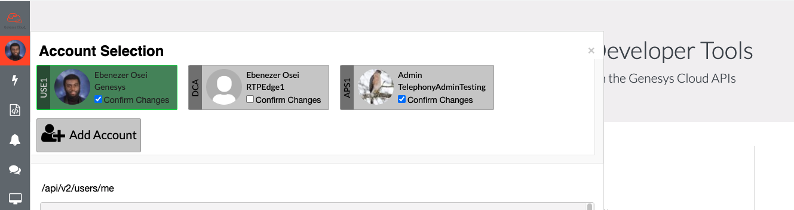

Greetings everyone! The current developer tools doesn't support the ability to switch between accounts without having to logout and log back in with desired account. It can be annoying if you regularly use different accounts in the developer tools. The new account switcher solves this problem by saving your account information after you log in for the first time. It also gives you the ability to add other accounts once you are signed in, thereby, giving you the ability to switch between accounts seamlessly without having to input login details everytime.

## Using the Account Switcher

The new account switcher is already incorporated into the developer tools so you don't need any extra steps to utilize it.

Below was how the old side bar looked like:

Here is the new look:

As shown above, there are 2 accounts currently signed in; the green one being the active account. You can easily switch to a different account by clicking on the account card. Once an account is selected, all operations will performed using the account's information.

## Confirm Changes

The confirm changes checkbox serves an important purpose. Due to the low effort in switching between accounts, some users may forget which account is currently active and perform crucial operations with the wrong account. To avoid such accidents, we included the confirm changes checkbox as a safeguard. It is totally optional for users. Once checked, you get a prompt in api-explorer whenever you try to make a non-GET request. To make this more effective, confirm changes settings get saved even after an account get deleted or a token gets expired. The settings then get reapplied once you log back in.

## Prompt Login

The prompt login checkbox does exactly as the name suggests. Once checked, user will be forcefully prompted to enter credentials when adding a new account. Its main use case is when a user tries add an account that is in the same region as any of the already added accounts. This is because adding an account without checking the prompt login checkbox will cause the authentication service to automatically read the auth cookie and return a new auth token automatically without prompting for credentials.

## Resources

This [Developer Drop](https://youtube.com) demonstrates the functionality of this new feature.

## Feedback

If you have any feedback or issues with the new account switcher, please reach out to us on the [developer forum](/forum).
