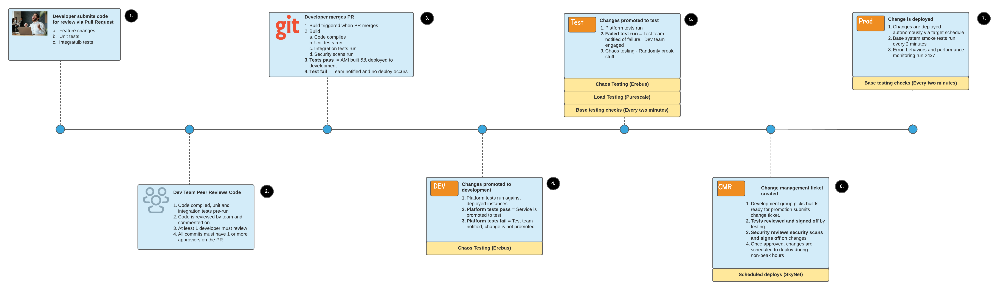

Greetings everyone. The summer months have passed here in North Carolina and we are finally getting some relief from the heat and humidity. Frequently, I have been asked to explain the approach Genesys Cloud uses in ensuring quality in their overall development processes. This is a broad topic, but I want to spend some focusing specifically on one approach we use in our quality management portfolio: our Continuous Integration/Continuous Deployment (CI/CD) pipeline.

## How we build software
The Genesys Cloud platform is built on a microservices architecture. We expose all the functionality in the platform through hundreds of microservices. While we have private APIs that run in an Amazon VPC, we expose all the platform functionality through a public API that calls these private APIs. We built the Genesys Cloud UI to use these public APIs and we treat the Genesys Cloud UI as just another application that consumes our services. One of core architectural intents has always been to be a platform that others can build "composable" customer experience solutions that are tailored to meet the specific needs of their organization.

The design and the development of individual microservices is owned by teams throughout Genesys Cloud. Each team handles the design, implementation, and deployment of a set of microservices. While we have a central architecture team, the day-to-day design decisions for the microservices belong to the teams that own the service. The development team chooses the technologies they are going to implement the services in and the technology chosen reflects what is best for the unique functional and quality of services characteristics for the problem domain they are in charge of.

In addition, the development team handles services deployments and operational support. The development team owns how often they are going to deploy. There are no set releases (or code freezes) to define when code is shipped. When a problem is encountered on the platform, it is the development team and not a centralized operations group that answers the page in the middle of the night. For many people who come from a traditional operations background, what I just described sounds like barely controlled chaos. In reality, the model we used to build, test, deploy our software is extremely thought through and disciplined. Here are 5 core principles we follow in our CI/CD pipeline:

1. **Trust your people**. We hire smart people and operate under a model of good intent. Our development teams are closest to the problems and can move the quickest to resolve them. Don’t impose process to protect the organization, instead empower the development teams to deliver solutions quickly.

2. **Automate everything (and I mean everything)**. Once a merge occurs in our code repository, we take the human element out of the process and let the “robots” do all the work. We automate all deployments and once a deployment is complete, it is immutable. A human being should never touch deployed code and we work extremely hard to make sure this does not happen.

3. **Bake quality in at every step in the deployment pipeline.** Before we deploy code to the development or test environment, we run a series of automated tests. We do not believe in manual testing and instead want to ensure our test mechanism are consistent and repeatable. While the deployed code "sits" in an environment, we continuously run a variety of tests, including platform tests, load tests, and chaos tests. Chaos testing is particularly important. By randomly breaking things in our lower environments, we test the survivability of the overall platform. Doing chaos testing, we routinely that the overall platform (not just an individual service) can degrade gracefully and recover during an incident without human intervention.

4. **Monitor everything**. We constantly monitor the microservices in all of our environments. Baseline error levels and performance for all services are collected and monitored throughout the entire deployment pipeline. A service’s monitoring definitions are checked into source control and deployed in the environment as part of the service deployment. This ensures that our monitoring configuration is consistently applied throughout all environments, including and up to our production environments. The development teams are immersed in data about their services and use it daily to drive when changes are ready for deployment.

5. **Enforce consistency in the build and deployment process, not conformity in the development process**. Efficiency and quality do not come through standardized languages or centralized architectural control, but a standardized testing and deployment pipeline that all services flow through. Development teams pick the individual technologies that are best for their microservices. We use the deployment pipeline to enforce consistency how software is tested.

So enough about high-level principles, lets get into our CI/CD pipeline.

## Our CI/CD pipeline

Our CI/CD pipelines comprise seven steps and are illustrated in the diagram below:

## Step #1 - Developer submits code for review via Pull Request
Once a developer has completed a feature or a bug fix they want to submit, they will put together a Pull Request (PR) asking the other members of the service team to perform a code review.

All service teams write automated unit tests and integration tests along with the actual feature or bug test. For our coding processes, we define a unit test to be a test that tests a change in complete isolation from any other dependencies. Unit tests are small in scope. Any dependencies within the function are stubbed out. Integration tests test the execution path of changed code end-to-end within the service. Any third-party service calls or database calls are mocked out with a mocking engine (e.g. a “faux” database service or proxy HTTP server). When a PR is created, we run all unit and integration tests as a pre-flight checklist and we attach the results of the unit and integration tests to the open PR.

## Step #2 - Dev team peer reviews code
Once a PR is created, the individuals listed on the PR will walk through the code changes and review the unit and integration tests for changes. They will provide written feedback to the author on such things as correctness of the changes, improvements that can be made along with comments about the overall readability and maintainability of the code. Once the PR submitter has adequately addressed code review feedback, the reviewers on the team must formally approve the code via the source control system.

Genesys Cloud requires at least two people to approve a PR before it can be merged.  

## Step #3 - Developer merges PR
Once the other service team members review and approve the PR, the developer is free to merge their change. The merging of code will kick off a build process where again the unit and integration tests are re-run. If these tests fail, the process stops and the developer who submitted the merge is notified via email and the overall development team is notified in their group chat.

If the tests pass, the build pipeline runs a set of developer provided scripts (we use Ansible, Packer, and Amazon Cloudformation) that will provision an Amazon Machine Image (AMI) and then deploy the newly created AMI to our development environment. We follow the principles of an immutable architecture and never deploy code to an existing server. Instead, we always provision a new virtual machine image and deployt the image, not the code. 

All provisioning and Cloudformation scripts are co-located in the same source control repository as the service code. Development teams do not write all of their Ansible, Packer and Cloudformation scripts from scratch. Our Genesys Cloud DevOps team has worked extremely hard to provide standard libraries and automation to carry out common deployment tasks, and Genesys Cloud service teams leverage these libraries whenever possible. Provisioning scripts not only define how the service will be deployed, but also the configuration of all monitoring and alerting policies associated with the deployed services.
**Note:** While we use several technologies in our CI/CD pipeline (e.g. Ansible, Packer, Cloudformation) their usage here does not constitute an endorsement of these tools. You need to look at the specific requirements of your own CI/CD pipeline and determine whether these tools will meet your needs.

## Step #4 - Changes promoted to development
Once an AMI is provisioned, it is deployed to our development environment. A service team can make no further changes to the service or infrastructure without making another source code change and going back through steps 1-3. Once deployed to the development environment, the CI/CD pipeline will trigger platform tests that are specific to that set of services.

Platform tests simulate a user carrying out a task across a set of services. Members of our testing team write platform tests to ensure that the end-to-end functionality of the services they support is properly functioning. Platform tests do not use mocked or stubbed calls. Instead, the testing team sets up actual Genesys Cloud organizations that are configured and then populated with test data. Each service team has one or more testing team members assigned to them who ensure that platform tests are throughly completed whenever new features or fixes are released.

Once a service successfully deploys to development, there are several test suites that run against the deployed service. The first type of test suite is the base-testing check. Our base testing checks are a set of 2-3 tests that run every 5 minutes and assert that the core functionality in the environment is still functioning. We do not design these tests to be a fully comprehensive suite of tests (that would take far too long to run every 5 minutes). Instead, these tests act like a canary in a coal mine. If the bird dies or, in our case, the tests fail, then there is a problem in the environment that needs to be immediately addressed. When a base-testing check fails, is notified and the testing team becomes involved to help diagnosis the problem.

The second type of test suite we leverage is chaos tests. Our Genesys Cloud Site Reliability Engineering (SRE) team has built a suite of chaos engineering tools (called Erebus) that will randomly “break” services in an environment by slowing down, killing or making unavailable core services and infrastructure. The goal with these chaos tests is to validate the resiliency patterns built into our services to help ensure the affected services degrade gracefully and recover without human intervention. Chaos engineering tests also help the development teams validate their monitoring and fault detection capabilities are properly working.

## Step #5 - Changes promoted to test
After a new service build is promoted to the development environment, and the platform tests run successfully, our CI/CD pipeline will automatically deploy the service to our test environment. If the platform tests fail, the CI/CD pipeline will not deploy the service and instead, the build will stay contained in the development environment. The CI/CD pipeline will then notify the service team’s testers.

Upon successful promotion of the service to test, we again re-run all the platform tests associated with the service. Base and chaos tests are run periodically against our test environment. The Genesys Cloud test environment is also where performance and load testing is executed. Genesys Cloud employees a dedicated performance testing team. Performance tests are run Monday - Friday, starting at around 7:30 AM EDT and running on towards 6:00 PM EDT. On Mondays, the performance team runs roughly double the number of users and conversations tests. The full size and scope of these performance tests are hard to describe in a single blog post. Here are some highlights from what the performance testing team does during their runs:

1. At the beginning of the week, we take the highest numbers in production from our previous week and then double that load for our performance and load tests. 

2. For the rest of the week (Tuesday - Friday), the load testing team will take the peak numbers from our previous week’s production load and use that as the base load and performance tests.

3. These agents go through a whole series of simulations that cover all communication channels, including voice, chat, message, web message and emails.

4. All the load tests use our public api. This ensures that regardless of how you access our platform (either through the Genesys Cloud UI or your own solution) we consistently test the public API for load and ensure conformity across all access mechanisms.

5. The performance testing team is constantly assessing new features being rolled out and ensures that load tests provide proper testing coverage for these features. 

6. While the performance testing team focuses on the public api, many of the internal development teams also incorporate performance testing of the private APIs through the use of the [Locust](https://locust.io/) testing framework. The performance testing team also supports these efforts.

## Step #6 - Change management ticket created
The team lead of the service team drives the decision when to deploy changes. Most teams release code changes (e.g. bug fixes, enhancements and new features) once every two weeks. When a team is ready to promote their software to production, the team lead for the group reviews of all of their services and picks a target build number for the service that they want to release. Team leads chose the deployed service build based on the time the service build has been “baking” in the test environment, along with the criticality of any bugs or features for that build.

The team leads then put together a change management ticket that lists the build numbers along with the relevant release notes. The team lead also schedules when they want the services to deploy using our internal scheduling system. Once they have pulled together a change ticket, the team lead submits the ticket for approval. The ticket then has to wait for two additional approvals before a deploy can occur:

1. **The testers assigned to the service team have to review and approve the ticket**. The testers review the build numbers and check the test runs for those builds. They look for any failed test cases and any changes in the performance tests. Change requests for non-emergency (e.g. normal build) deploys can not go into production without the explicit approval of the testing team.

2. **The security team has to run their security scans and approve the changes**. The security team runs security scans against the services that are being deployed and checks the age of the build going into production. Genesys Cloud requires all of their deployed services to have AMIs that are no older than 30 days old, as our DevOps team is constantly patching and updating the operating system image used by all of our services.

**Note**: Step 6 really describes what happens during a normal deploy. However, in the event of a platform level issue, a development team lead is empowered to do emergency deploys without waiting for all levels of approvals. This goes back to our first principle in our CI/CD pipeline: Trust your people. In the event of an emergency, a change ticket still much be created, but the team lead can deploy and then review and seek approval from the Critical Situation Manager (CSM). We always want to put the stability of the platform before being bound by approval processes.

## Step #7 - Change is deployed
While our service teams can manually deploy services to each of our 12 Amazon regions, the preferred approach for service deployment is to have the targeted builds deployed via our scheduling system, affectionately known as SkyNet. When setting up a scheduled deployed, the developer chooses the targeted regions they want to deploy to, along with when they want to deploy the software. By default, SkyNet will always deploy in a region’s “off-hours” to minimize the opportunity for platform outages or interruptions of service. SkyNet will also look at rolling out to our least populated regions first.

Once a build has deployed, the service teams can, as part of their deployment jobs, invoke smoke tests specific to the individual services. Not all teams do this. However, the test team continually runs platform-level base testing against the entire production platform. These tests run every 2 minutes and ensure that basic platform functionality is working (e.g. can a user login, can a user make or receive a call). Any anomalies or failures will page a member of the test team to investigate their failure.

Once production deployment is complete, the owning service team will continuously monitor the services for changes in error levels, response time and physical computing metrics (e.g. CPU, memory, etc....). Any faults or wide changes in behavior will cause a page to an on-call member of the service team who will then respond.

## Closing thoughts
On the surface, this might appear to be a chaotic mechanism for building software. After all you have literally hundreds of teams working independently of each other deploying all the time. In an average week, Genesys Cloud can literally have over a 1000 deploys going on. This is all done without a central review authority or a heavy process. However, it works and it works extremely well because the responsibility for the services uptime is kept closest to the people who actually write and own the code: the developers. With this deep level of responsibility also comes empowerment: developers have complete control over the technologies and approaches they used to build their microservices. They pick the tools that they feel works best for them and they are responsible for the outcomes. 

Our approach to CI/CD, keeps the Genesys Cloud teams extremely agile and allows them to constantly deliver new features. Our CI/CD process eliminates much of the bureaucracy associated with building and deploying software. Many organizations build heavy processes around how they deliver software not because they are trying to be more efficient or effective, but are reacting to something that caused them pain. Pain can be a wonderful teacher for software developers. However, if you don’t hold the developers to learn from their pain in a blameless fashion and improve from it, it can lead to organizational scars that limit the long-term agility of the organization. Processes, whether good or bad, act as a positive or negative multiplier on the overall effectiveness of an organization's ability to build high-quality software.

