The purpose of this article is to describe how to create and to configure a [BYOC Cloud Trunk](https://help.mypurecloud.com/?p=152702) (SIP Trunk):
- to transfer and to connect calls from Genesys Cloud to an external system (that supports SIP connectivity over the public internet),
- and to transfer these calls back to Genesys Cloud (releasing resources on the external SIP device).

Typically, this trunk would coexist with another trunk (i.e. Genesys Cloud Voice or BYOC Cloud Trunk), used by the Genesys Cloud org (i.e. the enterprise), to manage inbound and outbound traffic with end customers via the PSTN.

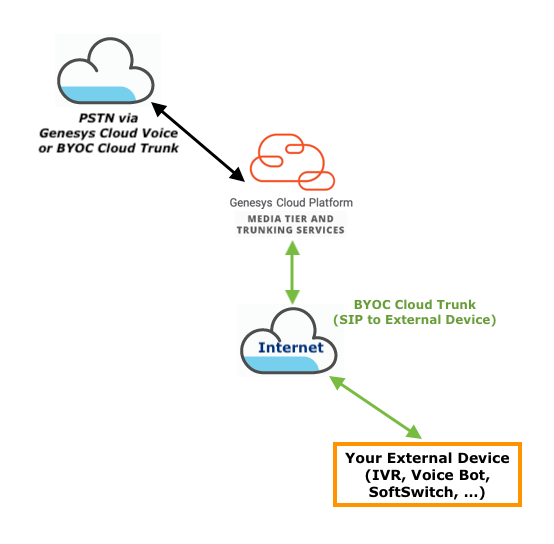

At this time, only Genesys Cloud Voice and BYOC Cloud can coexist in a single Genesys Cloud org.
The enterprise could then have a Genesys Cloud Voice Trunk (for PSTN connectivity) and a BYOC Cloud Trunk (to interact with your external SIP device).  
Or the enterprise could have a BYOC Cloud Trunk (for PSTN connectivity via a PSTN/SIP provider) and a second BYOC Cloud Trunk (to interact with your external SIP device).

:::primary
**Note:** Combining Genesys Cloud Voice or BYOC Cloud with a BYOC Premise Trunk is not supported at this stage.
Later this year, Genesys Cloud will support Hybrid environments, allowing to combine Genesys Cloud Voice, BYOC Cloud and BYOC Premise.
:::

About:
- [__Genesys Cloud Voice__](https://help.mypurecloud.com/?p=60252)
- [__BYOC Cloud__](https://help.mypurecloud.com/?p=152702)

The following article assumes that you have setup your connectivity with the PSTN, using Genesys Cloud Voice or BYOC Cloud: *Location(s) with verified address(es); Site(s) using Cloud Media Model, one set as Default Site, and with Outbound Routes that leverage the Genesys Cloud Voice pre-defined trunk or the BYOC Cloud trunk used for PSTN connectivity*.

## Configure a new SIP Trunk (BYOC Cloud) to your external system 

### Step 1 - Make sure BYOC Cloud add-on is available and active 

If you are using Genesys Cloud Voice for PSTN connectivity, make sure that the BYOC Cloud add-on is available and active in your Genesys Cloud org.

From Genesys Desktop, in Admin, select ***Genesys Add Ons*** in ***Account Settings***.

If the BYOC Cloud option is available in your org, you should see a ***BYOC Cloud*** tile.
Otherwise, please reach out to your Genesys contact to ask for it.

Make sure to ***Activate*** this add-on (it will then appear as ***Active***).

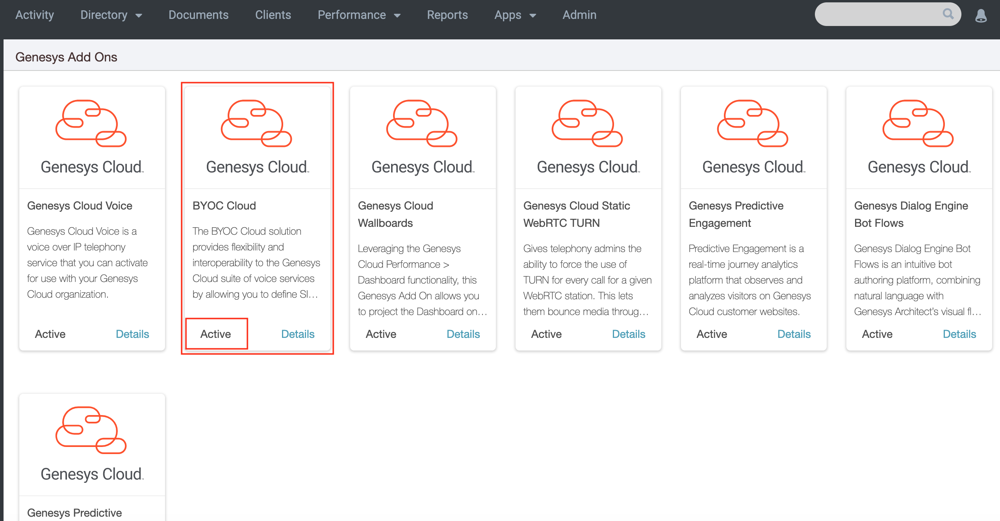

### Step 2 - Prepare and collect information about your external SIP device 

This information will be required on Genesys Cloud side, when configuring the new BYOC Cloud trunk.

1. __SIP Server/Proxy address__. Address (*IP Address(es) or FQDN(s) and IP Address(es)*), Port (*SIP port*) and Transport Protocol (*UDP/TCP/TLS*) of your SIP Server/Proxy.

  We need at least one FQDN (Fully Qualified Domain Name) or a public IP address to target your SIP Server/Proxy when transferring calls from Genesys Cloud.

  An IP Address is also required to define the SIP Access Control List on Genesys BYOC Cloud trunk side (IP or CIDR Address(es) of your SIP Server/Proxy). The SIP Access Control List allows to control and to limit access to the SIP service.

  *e.g. 10.34.12.16 on port 5060, using UDP as transport protocol for SIP*

  Note that if you plan to use TLS as Transport Protocol for SIP, it implies that your SIP Server/Proxy must leverage a FQDN (Fully Qualified Domain Name), and that you have a valid certificate, signed by a recognized Certification Authority (CA). See [__TLS trunk transport protocol specification__](https://help.mypurecloud.com/?p=197875).

2. __Supported Audio codecs__. Audio codecs that your external device supports and that you want to enforce.

  e.g. G.711 ulaw/alaw (PCMU/PCMA) only? Opus as well?

3. __Expected DNIS__. If the external device expects specific numbers (i.e. destination number/DNIS/To), please provide a list (E.164 numbers or short/extension numbers).

  When trying to connect a call to your device, Genesys Cloud will send a SIP INVITE with the destination number provided as user part in the Request-Uri, and in the To header.

  We'll have to define new Number Plans and Classification categories, on the Genesys Cloud Site that you plan to leverage. A new Outbound Route pointing to our future BYOC Cloud trunk will leverage these new Number Plan classification category.

4. __Optional: Control Access to your device__. In order to control and to limit access to your system, it is possible to send a custom SIP header (static value) in the SIP INVITEs from Genesys Cloud to your device, and/or to enable Digest Authentication. See [__Controlling access to your SIP device__](#controlling-access-to-your-sip-device) for more details.

  Use of custom SIP Header: Yes/No
  * Expected SIP Header name:
  * Expected SIP Header value:

  Use of Digest Authentication: Yes/No
  * Realm:
  * User Name:
  * Password:

### Step 3 - Information you may need from Genesys Cloud 

A Genesys Cloud org is deployed in a single AWS region. See [AWS regions for Genesys Cloud deployment](https://help.mypurecloud.com/?p=162751) for a list of supported regions, or to determine in which region your Genesys Cloud org is deployed.

If you have a mechanism to control the IP Addresses allowed to access to your device (SIP Access Control List):
- For SIP, you can find the [list of the BYOC Cloud public SIP IP addresses, for each AWS/Genesys Cloud region, here](https://help.mypurecloud.com/?p=152869).
- If you also need to define a list for the media traffic (Genesys Cloud Media), see [IP addresses for the firewall allowlist](https://help.mypurecloud.com/?p=231699).

See [__Controlling access to your SIP device__](#controlling-access-to-your-sip-device) for more details.

### Step 4 - Check that Release Link Transfer is disabled on the trunk used for PSTN connectivity

If you are using Genesys Cloud Voice for the PSTN connectivity, you can disregard this step and go to the next one.

If you are using BYOC Cloud for the PSTN connectivity, make sure to disable ***Release Link Transfer*** on your existing BYOC Cloud trunk (Trunk configuration page - under ***Protocol***).

If ***Release Link Transfer*** is enabled on your existing BYOC Cloud trunk (for the PSTN connectivity), Genesys Cloud will attempt to get out of the signaling path (sending a SIP REFER) when being requested to transfer the call to an external destination (i.e. your device).
As we want calls that are transferred to your SIP device to be bridged via Genesys Cloud, we need to make sure that ***Release Link Transfer*** is disabled on the inbound trunk (used for PSTN connectivity).

### Step 5 - Adding the new BYOC Cloud Trunk and settings 

1. From Genesys Desktop, in Admin, select ***Trunks*** in ***Telephony***.

2. Click on ***Create New*** button (***External Trunks*** tab).

3. Enter a name for your External Trunk (e.g. MyBYOCCloudTrunkForTransferToExternalDevice).

4. Select ***BYOC Carrier*** as Type, and ***Generic BYOC Carrier*** as sub-type.

5. Select the Transport Protocol used for SIP: UDP/TCP/TLS (e.g. UDP)

6. Under ***Inbound / Termination***, enter a value for the ***Inbound SIP Termination Identifier*** (e.g. myexternaldevicetrunk).

  This is the unique identifier of your trunk. It is used for inbound calls to Genesys Cloud, to uniquely identify a customer (Genesys Cloud org) and a trunk, in a specific region (e.g. sip:+xxxxxxxxxxx@myexternaldevicetrunk.byoc.mypurecloud.com).  
  In the scenario of call transfer from Genesys Cloud to your external system, we will not make use of the Trunk Inbound SIP Termination identifier but it must still be configured.

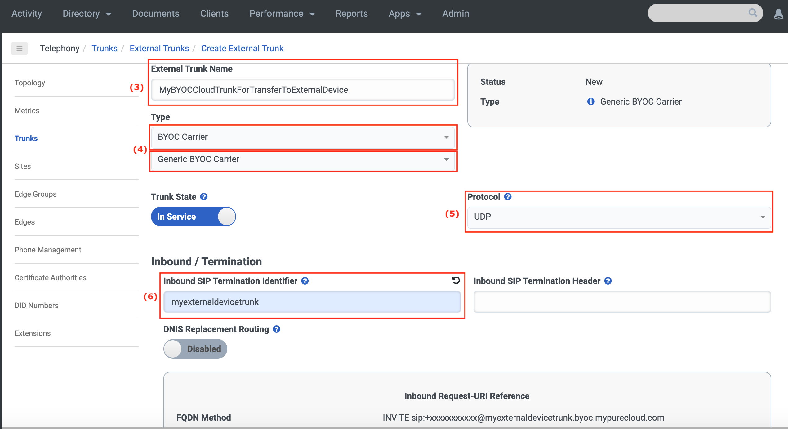

7. Set the IP Address(es) or FDQN(s) and Port for SIP (to reach your device) in ***SIP Servers or Proxies***, Under ***Outbound*** (e.g. 10.34.12.16 on port 5060)

8. If you have decided to leverage Digest Authentication, under ***Outbound***, enable ***Digest Authentication*** and set the values for ***Realm***, ***User Name*** and ***Password***.

9. Under ***Outbound***, in ***Calling***, set ***Address Override Method*** to ***Unassigned DID***.

  This is to preserve the ANI/CLI of the caller when transferring his call from Genesys Cloud to your device (From header).
  
  You will also need to define a ***Caller ID*** value (e.g. an E.164 number - +19999990000) which will be used as a default value if the ANI/CLI of the caller can't be propagated to your system (e.g. a Genesys Cloud Contact Center Agent, with no assigned number, makes a call to your device).

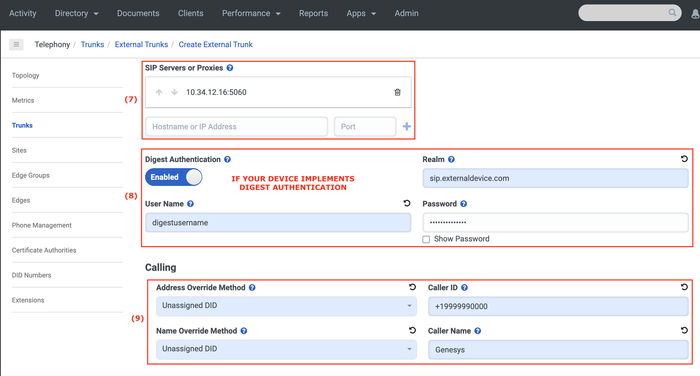

10. Under ***SIP Access Control***, define the list of IP or CIDR addresses that your device uses for SIP (e.g. 10.34.12.16)

  This list is to control access on Genesys Cloud side.

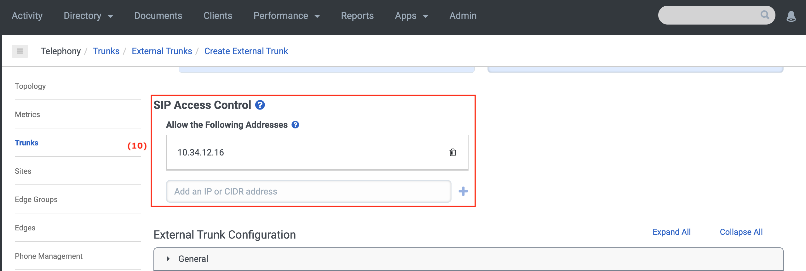

11. Under ***Identity***, for ***Calling*** and ***Called***, my preference is to disable ***Address Omit + Prefix***.

  If disabled, when a call comes to Genesys Cloud and is transferred to your device (via the configured BYOC Cloud trunk), the + prefix will be preserved in From and To header.

  If enabled, the + prefix will be removed (if it is present in the From/To numbers).

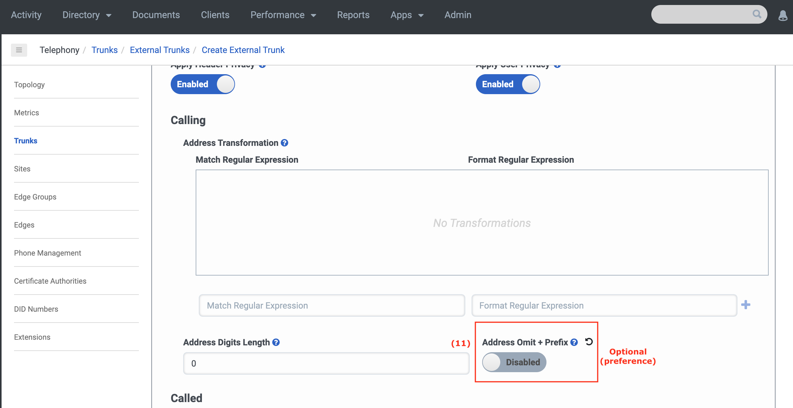

12. Under ***Media***, define your ***Preferred Codec List*** based on the audio codecs your device supports (e.g. audio/PCMU, audio/PCMA).

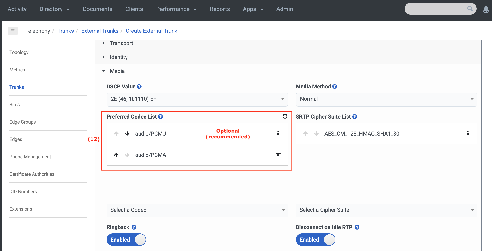

13. Under ***Protocol***, enable ***Take Back and Transfer*** if you want to transfer the calls back from your SIP device to Genesys Cloud, using a SIP Refer, in order to release the call and resources on your equipment.

14. Under ***Protocol***, in ***Outbound***, you can define a custom SIP header and value (static) that will be added to the SIP INVITE. You can leverage this custom SIP header and value if you want to control the access to your equipment, as described in [__Controlling access to your SIP device__](#controlling-access-to-your-sip-device) section (e.g. CUSTOM-DEVICE-TOKEN as header name, and 1234567 as value).

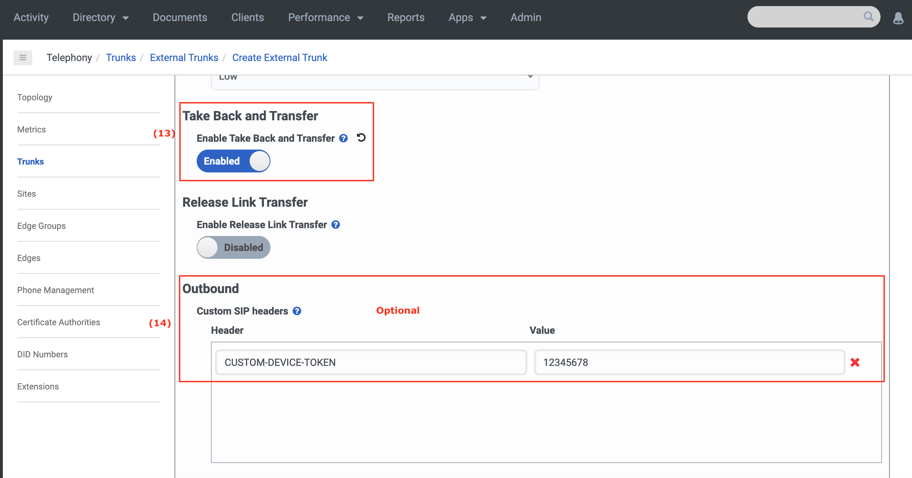

You can find more information on the different [External Trunk settings here](https://help.mypurecloud.com/?p=130654). Please note that the settings tagged with "External SIP only" do not apply to BYOC Cloud. They are only supported with [BYOC Premises](https://help.mypurecloud.com/?p=152741).

### Step 6 - Add new Number Plan/Classification and the Outbound Route on Site 

Now that you have created a new BYOC Cloud trunk, dedicated for your transfer of calls from Genesys Cloud to your external device, we need to make sure that this trunk will be able to co-exist with the one you are using for your PSTN connectivity (Genesys Cloud Voice or BYOC Cloud) and that it will be selected when targeting specific numbers (i.e. the numbers you have chosen as Expected DNIS in [Prepare and collect information about your external SIP device ](#step-2---prepare-and-collect-information-about-your-external-sip-device) section).

1. From Genesys Desktop, in Admin, navigate to ***Sites*** in ***Telephony***, and select the site where you want to add your BYOC Cloud trunk (e.g. Daly City)

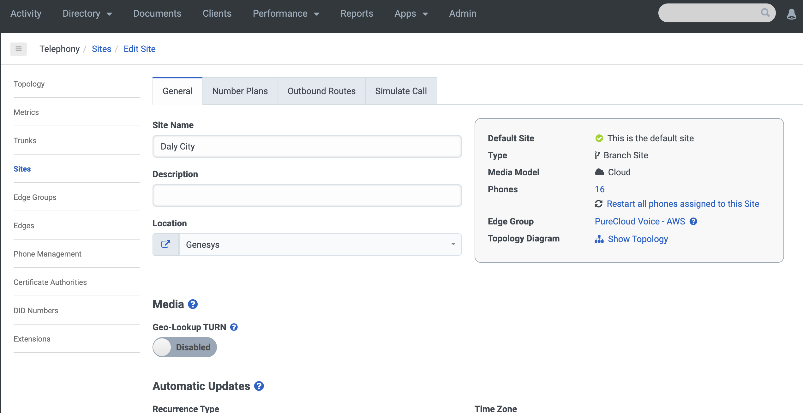

2. Navigate to the ***Number Plans*** tab

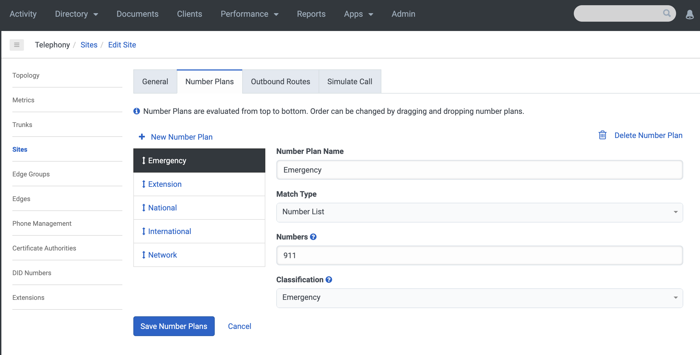

3. Add new Number Plans matching your expected DNIS. ***Make sure to have the new number plans at the top of the list (as they are evaluated from top to bottom)***.

  Example - if you plan to use E.164 numbers:
  * Number Plan Name: New Number Plan with E164
  * Match Type: E.164 Number List
  * Numbers: +19999990001 to +19999990001
  * Classification (type a new name and type enter - it will create a new classification category) - e.g. E164ToExternalDevice

  Example - if you plan to use short numbers:
  * Number Plan Name: New Number Plan with short number
  * Match Type: Number List
  * Numbers: 9991,9992
  * Classification (type a new name and type enter - it will create a new classification category) - e.g. ShortNumberToExternalDevice

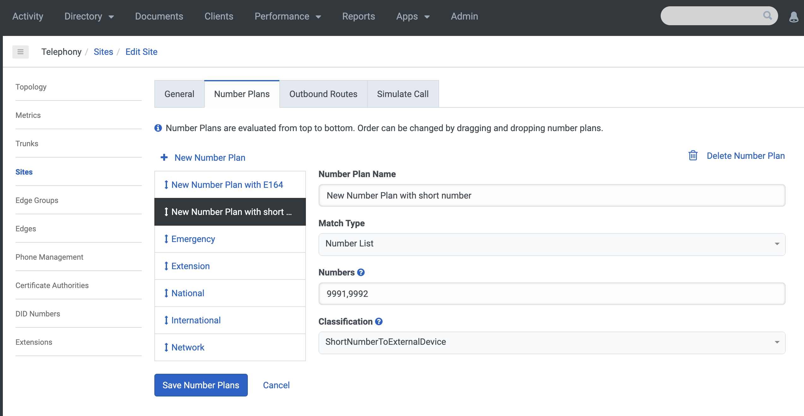

  You can of course also use a Regular Expression (RegEx) to define your Number Plan. Using the E.164 Number List or the Number List match types are just suggestions to get connectivity between Genesys Cloud and your system up and running faster.

4. Navigate to the ***Outbound Routes*** tab

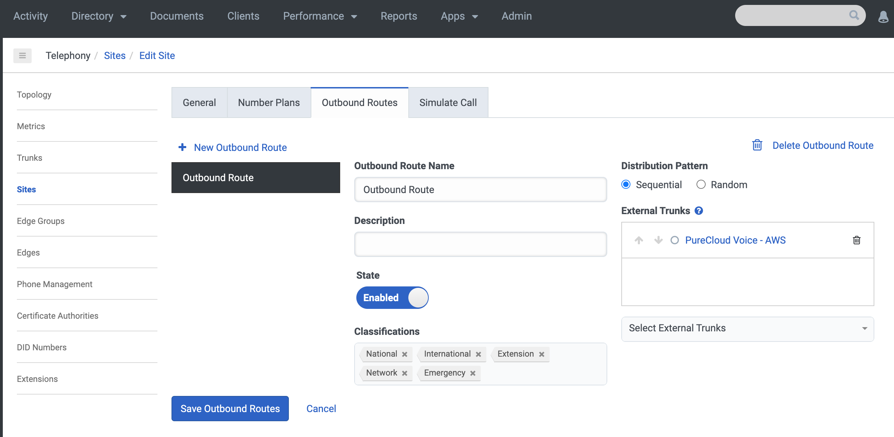

5. Add a new Outbound Route

  Example - if you plan to use short numbers:
  * Outbound Route Name: New Outbound Route to External Device
  * External Trunks: MyBYOCCloudTrunkForTransferToExternalDevice
  * Classifications: E164ToExternalDevice and ShortNumberToExternalDevice

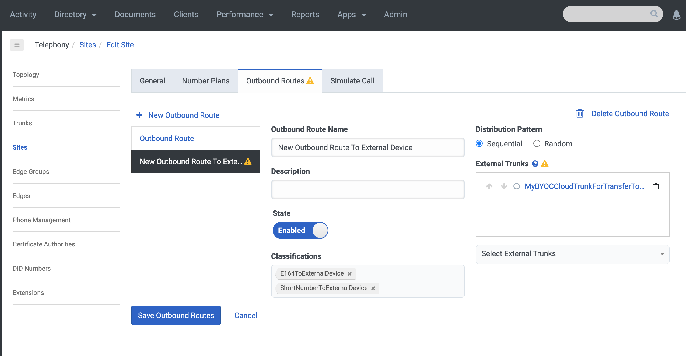

At this stage, you should be able to make or to transfer calls to your external device.

## Destination of the transfer (Transfer from external device back to Genesys Cloud) 

In our scenario, we want to transfer the call back from your external SIP device to Genesys Cloud, and specifically to an Architect Inbound Call flow or to a Genesys Cloud user, releasing the call and resources from your device.

When a call is connected to an external destination (i.e. external participant), it is not possible to transfer it back to Genesys Cloud using the Platform API.  
At this time, this can only be achieved using a SIP REFER.  
Make sure that ***Take Back and Transfer*** is enabled on the BYOC Cloud trunk to your external device.

The destination number is to be specified in the Refer-To header of the SIP REFER that will be triggered from your external SIP device.

You can find an example at the bottom of the [UUI data formats](https://help.mypurecloud.com/?p=147926) page, along with UUI data.

*With UUI Data:*
`Refer-To: <sip:address@ip?User-to-User%3Dhexdata%3Bencoding%3Dhex>`  
Non-escaped: `Refer-To: <sip:address@ip?User-to-User=hexdata;encoding=hex>`

*Without UUI Data:*
`Refer-To: <sip:address@ip>`

The ***ip*** portion can be anything. It is not checked and used by Genesys Cloud in this scenario. e.g. whatever_domain, locahost, ... would work.

As we want the call to reach an Architect Inbound Call flow, the ***address*** will have to be a number (E.164 -e.g. +19999999999), that has been defined as part of a [DID Range](https://help.mypurecloud.com/?p=45318) and that has been assigned to the desired Architect flow.

## Sending data from Genesys Cloud to your SIP device on transfer

When you request to connect a call from Genesys Cloud to your external SIP device, it is possible to send additional data as part of the SIP INVITE.

### ConversationId as a custom SIP header (BYOC Cloud) 

It is possible to request Genesys Cloud to automatically attach the ConversationId, as a custom SIP header, in the outgoing SIP INVITE (Genesys Cloud to your SIP Device).

The feature can be enabled at the trunk configuration level (BYOC Cloud).  
Under ***Protocol***, enable the ***Conversation Headers*** toggle.

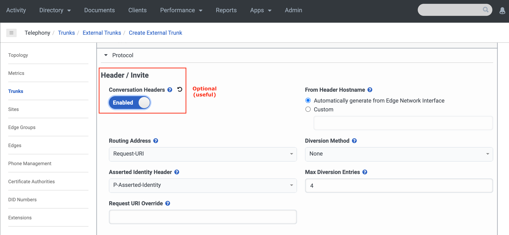

On outbound calls (Genesys Cloud to External via BYOC Cloud), Genesys Cloud will add a ***x-inin-cnv*** header containing the ConversationId on SIP INVITE.  
For inbound calls (External to Genesys Cloud via BYOC Cloud), Genesys Cloud will add a ***x-inin-cnv*** header containing the ConversationId in the 200 OK (following the received SIP INVITE).

### Data as User to User Information 

If you need to pass any additional data from Genesys Cloud to your external device, you can also leverage User to User Information (UUI).

You will need to enable UUI Data on your BYOC Cloud trunk.  
Under ***Protocol***, in ***User to User Information (UUI)***, enable the ***UUI Passthrough*** toggle and select the ***Header Type*** (User-to-User, User-to-User with pd parameter, x-User-To-User) and ***Encoding Format*** (hex, ascii) you want to use.  
You can find a description of these in the [UUI data formats](https://help.mypurecloud.com/?p=147926) page on the Resource Center.

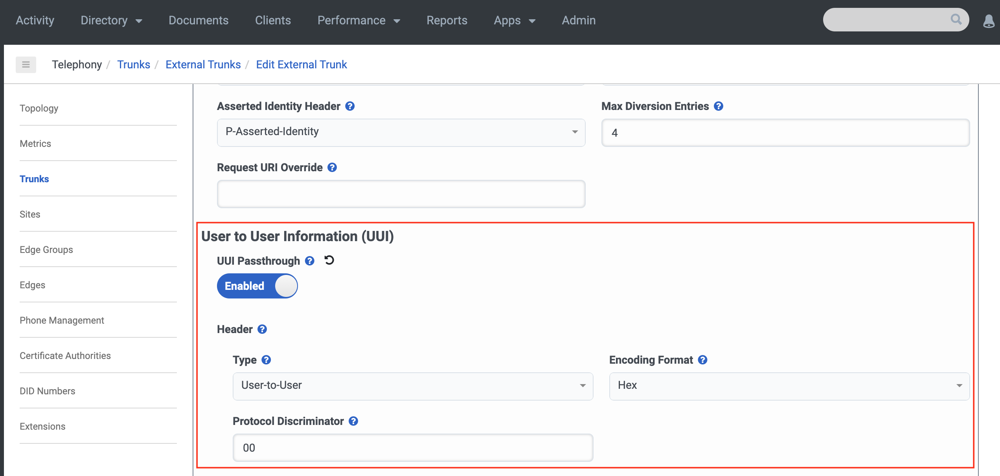

In your Architect Inbound Call flow, you can use the ***[Set UUI Data](https://help.mypurecloud.com/?p=130397)*** action (Outgoing UUI Data = For Transfers) to set the data you want to send. You don't need to encode it in hexadecimal (if this is the encoding format you have defined for your BYOC Cloud trunk configuration). Genesys Cloud will take care of this.

You can then use a ***[Transfer to Number](https://help.mypurecloud.com/?p=3786)*** action to trigger the transfer to your external device.  
***Do Not Transfer the call via a Platform API request (through a Data Action) if you want to pass data to your device.***  
If the transfer is made via a Platform API request, while the call is in the Architect Inbound Call flow, the data you have set via ***Set UUI Data*** action will be ignored.

Note that you can also trigger the transfer while the call is connected to a Contact Center Agent (Blind Transfer to Number).  
In order to position the UUI data to send, you can leverage a [Script](https://help.mypurecloud.com/?p=54284) and use the ***[Update action, in UUI Actions](https://help.mypurecloud.com/?p=81345)***. Once done, the agent can request the transfer to your external device number.

## Sending data from your external device to Genesys Cloud on take back and transfer 

If you need to transfer the call back from your external SIP device to Genesys Cloud, and specifically to an Architect Inbound Call flow or to a Genesys Cloud user, releasing the call and resources from your device, your SIP device can issue a SIP REFER to Genesys Cloud.

When your device sends this SIP REFER request, it can also pass data back to Genesys Cloud if necessary (e.g. an identifier, a set of info, ...).  
This is again leveraging User to User Information (as part of the *Refer-To*).

This data (decoded to ascii) will be made available to the Genesys Cloud conversation (available from an Architect flow, or at Contact Center Agent Desktop application level).  
e.g. identifier used from Genesys Cloud to query and to retrieve information - in the Architect flow or in a Script via a [Data Action](https://help.mypurecloud.com/?p=209478) (like the Web Services Data Action integration).

In an Architect Inbound Call flow, it is made available through the [Call.UUIData architect built-in variable](https://help.mypurecloud.com/?p=51613) (automatically decoded from hexa to ascii).

The data is expected to be provided in the *Refer-To* header, as described at the bottom of the [UUI data formats](https://help.mypurecloud.com/?p=147926) page.  
The hex data will start with a protocol discriminator (XX - 00, 01, 02, ...).  
*Note: If you are formatting a UUI header for a REFER, the data should be in the following format.*  
`Refer-To: <sip:address@ip?User-to-User%3Dhexdata%3Bencoding%3Dhex>`

As an example:
* Data to send: `This is my data`
* Encoded in hexadecimal: `54686973206973206d792064617461`
* Adding leading 00 (protocol discriminator - I chose 00 but you can use a different value): `0054686973206973206d792064617461`
* Refer-To value: `<sip:+33456456456@localhost?User-to-User=0054686973206973206d792064617461;encoding=hex>`
* Or with escaped characters: `<sip:+33456456456@localhost?User-to-User%3D0054686973206973206d792064617461%3Bencoding%3Dhex>`

## SIP Call-ID and Genesys Cloud ConversationId 

The following is an additional piece of information regarding a possible way to correlate a SIP session with a Genesys Cloud conversation.

If you have enabled ***Conversation Headers*** in your trunk configuration (which would be the easiest and preferred approach), as described in the previous sections, you do not need to care about this.

Otherwise, note that the SIP Call-IDs are stored and are made available in the [Platform API Analytics Conversation details](/api/rest/v2/analytics/conversation_detail_model).  
In the *participant* structure, under *sessions*, you should see a *protocolCallId* attribute, that will contain the SIP Call-ID related to this participant's call leg.  
Note: There are multiple SIP Call-IDs in a Genesys Cloud call conversation (one for each leg/session).

You can get the SIP Call-ID from a ConversationId using a [GET /api/v2/analytics/conversations/{conversationId}/details](/api/rest/v2/analytics/#get-api-v2-analytics-conversations--conversationId--details).  
Depending on your use case and flow, find the "inbound" or "outbound" participant (*purpose* = customer or external) and check the *protocolCallId* in his session.

You can also find the ConversationId from a SIP Call-ID using a [query for conversation details - POST /api/v2/analytics/conversations/details/query](/api/rest/v2/analytics/#post-api-v2-analytics-conversations-details-query).  
In your query, define a *segmentFilter* that leverages the *protocolCallId* dimension.

Also note that the Analytics Conversation Details are available right after the conversation starts. You do not need to wait for the end of a conversation to perform an Analytics query for conversation details.

## Controlling access to your SIP Device 

In order to control and to limit the access to your external device, which will be exposed on the public internet, you can leverage a combination of the following methods. These are up to you - nothing is mandatory!

### IP Address Access Control List 

A Genesys Cloud org is deployed in a single AWS region. See [AWS regions for Genesys Cloud deployment](https://help.mypurecloud.com/?p=162751) for a list of supported regions, or to determine in which region your Genesys Cloud org is deployed.

If you have a mechanism to control the IP Addresses allowed to access to your device (SIP Access Control List):
- For SIP, you can find the [list of the BYOC Cloud public SIP IP addresses, for each AWS/Genesys Cloud region, here](https://help.mypurecloud.com/?p=152869).
- If you also need to define a list for the media traffic (Genesys Cloud Media), see [IP addresses for the firewall allowlist](https://help.mypurecloud.com/?p=231699).

### SIP Digest Authentication 

BYOC Cloud trunk supports enabling SIP Digest Authentication (i.e. SIP INVITE from Genesys Cloud to your SIP device challenged for Digest Authentication).  
The Realm, User Name and Password are configured at the BYOC Cloud trunk level, as described in the previous sections.

### Custom SIP Header (static value) 

It is possible to send a custom SIP header (with a static value) in the SIP INVITE from Genesys Cloud to your external device.  
You could configure a token, assigned to your Genesys Cloud customer, as an additional control and verification mechanism (e.g. CUSTOM-DEVICE-TOKEN as header name, and 1234567 as value).

In the trunk configuration, under ***Protocol***, in ***Outbound***, you can define the custom SIP header and the value (static) that will be added to the SIP INVITE, as described in the previous sections.

### Token in UUI data (User to User Information) 

It is also possible to leverage the UUI data, which can be set at the Architect Inbound Call flow level, to carry a token, assigned to your Genesys Cloud customer, as an additional control and verification mechanism.

See [Data as User to User Information](#data-as-user-to-user-information), under [Sending data on transfer to your SIP device](#sending-data-on-transfer-to-your-sip-device), for more details.

