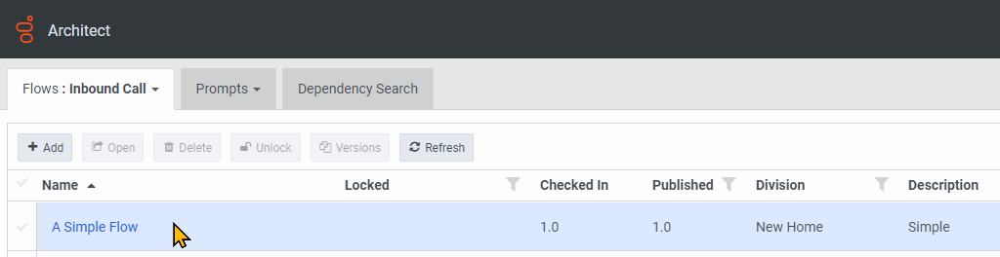
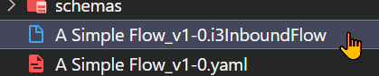

Greetings! Today we're going to look at an exciting feature of our Archy developer application: Flow Exporting. This blog post is for everyone that's either already using Archy, or just curious about learning the tool. We'll first do a quick overview, how to set it up, then we'll walk through the process of exporting and importing flows using it.

## What is Archy?

Archy is a command line tool that lets you create Architect flows in a Genesys Cloud organization using the YAML format. It lets you create, update, and publish flows, and now, also allows you to export them as YAML files. While Archy can be used as a standalone tool, they could also be integrated in automated environments such as CI/CD pipeline.

For those who are new to Archy, let's start with the steps on how to set it up:

## Requirements

1. A Genesys Cloud organization.
2. Basic knowledge of [Architect](https://help.mypurecloud.com/articles/architect-overview/) and flows.
3. Client Credentials OAuth - In order for the tool to make changes to your org, it needs to be configured with a Client ID and Client Secret. If you're not familiar with OAuth Clients please follow this [documentation](https://help.mypurecloud.com/articles/create-an-oauth-client/) in order to create one.

## Setup Archy in your machine

1. Download Archy for your OS:
   - [Archy for macOS](https://sdk-cdn.mypurecloud.com/archy/latest/archy-macos.zip)
   - [Archy for Linux](https://sdk-cdn.mypurecloud.com/archy/latest/archy-linux.zip)
   - [Archy for Windows](https://sdk-cdn.mypurecloud.com/archy/latest/archy-win.zip)

    Archy itself is simply a binary file that can be run via the command line. If you're not comfortable working with command line applications or want to follow a more official approach in "installing" the tool then you can use our [installation guide](/devapps/archy/install) which shows step-by-step our recommended setup for Archy.

2. Run Archy setup

    

    Once you can run Archy from the command line, let's go ahead and run the `setup`. From your command line enter:

    ```bash
    archy setup
    ```

    The configuration process will ask for the client id and client secret. It will also ask which region your organization is in (eg. mypurecloud.com, api.apne2.pure.cloud, etc...).

    The last step of the setup is the `refresh` and depending on how many queues, data actions, or flows are already configured in your org, this may take several minutes. It will show you the progress though and will also let you know once it's done.

    

    All in all, the `setup` should be an easy and straightforward process. If you want to read more about the it, please refer to the [Archy Setup](/devapps/archy/setup) documentation.

## Export

Let's get right into it.

In this example I'm going to use this inbound call flow that I just created:



You can create a very simple one or if you have, use an existing one.

There are two things we need to determine: the name, and the type of the flow. We need the type of the flow because Architect can allow two different types of flow with the same name (eg. an inbound call flow and an inbound chat flow can have the name "Inbound Flow").

In order to know the possible options and also the different flow type values, we can run:

```bash
archy export --help
```


Now let's try exporting a call flow:

:::primary
**Note**: By default the exportType is "architect" (Same file type when you export the flow from Architect). We need to tell Archy to export the flow as YAML.
:::

```bash
archy export --flowName "A Simple Flow" --flowType inboundcall --exportType yaml
```

Since we haven't specified the output directory then the file will be downloaded into the Archy home directory.

Once you have the YAML file, you can now edit it and make changes as you would a flow.


One of the cases where this is an advantage over using the Architect drag and drop UI is when you're exporting flows from one org to another. Instead of scrolling and looking for references that may not exist in the org (eg. queues with different names, etc.) you can simply run a find and replace in the YAML files that you have. There are other options for doing this which we'll touch later in the post.

Now let's look at how we could import back our flows. There are two options:

1. Create an import file which Architect can use.
2. Use Archy to create a flow from the exported YAML.

### Creating an Import File

If you've ever worked with Architect, you might have exported and imported some flows. If you tried reading the exported files, you'd notice that they aren't readable and are actually heavily encoded JSON files. So far, Architect can only import from this format and so Archy also has a way to generate to this format.

```bash
archy createImportFile --file "A Simple Flow_v1-0.yaml"
```

After specifying the YAML file, it will create a new file in the Archy home directory:



:::primary
**Note**: File extension varies based on the flow type.
:::

You can then use this file in importing to Architect UI.

### Creating a flow with Archy

If you want to keep it in the CLI, we could directly import flows with Archys. Importing in this case is simply creating a new flow with a defined YAML configuration.

With our YAML file ready, run this command in the new org:

```bash
archy create --file "A Simple Flow_v1-0.yaml"
```

This will create a new flow in the org. If it gives you an error that a flow with the name already exists, you can:

1. Use the `recreate` option to recreate and overwrite the existing flow.

    ```bash
    archy create --file "A Simple Flow_v1-0.yaml" --recreate
    ```

    OR

2. Edit the YAML file and rename the flow

    ```YAML
    inboundCall:
      name: Another Simple Flow
      description: Simple Flow 2
      division: Home
    ...
    ```

:::primary
**Note**: You may notice that we only had one set of credentials in the Archy setup. If you're working with more than one org then you'd need to make use of Options Files to declare credentials for the other orgs. Read more about it [here](/devapps/archy/commandOverview#parameter-values-and-the-options-file)
:::

## Resolving References

A common question when working with multiple orgs is how to resolve the different references that are inside the flow. An example is if a flow is transferring an interaction to a particular queue but on another org, the queue has a different name. It's easy to have multiple references not only for queues but groups, users, data action, etc..

We won't go deep into each option but if you're working with Archy on production, then being familiar with each method will help:

1. Manually updating the values in the YAML file
   - Simple and straightforward. YAML is plaintext and you can simply update the values you need before importing it to the next org. This may not be the best option for scaling.

2. Using Archy substitutions.
   - Substitutions is Archy's way to define variables in a YAML flow file. This will still require manually updating a flow to replace the static values with the variables but you can use different option files to define different sets of values to replace the variables. Read more about it [here](/devapps/archy/flowAuthoring/lesson_07_substitutions).

3. Using CX as Code
   - [CX as Code](/blog/2021-04-16-cx-as-code/) is configuration management tool that allows you to define Genesys Cloud configuration objects (e.g. Queues, Skills, Users, etc) in plain text files. At the time of writing, CX as Code is still being developed and may not work fully with Archy but the plan is to have the tools working seamlessly with each other. It doesn't hurt to know about it as early as now :)

That's about it. I hope you enjoyed following along the steps and learned new things about Archy.

If you have any questions or need assistance, please feel free to post and share your experience to our [Developer Forums](/forum/).

See you.

## Additional Resources

1. [DevDrop Video Series for Archy](https://www.youtube.com/watch?v=3NwGJ9X1O0s)
2. [Archy Documentation](/devapps/archy/)
3. [Archy Flow Authoring Tutorial Series](/devapps/archy/flowAuthoring/)
4. [CX as Code](/api/rest/CX-as-Code/)
5. [YAML File Format](https://en.wikipedia.org/wiki/YAML)
