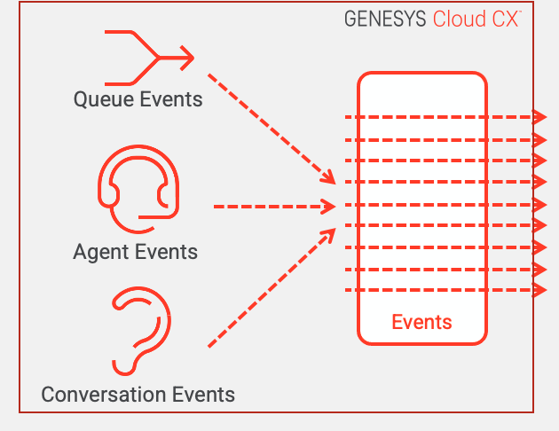
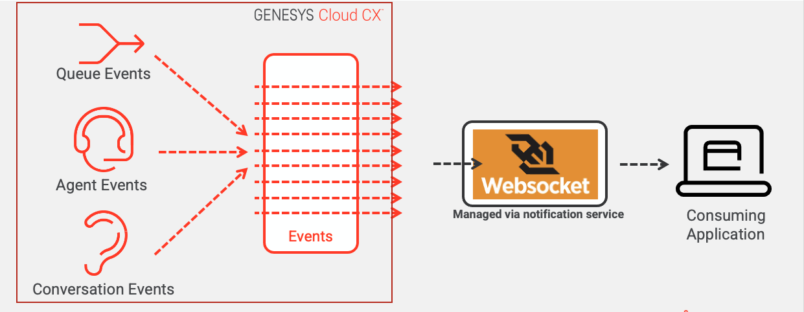

Greetings everyone. Service-based architectures have very much become the norm for building applications and more importantly integrating with third-party platforms. Genesys Cloud has long recognized this and provides a rich and deep set of services to deliver solutions. However, services are not the only form of integration offered by Genesys Cloud. Genesys Cloud has long supported the concept of event-driven integrations, where as state changes in and activities occur within Genesys Cloud, an event will published asynchronously to be consumed by an application or integration.

This article is going to explore:

1. When to consider leveraging event-driven integrations for your own applications
2. Using the Genesys Cloud notification service for event-driven integrations
3. Using the Genesys Cloud AWS Event Bridge for event-driven integrations
4. Coming Soon: The Genesys Cloud event orchestrator

## When to consider leveraging event-driven integrations for your own applications

Service-based architecture, particularly microservice-based architectures, has made it incredibly easy to build and integrate applications together. However, service-based architectures follow a synchronous request-response model. This requires the consuming application to be responsible for when to call the API. In many scenarios, applications leveraging APIs to carry out an action need to continuously "call" or "poll" the API. Based on the frequency of this call, this can often introduce "rate-limiting" or scalability problems when having to call a cloud-based service APIs.

Event-driven architectures take a different approach. In an event-driven architecture, as data is updated or an action is taken, a message is generated and *published* to a pipe. The publisher of the event has no idea who is going to actually do anything with the message. Instead an application will *subscribe* to the pipe and listen for any messages coming down the "pipe." The diagram below depicts this:   

In the above diagram, as call state changes, as there are several advantages to using an event-driven architecture:

1. **Events are asynchronous**. The producer of the event can publish an event and immediately return. The producer does not have to wait for the consumer to acknowledge they have received the message or successfully consumed it.
2. **Events are published as they happen**. Events are produced milliseconds after they occur so the events can be consumed in near time. This means a message consumer can get a message almost as soon as it happens.
3. **Events reduces the need for unnecessary API polling**. Synchronous service invocations use a pull model where the data is "pulled" from the provider. In an event-driven architecture, the data is pushed to the consumer.
4. **Events provide opportunities for increased scalability and resiliency**. In many event-driven architectures messages can be queued up and consumed by multiple consumers very quickly. In addition, because messages can be queued up if a consumer can not immediately consume a message because of any outage, the messages are not lost.

:::{"alert":"warning","title":"A note on message queueing","autoCollapse":false}
Not all event-driven architectures use message queueing. Genesys Cloud provides two different message implementations:  a web-socket based solution and AWS event bridge. The web-socket based solution does not implement message queueing. Please be aware of this as you select which implementation of an event-driven architecture you are going to use here.
:::

Event-driven architectures are extremely powerful, but they do have downsides. The biggest complaint with event-driven architectures are that they are hard to reason through and debug. With a synchronous service invocation you can walk through a very linear set of actions to determine what happens before, during and after the service invocation. Asynchronous events are harder to debug because they are coming in at different times and can be processed at different rates of speed. In a high volume, event-driven architecture debugging issues can be maddening.

Genesys Cloud provides two different implementations of an events-based architecture:

1. A platform-agnostic, web-socket event implementation
2. A message bus implementation based on the AWS EventBridge technology

<<STOPPED HERE>>

## Using the Genesys Cloud notification service for event-driven integrations

- Websocket based
- Open a channel and subscribe to a topic
- Was originally based on 
- It is geared toward's UI integration (it is the foundational mechanism for how the Genesys Cloud UI is built)

- Limitations
  - Lower level programming models 
  - Non-durable socket.  If the socket goes away you miss messages.
  - No ability to generalize
  - Usage limitations 
    - Channels remain active for 24 hours. To maintain a channel for longer than 24 hours, resubscribe to topics.
    - You can create up to 20 channels per user and application. When the channel limit is reached, then the new channel replaces the oldest channel that does not have an active    
      connection.
    - Each WebSocket connection is limited to 1,000 topics. If you subscribe to more than 1,000 topics, then the notification service returns a 400 error code.
    - Each channel can only be used by one WebSocket at a time. If you connect a second WebSocket with the same channel ID, the first WebSocket disconnects.
    - Guests cannot subscribe or unsubscribe to topics over WebSockets.

4. [Using the Genesys Cloud to listen to Notification Service Events](https://www.youtube.com/watch?v=r4Jc-Mn0ONA)
5. [Using the Genesys Cloud Python SDK with the Notification Service](https://www.youtube.com/watch?v=z6JS12DX_pI)
6. [Build a chat translation assistant with the AWS Translate service](/blueprints/chat-translator-blueprint/)    

    
## Using the Genesys Cloud AWS Event Bridge for event-driven integrations

  - Events are published to an AWS event bridge
  - Once it hits the event bridge the messages can be published to various downstream AWS properties:
    - SQS
    - Lambda
    - SNS
    - Kinesis - Kinesis can store the message for up to 7 days
  - Much better durability.  If event bridge is down, Genesys will store the messages and attempt to resend them for 4 days.
  - Much better generalization.  More robust filtering support so that you can use * to execute capture data.  Can also filter on elements inside the message
  - Limitations
    - Must be run inside of a customer's AWS account

7. [AWS EventBridge - Create a PagerDuty Incident in response to OAuth client deletes](/blueprints/aws-eventbridge-oauth-client-delete-blueprint/)
8. [AWS EventBridge - Write user presence updates to DynamoDB](/blueprints/aws-eventbridge-user-presence-update-blueprint/)

## Coming Soon: The Genesys Cloud event orchestrator

## Additional Resources

1. [Notification Service](/api/rest/v2/notifications/notification_service)
2. [Event topics](api/rest/v2/notifications/available_topics)
3. [Genesys Cloud AWS EventBridge ](/api/rest/v2/notifications/event_bridge)
4. [Using the Genesys Cloud to listen to Notification Service Events](https://www.youtube.com/watch?v=r4Jc-Mn0ONA)
5. [Using the Genesys Cloud Python SDK with the Notification Service](https://www.youtube.com/watch?v=z6JS12DX_pI)
6. [Build a chat translation assistant with the AWS Translate service](/blueprints/chat-translator-blueprint/)
7. [AWS EventBridge - Create a PagerDuty Incident in response to OAuth client deletes](/blueprints/aws-eventbridge-oauth-client-delete-blueprint/)
8. [AWS EventBridge - Write user presence updates to DynamoDB](/blueprints/aws-eventbridge-user-presence-update-blueprint/)

