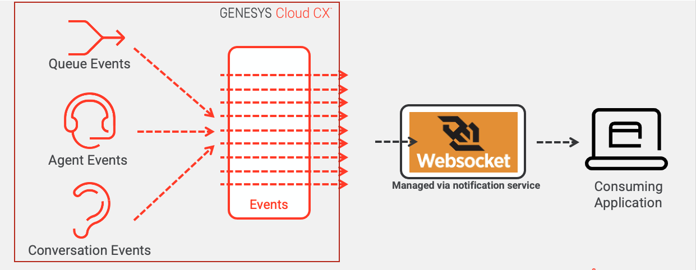
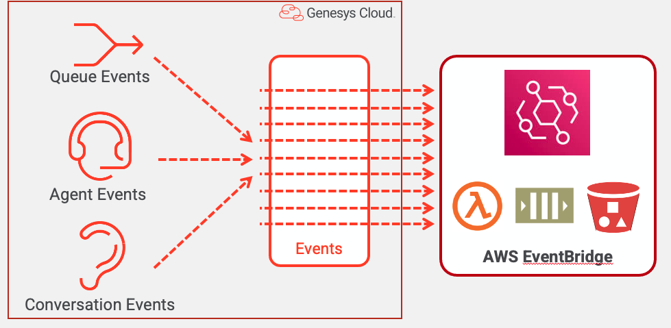

Greetings everyone. Service-based architectures have very much become the norm for building applications and more importantly integrating with third-party platforms. Genesys Cloud has long recognized this and provides a rich and deep set of services to help you deliver integrations. However, services are not the only form of integration offered by Genesys Cloud. Genesys Cloud has long supported the concept of event-driven integrations, where as state changes in and activities occur within Genesys Cloud, an event is published asynchronously to be consumed by an application or integration.

This article is going to explore:

1. When to consider leveraging event-driven integrations for your own applications
2. Using the Genesys Cloud notification service for event-driven integrations
3. Using the Genesys Cloud AWS EventBridge for event-driven integrations
4. Coming Soon: Genesys Cloud Event Triggers

## When to consider leveraging event-driven integrations for your own applications

Service-based architecture, particularly microservice-based architectures, has made it incredibly easy to build and integrate applications together. However, service-based architectures follow a synchronous request-response model. This requires the consuming application to be responsible for when to call the API. In many scenarios, applications leveraging APIs to carry out an action need to continuously "call" or "poll" the API. Based on the frequency of these calls, this can often introduce "rate-limiting" and/or scalability problems. This is particularly prevalent when having to invoke a cloud-based service APIs.

Event-driven architectures take a different approach. In an event-driven architecture, as data is updated or an action is taken, a message (i.e. an event) is generated and *published* to a pipe. The publisher of the event message has no idea who is going to actually do anything with the message. Instead an application will *subscribe* to the pipe and listen for any messages coming down the "pipe." The diagram below depicts this:   

In the above diagram, as call state changes, there are several advantages to using an event-driven architecture:

1. **Events are asynchronous**. The producer of the event can publish an event and immediately return. The producer does not have to wait for the consumer to acknowledge they have received the message or successfully consumed it.

2. **Events are published as they happen**. Events are produced milliseconds after they occur so the events can be consumed in near time. This means a message consumer can get a message almost as soon as it happens.

3. **Events reduces the need for unnecessary API polling**. Synchronous service invocations use a pull model where the data is "pulled" from the provider. In an event-driven architecture, the data is pushed to the consumer.

4. **Events provide opportunities for increased scalability and resiliency**. In many event-driven architectures messages can be queued up and consumed by multiple consumers very quickly. In addition, because messages can be queued up if a consumer can not immediately consume a message because of any outage, the messages are not lost.

5. **Events provide flexible integrations points.**  Unlike a synchronous request/response API integration model, the producer of an event has no direct knowledge of what applications downstream are going to consume it. New consumers can be easily added without significant code changes. 

:::{"alert":"warning","title":"A note on message queueing","autoCollapse":false}
Not all event-driven architectures use message queueing. Genesys Cloud provides two different message implementations:  a WebSocket based solution and AWS EventBridge. The WebSocket based solution does not implement message queueing. Please be aware of this as you select which implementation of an event-driven architecture you are going to use here.
:::

Event-driven architectures are extremely powerful, but they do have downsides. The biggest complaint with event-driven architectures are that they are hard to reason through and debug. With a synchronous service invocation you can walk through a very linear set of actions to determine what happens before, during and after the service invocation. Asynchronous events are harder to debug because they are coming in at different times and can be processed at different rates of speed. In a high volume, event-driven architecture debugging issues can be maddening.

Genesys Cloud provides two different implementations of an events-based architecture:

1. A platform-agnostic, WebSocket event implementation
2. A message bus implementation based on the AWS EventBridge technology

Lets walkthrough each of these event-based architectures in more detail.

## Using the Genesys Cloud Notification service for event-driven integrations

At a high-level the Genesys Cloud Notification service allows you to create a "channel" to Genesys Cloud and the subscribe to Genesys Cloud Events. Once this channel and subscription is created you can establish a WebSocket with Genesys Cloud and listen for these subscribed events as they occur.

The diagram below illustrates this flow and behavior.

It is important to realize that the original intent of this event-driven architecture was to allow developers to build real-time dashboards without having to constantly poll the Genesys Cloud API to retrieve data.

This model can be leveraged in backend services to build near-time data integrations, but as a developer you need to be aware of when using this model:

1. **No message durability**. Genesys Cloud will only send events over an open WebSocket. If a WebSocket is closed for any reason, any events that are generated while the WebSocket is not open will not be queued or retried when a new WebSocket is created. In the event of any kind of network interruption, once a WebSocket is re-established, the developer must use the Genesys Cloud API to "fill in" the data that is missing during the time period the socket was down.

2. **WebSockets are a lower-level primitive**. With a WebSocket, you as the developer are responsible for establishing the network connection, handling network connectivity issues, scaling based on volume of messages, and processing messages. While these individual activities are not very complicated on their own, taken together they can make building message-based integrations significantly more complicated.

3. **Limited generalization for to subscribing topics**. When subscribing to topics, you must explicitly know the id of the Genesys Cloud object you are listening to events on. For example, to subscribe to events associated with multiple queues, you must explicitly subscribe to each individual queue. This can be painful to do and there is no mechanism to subscribe to events from multiple queues using a single topic.

In addition to the limitations above, you need also need to manage to and respect the following Genesys Cloud rate-limits associated with the Notification service WebSockets implementation:

1. **Channels remain active for 24 hours**. To maintain a channel for longer than 24 hours, resubscribe to topics.

2. **You can create up to 20 channels per user and application**. When the channel limit is reached, then the new channel replaces the oldest channel that does not have an active  connection.

3. **Each WebSocket connection is limited to 1,000 topics**. If you subscribe to more than 1,000 topics, then the notification service returns a 400 error code.

4. **Each channel can only be used by one WebSocket at a time**. If you connect a second WebSocket with the same channel ID, the first WebSocket disconnects.

We are not going to do a walk through in detail how to setup a web socket using the Notification service, but I would recommend you review the following resources:

1. [Genesys Cloud Notification Service Documentation](api/rest/v2/notifications/notification_service )
2. [Using the Genesys Cloud CLI to listen to Notification service events](https://www.youtube.com/watch?v=r4Jc-Mn0ONA)
3. [Using the Genesys Cloud Python SDK with the Notification Service](https://www.youtube.com/watch?v=z6JS12DX_pI)
4. [Build a chat translation assistant with the AWS Translate service](/blueprints/chat-translator-blueprint/)    

## Using the Genesys Cloud AWS Event Bridge for event-driven integrations

Genesys Cloud is currently beta-ing a new mechanism to publish and subscribe to events by using AWS's EventBridge. AWS EventBridge allows you to subscribe to Genesys Cloud messages originating from your Genesys Cloud account and process them to various pieces of AWS-based resources for processing. The diagram below illustrates:

AWS EventBridge provides significant advantages over the Websocket model.  These advantages include:

1. **Serverless**. The Amazon EventBridge is completely serverless.  It requires no services to run and using it involves minor configuration.

2. **Message durability**. Genesys Cloud will attempt to deliver messages for up to 4 days in the event of an AWS EventBridge outage. In addition, AWS EventBridge will allow you to publish a message to Kinesis where it can be persisted for up to 7 days before it is processed. In addition, AWS supports [Dead Letter Queue](https://docs.aws.amazon.com/eventbridge/latest/userguide/eb-rule-dlq.html) (DLQ) configuration with the AWS EventBridge so that if a target is unavailable from the EventBridge, messages will not be lost.   

3. **Strong message filtering and routing capabilities**. AWS EventBridge can subscribe to whole classes of events (e.g. no need to identify the specific item you are looking for) and can apply sophisticated routing rules to an it receives.

4. **Multiple routing targets for messages**.  AWS EventBridge can send an incoming message to multiple  AWS targets. Targets for processing include (just to name a few): SQS, Lambda, SNS, Kinesis and Cloudwatch.

The only real limitation for using AWS EventBridge to integrate with Genesys Cloud is that you need to have an AWS Account in order to use it.

In preparation for the AWS EventBridge release, we have been building new content to demonstrate how to configure and use it. This content includes:

1. [DevDrop - Introducing the Genesys Cloud AWS EventBridge](https://www.youtube.com/watch?v=1uqEUpFtk8Q)
2. [Blueprint - AWS EventBridge: Create a PagerDuty Incident in response to OAuth client deletes](/blueprints/aws-eventbridge-oauth-client-delete-blueprint/)
3. [Blueprint - AWS EventBridge: Write user presence updates to DynamoDB](/blueprints/aws-eventbridge-user-presence-update-blueprint/)
4. [CX as Code Remote Module - AWS EventBridge](https://github.com/GenesysCloudDevOps/aws-event-bridge-module)

## Coming Soon: Genesys Cloud Event Triggers

Genesys is continuing to build out the Genesys Cloud event processing capabilities. Currently, Genesys Cloud allows you to consume messages with your own external integrations via a WebSocket or AWS EventBridge. The Genesys Cloud development teams are currently working on a mechanism to consume Genesys Cloud events and process them without having to leave Genesys Cloud. This new capability, called Genesys Cloud Event Triggers, is currently in beta with a target release date of Q1 2022. With the Event Triggers feature you can invoke an Architect Workflow when an event for a particular topic you are subscribed occurs.

The Genesys Cloud EventBridge and the Genesys Cloud Event Triggers features are properly thought of as opposite sides of the same coin; similar functionality but for very different use cases. Event Triggers are intended to invoke workflows within Genesys Cloud in order to react to events that occur within Genesys Cloud; EventBridge is a high throughput messaging bus that can be used to archive information in an external system or the creation of your own process automation flows within your AWS infrastructure. As a message bus, AWS EventBridge has robust message queuing and retry logic. The Genesys Cloud Event Triggers feature does not have the same level of service level guarantees, message retries, etc. that are crucial for something like a BI pipeline, while EventBridge was specifically built to service these sorts of use case.

If you are interested in finding out more about the Genesys Cloud Event Triggers feature please reach out to Richard Schott (richard.schott@genesys.com) for more information. In addition, if you would like browse the Event Trigger's APIs they are in preview status on the [Genesys Cloud Developer Center](/api/rest/v2/previewapis/). The Event Trigger's APIs will begin with the `/api/v2/processautomation/triggers/` prefix.

## Closing Thoughts

Event-based integration is incredibly powerful because it allows for real-time consumption of events while avoiding the heavy costs of heavy API polling. Genesys Cloud has three event-based integration models. They include:

1. **Notification Service using WebSockets**. This works best for real-time UI integrations like dashboards and agent applications. This was originally the only mechanism that could be used for back-end integration, but had severe limitations around message durability. It also a complicated programming model that pushes many core resiliency and scalability responsibilities to the developer.

2. **Notification Service using AWS EventBridge**. An enterprise messaging bus suitable for real-time backend data integrations. While it can only be used within the context of a customer's AWS account, it has a much higher level of message durability and retry-ability then the Notification Service using WebSockets. It is currently in beta and should be available in December 2021. If you are interested in more information or want to participate in the last stages of the beta, please reach out to Becky Powell, the product manager for the AWS Eventbridge Integration. (becky.powell@genesys.com)

3. **Genesys Cloud Event Triggers**. This a feature currently in beta and is expected to be released Q1 of 2022. Genesys Cloud Event Triggers will allow you to execute Architect workflows based on event-based triggers directly within Genesys Cloud. Event Triggers are geared towards building sophisticated business workflows that react to events within your Genesys Cloud environment. If you are interested in more information or want to participate in the last stages of the beta, please reach out to Richard Schott, the product manager for the AWS Genesys Cloud Event Triggers feature. (richard.schott@genesys.com)

## Additional Resources

1. [Notification Service](/api/rest/v2/notifications/notification_service)
2. [Event topics](api/rest/v2/notifications/available_topics)
3. [Genesys Cloud AWS EventBridge ](/api/rest/v2/notifications/event_bridge)
4. [ Using the Genesys Cloud CLI to listen to Notification Service Events](https://www.youtube.com/watch?v=r4Jc-Mn0ONA)
5. [Using the Genesys Cloud Python SDK with the Notification Service](https://www.youtube.com/watch?v=z6JS12DX_pI)
6. [Build a chat translation assistant with the AWS Translate service](/blueprints/chat-translator-blueprint/)
7. [AWS EventBridge - Create a PagerDuty Incident in response to OAuth client deletes](/blueprints/aws-eventbridge-oauth-client-delete-blueprint/)
8. [AWS EventBridge - Write user presence updates to DynamoDB](/blueprints/aws-eventbridge-user-presence-update-blueprint/)
9. [DevDrop - Introducing the Genesys Cloud AWS EventBridge](https://www.youtube.com/watch?v=1uqEUpFtk8Q)
10. [CX as Code Remote Module - AWS EventBridge](https://github.com/GenesysCloudDevOps/aws-event-bridge-module)

