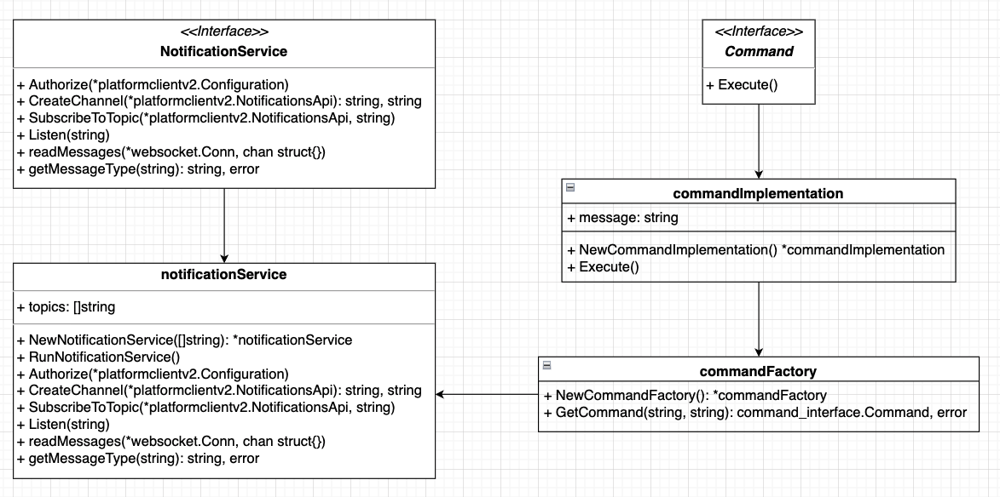
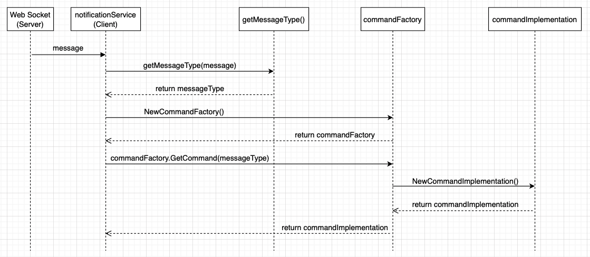

With the Genesys Cloud Notification Service, you can create a notifications channel, subscribe the channel to topics and listen for notification events from Genesys Cloud by opening a web socket connection to the notifications channel. You can subscribe the notifications channel to user topics, conversation topics, workforce management topics and many more. Today we are going to look at building a notification service with the Go SDK and in this example we will be using the Factory Pattern and the Command Pattern to process incoming requests. 

The Factory Pattern is a creational design pattern used to determine which objects to create without exposing the object creation logic to the client or user. In the notification service, we will be using the Factory pattern to determine which command implementations to create based on the incoming message type. 

The Command Pattern is a behavioural design pattern that is used to decouple the object that invokes an operation from the object that actually executes the operation, achieving abstraction. Basically, the invoker of a command does not need to know about the object that actually executes the command, all of the information needed to do so is encapsulated in the object itself.

## An Overview Of The Notification Service

The image below shows the different components that make up the notification service and the relationship between them.

1. The notification service will implement the **notification service interface** methods.
2. The notification service will create an instance of the **command factory** and call its `GetCommand()` method.
3. The **command factory** will determine which **command implementation** to create.
4. The **command implementation** will implement the **Command interface** `Execute()` method.



And image here describes the sequence of interactions between the various objects in the notification service as we process messages with the **Factory Pattern** and the **Command Pattern**.

1. The client Receives a message from the web socket server.
2. The client passes the message to a helper function `getMessageType()` which returns the type of the message.
3. The client creates an instance of the **command factory** with `NewCommandFactory()`.
4. The client calls `GetCommand()` on the **command factory instance** passing in the message type.
4. Depending on the message type the command factory will create an instance of a **command implementation** and return the **command implementation**.
5. The returned command implementation has its `Execute()` method called.



## Getting Started

Before we write any code, you will need to install and configure the `Go` SDK. 

See the [Go SDK documentation](/api/rest/client-libraries/go/) for instructions on how to install and configure the SDK.

You can retrieve the package from [https://github.com/MyPureCloud/platform-client-sdk-go](https://github.com/MyPureCloud/platform-client-sdk-go) using `go get`.

```go
go get github.com/mypurecloud/platform-client-sdk-go/v61/platformclientv2
```

### Using The SDK

To use the SDK, you will need to import the package.

```go
import "github.com/mypurecloud/platform-client-sdk-go/v61/platformclientv2"
```

### Project Structure

This is the basic structure of the project. 

We will be using packages to organize our code with separate packages for the **command factory**, **command implementations** and the **notification service**.

```go
./golang-sdk-notification-service
	./command_factory
		command_factory.go
	./command_implementation
		command_interface.go
		heartbeat.go
		routing_queues_id_users.go
		users_id_presence.go
	./notification_service
		notification_service.go
		notification_service_interface.go
	main.go
```

## The Notification Service Interface

Let's begin by writing the **notification service interface**. 

`Authorize()` will take the default configuration instance. 

`CreateChannel()` will take the notifications API instance and return two strings, the **channel ID** and the **connect URI**. 

`SubscribeToTopic()` will take the notifications API instance and the channel ID. 

`Listen()` will take the connect URI.

```{"language":"go","title":"./notification_service/notification_service_interface.go"}
package notification_service

import "github.com/mypurecloud/platform-client-sdk-go/v61/platformclientv2"

type NotificationService interface {
	Authorize(config *platformclientv2.Configuration)
	CreateChannel(notificationsApi *platformclientv2.NotificationsApi) (string, string)
	SubscribeToTopic(notificationsApi *platformclientv2.NotificationsApi, channelId string)
	Listen(connectUri string)
}
```

Now that we have the **notification service interface** we can write the **notification service** and implement the interface methods.

## The Notification Service

The notification service `./notification_service/notification_service.go` will implement the methods from above and process incoming messages one by one.

To begin, let's create the **notification service struct**. Here you can see that the notification service `struct` contains a `topics` variable of type `[]string`. The `topics` variable will hold the **topics** we want to subscribe to.

```go
type notificationService struct {
	topics []string
}
```

Now let's write the **constructor function** that will be used to create an instance of the notification service in our main function. The constructor function will be passed a slice of **topics** which will be assigned to the `topics` variable in the notification service struct.

```go
func NewNotificationService(topicList []string) *notificationService {
	return &notificationService{
		topics: topicList,
	}
}
```

Now that we have the **notification service struct** and the **constrcutor function**, we can implement the interface methods and write the method logic.

### Authorization

Let's implement `Authorize()`. 

**Note:** In `Go` interface methods are implemeted implicitly so there is no need to explicitly say that your file implements the interface like you might have seen in other language such as as Java.

Here you can see why `Authorize()` takes the default configuration instance. It is used to call `AuthorizeClientCredentials()` and authorize our client application using the **OAuth 2.0 Client Credentials Grant flow**. You can read more about the Client Credentials Grant on the Developer Center: [Grant - Client Credentials](/api/rest/authorization/use-client-credentials).

Iff the request is not successful, `AuthorizeClientCredentials()` will return an error.

```go
func (ns *notificationService) Authorize(config *platformclientv2.Configuration) {
	log.Println("authorizing")
	err := config.AuthorizeClientCredentials(os.Getenv("GENESYSCLOUD_OAUTHCLIENT_ID"), os.Getenv("GENESYSCLOUD_OAUTHCLIENT_SECRET"))
	if err != nil {
		log.Fatalf("error authorizing: %v", err)
	}
}
```

### Creating The Channel

In `CreateChannel()` we are using the notifications API instance to call `PostNotificationsChannels()` which will go ahead and create a new channel.

The request will return three values `*Channel`, `*APIResponse` and `error` but what we need from here is just the **connect URI** and the **channel ID** as these values will be used when subscribing to **topics** and opening the web socket connection.

```go
func (ns *notificationService) CreateChannel(notificationsApi *platformclientv2.NotificationsApi) (string, string) {
	log.Println("creating the notifications channel")
	channel, _, err := notificationsApi.PostNotificationsChannels()
	if err != nil {
		log.Fatalf("error creating the notifications channel: %v", err)
	}
	return *channel.Id, *channel.ConnectUri
}
```


### Subscribing To Topics.

Now that we have created the channel, we can subscribe the channel to our **topics**. You can see the list of available topics on the [developer center](/api/rest/v2/notifications/available_topics) or to see the list of available topics in your Genesys Cloud organization, call `GET /api/v2/notifications/availabletopics`.

In `SubscribeToTopic()` you can see I have declared a variable called `reqBody` of type `[]platformclientv2.Channeltopic`. `reqBody` is a slice that will hold the **topic objects**.

We loop over the slice of topics and append an object of type `platformclientv2.Channeltopic` (one for each topic) onto `reqbody` giving the objects `Id` attribute the value of our `topics`.

**Note:** We are assigning the value of the topic by writing `&ns.topics[i]` and using the index to acces this value and not just the value of the copy that is created in the `for` loop.

```go
func (ns *notificationService) SubscribeToTopic(notificationsApi *platformclientv2.NotificationsApi, channelId string) {
	var reqBody []platformclientv2.Channeltopic
	for i, topic := range ns.topics {
		log.Println("subscribing to topic: " + topic)
		reqBody = append(reqBody, platformclientv2.Channeltopic{Id: &ns.topics[i], SelfUri: nil})
	}
	_, _, err := notificationsApi.PostNotificationsChannelSubscriptions(channelId, reqBody)
	if err != nil {
		log.Fatalf("error subscribing to topics: %v", err)
	}
}
```

For example, your slice of topics might look like:

```go
const topic1 = "v2.routing.queues.a6ab52ba-d915-49f3-bf6e-b4f0567eac82.users"
const topic2 = "v2.users.a6ab52ba-d915-49f3-bf6e-b4f0567eac82.presence"

topics := []string{
	topic1,
	topic2,
}
```

So `reqbody` would look like this after we finishing looping over the `topics` and appending the **topic** objects.

```go
reqBody := []platformclientv2.Channeltopic{
	{Id: &topic1, SelfUri: nil},
	{Id: &topic2, SelfUri: nil},
}
```

Then we call `PostNotificationsChannelSubscriptions()` and pass in the `reqbody` and the `channelId`. The request will return three values, `*Channeltopicentitylisting`, `*APIResponse` and `error`, but we are only concerned with the error return value.

### Listening For Notifications

To listen for notification events, we need to open a web socket connection to the notifcations channel. In this example we will be using **Gorilla WebSockets** which is *"A fast, well-tested and widely used WebSocket implementation for Go".* See the [Gorilla WebSockets documentation](https://github.com/gorilla/websocket) for more info.

you can install Gorilla WebSockets with:

```go
go get github.com/gorilla/websocket
```

To begin, let's create a channel of type `os.Signal`. The channel will be used to send `os.Signal` values as we want to close the web socket connection and exit the program on `SIGINT` or `ctrl^C`. 

Take a look at the `for` loop at the bottom of the method. We will infinitely loop and use the `select` key word which blocks until one of its cases match and in our case it will be `SIGINT` on the `interrupt` channel.

Now we can build the `URL`. In the example below we are using `url.Parse()` to parse the **connect URI**. From here we can extract out the **scheme**, **host** and **path**.

Then we can call `Defaultdialer.Dial()` and pass in the `URL` as a `string`. If all goes well, the request will return the web socket connection object.

From here, we can pass the `connection` object to `readMessages()` and begin receiving messages from the web socket connection. We will also pass in the `done` channel which will be closed if there is an error when reading or processing the messages (so we can gracefully close the web socket connection if there is an error).

Once again, take a look at the `for` loop at the bottom of the method. When receiving from the `done` channel we use an additional variable `ok` to determine if the channel has been closed.

 When the `done` channel is closed the value of `ok` will be false, so we check if the value of `ok` is false and if it is, we log a message and return, which will in turn close the web socket connection (as the closing of the connection is deferred) and then exit the application.

```go
func (ns *notificationService) Listen(connectUri string) {
	interrupt := make(chan os.Signal, 1)
	signal.Notify(interrupt, os.Interrupt)

	parsedUrl, err := url.Parse(connectUri)
	if err != nil {
		log.Fatalf("error parsing connect URI: %v", err)
	}

	u := url.URL{Scheme: parsedUrl.Scheme, Host: parsedUrl.Host, Path: parsedUrl.Path}

	connection, resp, err := websocket.DefaultDialer.Dial(u.String(), nil)
	if err != nil {
		log.Fatalf("handshake failed with status %v: error %v", resp.StatusCode, err)
	}
	log.Println("connected to server")

	// close the connection when function returns
	defer connection.Close()

	done := make(chan struct{})

	// process incoming messages with factory and command pattern
	go readMessages(connection, done)

	for  {
		select {
		case _, ok := <-done:
			if !ok { // closed
				log.Println("closing web socket connection and exiting the application")
				return
			}
		case <-interrupt:
			// Cleanly close the connection by sending a close message and then
			// waiting (with timeout) for the server to close the connection.
			err := connection.WriteMessage(websocket.CloseMessage, websocket.FormatCloseMessage(websocket.CloseNormalClosure, ""))
			if err != nil {
				log.Printf("error closing connection: %v", err)
				return
			}
			select {
			case <-done:
			case <-time.After(time.Second):
			}
			return
		}
	}
}
```

To read the messages, we will infinitely loop and read the messages from the web socket by calling `connection.ReadMessage()`. 

`connection.ReadMessage()` returns three values, but we are only concerned with the message itself and the error.

The next step is optional, but here we are formatting the messages nicely as `JSON` with the **pretty** package. See the [pretty documentation](https://github.com/tidwall/pretty) for more info. And trimming new lines at the end of the `string`.

**Note:** In the case of an error when reading or processing the messages, we log an error message and return. Which will in turn close the `done` channel and indicate that more values will be sent on the channel. The value of `ok` we saw above will now be false. This is done so we can gracefully close the connection.


```go
func readMessages(connection *websocket.Conn, done chan struct{}) {
	defer close(done)
	for {
		_, message, err := connection.ReadMessage()
		if err != nil {
			log.Println(err)
			return
		}
		// format message
		prettyMsg := fmt.Sprintf("%s", pretty.Pretty(message))
		msg := strings.TrimSuffix(prettyMsg, "\n")
		messageType, err := getMessageType(msg)
		if err != nil {
			log.Printf("error getting message type: %v", err)
			return
		}
		commandFactory := command_factory.NewCommandFactory()
		command, err := commandFactory.GetCommand(messageType, msg)
		if err != nil {
			log.Printf("error getting command: %v", err)
			return
		}
		command.Execute()
	}
}
```

Then we can pass the message to the `getMessageType()` helper function which will return the type of the incoming message, i.e is it `users.{id}.presence` or `routing.queues.{id}.users` etc..

**Note:** The type of message will depend on what topics you have subscribed to. In this case we have subscribed to `v2.routing.queues.{id}.users` and `v2.users.{id}.presence`.

`getMessageType()` unmarshalls the message into a `map[string]interface{}`. If there is an error unmarshalling the data, we return the empty string and the error. Then we check if the `topicName` key exists in the message, if it does, we return its value, otherwise we return an error message.

```go
func getMessageType(message string) (string, error) {
	var jsonData map[string]interface{}
	err := json.Unmarshal([]byte(message), &jsonData)
	if err != nil {
		return "", err
	}
	val, ok := jsonData["topicName"]
	if !ok {
		return "", fmt.Errorf("message type not found for message:\n%v", message)
	}
	return val.(string), nil
}
```

Now we will create an instance of the **command factory** and call `commandFactory.GetCommand()` and pass in the message type and the message itself. The **command factory** will determine which **command** to create based on the message type.


```go
commandFactory := command_factory.NewCommandFactory()
command, err := commandFactory.GetCommand(messageType, msg)
if err != nil {
    log.Fatalf("error getting command: %v", err)
}
```

### The Run Method

Finally let's write one more method in the notification service. `RunNotificationService()` will call the methods that we defined above and will be called itself from the main function in our program.

```go
func (ns *notificationService) RunNotificationService() {
	fmt.Println("======== running notification service ========")
	config := platformclientv2.GetDefaultConfiguration()
	ns.Authorize(config)
	notificationsApi := platformclientv2.NewNotificationsApi()
	channelId, connectUri := ns.CreateChannel(notificationsApi)
	ns.SubscribeToTopic(notificationsApi, channelId)
	ns.Listen(connectUri)
}
```

Now that we have the **notification service** code and we have seen how we will be using the **Factory Pattern** and the **Command Pattern** in the notification service. let's take a look at the code for the **Factory Pattern** and the **Command Pattern** in more detail.

## The Factory Pattern

The **Factory Pattern** is a creational design pattern used to determine which objects to create without exposing the object creation logic to the client or user. In the notification service, we are using the **Factory Pattern** to determine which **commands** to create based on the message type.

Here you can see `GetCommand()` which returns an instance of a command depending on the message type. We are also passing the message to each of the command constructor functions so we can assign in to a variable in each command implementation. The return value might look strange as we are returning the `command_implementation.Command` type and not the actual **struct type**, but a value can be of two different types. Because the **commands** implement the **command interface**, they are of type `command_implementation.Command` and of their own custom struct type as well.

```{"language":"go","title":"./command_factory/command_factory.go"}
package command_factory

import (
	"fmt"
	"github.com/MyPureCloud/golang-sdk-notification-service/command_implementation"
	"regexp"
)

type commandFactory struct {}

func NewCommandFactory() *commandFactory {
	return &commandFactory{}
}

func (cf *commandFactory) GetCommand(messageType string, message string) (command_implementation.Command, error) {
	if match, _ := regexp.MatchString(`routing\.queues\.(.+)\.users`, messageType); match {
		return command_implementation.NewRoutingQueuesIdUsers(message), nil
	}
	if match, _ := regexp.MatchString(`users\.(.+)\.presence`, messageType); match {
		return command_implementation.NewUsersIdPresence(message), nil
	}
	if match, _ := regexp.MatchString(`channel\.metadata`, messageType); match {
		return command_implementation.NewHeartbeat(message), nil
	}
	return nil, fmt.Errorf("command not found for message type: %v", messageType)
}
```

Now that we have seen the **command factory**, let's have a look at the **Command Pattern** and the **command implementations**.

## The Command Pattern

The **Command Pattern**, is a behavioural design pattern that is used to decouple the object that invokes an operation from the object that actually executes the operation, achieving abstraction. Basically, the invoker of a command does not need to know about the object that actually executes the command, all of the information needed to do so is encapsulated in the object itself.

As we saw earlier, the invoker `readMessages()` does not know anything about the the object that executes the command. we are only exposing what is necessary to the client and nothing more.

let's take a look at code in more detail.

To begin with the **Command Pattern**, we need to create the **command interface** that defines a single method called `Execute()`.

```{"language":"go","title":"./command_implementation/command_interface.go"}
package command_implementation

type Command interface {
	Execute()
}
```

Next we need to create our **command implementations** which will implement `Execute()`.

Here is an example of three **command implementations** that will call `Execute()` and carry out the operation after being invoked by the client.

```{"language":"go","title":"./command_implementation/heartbeat.go"}
package command_implementation

import "fmt"

type heartbeat struct {
	message string
}

func NewHeartbeat(message string) *heartbeat {
	return &heartbeat{
		message: message,
	}
}

func (hb *heartbeat) Execute() {
	fmt.Println(hb.message)
}
```

```{"language":"go","title":"./command_implementation/routing_queues_id_users.go"}
package command_implementation

import "fmt"

type routingQueuesIdUsers struct {
	message string
}

func NewRoutingQueuesIdUsers(message string) *routingQueuesIdUsers {
	return &routingQueuesIdUsers{
		message: message,
	}
}

func (rqiu *routingQueuesIdUsers) Execute() {
	fmt.Println(rqiu.message)
}
```

```{"language":"go","title":"./command_implementation/users_id_presence.go"}
package command_implementation

import "fmt"

type usersIdPresence struct {
	message string
}

func NewUsersIdPresence(message string) *usersIdPresence {
	return &usersIdPresence{
		message: message,
	}
}

func (uip *usersIdPresence) Execute() {
	fmt.Println(uip.message)
}
```

These are the **command implementations** that we saw returned from `commandFactory.GetCommand()` which will in turn have their `Execute()` method called by the client.

Then we call `Execute()` on the command implememtation and print the message to the terminal.

```go
command.Execute()
```

## The Main function

Finally let's take a look at the main function. Here I have a slice of **topics** that I want my notification service to subscribe to. We create an instance of the **notification service** and give it our slice of **topics**. Then we call the `RunNotificationService()` method.

```go
package main

import (
	"flag"
	"github.com/MyPureCloud/golang-sdk-notification-service/notification_service"
)

func main() {
	const topic1 = "v2.users.fe473a2c-e488-4293-9084-5313cb460875.presence"
	const topic2 = "v2.routing.queues.788c3a6d-8b4f-4a2d-a2bc-ffc815bba881.users"
	topics := []string{
		topic1, 
		topic2
	}
	ns := notification_service.NewNotificationService(topics)
	ns.RunNotificationService()
}
```

So to run the notification service:

```go
go run main.go
```

## Final Thoughts

With the Genesys Cloud notification service you can view status updates on topics such as user status changes, incoming calls, converations, membership changes on queues and much more. To use the notification service, you need to create a channel, subscribe the channel to topics and open a web socket connection the notifications channel to listen for notification events from Genesys Cloud. Our SDKs make using the notification service painless and allow you to easily interface with the Genesys Cloud public APIs. In this blog post we covered how to use the notification service with the `Go` SDK and also implemented the Factory Pattern and the Command Pattern to process incoming messages. Thanks for reading. If you have an issues or questions, please feel free to reach out to us on the [developer forum](https://developer.genesys.cloud/forum/).

## Additional Resources

1. [Go SDK Documentaion](/api/rest/client-libraries/go/). Instrcutions for using the Go SDK.
2. [Software Development Kits (SDKs)](/api/rest/client-libraries/). Our client libraries.
3. [The Genesys Cloud Notifications Service](/api/rest/v2/notifications/notification_service). Instrcutions for using the Notifications Service.
4. [Developer Forum](https://developer.genesys.cloud/forum/). Reach out to us on the Developer Forum
