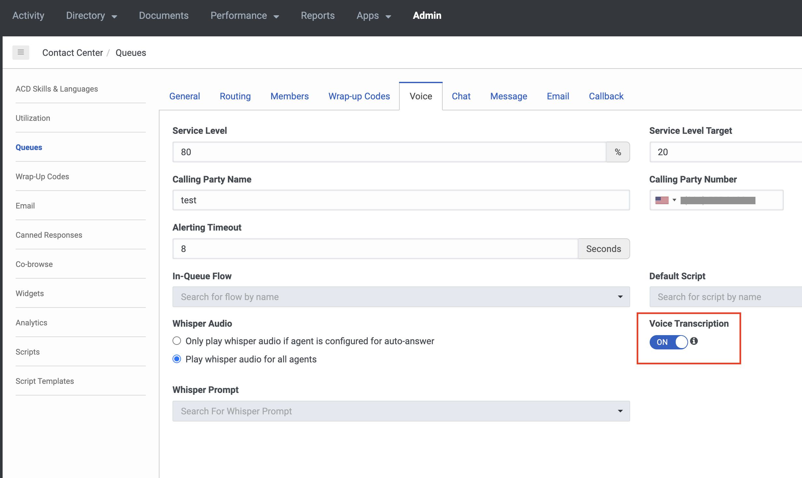
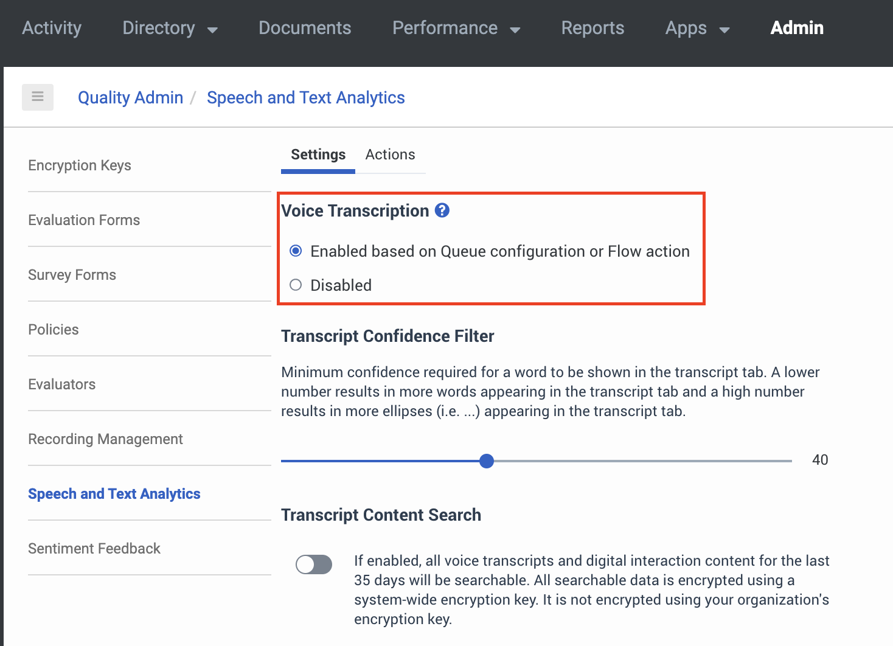

Have you ever wanted to access the transcripts of your Genesys Cloud voice conversations in near-real time? This can now be accomplished using the Genesys Cloud Notification service.  The potential uses for these transcripts are many, and it’s ultimately up to the client how this will fit into his or her project.  However, a recent [developer drop](https://www.youtube.com/watch?v=c6PTEMi__7E) and an upcoming [blueprint](https://github.com/GenesysCloudBlueprints/partial-transcription-blueprint) on this topic aim to shed light on the process of accessing these transcript feeds, integrating them into your project, and an example of how to leverage them.

## Priming Genesys Cloud for the Partial Transcription Integration

This step involves the preliminary setup of the Genesys Cloud application that should be done before adding the integration.  This covers:

- Queue settings
- IVR flow
- Call Routing
- DID assignment
- Agent settings

If you already have your call flows setup you may skip this step, but make sure that 
“Voice Transcription” is enabled in your queues and on the “Speech and Text Analytics” page.

In the queue settings:

On the Speech and Text Analaytics page:

## Developing the Client App Integration
To begin, install the Genesys Cloud Client App Integration. For help installing, see the Genesys Resource Center article ["Set up a Client Application integration
"](https://help.mypurecloud.com/articles/set-custom-client-application-integration/). 
The next step will depend on the client-side language you choose.  The upcoming blueprint on the subject uses a React+TypeScript base, so it requires the [Platform API Javascript Client](https://github.com/MyPureCloud/platform-client-sdk-javascript).  
After installing the [corresponding Platform API Client dependency](https://www.npmjs.com/package/purecloud-platform-client-v2), use the Genesys Cloud Notifications service to subscribe to the partial transcription events of active conversations of your choice.  In the blueprint, the application -- titled the “Active Conversations Dashboard”  -- subscribes to all the active conversations in the organization.

## Potential Use Cases
These feeds of the transcripts of active conversations could be used in a high variety of ways.  The blueprint takes the example of a dashboard that displays the transcripts for active conversations and a “standing” for each based on whether certain pre-defined utterances were spoken.  Here are a couple of other ideas:

- If an agent doesn’t tell the customer about a current special offer in the first minute of the conversation, then send the agent a notification prompting them to mention the offer.

- A dashboard that gathers metrics based on call transcripts.  E.g. - If you want agents to greet all customers with a particular greeting, what is the percentage of calls where said greeting is made by the agent?