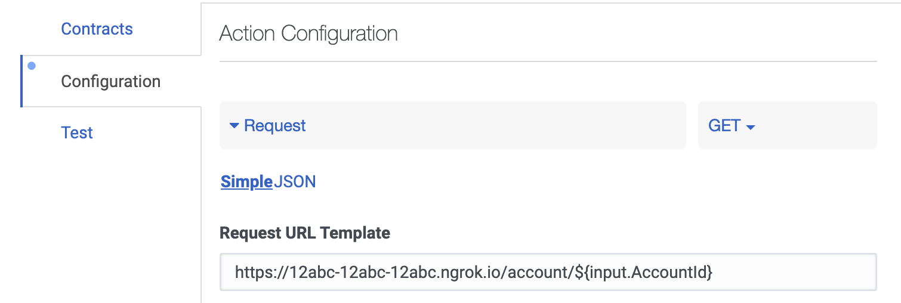
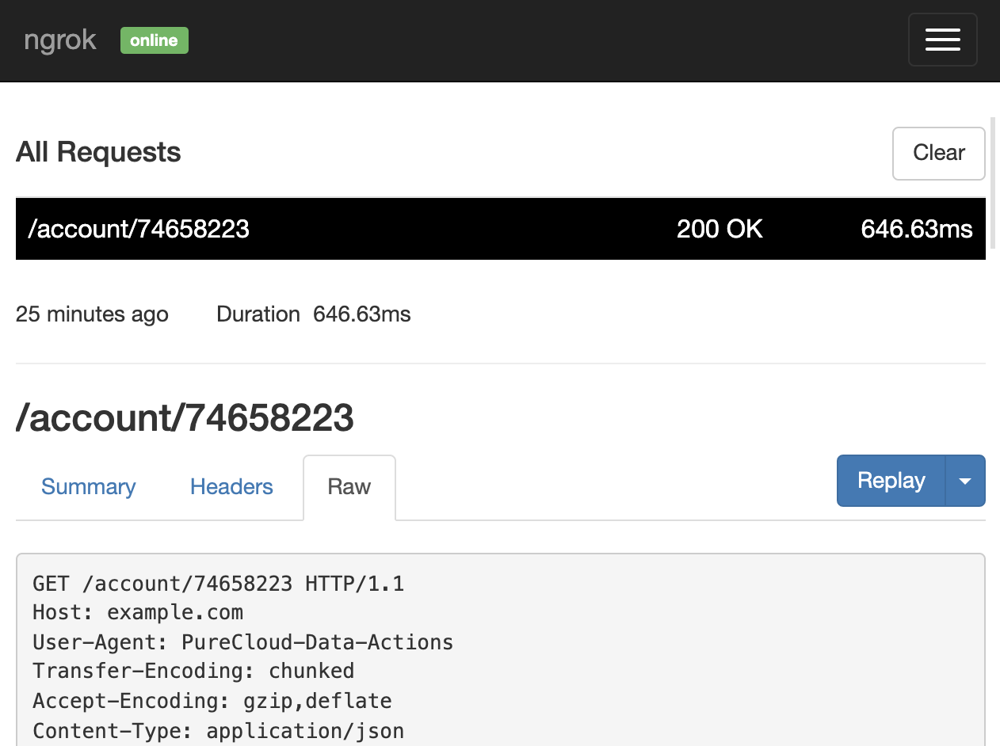

When creating Web Service Data Actions (and their dependent flows) in [Genesys](https://www.genesys.com/) I spent a lot of
time debugging problems around these Data Actions - the main culprit being input values that resulted in unexpected
responses from a downstream API, breaking contracts/mappings. The following is how I sped up diagnosing problems by
spying on the interaction between my Web Service Data Actions and downstream APIs.

**WARNING: The tool used below should never be used to spy on Data Actions that are used by real customers. It
terminates after a fixed period of time, has limited bandwidth and may leak secrets.**

## Overview

We will intercept a Data Action's requests by configuring the Data Action to point at a tunnel created by a
tool called [ngrok](https://ngrok.com/). This tunnel will forward requests to the Data Action's original URL, and
importantly will allow us to inspect any request that passes through it.


## Installing ngrok

Creating the tunnel will require [ngrok](https://ngrok.com/) to be installed locally by following the steps:

1. Follow the [official instructions to install ngrok](https://ngrok.com/download)
2. [Sign up for a free account](https://dashboard.ngrok.com/signup). You'll need this to be able to configure the proxy
3. [Configure ngrok with an auth token](https://ngrok.com/docs#getting-started-authtoken) from the account you set up above

## Creating a tunnel

Create the tunnel by running the following command, configured with the host from the Data Action's URL
```shell
ngrok http -host-header=<host> <host>:<port>
```

- `-host-header=<host>` - Set the [host-header switch](https://ngrok.com/docs#http-host-header) to the host of the Data Action's current URL
- `<host>:<port>` - Set this to the host and port of the Data Action's current URL


### Example

If the Data Action's URL is
```
https://example.com/account/${input.AccountId} 
```

Then the command will be:
```shell
ngrok http -host-header=example.com example.com:443
```

_Port 443 = HTTPS_

## Configuring the Data Action

When you run the ngrok command in the previous step you'll be presented with the output below. Contained within this
output is the randomly generated forwarding address. We will configure our Data Action to use this URL.

```
ngrok by @inconshreveable                                                                                                                                                                   (Ctrl+C to quit)

Session Status                online
Account                       xxxx@xxxx.com (Plan: Free)
Version                       2.3.35
Region                        United States (us)
Web Interface                 http://127.0.0.1:4040
Forwarding                    https://12abc-12abc-12abc.ngrok.io -> https://example.com:443

Connections                   ttl     opn     rt1     rt5     p50     p90
                              0       0       0.00    0.00    0.00    0.00
```

### Update the Data Action's URL

1. Take the forwarding address from output, which in the example above is:
   ```
   https://12abc-12abc-12abc.ngrok.io
   ```
2. Update the Request URL Template in the Data Action to use the forwarding address:
   ```
   https://12abc-12abc-12abc.ngrok.io/account/${input.AccountId}
   ```



## Inspect requests

Now ngrok is running and your Data Action is pointing at ngrok's forwarding address (aka tunnel) you can inspect
HTTP(S) traffic going through it.

Navigate to [http://127.0.0.1:4040/inspect/http](http://127.0.0.1:4040/inspect/http) to see the traffic, or
[follow the official guide](https://ngrok.com/docs#getting-started-inspect).



## Cleanup

When you close ngrok it will also close the tunnel (which is unique each time), so you'll have to revert your
Data Action's URL after inspecting the traffic.

**This article on [troubleshooting Genesys Web Service Data Actions](https://sketchingdev.co.uk/blog/genesys-troubleshooting-data-actions.html)
was originally written for my personal blog, where I'll be writing more articles of this nature. If you have any
suggestions on how I can improve it, or my writing then please let me know [@SketchingDev](https://twitter.com/sketchingdev).**
