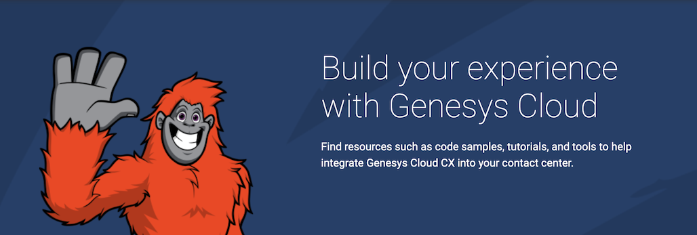
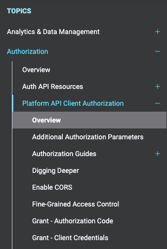
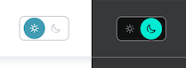

स्वागत छ! Willkommen! Ласкаво просимо! Welkom! Receber! Welcome! The Genesys Cloud Developer Center has a fresh new look, with improved navigation and design, reorganized content, integrated Genesys Cloud sign in, and a preview of the new Developer Tools. Let's take a look!

## Information Architecture

Enhance! _\*typing noises\*_ Enhance! _\*furious typing noises\*_ **ENHANCE!**

We've reorganized all of the site's content into a new _Information Architecture_. This new structure is built on 11 primary topics. The goal of this reorganization is to put similar content nearby in the navigational structure. This is in contrast to the previous approach of grouping content by how a feature is accessed within the platform. Here are the new topics:

* [Analytics & Data Management](/analyticsdatamanagement/) - The Analytics & Data Management category contains content relating to accessing and extracting historical conversation data from Genesys Cloud.
* [Authorization](/authorization/) - The Authorization category contains content about Authorizing custom applications using one of the Genesys Cloud OAuth2 grants.
* [Billing](/billing/) - The Billing category contains content about accessing platform billing data.
* [Communication & Digital Channels](/commdigital/) - The Communication & Digital Channels category contains content about the digital (all non-voice media).
* [GDPR & Privacy](/gdprprivacy/) - The GDPR & Privacy category contains content about GDPR, Org trust, and other regulatory and compliance topics.
* [Notifications & Alerts](/notificationsalerts/) - The Authorization category contains content about real-time notifications, Event Bridge, and general alerting.
* [Organization](/organization/) - The Organization category contains content about org configuration and other larger concepts.
* [Platform](/platform/) - The Platform category contains meta-content about the platform as well as some integration points.
* [Routing & Conversation Handling](/routing/) - The Routing & Conversation Handling category contains content about configuring routing and interacting with conversations.
* [Telephony](/telephony/) - The Telephony category contains content about Edges and related telephony configurations.
* [User & Agent Management](/useragentman/) - The User & Agent Management category contains content about interacting with Genesys Cloud user entites.

## Navigation

The topics above are the primary elements in the new sidebar navigation. The navigation now operates as an expandable tree to allow you to browse through the site's structure more easily. The 11 topics are displayed first on the list and can be drilled down into. Additional resources, such as developer applications (tools), developer blog, blueprints, guide listings, videos, and more can be found under the _Resources_ section below.

## Dark Mode

Are you in a dark basement with a bright display? Well, I am. Click the toggle at the top of the page to enable dark mode. If you've given the app permission to use browser storage, this setting will be remembered for future visits. If you need to enable browser storage, the setting can be found on the account switcher or in the toolbox settings.

## What's that wrench?

Wondering what that wrench is in the bottom-left corner of your screen? It's your [Toolbox](/devapps/about/) where you can find saved [API Explorer](/devapps/about/api-explorer) resources, see incoming real-time [Notifications](/devapps/about/notifications), view saved [Pages](/devapps/about/pages), and access settings for the site. You can sign into Genesys Cloud accounts (even multiple in the same org!) to use these tools using the [Account Switcher](/devapps/about/account-switcher) found in the upper-right corner of the screen. 

:::info
The API Explorer tool is still in beta, but we've chosen to include it in the new site as a preview. Stay tuned for future enhancements!
:::

## Something on your mind?

Do you have something you'd like to tell us? We would love to hear from you! Use the feedback widget at the bottom of any content page (where it says _Was this page helpful?_ and click on an option for the full feedback form), or create a new topic in the [Site Feedback category](https://developer.genesys.cloud/forum/c/site-feedback/3) on the dev forum.
