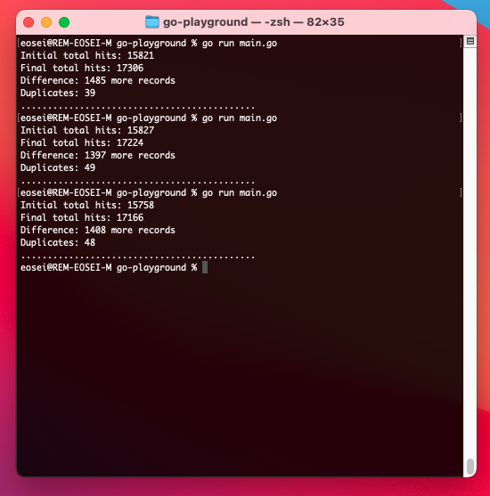
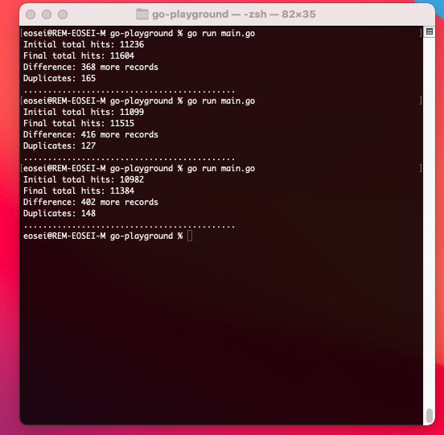

Greetings everyone! `POST /api/v2/analytics/conversations/details/query` is a valid API endpoint to view or monitor conversation details in an organization. It queries conversations extensively based on the desired metrics. Because of the nature of conversation data, the endpoint's responses may sometimes seem unusual. This article describes the irregular endpoint's behavior and suggests ways you can make effective API calls.

For more information on the conversation details query endpoint, see the [Conversations detail query](https://developer.genesys.cloud/analyticsdatamanagement/analytics/detail/conversation-query "Goes to the Conversation details query") page in the Genesys Cloud Developer Center.

## Obvious inconsistency of the Conversation Details Query endpoint

When querying the `POST /api/v2/analytics/conversations/details/query`, the totalHits counter reflects the approximate number of matching conversations for the specified query body. If the interval that covers a date span contains data that receives new traffic from the organization, the totalHits counter can constantly change the value due to data that is continuously fed into the backend in real-time. As a result, if it is necessary to page through result sets, the data deduplication result could be required. Early content pages could appear on a subsequent pull page as the dataset constantly updates. Every API request reproduces data, and the system knows when the request was made. When querying an interval that receives new information, the totalHits count and contents of the particular pages change with the latest data.

To receive real-time data, use the [Notifications](https://developer.genesys.cloud/analyticsdatamanagement/analytics/notifications "Goes to the Notifications page") where applicable.

## Demonstration of API behavior

To briefly demonstrate the behavior, a simple code snippet calls the conversation detail query endpoint to collect the Mean Opinion Score (MOS) of the conversations from ten minutes ago. [MOS](https://developer.genesys.cloud/analyticsdatamanagement/analytics/detail/call-quality#mean-opinion-score--mos- "Goes to the MOS page") is a measure of audio quality at a specific measurement point of voice interaction.

```go
func getMos() {
    pageNumber := 1

    //Maximum number of records per page
    pageSize := 200

    currentTime := time.Now()

    //interval for past 10 minutes
    interval := fmt.Sprintf("%v/%v", currentTime.Add(time.Minute*-10).Format(time.RFC3339),currentTime.Format(time.RFC3339))

    queryBody := platformclientv2.Conversationquery{
        Interval: &interval,
        ConversationFilters: &[]platformclientv2.Conversationdetailqueryfilter{
            {
                VarType: platformclientv2.String("and"),
                Predicates: &[]platformclientv2.Conversationdetailquerypredicate{
                    {
                        Dimension: platformclientv2.String("mediaStatsMinConversationMos"),
                        Operator:  platformclientv2.String("exists"),
                    },
                },
            },
        },
        Paging: &platformclientv2.Pagingspec{
            PageSize:   &pageSize,
            PageNumber: &pageNumber,
        },
    }

    //Api call to get initial totalHits
    conversations, _, err := analyticsApi.PostAnalyticsConversationsDetailsQuery(queryBody)

    if err != nil {
        log.Println(err)
        return
    }

    duplicates := 0

    initialTotalHits := *conversations.TotalHits

    //To check for duplicates
    collectedConversations := make(map[string]float64)

    for {
        api_response, _, err := analyticsApi.PostAnalyticsConversationsDetailsQuery(queryBody)

        if err != nil {
            log.Println(err)
            return
        }

        if api_response.Conversations == nil {
            break
        }

        for _, v := range *api_response.Conversations {

            conversationMosScore := *v.MediaStatsMinConversationMos

            _, exists := collectedConversations[*v.ConversationId]

            if !exists {
                collectedConversations[*v.ConversationId] = conversationMosScore
            } else {
                duplicates++
            }
        }

        pageNumber++
    }

    fmt.Println("Initial total hits:", initialTotalHits)
    fmt.Println("Final total hits:", len(collectedConversations))
    fmt.Println("Difference:", len(collectedConversations)-initialTotalHits, "more records")
    fmt.Println("Duplicates:", duplicates)
    fmt.Println("............................................")
}

```

The following illustration shows the output of the preceding code after a couple of runs. 



Some differences exist between the initial total hits and the final ones.

After a few changes, the query body returns the following results:



In this example, the total hits are smaller, and the processing time is faster. There are duplicate records in both cases. For example, a record that is included on the fourth page during a request may end up on the fifth page during a later request, causing it to appear duplicated. This happened because of the indefinite update of the response on the server. The following section shows how to improve the response.

## Recommended practices to improve response consistency

- Include `conversationEnd` filter in your query to avoid ongoing conversations.
- Avoid including the current time in the interval. For example, when you are querying conversations from the past 30 minutes, make the interval `time.now()-30min/time.now()-1min`.

The main idea is to narrow the query request. A specific query request results in a more consistent response and reduces processing time, especially if you have a huge dataset. For more information, see [here](https://developer.genesys.cloud/analyticsdatamanagement/analytics/detail/#performance-tips "Goes to the Introduction page") in the Genesys Cloud Developer Center.


## Additional resources

- [Conversations Detail Query](https://developer.genesys.cloud/analyticsdatamanagement/analytics/detail/conversation-query "Goes to the Conversations Detail Query page") in the Genesys Cloud Developer Center.

- [Notifications](https://developer.genesys.cloud/analyticsdatamanagement/analytics/notifications "Goes to the Notifications page") in the Genesys Cloud Developer Center.


## Feedback

If you have any feedback or questions, contact us on the [Genesys Cloud Developer Forum](https://developer.genesys.cloud/forum/ "Goes to the Genesys Cloud Developer Forum").