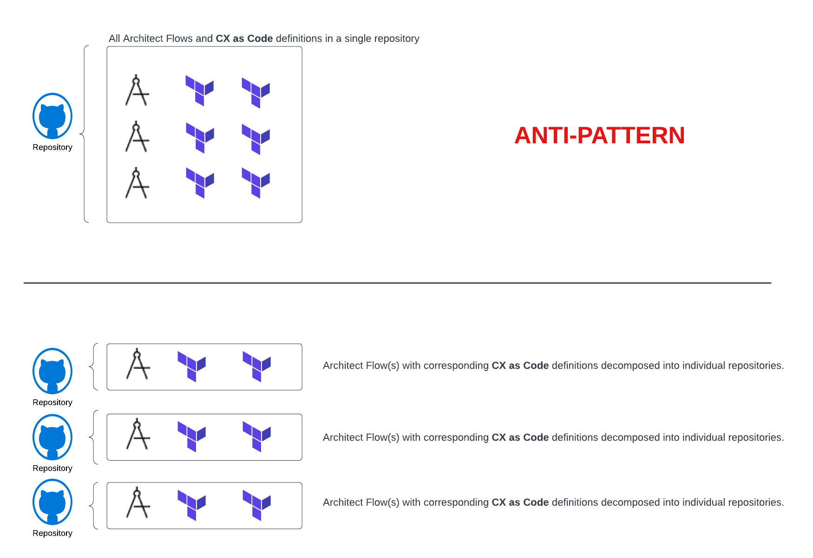
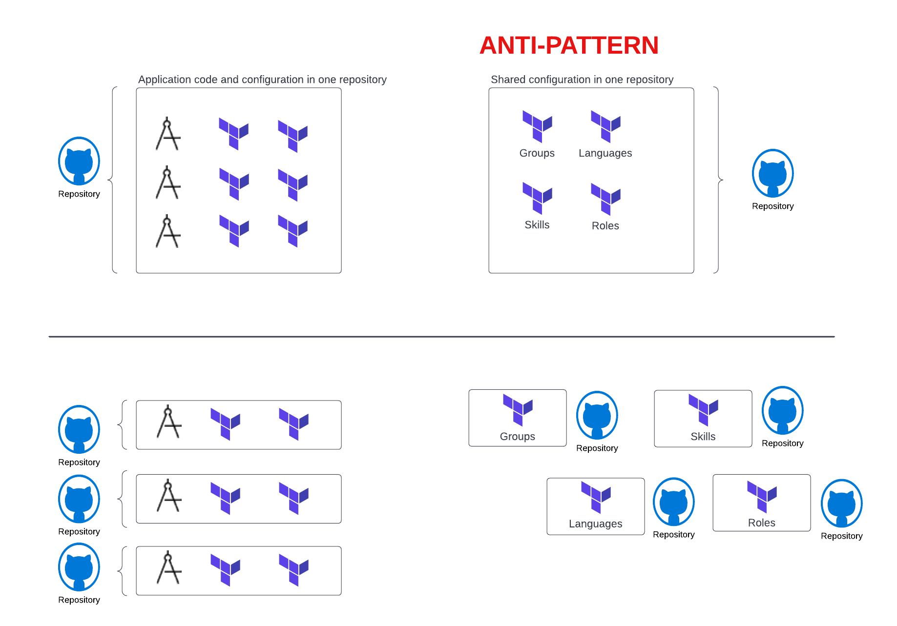

Greetings everyone! 2022 has flown by. Today, I want to talk about DevOps best practices and how they can be applied to your **CX as Code** implementations. While many developers and administrators are excited by the control and capabilities that **CX as Code** gives, if they are new to the DevOps world, they often miss the context of what makes DevOps practices and tools like **CX as Code** successful. This article discusses the six best practices to consider when using **CX as Code** in your environment. We will discuss:

- No infrastructure monoliths
- Source control is the source of truth
- Minimize shared infrastructure between components
- Whenever possible, move forward, don't roll back
- Know your CI/CD tools
- Start small and iterate

## No infrastructure monoliths
One of the common mistakes new DevOps practitioners make is that they put all of their infrastructure declarations for **CX as Code** in one or two large Terraform projects. These projects are managed from a single source control repository. This is problematic for two reasons:

1. **You have created a single monolithic infrastructure where changes to one part of your CX infrastructure need the entire CX infrastructure to be deployed at the same time**. This means that if multiple teams work within your Genesys Cloud environment and the source code repositories, their changes must be deployed in lockstep. This is because all of your CX as Code definitions stay in the same repository. This is problematic because if you try to roll back a change, you roll back not only your change, but any other changes deployed at the same time your change was sent. Different teams operate at different deployment velocities, and tying all of these teams together under a single source control repository can be an absolute productivity killer.
2. **It is easy to create implicit cross-component dependencies because your entire CX infrastructure is defined in a single project. As a result, developers can easily reference another component, for example, a queue, skill, language, etc., without thinking through the implications of the changes they are making.** It is therefore necessary to have long test cycles to do regression testing of the entire infrastructure. A change made by one developer can easily disrupt or break multiple components within your CX infrastructure.

Organize your CX infrastructure into small deployable units of work that mirror the natural communication structure of your organization. If different Lines of Business (LOB) or functional areas work on a system, their respective software components should mirror their organizational structure: each group has a separate repository and code deployment pipeline. This is often referred to as [Conway's law](https://en.wikipedia.org/wiki/Conway%27s_law "Goes to Conway's law page").

Conway's law can be applied by starting with the Architect flows that represent your organization's natural division of responsibility. Analyze the infrastructure that each Architect flow consumes, for example, queues, data actions, etc., then map out the Architect flow definitions and components in **CX as Code**. Maintain a separate source control repository for each architect flow and related artiifacts, and deploy it independently.

## Source control is the source of truth
**CX as Code** can be used to manage components of your Genesys Cloud infrastructure. However, you must ensure all changes to those components are managed and deployed using your source control system. Developers are tempted to log into the console during an outage or when a change needs to be made to a business partner.

By giving in to this temptation, you introduce configuration drift and begin an endless cycle of trying to keep your environments in sync. At first, this might not seem like a big deal. It is okay to say "hey we can circle back around and ensure we include this change in our **CX as Code** definitions." Hey, people get busy, they are not infallible, and change does not come automatically. As a result, you suddenly find your environments out of sync, and your business partners loses confidence in the overall integrity of the systems.

**CX as Code** is built upon Terraform, which expects to be the sole maintainer of the state of the objects that it owns. If you manually modify a Terraform-managed object and then run your Terraform script, Terraform reverts the object to its initial state. For example, you create and manage a queue through Terraform. Then you log into the console and add additional routing rules to the queue. You will lose manual routing rules the next time you deploy your queue through your CI/CD pipeline. This is because you do not add those configuration changes to your **CX as Code** definitions. Don't manually modify Terraform-managed objects: it can cause an outage.

:::{"alert":"Warning","title":"Symptoms of an anti-pattern: source control is not the truth","autoCollapse":false}
In **CX as Code** you cannot "snapshot" a specific version and use that snapshot to "roll back" to that version in a different organization. There is almost always some form of manual work to "sync" the organizations.

In order to make changes in Genesys Cloud, you have to constantly "snapshot" your production environment and sync it to your development and test environments. To drive changes, a DevOps practitioner uses source control. This ensures the integrity of development, test, and production environments.

**Note**: THere is a good [blog post](https://www.hashicorp.com/blog/detecting-and-managing-drift-with-terraform "Goes to the Detecting and Managing Drift with Terraform") that discusses how to detect and fix configuration drift in one environment.
:::

Consider the following points:

* **It is recommended that you use your Genesys Cloud development organization as a sandbox to try out new things. Once your developers have manually experimented with something, they should put their Architect flows, and CX as Code definitions under source control management and delete their manual configuration.** It is always best to manage infrastructure changes via source control and a deployment pipeline. 
* **Make sure only a few people can make changes to your test and production environments. Most organizations fail to build out their access control systems (especially in lower-level environments) and leave the environment open so that changes can be implemented quickly without properly planning for them.** Although this practice is convenient from a convenience standpoint, it can undermine your confidence in your environment's consistency.
* **Don't change your test/prod environment via the console.** You shouldn't do this unless it is a "break glass" event. Develop the habits and discipline within your development organization so that "anything under **CX as Code** management must be deployed via your deployment pipeline." Also, create a documented playbook to ensure emergency production changes are backported to your **CX as Code** definition. 
* **CX as Code should not be used for all aspects of your Genesys Cloud environment**. Things that change multiple times a day should not be placed under **CX as Code** management because they need to be handled through your deployment pipeline. For example, if a queue assignment for an agent changes multiple times a day, you probably want to define your queue definitions in **CX as Code**. Understanding the rate of change of data is critical to deciding whether **CX as Code should manage a configuration**.
* **Let's automate, automate, automate. A CI/CD pipeline shouldn't include manual steps.** Once code is committed to your source control repository, the robots; aka your deployment scripts handle everything. Any manual file movement should be avoided in your development/test/production pipeline. You should not move files manually anywhere in your dev/test/production pipeline. Don't let this temptation to not automate enter your mind because every human involved in the pipeline leaves the possibility of mistakes. 

## Minimize shared infrastructure components
Reduce the number of components shared between your Architect flows as you tease apart configurations. This practice prevents deployment dependencies. Also, don't hesitate to deploy redundant components such as skills, groups, and queues that might overlap across flows. Maintaining these definitions locally makes deploying individual flows much easier, even though you might end up with duplicate definitions. The following items should also be considered about shared dependencies:

* **Organize dependencies that share a high degree of cohesion into one repository**. It is not a good idea to mix **CX as Code** resources in the same repositories. It creates artificial deployment dependencies. For example, you could create a skills repository with all the skills definitions and centrally manage them. The following diagram illustrates how to separate dependencies by their repositories:

* **Remember: Managing shared dependencies separately from the objects that consume them** means that they can be deployed sooner, often with minimal risk. For example, you can deploy Genesys Cloud language definitions independently of the flows and scripts that consume them. Get these changes out often.
* **Changes to shared resources should be made using a pull request model.** Shared resources are often centralized and accessible only to the designated team members. Unless the shared resources are very sensitive, for example, credentials management, use your source control system's pull request mechanism. This enables anyone to branch the code, make changes, and submit a pull request. Changes should be reviewed and merged into the master branch by the designated team. It is important for teams that need to update their resources to do the actual work.

## Avoid rolling back whenever possible
**CX as Code** does not support rolling back environments to a specific "snapshot" version. If you discover a problem in your deployments, I highly recommend a "move forward" model where you fix the problem in the lower environments and then promote and deploy the fix to the production environments. You should keep these things in mind if you need to roll back:

* **Use your source control system** to tag your builds each time they are deployed to production. You can roll back the source control repository by redeploying the tagged version.
* **If you are not deploying to the previous version, ensure you understand what has changed between the production releases.** Run a Terraform plan command before rolling back, making sure you do not lose resources created between the current and previous versions.
* **Automate testing as part of your deployment pipeline.** Whenever possible, run automated tests after deployment to test your code and infrastructure. Automate these tests in your production environment. These automated tests give you a quick feedback loop that confirms your deployment worked. As a result of automated tests, you are less likely to make quick decisions (such as making changes via the console) since they uncover deployment issues quickly and you are under pressure to fix them during critical business hours.

## Get to know your CI/CD tools 
Genesys Cloud's **CX as Code** platform provides low-level primitives for developing CI/CD deployment solutions. There are no shrink-wrapped Disaster Recovery (DR), backup, or migration tools included in this set of primitives. These tools can be used to help build these solutions, but they must be customized for your organization, are time-consuming to develop, and must be tested regularly. Do not make assumptions about **CX as Code** (or any CI/CD tool). Though DevOps and CI/CD practices can provide you with a high level of stability and confidence, they do not eliminate or minimize the need for IT professionals. The practice of DevOps is part of IT, not a replacement for it.

## Iterate and start small 
Do not use **CX as Code** to manage your entire infrastructure until you and your development team are comfortable with it. I often advise new DevOps teams to start small and iterate with one Architect flow and one piece of infrastructure. Get a sense of what you want to manage and figure out how to deploy that infrastructure from the development environment to the production environment. You should understand not only how to deploy a solution but also how to roll it back if it fails. Learn and iterate as you begin your **CX as Code** journey. You will make mistakes along the way, but it is better to make small mistakes rather creating a monolith that adds complexity, not value.

## Additional resources
* [CX as Code](https://developer.genesys.cloud/devapps/cx-as-code/ "Goes to the CX as Code page") in the Genesys Developer Center.
* [Genesys Cloud Provider](https://registry.terraform.io/providers/MyPureCloud/genesyscloud/latest/docs "Goes to the Genesys Cloud Provider page") on the Terraform website. 
* [Introducing CX as Code](/blog/2021-04-16-cx-as-code/ "Goes to Introducing CX as Code blog repository") in GitHub. 
* [DevCast Tutorial 19: Managing your Customer Experience as Code: Introducing CX as Code](https://www.youtube.com/watch?v=21p6hDFipKY&t=1470s "Goes to DevCast Tutorial 19: Managing your Customer Experience as Code: Introducing CX as Code video") on YouTube. 
* [Deploy a simple IVR using Terraform, CX as Code, and Archy](https://github.com/GenesysCloudBlueprints/simple-ivr-deploy-with-cx-as-code-blueprint "Goes to Deploy a simple IVR using Terraform, CX as Code, and Archy blueprint repository") in GitHub.
* [Classify and route emails with Amazon Comprehend blueprint](https://developer.genesys.cloud/blueprints/email-aws-comprehend-blueprint/ "Goes to Classify and route emails with Amazon Comprehend blueprint repository") in the Genesys Cloud Developer Center. 
* [Build a CI/CD pipeline using GitHub Actions, Terraform Cloud, CX as Code, and Archy blueprint](/blueprints/cx-as-code-cicd-gitactions-blueprint/ "Goes to Build a CI/CD pipeline using GitHub Actions, Terraform Cloud, CX as Code, and Archy blueprint") in GitHub.
* [Conway's Law](https://en.wikipedia.org/wiki/Conway%27s_law "Goes to the Conway's law article") in Wikipedia.
* [How to begin your CX as Code Journey](https://github.com/MyPureCloud/developer-center-blog/blob/master/source/2021-10-10-treating-contact-center-infrastructure-as-code/index.md "Goes to How to begin your CX as Code Journey blog") in GitHub.

## Feedback
If you have feedback or questions, please contact us on the [developer forum](/forum/).
