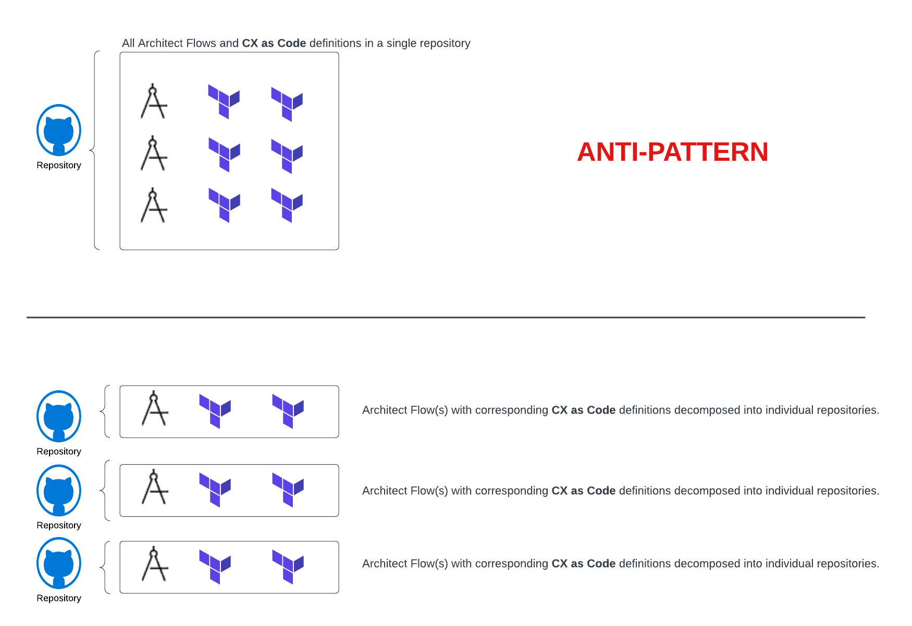
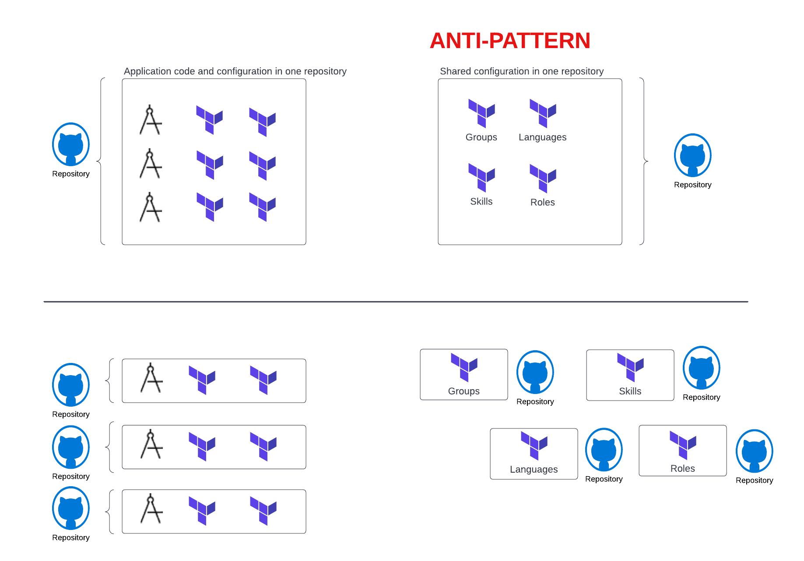

Greetings everyone! 2022 is flying by. The year is almost half-gone. Today I want to spend sometime talking about DevOps best practices and how they can be applied to your **CX as Code** implementations. While many developers and administrators are excited by the control and capabilities that **CX as Code** provides, if they are new to the DevOps world, they often miss the context of what makes DevOps practices and tools like **CX as Code** successful. In this article, we are going to talk about the 6 best practices you should consider as you begin leveraging **CX as Code** within your own environments.  Specifically, we are going to cover:

1. No infrastructure monoliths
2. Source control is the source of truth
3. Minimize shared infrastructure between components
4. Whenever possible, move forward, don't rollback
5. Know your CI/CD tools
6. Start small and iterate

## No infrastructure monoliths

One of the more common mistakes I see people make is that put all of their infrastructure declarations for **CX as Code** as one or two big Terraform project all managed from a single repository. This is problematic for two reasons:

1. **You have created a single monolith infrastructure where changes to one part of your CX infrastructure require the entire CX infrastructure to be deployed at the same time**. This means that if you multiple project teams working within your Genesys Cloud environment, they must deploy in lockstep because all of your CX as Code definitions reside in the same repository. This is particularly problematic because if you to rollback a change, it rolls back everyone's changes that were made environment. Different teams operate at different deployment velocities and this type of behavior can be productivity killer.

2. **It is easy to create implicit cross-component dependencies because your entire CX infrastructure is defined in a single project and as a result developers can easily reference another component (e.g. a queue, skill, language, etc..) without thinking through the implications of the changes they are making.** This means that you need to have long test cycles to do regression testing and one developer's change can easily disrupt or break multiple components within your CX infrastructure.  

To this end, decompose your CX infrastructure down into small deployable units of work that mirror the natural communication structure of your organization. This is often referred to an Conway's law. This means that if you multiple Lines of Business (LOB) or functional areas working on a system, they should mirror their components around that organizational structure and have separate repositories and code deployment pipelines rather then a single monolithic repository.  

In many Genesys Cloud environments, you need to start with your Architect flows.  Your Architect flows represent a natural division of responsibility within your organization. Take each of your Architect flows and map out the infrastructure they consume (e.g. queues, Data Actions, etc...).  Then place the Architect flow definitions along with the components they consume and map them out in CX as Code. These items should then be placed in their own source control repositories and deployed independently of one another.

The diagram below illustrates

This way different pieces of code (e.g. your flows) can be deployed independently of one another.

## Source control is the source of truth
This is one of the hardest changes for many organizations to make. If you are going to use **CX as Code** to manage a piece of your Genesys Cloud infrastructure, you need to ensure that all changes to that infrastructure are managed through the source control system **and** all changes are deployed from the source control system. In an outage situation or even when your developers are in a hurry to make a change on the behalf of their business partners, the temptation is there to just login to the console and make the change.

By doing this, you are introducing configuration drift and you begin an endless cycle of trying to keep your environments in sync. One of the most common symptoms of this when you have to constantly "snapshot" your production environment and sync it back your development and test Genesys Cloud accounts.

Here are some key things to think about:

1. **Your development Genesys Cloud environment should be a sandbox to try things out. Once your developers have manually experimented with something, they should put their Architect flows and CX as Code definitions under source control management and then delete their manual configuration.** Infrastructure changes should always be managed via source control and a deployment pipeline. 

2. **Lockdown your test and production environments so that only a very, very small number of people can make changes. Too often organizations do not take time to properly build out their Access Control and leave the environment open so that changes can be made quickly.** While this is a tempting practice from a convenience perspective, it can ruin the confidence you have that your environments are consistent.

3. **Avoid the temptation to make changes in your test/prod environment via the console.** Seriously, don't do this unless it is "break glass" event. You need to build the behaviors and discipline within your development organization that enforces "anything under **CX as Code** management needs to be deployed via your deployment pipeline."

4. **Not everything in your Genesys Cloud environment should be managed with CX as Code**. Things that change multiple times a day should not be put under **CX as Code** management because those changes will need to be handled via your deployment pipeline. For example, if you work in an environment where agent queue assignments can change multiple times a day you probably want to define your queue definitions in **CX as Code**, but not map your agents to queues in your **CX as Code** definitions.  Understanding the velocity in which data changes is key to determining whether or not a configuration should be managed by **CX as Code**.

5.  **Automate, automate, automate. There should be no manual parts to your CI/CD pipeline.** Once code is committed to your source control repository, the robots (aka your deployment scripts). There should be not manual movement of files anywhere in your dev/test/production pipeline. This would seem to be a intuitive statement, but I have frequently found that many organizations will automate to 80% of their pipeline and then not finish the last 20% of automation because it is difficult to do. Avoid this temptation to not automate because every time a human being is in involved in your pipeline, there is an opportunity for mistakes. 

## Minimize shared infrastructure components
As you tease apart configurations minimize the amount of shared components between your Architect flows. Minimizing these shared dependencies avoids deployment dependencies. Also, don't be afraid to deploy redundant components like skills, groups or queues that might overlap across flows. While you might end up with duplicate definitions and it can complicate reporting, maintaining these definitions locally makes it much easier to deploy individual flows.  A few other items to consider about shared dependencies:

1. **Group shared dependencies with high cohesion into the same repository**. For example, if you have skills that are used across multiple flows create a skills repository with all of your skills definitions and maintain them centrally.  Don't intermix different shared CX as Code resources together in the same repositories. This creates artificial deployment dependencies.  The diagram below illustrates how to tease apart shared dependencies into their own repositories:

2. **Remember many shared dependencies can be deploy independently of the things consuming them and get often be deployed ahead of time with minimal risk**. So for instance, if you have a shared definition of languages, the language changes can often be deployed independently of the flows or scripts consuming them. Deploy these changes frequently and get those changes out there.

3. **Use a pull request model for changes to shared resources**. Often times organizations will centralize control of shared resources and only allow those resources to be directly changed by that group. Unless the resources are extremely sensitive (e.g. credentials management), leverage your source control system's pull request system to allow the individuals who want the change to branch the code and submit a pull request. The centralized group should be responsible for reviewing the changes and merging them into the master branch. The actual work of doing the configuration should go to the team doing the work.

## Whenever possible, move forward, don't rollback
**CX as Code** (and the Terraform project it is built on) does not have the concept of environmental snapshots and the ability to rollback code to a specific version. If you discover a problem in your deployments, I highly recommend a "move forward" model where you make the fix in your lower environments and then promote and deploy the fix to the production environments. If you do need to rollback to a previous version keep the following in mind:

1. **Leverage your source control system.** Each time you deploy to production tag your build. If you need to rollback, redeploy that version of the source control repository. 

2. **If you are not deploying back to the previous version of your configuration, make sure you understand what has changed between between the production releases**. Run a `terraform plan` before doing the rollback and make sure you don't inadvertently drop a resource that was created between releases. 

3. **Leverage automated testing as part of your deployment pipeline.** Whenever possible kickoff automated tests to check your code and infrastructure after it has been deployed. This includes in production. These automated tests provide a quick feedback loop that your deployment worked and reduces the risk of making hasty decisions (e.g. using the console to make changes) because you are under pressure to fix an issue during critical business hours.

## Know your CI/CD tools 
**CX as Code** is a set of low-level primitives for building CI/CD deployment solutions with Genesys Cloud. It is not a shrink-wrapped Disaster Recovery (DR), backup, or migration tool. It can be used to help build these type of solutions, but this type of tooling will need to be specific to your organization, takes time to be developed and must be tested on a regular basis. Do not make assumptions about how **CX as Code** (or any CI/CD tool) works. While DevOps and CI/CD practices can provide a high-level of stability and confidence in your environment, they do not eliminate or minimize the need for IT folks. DevOps is a practice within IT, not a replacement for it.

## Start small and iterate
Do not try to manage your entire infrastructure using **CX as Code** until you and your development staff have become comfortable with it and have experience with it. I often advise teams new to DevOps to start small and iterate with one piece of infrastructure. Get a feel for what you want to manage and figure out how to deploy that one piece of infrastructure from the development environment to production. Make sure you understand how to not only deploy a solution, but also how to roll it back. As you begin your **CX as Code**
journey iterate and learn.  Mistakes will be made, but it is better to make small mistakes along the way then try to "go big" and then find out you have created a monolith that does not add value, but instead adds complexity.

## Resources

## Feedback

If you have any feedback or questions, please reach out to us on the [developer forum](/forum/).
