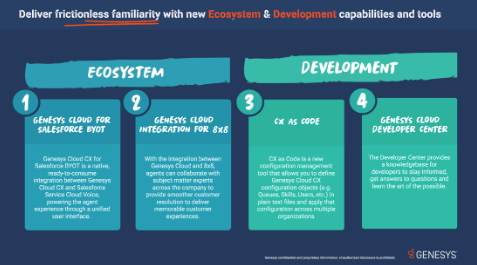
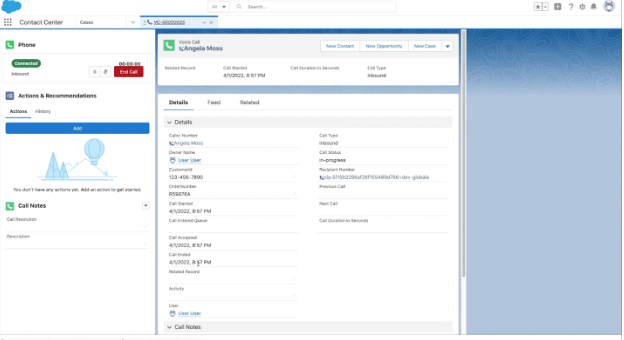
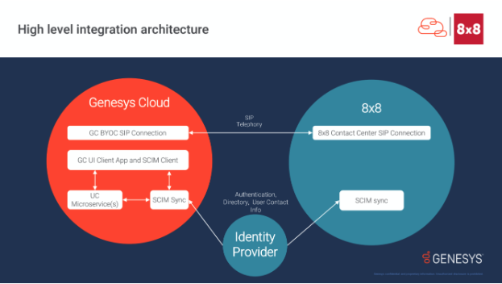
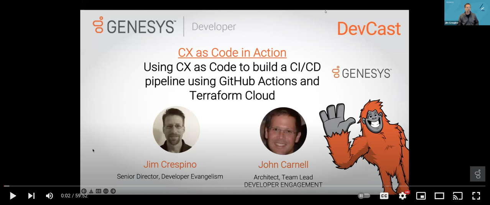
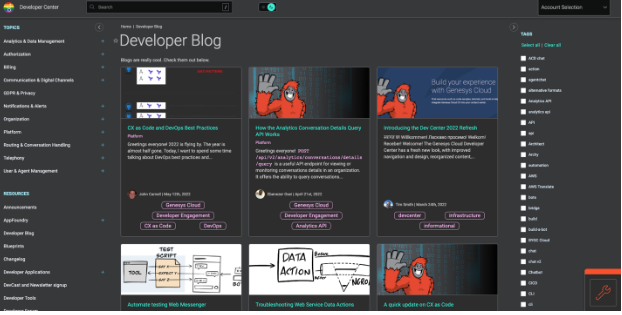

Xperience is something I look forward to every year as I love meeting with our customers and partners. As I put in my blog last year being virtual has been bittersweet as it's great to share information on what we are doing, but I really miss those personal conversations and look forward to hopefully being able to meet everyone in person next year! 

For those of you that found this blog from my Xperience session, I hope you found the session helpful. For those that have not watched my on-demand session this year, I had the opportunity to co-present “What’s Next in Your CX Ecosystem?” with my amazing colleague Sam Rector where we detailed the latest and greatest pre-built integrations and dev tools that your teams can leverage to co-create unique experiences at scale. 

*CX Ecosystem and Development*

With the session being only 10 minutes long, I thought it would be helpful to dive a little deeper into each of these ecosystem and development tools, provide some demo videos, sneak-peak screenshots, diagrams, and helpful links. Let’s get started! 

## Genesys Cloud for Salesforce SCV BYOT 

This is a ready-to-consume, packaged integration that utilizes the Genesys Cloud CX platform to power the Service Cloud Voice agent experience and user interface. With Genesys Cloud for Salesforce BYOT, agents in Service Cloud will have a complete view of the customer and their request in conjunction with the advanced voice capabilities from Genesys Cloud CX to deliver a consistent and efficient service experience. 

*Integrated Call Controls and Customer Data*

*Presence and Field Mapping*

Core interaction management functionality including setting status and receiving ACD calls, customized screen pops, call transfers, After Call Work (ACW), call on-behalf of queue, unified user management and Salesforce Single-Sign-On (SSO) will be included at launch. If you’re interested in participating in the beta program, apply [here](https://forms.office.com/pages/responsepage.aspx?id=nOZceM-Qx02ogurzEtHRXXSwA6VEC1xJjOIycYysvt5UQzFDUEM5TE5POU0wQks2STBVMjhDNzNMNy4u).

## Genesys Cloud Integration for 8x8 
Back in April, Genesys and 8x8 jointly announced a new product integration between 8x8 Work and Genesys Cloud CX. By combining 8x8 Work's enterprise voice, video meetings and team chat capabilities with the composable Genesys Cloud CX platform, organizations can drive all employee communication and collaboration needs across voice and digital channels for the entire enterprise.  

There are two key components to the integration; first is a SIP integration between the two platforms using a Genesys Cloud BYOC External Trunk. With this, you can transfer voice interactions in either direction between the two platforms without incurring PSTN charges. The second is a SCIM integration for user synchronization–choose an identity provider and import users into both Genesys Cloud and 8x8. User data will routinely sync between the two platforms to ensure consistency.   

To learn more about 8x8 Work and our integration, check out the [AppFoundry listing](https://appfoundry.genesys.com/filter/genesyscloud/listing/9fe7898a-c518-4ce6-9cce-862a9a8a29b6). 

## CX as Code 

[CX as Code Video](https://www.youtube.com/watch?v=cFNI-lOHaBI&ab_channel=GenesysCommunity)

One of the newer tools in the Genesys Cloud developer ecosystem, CX as Code is a configuration management tool that allows you to define Genesys Cloud configuration objects (e.g. Queues, Skills, Users, etc) in plain old text files and then apply that configuration across multiple Genesys Cloud organizations. It’s ideally suited for use in a CI/CD deployment pipeline, which I would highly recommend if you aren’t employing such a method already. It’s been very exciting to see organization using CX as Code to help ensure that their innovative CX configurations are applied consistently across multiple Genesys Cloud organizations.  

To learn more about how to get started with CX as Code, check out this [blog]. 

## Genesys Cloud Developer Center 
Welcome, you’re already here! On the Developer Center, you’ll find technical content for Genesys Cloud developers like new release announcements, blogs, tutorials, how-to guides, access to dev tools, and more. Recently, we gave the Developer Center a new, modern look and feel (with Dark Mode!) that we hope our technical users will love. This includes a new information architecture, improved navigation and design, integrated sign-in, dev toolbox, an integrated application inspector, and last, but certainly not least, dark mode. Just hit that toggle at the top of your screen and start exploring!  

