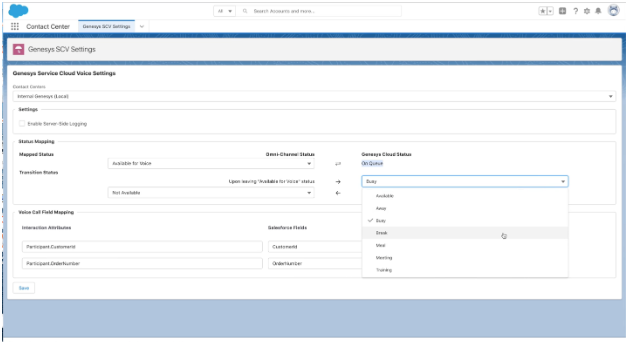

I look forward to Xperience every year, meeting our customers and partners. Although virtual has been bittersweet, sharing what we do has been excellent. I miss conversations and look forward to hopefully meeting everyone personally next year! 

I hope you found this session helpful from my Xperience session. For those that have not watched the on-demand session, I had the opportunity to co-present "What's next in your CX Ecosystem?" with my amazing colleague Sam Rector. We detailed the latest and greatest pre-built integrations and dev tools your teams can use to co-create unique experiences at scale. 

With only a 10-minute session, I thought it would be helpful to dive deeper into each of these ecosystem and development tools and provide some demo videos, sneak-peak screenshots, diagrams, and useful links. Let's get started! 

## Genesys Cloud for Salesforce SCV BYOT 

This packaged integration uses the Genesys Cloud CX platform to power the Service Cloud Voice agent experience and user interface. With Genesys Cloud for Salesforce BYOT, agents in Service Cloud have a complete view of the customer and their request with the advanced voice capabilities from Genesys Cloud CX to deliver a consistent and efficient service experience. 

At launch, the Core interaction management functionality includes setting status and receiving ACD calls; customized screen pops, call transfers, After Call Work (ACW), call on behalf of the queue, unified user management, and Salesforce Single-Sign-On (SSO). If you are interested in participating in the beta program, apply [here](https://forms.office.com/pages/responsepage.aspx?id=nOZceM-Qx02ogurzEtHRXXSwA6VEC1xJjOIycYysvt5UQzFDUEM5TE5POU0wQks2STBVMjhDNzNMNy4u "Goes to the Genesys Cloud CX for Salesforce - Service Cloud Voice - Limited Availability access request page") in the Genesys Cloud website.

## Genesys Cloud Integration for 8x8 
A new product integration between 8x8 Work and Genesys Cloud CX was announced in April. By combining 8x8 Work's enterprise voice, video meetings, and team chat capabilities with the composable Genesys Cloud CX platform, organizations can drive all employee communication, and collaboration needs across voice and digital channels for the entire enterprise.
 
There are two key components to the integration; the first is a SIP integration between the two platforms using a Genesys Cloud BYOC External Trunk. You can transfer voice interactions in either direction between the two platforms without incurring PSTN charges. The second is a SCIM integration for user synchronization–choose an identity provider and import users into Genesys Cloud and 8x8. User data routinely sync between the two platforms to ensure consistency.   

To learn more about 8x8 Work and our integration, check out the [AppFoundry listing](https://appfoundry.genesys.com/filter/genesyscloud/listing/9fe7898a-c518-4ce6-9cce-862a9a8a29b6 "Goes to the Genesys Cloud CX for Salesforce - Service Cloud Voice - Limited Availability access request page") in the Genesys Cloud website. 

## CX as Code 

[CX as Code video](https://www.youtube.com/watch?v=cFNI-lOHaBI&ab_channel=GenesysCommunity "Goes to the DevCast Tutorial 24 | CX as Code in Action: Building Contact Centers via CI/CD Pipelines video") in YouTube.

A new configuration management tool in the Genesys Cloud developer ecosystem, CX as Code allows you to define Genesys Cloud configuration objects (e.g., queues, skills, users, etc.) in plain text files and then apply that configuration across multiple Genesys Cloud organizations. It is ideally suited for use in a CI/CD deployment pipeline, which I highly recommend if you are not employing such a method. It has been exciting to see organizations using CX as Code to help ensure their innovative CX configurations are applied consistently across multiple Genesys Cloud organizations.  

To learn more about how to get started with CX as Code, check out this [blog](/blog/2021-04-16-cx-as-code/). 

## Genesys Cloud Developer Center 
Welcome, you are already here! On the Developer Center, you find technical content for Genesys Cloud developers, like new release announcements, blogs, tutorials, how-to guides, access to dev tools, and more. Recently, we gave the Developer Center a fresh, modern look and feel (with Dark Mode) that we hope our technical users love. This includes a new information architecture, improved navigation and design, integrated sign-in, a dev toolbox, an integrated application inspector, and, last but not least, dark mode. Just hit that toggle at the top of your screen and start exploring!  

I look forward to Xperience every year, meeting our customers and partners. Although virtual has been bittersweet, sharing what we do has been excellent. I miss conversations and look forward to hopefully meeting everyone personally next year! 

I hope you found this session helpful from my Xperience session. For those that have not watched the on-demand session, I had the opportunity to co-present "What's next in your CX Ecosystem?" with my amazing colleague Sam Rector. We detailed the latest and greatest pre-built integrations and dev tools your teams can use to co-create unique experiences at scale. 

With only a 10-minute session, I thought it would be helpful to dive deeper into each of these ecosystem and development tools and provide some demo videos, sneak-peak screenshots, diagrams, and useful links. Let's get started! 

## Genesys Cloud for Salesforce SCV BYOT 

This packaged integration uses the Genesys Cloud CX platform to power the Service Cloud Voice agent experience and user interface. With Genesys Cloud for Salesforce BYOT, agents in Service Cloud have a complete view of the customer and their request with the advanced voice capabilities from Genesys Cloud CX to deliver a consistent and efficient service experience. 

At launch, the Core interaction management functionality includes setting status and receiving ACD calls; customized screen pops, call transfers, After Call Work (ACW), call on behalf of the queue, unified user management, and Salesforce Single-Sign-On (SSO). If you are interested in participating in the beta program, apply [here](https://forms.office.com/pages/responsepage.aspx?id=nOZceM-Qx02ogurzEtHRXXSwA6VEC1xJjOIycYysvt5UQzFDUEM5TE5POU0wQks2STBVMjhDNzNMNy4u "Goes to the Genesys Cloud CX for Salesforce - Service Cloud Voice - Limited Availability access request page") in the Genesys Cloud website.

## Genesys Cloud Integration for 8x8 
A new product integration between 8x8 Work and Genesys Cloud CX was announced in April. By combining 8x8 Work's enterprise voice, video meetings, and team chat capabilities with the composable Genesys Cloud CX platform, organizations can drive all employee communication, and collaboration needs across voice and digital channels for the entire enterprise.
 
There are two key components to the integration; the first is a SIP integration between the two platforms using a Genesys Cloud BYOC External Trunk. You can transfer voice interactions in either direction between the two platforms without incurring PSTN charges. The second is a SCIM integration for user synchronization–choose an identity provider and import users into Genesys Cloud and 8x8. User data routinely sync between the two platforms to ensure consistency.   

To learn more about 8x8 Work and our integration, check out the [AppFoundry listing](https://appfoundry.genesys.com/filter/genesyscloud/listing/9fe7898a-c518-4ce6-9cce-862a9a8a29b6 "Goes to the Genesys AppFoundry page") in the Genesys Cloud website. 

## CX as Code 

[CX as Code video](https://www.youtube.com/watch?v=cFNI-lOHaBI&ab_channel=GenesysCommunity "Goes to the DevCast Tutorial 24 | CX as Code in Action: Building Contact Centers via CI/CD Pipelines video") in YouTube.

A new configuration management tool in the Genesys Cloud developer ecosystem, CX as Code allows you to define Genesys Cloud configuration objects (e.g., queues, skills, users, etc.) in plain text files and then apply that configuration across multiple Genesys Cloud organizations. It is ideally suited for use in a CI/CD deployment pipeline, which I highly recommend if you are not employing such a method. It has been exciting to see organizations using CX as Code to help ensure their innovative CX configurations are applied consistently across multiple Genesys Cloud organizations.  

To learn more about how to get started with CX as Code, check out this [blog](/blog/2021-04-16-cx-as-code/). 

## Genesys Cloud Developer Center 
Welcome, you are already here! On the Developer Center, you find technical content for Genesys Cloud developers, like new release announcements, blogs, tutorials, how-to guides, access to dev tools, and more. Recently, we gave the Developer Center a fresh, modern look and feel (with Dark Mode) that we hope our technical users love. This includes a new information architecture, improved navigation and design, integrated sign-in, a dev toolbox, an integrated application inspector, and, last but not least, dark mode. Just hit that toggle at the top of your screen and start exploring!  

