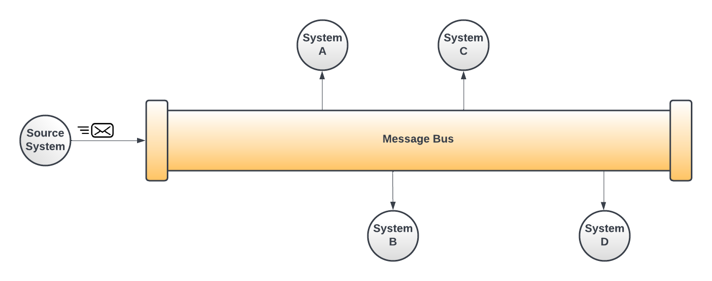

Greetings everyone! The summer is quickly coming to end, as the heat in many parts of the country is reaching its peak and the summer vacation for any children are coming to an end. This month, I want to introduce the Genesys Cloud/AWS EventBridge integration. Genesys Cloud offers two different mechanisms for integrating your platform together:

1. **Point-to-Point integrations**. Point-to-point integrations involve integrating systems through the use of services (in the case of Genesys Cloud, REST-based services.  Point-to-point integrations follow a synchronous request-response model. This requires the consuming application to be responsible for when to call the API. In many scenarios, applications leveraging APIs to carry out an action need to continuously "call" or "poll" the API. Based on the frequency of these calls, this can often introduce "rate-limiting" and/or scalability problems. This is particularly prevalent when having to invoke a cloud-based service APIs.

2. **Event-based integrations**. In an event-based integration model, as activities occur within a system, it publishes a message out to some type of transport layer (e.g. a queue, websocket, or message bus). The producer of the event has no idea who is going to consume the message and new message consumers can be added without causing the cascading chain of dependencies that occur in point-to-point integration models.

In this blog post I am going to introduce you to the concept of a message bus and show you how to leverage Genesys Cloud and AWS EventBridge (AWS's implementation of a message bus) to integrate messages generated by Genesys Cloud into your own applications. I will also show you how to setup and configure a Genesys Cloud/AWS event bridge integration in your own AWS account.

## What is a message bus?
A message bus is an integration pattern that allows systems to share state and data changes through the passing of messages back and forth between these systems.  However, with a message bus, the producer of the message and the consumers of the message never directly exchange messages. Instead, the message producer publishes the message to what is conceptually a pipe. As that message enters the pipe, other systems cans read the message from the pipe and do what they like with it. New message producers and consumers can be easily added to and removed from the pipe. The diagram belows illustrates the concept of a message bus:



:::{"alert":"primary","title":"What is the difference between message queues and enterprise service buses?","autoCollapse":false}
If you are new to integration patterns, you might be asking what the difference between message buses and other integration patterns and technologies. A message bus focuses on providing a transport and routing layer for messages. It is meant to be a lightweight integration pattern and does not offer comprehensive queueing capabilities like IBM MQ or Apache MQ. A message bus has minimal support for data transformation of messages or applying business rules to a message unlike its heavier cousin, the enterprise service bus.
:::

## What is AWS EventBridge

AWS EventBridge is a managed message bus service that allows AWS partners to publish messages from their platforms to resources residing in AWS. With AWS EventBridge a message originating from a partner platform (e.g. Genesys Cloud) can be persisted to an AWS S3 bucket, sent to a Kinesis stream or processed directly by a Lambda running within your own AWS account. AWS EventBridge provides a filtering language to help filter out events that are not of interest to the consumer.

## Why use AWS EventBridge with Genesys Cloud

The Genesys Cloud/AWS EventBridge integration is an extremely attractive option for building event-based integrations with Genesys Cloud. Some of the reasons to consider using AWS EventBridge:

- **Completely managed by AWS**. AWS EventBridge is completely managed by AWS. There are no servers to manage and you only pay for what you use. There is no code required to setup AWS EventBridge.
- **Resiliency**.  AWS provides a [99.99%](https://aws.amazon.com/eventbridge/sla/) service level agreement for AWS EventBridge. In addition, if Genesys Cloud is unable to connect to your AWS EventBridge account due to an AWS outage, Genesys Cloud will queue messages for up to 24 hours. This is quite a bit different from the the Genesys Cloud notification service. With the Genesys Cloud notification service, if the websocket that messages are being passed across is closed, any sent messages are lost.
- **Scalability**. AWS automatically handles scaling for burst of messages coming into the AWS infrastructure. In addition, by leveraging AWS EventBridge and other AWS technologies like Kinesis and AWS Lambdas you can scale up and down to meet almost any resourcing requirements.
- **Multiple integration partners**.  AWS EventBridge integrates with a large number of partner systems. This makes integrating third-party SaaS platforms like Genesys Cloud a configuration exercise rather then a custom-coding one. For a full list of AWS integration partner see [here](https://aws.amazon.com/eventbridge/integrations/).
- **Multiple AWS targeting options**. Once a message hits the AWS EventBridge, you are able to process the message with a large number of AWS technologies. A full list can be found [here](https://docs.aws.amazon.com/eventbridge/latest/userguide/eb-targets.html).

## Setting up the Genesys Cloud and AWS EventBridge

In order to setup Genesys Cloud and AWS EventBridge, there are a number of components in both Genesys Cloud and AWS that need to be configured.  The diagram below illustrates these componentsL


1. **Genesys Cloud EventBridge Integration**.  Genesys Cloud's EventBridge capabilities are exposed as a Genesys Cloud integration. For instructions on how to setup the EventBridge in Genesys Cloud, see [here](https://help.mypurecloud.com/articles/about-the-amazon-eventbridge-integration/).
2. **AWS EventBridge Partner Event Source**. The AWS partner event source represents the partner configuration needed to be done in your Amazon account in order for the partner to communicate with Genesys Cloud. The Genesys Cloud EventBridge integration will automatically create a partner event source for you in your Amazon account.  However, before you can begin receiving messages from Genesys Cloud, you will need to associate the Genesys Cloud created partner event source with an AWS Event bus. 
3. **AWS EventBridge Event Bus**. This is the event bus that information will flow across. There is always at least one AWS EventBridge event bus associated with your AWS account. The name of this event bus is called *default*. You can create additional event buses to segregate traffic coming from different vendors.
4. **AWS EventBridge Rules**.  AWS provides a filtering language that enables you to match on patterns on incoming events and only allows those events that match the pattern to be allowed into the event bus. Once a message has been matched to a pattern, it will be passed to one or more AWS EventBridge targets.
5. **AWS EventBridge Targets**. An AWS EventBridge rule can have one or more EventBridge targets. A target represents a destination where a message will be stored or processed. A full list can be found [here](https://docs.aws.amazon.com/eventbridge/latest/userguide/eb-targets.html).


:::{"alert":"primary","title":"Video tutorials for setting up AWS EventBridge","autoCollapse":false}
I will not be walking through step-by-step in this blog post on how to manually setup the Genesys Cloud AWS EventBridge integration or the AWS EventBridge integration. These topics are covered in the following videos:

1. [Configuring a simple AWS EventBridge with Genesys Cloud](https://www.youtube.com/watch?v=1uqEUpFtk8Q). This is a short video that walks through how to hookup Genesys Cloud and AWS EventBridge to send Genesys Cloud events to an AWS Lambda.
2. [AWS EventBridge Overview](https://www.youtube.com/watch?v=ea9SCYDJIm4). An AWS produced video that provides an excellent overview of AWS EventBridge and how to configure it.
:::

## Using CX as Code and Terraform to completely setup an AWS EventBridge

Let's build an AWS EventBridge integration that will take all available Genesys Cloud audit events and pass them to an AWS CloudWatch log. To setup this example, we are going to use **CX as Code** and the Hashicorp AWS Provider to install all of the configuration needed for this example. We are going to walk through each of the major **CX as Code** and Hashicorp AWS provider components of this integration. For conciseness, I am not going to show the entire [main.tf](main.tf) file or the example [dev.auto.tfvars](dev.auto.tfvars) file that sets the environment variables for the Terraform script. 

### Setting up the Genesys Cloud AWS EventBridge integration
The first thing that needs to be done is to create the Genesys Cloud AWS EventBridge integration. You can use the **CX as Code** [genesyscloud_integration](https://registry.terraform.io/providers/MyPureCloud/genesyscloud/latest/docs/resources/integration) resource to setup the integration. However, the `genesyscloud_integration` is a general purpose resource for setting up any kind of Genesys Cloud integration. Each integration requires specialized meta-data that is not always clearly documented. To simplify this for the creation of an AWS EventBridge integration, we have wrapped this setup using a Terraform remote module that is stored [here](git::https://github.com/GenesysCloudDevOps/aws-event-bridge-module.git?ref=main). 

```
module "AwsEventBridgeIntegration" {
   integration_name    = var.event_bus_name
   source              = "git::https://github.com/GenesysCloudDevOps/aws-event-bridge-module.git?ref=main"
   aws_account_id      = var.aws_account_id
   aws_account_region  = var.aws_region
   event_source_suffix = var.event_bus_name
   topic_filters       = ["v2.audits.entitytype.{id}.entityid.{id}"]
}
```

### Create the Cloudwatch Log Group
Next, we need to create the Cloudwatch log watch group that will hold the Genesys Cloud audit events passed to the AWS EventBridge. To create this log group, we will use the [Hashicorp AWS provider](https://registry.terraform.io/providers/hashicorp/aws/latest/docs).

```
resource "aws_cloudwatch_log_group" "audit_log_events" {
  name = "/aws/events/genesyscloud_audit_log_events"
}
```

### Create the EventBus
The creation of a Genesys Cloud EventBridge integration will create an AWS partner event source in your AWS account. Remember, though we need to associate a partner event source with an event bus. We will do by first looking up the event source that was created by Genesys Cloud.

```
data "aws_cloudwatch_event_source" "genesys_event_bridge" {
  depends_on = [
    module.AwsEventBridgeIntegration
  ]
  name_prefix = "aws.partner/genesys.com"
}
```

:::{"alert":"warning","title":"Beware the single bus","autoCollapse":false}
The above Terraform data lookup uses a `name_prefix` to look up a the the event source. The above example looks for an event source that begins with `aws.partner/genesys.com`. If you have more then one the Genesys Cloud EventBridge integration defined the above code will pull back more then one definition and fail. If you have more then one Genesys EventBridge integration, you will have to use the fully qualified name of the event_source (e.g. aws.partner/genesys.com/cloud/<<randomly generated-guid>>/<<sub-account-name>>)
:::

Once the partner event source is lookup, it can be used to create the event bus.

```
resource "aws_cloudwatch_event_bus" "genesys_audit_event_bridge" {
  name              = data.aws_cloudwatch_event_source.genesys_event_bridge.name
  event_source_name = data.aws_cloudwatch_event_source.genesys_event_bridge.name
}
```


### Creating the event bus rules
```
resource "aws_cloudwatch_event_rule" "audit_events_rule" {
  depends_on = [
    aws_cloudwatch_event_bus.genesys_audit_event_bridge
  ]
  name        = "capture-audit-events"
  description = "Capture audit events coming in from AWS"
  event_bus_name = data.aws_cloudwatch_event_source.genesys_event_bridge.name

  event_pattern = <<EOF
    {
      "source": [{
        "prefix": "aws.partner/genesys.com"
      }]
 
    }
EOF
}

resource "aws_cloudwatch_event_target" "audit_rule" {  
  rule      = aws_cloudwatch_event_rule.audit_events_rule.name
  target_id = "SendToCloudWatch"
  arn       = aws_cloudwatch_log_group.audit_log_events.arn
  event_bus_name = data.aws_cloudwatch_event_source.genesys_event_bridge.name
}
```


## Final Thoughts


## Additional Resources

1. AWS EventBridge documentation
2. Genesys Cloud EventBridge documentation
3. Genesys Cloud EventBridge topics
4. Genesys Cloud Remote Modules
5. Videos