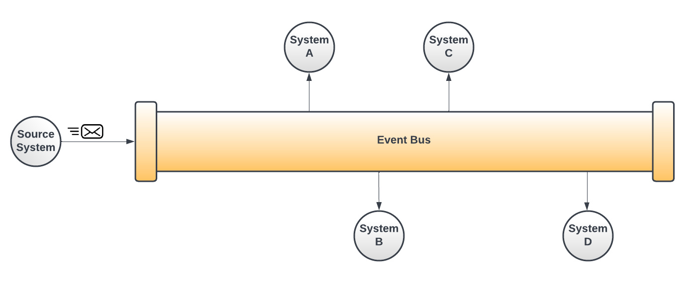
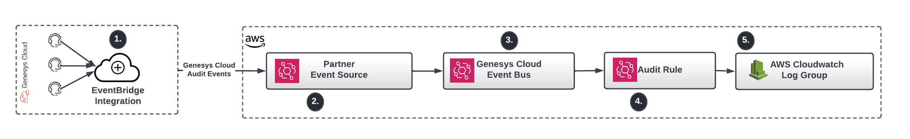

Greetings everyone, let's discuss the Amazon EventBridge integration in Genesys Cloud. Genesys Cloud is an event-driven platform. For various contact center-related events such as, a new conversation or the agent goes on queue or off queue, a generated message confirms the activity occurrence. 

The Amazon EventBridge integration allows you to tap into the huge stream of events that are sent from Genesys Cloud to the Amazon Web Services (AWS) account for processing. Tapping into the Genesys Cloud event stream allows you to build scalable, near-time backend integrations.  Unlike platform API calls, event-based integrations are "push" models where events are pushed to interested parties and consumed as the event happens. Using an event-based approach is often more scalable and durable than a platform API, unlike platform APIs, the consumption of messages does not come with the same [rate-limits](/platform/api/rate-limits) often related with Genesys Cloud platform APIs.

Let's define an event bus and the integration pattern that the Amazon EventBridge is built around.

## What is an Event bus?
An event bus, also known as a message bus, is an integration pattern that allows systems to share state and data changes by passing messages back and forth between these systems. With an event bus, the producer and the consumers never directly exchange messages. Instead, the event producer publishes a message about what is conceptually a pipe. As that message enters the pipe, other systems can read the message from the pipe and act accordingly. New event producers and consumers can easily add and remove from the pipe. The diagram illustrates the concept of an event bus:



:::{"alert":"primary","title":"What is the difference between message queues, an event bus, and enterprise service buses?","autoCollapse":false}
if you are new to integration patterns, understand the difference between event buses and other integration patterns and technologies. An event bus, a lightweight integration pattern, provides transport and routing layer for messages generated from events happening within systems. An event bus does not have the comprehensive queuing capabilities of a specialized message queue platform like IBM's MQ or the open-source equivalent, Apache MQ. An event bus has minimal support for transforming messages and does not provide the ability to apply comprehensive business rules to a message traveling inside the pipe. Much heavier technologies, like the enterprise service bus, provide these capabilities.

An event bus follows the maxim: "Dumb pipes, smart endpoints."
:::

## What is Amazon EventBridge?
Amazon EventBridge provides a lightweight filtering language to help filter events that are not of your interest. Amazon EventBridge is a managed event bus that allows AWS partners to publish messages from their platforms to resources that are in AWS. With Amazon EventBridge, a message that originates from a partner platform, for example, Genesys Cloud, can be persisted to an AWS S3 bucket, sent to a Kinesis stream, or processed directly by a Lambda running within your AWS account.

## Why use Amazon EventBridge with Genesys Cloud?
The Amazon EventBridge integration in Genesys Cloud is a desirable option for building event-based integrations with Genesys Cloud because:

- **Managed by AWS**. AWS completely manages Amazon EventBridge. Do not require code to set up Amazon EventBridge. There are no servers to manage, and you only pay for what you use.
- **Resiliency** - AWS provides an [Amazon EventBridge Service Level Agreement](https://aws.amazon.com/eventbridge/sla/ "Goes to the Amazon EventBridge Service Level Agreement page") - If Genesys Cloud is unable to connect to your Amazon EventBridge account due to an AWS outage, Genesys Cloud queues messages and retries sending them for up to four days. This is quite a bit different from the Genesys Cloud Notification service.  With the Genesys Cloud Notification service, if the WebSocket that messages were being passed across is closed, any sent messages are lost. In addition, Amazon EventBridge allows for retry logic and the use of Dead Letter Queues (DLQ) if an event bus cannot deliver a message to a target in Amazon.
- **Scalability** - AWS automatically handles scaling for bursts of messages coming into the AWS infrastructure. By using Amazon EventBridge and other AWS technologies like Kinesis and AWS Lambdas, you can automatically scale up and down to meet almost any volume requirements without the direct need for human intervention.
- **Multiple integration partners** - Amazon EventBridge integrates with many partner systems. This makes integrating third-party SaaS platforms like Genesys Cloud a configuration exercise rather than a custom-coding one. For a full list of AWS EventBridge integration partners, see [Amazon EventBridge integrations](https://aws.amazon.com/eventbridge/integrations/ "Goes to the Amazon EventBridge integrations page").
- **Multiple AWS targeting options** - Once a message hits the Amazon EventBridge, you can process the message with many AWS technologies. For a full list, see [Amazon EventBridge targets](https://docs.aws.amazon.com/eventbridge/latest/userguide/eb-targets.html "Goes to the Amazon EventBridge targets page"). Amazon EventBridge does not  limit you to AWS-based targets. Amazon EventBridge can pass along messages to any HTTP-based API.

## Why use the Genesys Cloud Notification Service and WebSockets?
Before the addition of Amazon EventBridge integration, Genesys Cloud offers only consumption of messages using the Notification service and a WebSocket. This messaging integration model was initially built for doing near-time UI-based messaging integrations. The most common use case is building out of near-time contact center dashboards.

Use this model in backend services to build near-time data integrations, mainly if you cannot use AWS in your organization. As a developer, make a note of the following information when using this model:

- **No message durability** - Genesys Cloud only sends events over an open WebSocket. When a WebSocket is closed for any reason and not open, any events generated are not queued or retried when a new WebSocket is created. When the WebSocket is re-established after any network interruption, you must use the Genesys Cloud API to fill in the data that was missing when the WebSocket was down.
- **WebSockets are a lower-level primitive** - You use the WebSocket to establish the network connection, handle network connectivity issues, scale the network based on the volume of messages, and process messages. While these individual activities are not complicated, they can make building message-based integrations more complex.
- **Limited generalization for subscribing topics** - When you subscribe to topics, you must know the id of the Genesys Cloud object that you want to listen to the events. There is no mechanism to subscribe to events from many queues using a single topic. For example, to subscribe to events related to multiple queues, you must subscribe to each queue.

In addition to these limits, you need to manage and respect the following rate-limits related with the Notification service WebSockets implementation:

- **Channels remain active for 24 hours** - In order to maintain a channel longer than 24 hours you need to resubscribe to the topics.
- **You can create up to 20 channels per user and application** - When the channel limit is reached, the new channel replaces the oldest channel with no active connection.
- **Each WebSocket connection is limited to 1,000 topics**. The Notification service returns a 400-code if you subscribe to over 1,000 topics.
- **Each channel can only be used by one WebSocket at a time** - The first WebSocket disconnects if you connect a second WebSocket with the same channel ID.

To set up a WebSocket using the Notification service, refer to the following resources:

* [Genesys Cloud Notification Service Overview](https://developer.genesys.cloud/notificationsalerts/notifications/ "Goes to the Genesys Cloud Notification Service Overview page") in the Genesys CLoud Developer Center
* [Using the Genesys Cloud CLI to listen to Notification Service Events](https://www.youtube.com/watch?v=r4Jc-Mn0ONA "Goes to the DevDrop 11: Using the Genesys Cloud CLI to listen to Notification Service Events video") in YouTube
* [Using the Genesys Cloud Python SDK with the Notification Service](https://www.youtube.com/watch?v=z6JS12DX_pI "Goes to the DevDrop 10: Using the Genesys Cloud Python SDK with the Notification Service video") in YouTube
* [Build a chat translation assistant with the AWS Translate service]( https://developer.genesys.cloud/blueprints/chat-translator-blueprint/ "Goes to Build a chat translation assistant with the AWS Translate service page") in the Genesys Cloud Developer Center    

## Set up the Genesys Cloud and Amazon EventBridge
The illustration shows the components that you must configure to set up Genesys Cloud and Amazon EventBridge:


- **Genesys Cloud EventBridge integration** - Genesys Cloud's EventBridge capabilities are exposed as a Genesys Cloud integration. For instructions on how to set up the Amazon EventBridge integration in Genesys Cloud, see [About the Amazon EventBridge integration](https://help.mypurecloud.com/articles/about-the-amazon-eventbridge-integration/ "Goes to About the Amazon EventBridge integration page") in the Genesys Cloud Resource Center.
- **Amazon EventBridge Partner Event Source** - the AWS partner event source represents the partner configuration that you need in your Amazon account to communicate with AWS. The Genesys EventBridge integration automatically creates a partner event source in your Amazon account. However, before receiving messages from Genesys Cloud, you must associate the Genesys Cloud-created partner event source with an Amazon Event bus. 
- **Amazon EventBridge Event bus** - the event bus through which the information flows across. There is always at least one Amazon EventBridge event bus that must be associated with your account. The name of this pre-created event bus is *default*. You can create more event buses to segregate the oncoming message traffic in the event bus.
- **Amazon EventBridge rules** - AWS provides a filtering language that enables you to match patterns on incoming events and only allows those events that match the pattern in the event bus. Messages that are matched to a pattern is passed to one or more Amazon EventBridge targets.
- **Amazon EventBridge targets** - an Amazon EventBridge rule can have one or more EventBridge targets. A target represents a destination where a message is stored or processed. For a complete list, see [Amazon EventBridge targets](https://docs.aws.amazon.com/eventbridge/latest/userguide/eb-targets.html "Goes to the Amazon EventBridge targets page") on the Amazon website.

:::{"alert":"primary","title":"Video tutorials for setting up Amazon EventBridge","autoCollapse":false}
A step-by-step process for manually setting up the Amazon EventBridge integration, see the following videos:

- [Introducing the Genesys Cloud Amazon EventBridge Integration](https://www.youtube.com/watch?v=1uqEUpFtk8Q "Goes to DevDrop 15: Introducing the Genesys Cloud Amazon EventBridge Integration video") in YouTube. This short video walks through how to hook up Genesys Cloud and Amazon EventBridge to send Genesys Cloud events to an AWS Lambda.
- [How To Get Started With Amazon EventBridge](https://www.youtube.com/watch?v=ea9SCYDJIm4 "Goes to the How To Get Started With Amazon EventBridge video") in YouTube, that provides an excellent overview of Amazon EventBridge and how to configure it.
:::

## Use CX as Code and Terraform to set up an Amazon EventBridge
+
Let's build an Amazon EventBridge integration that takes all available Genesys Cloud audit events and pass them to an Amazon CloudWatch log group. To perform the action, configure the following:

- An Amazon EventBridge integration.
- A partner event source; this is done for you by Genesys Cloud.  
- Associate the Genesys Cloud partner event source with an event bus.
- Create a rule to trigger on incoming messages.
- Create a rule target(s) that is sent if the message matches. 

To create this log group, use the AWS provider on the Terraform website.

The following illustration shows the actions to set up the integration:



To set up this example, use **CX as Code** and Hashicorp Terraform to install all the configurations. The following procedures take you through the steps for setting up the integration: 

### Set up Genesys Cloud Amazon EventBridge integration
To create the Amazon EventBridge integration in Genesys Cloud, use the **CX as Code** [genesyscloud_integration (Resource)](https://registry.terraform.io/providers/MyPureCloud/genesyscloud/latest/docs/resources/integration "Goes to the genesyscloud_integration (Resource) page") on the Terraform website. However, the `genesyscloud_integration` is a general-purpose resource for setting up any Genesys Cloud integration. Each integration requires specialized metadata. A simplified format of the integration setup using a Terraform remote module is available in the [Genesys Cloud DevOps repository](git::https://github.com/GenesysCloudDevOps/aws-event-bridge-module.git?ref=main "Goes to Genesys Cloud DevOps repository") in GitHub. The configuration for Genesys Cloud EventBridge remote module is as follows:

```
module "AwsEventBridgeIntegration" {
   integration_name    = var.event_bus_name
   source              = "git::https://github.com/GenesysCloudDevOps/aws-event-bridge-module.git?ref=main"
   aws_account_id      = var.aws_account_id
   aws_account_region  = var.aws_region
   event_source_suffix = var.event_bus_name
   topic_filters       = ["v2.audits.entitytype.{id}.entityid.{id}"]
}
```

### Create the Cloudwatch Log group
Next, create the Cloudwatch log watch group to hold the Genesys Cloud audit events passed to the Amazon EventBridge. To create this log group, use the [AWS provider](https://registry.terraform.io/providers/hashicorp/aws/latest/docs "Goes to the AWS Provider page") on the Terraform website.

```
resource "aws_cloudwatch_log_group" "audit_log_events" {
  name = "/aws/events/genesyscloud_audit_log_events"
}
```

### Create the Event bus
The creation of a Genesys Cloud EventBridge integration creates an AWS partner event source in your AWS account. Ensure that you associate the partner event source with an event bus. The event source that is created by Genesys Cloud:

```
data "aws_cloudwatch_event_source" "genesys_event_bridge" {
  depends_on = [
    module.AwsEventBridgeIntegration
  ]
  name_prefix = "aws.partner/genesys.com"
}
```

:::{"alert":"warning","title":"Beware the single bus","autoCollapse":false}
The above Terraform data lookup uses a `name_prefix` to look up the event source. The above example looks for an event source that begins with `aws.partner/genesys.com`. If you have more than one Genesys Cloud EventBridge integration defined, the above code pulls back more than one definition and fail. Multiple Genesys Cloud EventBridge integrations must use the fully qualified name in the `event_source` field. For example, aws.partner/genesys.com/cloud/<<Genesys Cloud Organization Id>>/<<Event Source Suffix>>.
:::

Once the partner event source is located, it can be used to create the event bus. The Terraform snippet demonstrates this below.

```
resource "aws_cloudwatch_event_bus" "genesys_audit_event_bridge" {
  name              = data.aws_cloudwatch_event_source.genesys_event_bridge.name
  event_source_name = data.aws_cloudwatch_event_source.genesys_event_bridge.name
}
```

### Create the Event bus rules and targets
Once the event bus is created, create a rule to process audit events. This is where Amazon EventBridge's filtering rules is applied to match or exclude messages passed from Genesys Cloud to AWS. The following configuration is the Terraform resource definition that creates the Amazon EventBridge rule:

```
resource "aws_cloudwatch_event_rule" "audit_events_rule" {
  depends_on = [
    aws_cloudwatch_event_bus.genesys_audit_event_bridge
  ]
  name        = "capture-audit-events"
  description = "Capture audit events coming in from AWS"
  event_bus_name = data.aws_cloudwatch_event_source.genesys_event_bridge.name

  event_pattern = <<EOF
    {
      "source": [{
        "prefix": "aws.partner/genesys.com"
      }]
 
    }
EOF
}
```

You can associate one or more targets that process the message passed into the event bus. The following resource creates an event target that passes the message to an AWS Cloudwatch log group.

```
resource "aws_cloudwatch_event_target" "audit_rule" {  
  rule      = aws_cloudwatch_event_rule.audit_events_rule.name
  target_id = "SendToCloudWatch"
  arn       = aws_cloudwatch_log_group.audit_log_events.arn
  event_bus_name = data.aws_cloudwatch_event_source.genesys_event_bridge.name
}
```

## To conclude
The Amazon EventBridge integration offers a new and powerful tool for integrating Genesys Cloud with other internal applications and SaaS platforms. The tool allows you to build durable and scalable backend integrations without dealing with many low-level complexities using the Genesys Cloud Notification service and a WebSocket. Furthermore, when you use **CX as Code** and Terraform, you easily automate the configuration and configuration of Genesys Cloud and Amazon EventBridge into a simple, declarative format that can be quickly processed with a CI/CD pipeline.

## Additional resources
- [Amazon EventBridge Documentation](https://docs.aws.amazon.com/eventbridge/?id=docs_gateway "Goes to Amazon EventBridge Documentation page") on the AWS website
- [About the Amazon EventBridge integration](https://help.mypurecloud.com/articles/about-the-amazon-eventbridge-integration/ "Goes to the About the Amazon EventBridge integration page"), in the Genesys Cloud Resource Center
- [Genesys Cloud/Amazon EventBridge Technical Notes](/notificationsalerts/notifications/event-bridge)
- [Genesys Cloud EventBridge topics](/notificationsalerts/notifications/available-topics)
- [Genesys Cloud CX as Code](https://developer.genesys.cloud/devapps/cx-as-code/ "Goes to the Genesys Cloud CX as Code page") in the Genesys Cloud Developer Center
- [Genesys Cloud Remote Modules](https://github.com/GenesysCloudDevOps)
- [Genesys Cloud EventBridge remote module](https://github.com/GenesysCloudDevOps/aws-event-bridge-module)
- [Introducing the Genesys Cloud Amazon EventBridge Integration](https://www.youtube.com/watch?v=1uqEUpFtk8Q "Goes to the DevDrop 15: Introducing the Genesys Cloud Amazon EventBridge Integration video") in YouTube
- [Video - How To Get Started With Amazon EventBridge](https://www.youtube.com/watch?v=ea9SCYDJIm4 "Goes to How To Get Started With Amazon EventBridge video") in YouTube
- [Blueprint - Amazon EventBridge - Create a PagerDuty incident in response to OAuth client deletes](https://developer.genesys.cloud/blueprints/aws-eventbridge-oauth-client-delete-blueprint/ "Goes to the Amazon EventBridge - Create a PagerDuty incident in response to OAuth client deletes page") in the Genesys Cloud Developer Center
- [Blueprint - Amazon EventBridge - Write user presence updates to DynamoDB](https://developer.genesys.cloud/blueprints/aws-eventbridge-user-presence-update-blueprint/ "Goes to the Amazon EventBridge - Write user presence updates to DynamoDB page") in the Genesys Cloud Developer Center