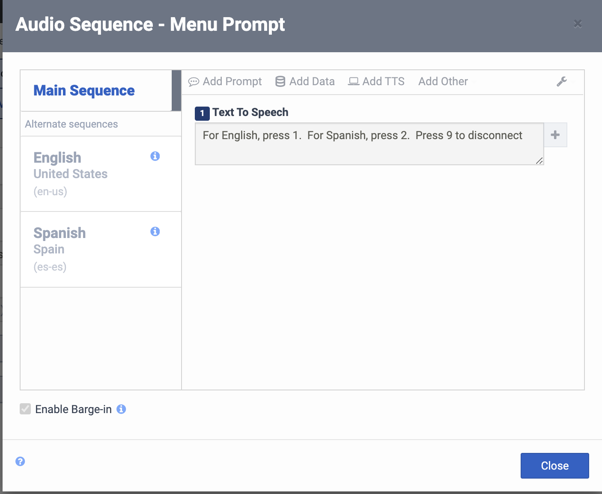
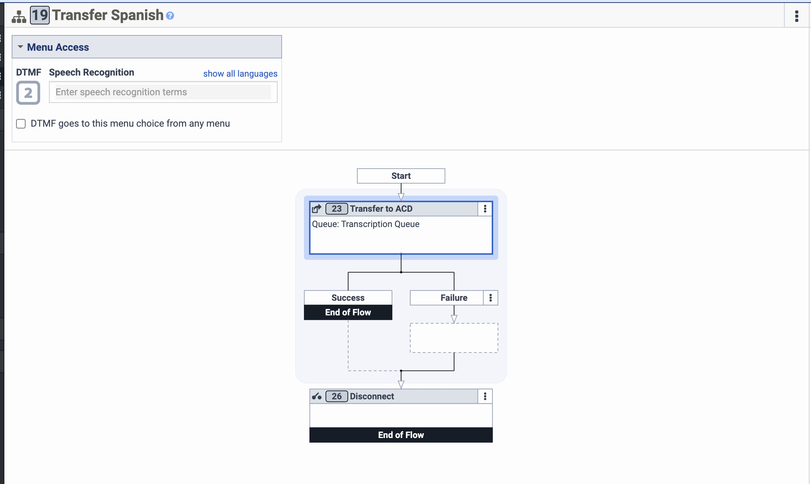
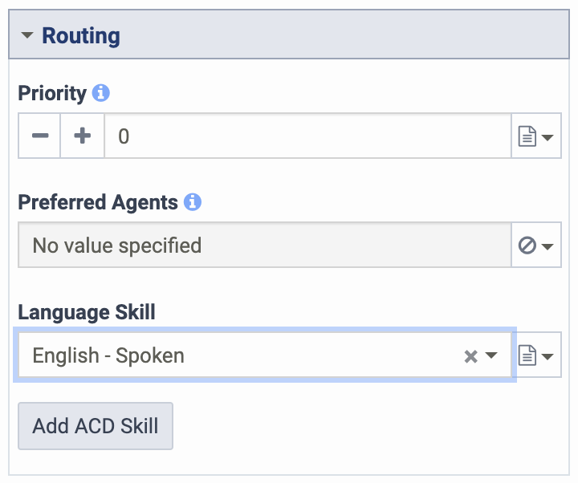
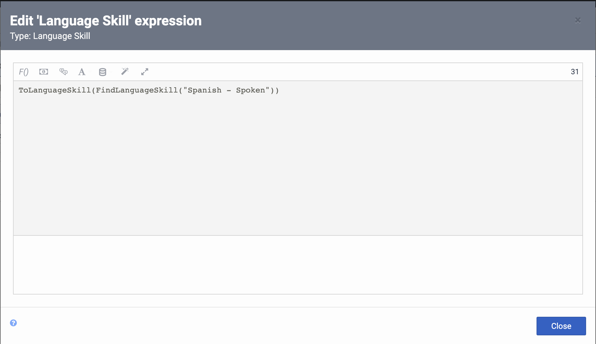
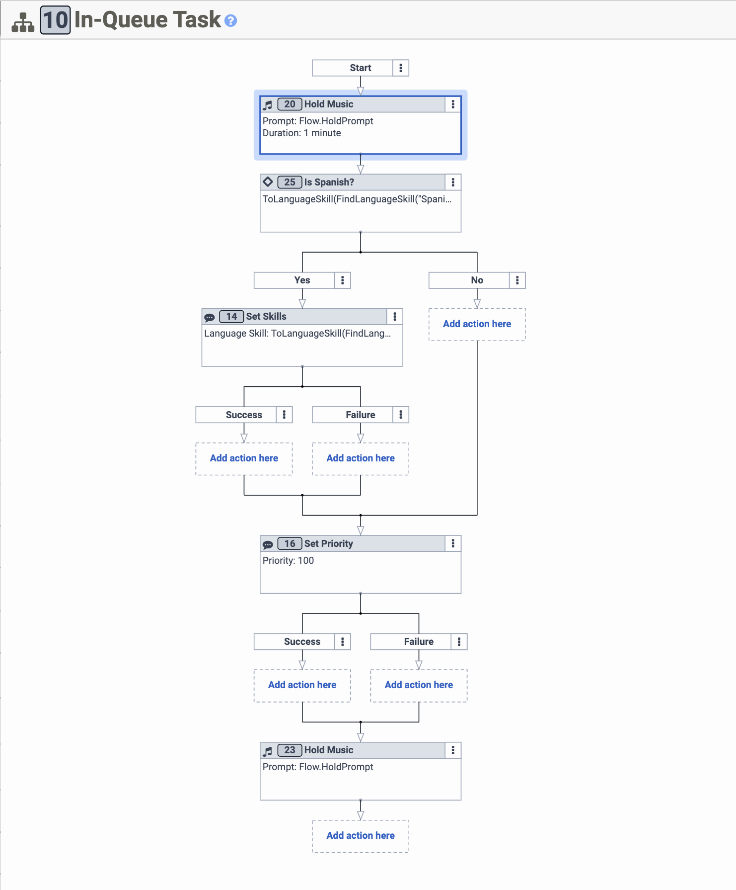
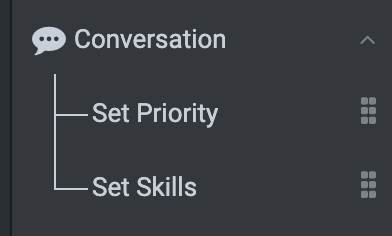
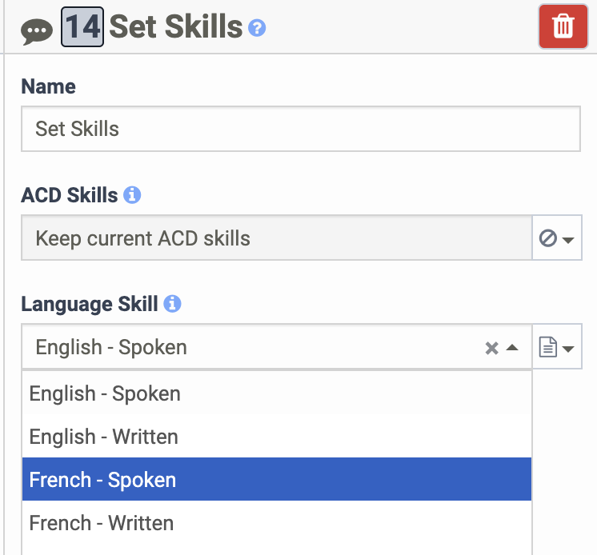

Hello, developers! 2023 is underway, and today's blog entry introduces priority and skill modification for in-queue interactions. It wasn't possible to update these in the past while an interaction sat in the queue, but now it can be done using either the Genesys Cloud API or built-in tools provided by Genesys Cloud Architect's In-Queue call flows.

To demonstrate the utility of this, let's look at two scenarios:

1. An organization has identified the hold times as an area for improvement. The new target states that if hold time exceeds 15 minutes, the call's priority should be increased to 50.

2. An organization's clients are primarily native Spanish speakers, but many also have English as a second language. When a customer selects Spanish, the inbound flow transfers the call to the queue with the language skill set to Spanish. Makes sense so far, but what if there aren't any Spanish-speaking agents available then? To remedy this, the organization decides that after a call sits in the queue for 15 minutes, the language skill should be set to English.

:::primary
Note: The queue used for this testing example used Standard Routing as its routing method and All Skills Matching as its evaluation method. These are relevant considerations but not mandatory.
:::

:::primary
Note: Regarding the API approach, this post aims not to demonstrate a fully-implemented client application, rather it highlights the use of the relevant API resources and outlines any other steps needed to complete the solution.
:::

The solution is here with Architect's tools for In-Queue call flows or using the API for a custom approach.

## Architect approach

### Inbound call flow
The In-Queue call flow differs from the API approach when opting to use Architect solely for the implementation. However, the inbound call flow won't change in this case.

To direct the inbound calls appropriately, set up the DTMF menu. First, configure the audio the customer is greeted with using an audio sequence.  

  

A separate DTMF task wis required to handle each menu option. The tasks will look very similar in this case. The difference lies in the language skills set when the call is transferred to the queue. Here's the handling of the "Spanish" option.  

  

Now, the key operation takes place -- setting the language skill.   
The simplest way to do this is to set the value using the editor's "literal" mode, which will provide a dropdown.



However, you can also use the expression editor to do this.  

  

### In-Queue call flow
The next step is to wait. The nice thing about Architect's hold music is that it also serves as a timer. In this case, the timer is set for 15 minutes.  

  

After the waiting period, the priority is boosted. If the language skill is currently set to Spanish, it will be changed to English.
The Architect's actions to accomplish this can be found in the toolbox under the "Conversation" heading.  

  

Now, the Set Skills action is used to set the language skill, but this time the English skill is set. This can be done using the editor's literal or expression modes.  The literal mode provides a dropdown.



English-speaking agents are now eligible to answer the call, so all that's left to do is play more hold music until the call is answered.

## API approach
This approach is made possible first and foremost by this API resource:  

<dxui:OpenAPIExplorer verb="patch" path="/api/v2/routing/conversations/{conversationId}"/>

In addition, these auxillary resources are used for this example.  

<dxui:OpenAPIExplorer verb="get" path="/api/v2/flows"/>  
<dxui:OpenAPIExplorer verb="get" path="/api/v2/routing/languages"/>  
<dxui:OpenAPIExplorer verb="post" path="/api/v2/analytics/conversations/details/query"/>  

### Inbound call flow
The inbound call flow is identical to the one used in the Architect approach in this example.

### In-Queue call flow
This approach doesn't require custom handling for calls waiting in the queue.

### Implementation
The Genesys Cloud CLI is leveraged to complete the job in this example.

1. Obtain the IDs of the In-Queue flow and the Spanish language skill.

The following CLI commands will do the trick:  
`gc flows list --name "Priority and Skill mod API"`
`gc routing languages list --name 'English - Spoken'`

2. Plug the flow ID from the response into an Analytics conversation details query to get the conversations with long-running hold times

The CLI command here will reference a JSON file containing the request body with the `-f` flag.  
`gc analytics conversations details query create -f conversation-query.json`

Try a request body like this:  
```{"language": "json"}
{
    "interval": "[your-ISO-8601-start-time-here]/[your-ISO-8601-end-time-here]",
    "order": "asc",
    "orderBy": "conversationStart",
    "paging": {
        "pageSize": 25,
        "pageNumber": 1
    },
    "segmentFilters": [
        {
            "type": "or",
            "predicates": [
                {
                    "type": "dimension",
                    "dimension": "flowId",
                    "operator": "matches",
                    "value": "[your-in-queue-flow-id]"
                },
                {
                    "type": "metric",
                    "metric": "tSegmentDuration",
                    "range": {
                        "gt": [your-desired-duration]
                    }
                }
            ]
        }
    ],
    "conversationFilters": [
        {
            "type": "or",
            "predicates": [
                {
                    "type": "dimension",
                    "dimension": "conversationEnd",
                    "operator": "notExists",
                    "value": null
                }
            ]
        }
    ]
}
```

3. Take the desired conversation's ID from the query response and update its skills and priority.

The CLI command:  
`gc routing conversations update [conversationId] -f conversation-update.json`

And the request body:  
```{"language": "json"}
{
    "priority": 100,
    "languageId": "[your-language-skill-id-here]"
}
```
## Other considerations
When setting up your test environment, consider using a dedicated test queue with the tester as the sole member on the queue. Configuring the queue with Standard routing and All Skills Matching evaluation will make for the most clear-cut testing process. Give the tester English but not Spanish-speaking skills. The incoming call with Spanish selected will sit in the queue until the language skill is switched back to English. At that point, if the tester's status is set to On Queue, they are assigned and will receive an alert notification for the call.

## Additional Resources
Check out these links if this piqued your interest or left you with unanswered questions.

1. [Priority and skill modification DevDrop](https://www.youtube.com/watch?v=RWeDL1IDrkE)
2. [Resource Center - Set Priority action](https://help.mypurecloud.com/?p=260380)
3. [Resource Center - Set Skills action](https://help.mypurecloud.com/?p=260382)
4. [Work with in-queue flows](https://help.mypurecloud.com/?p=146063)