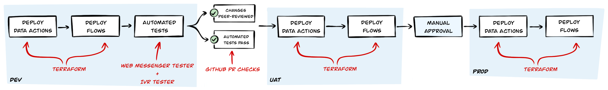
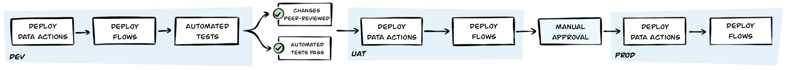
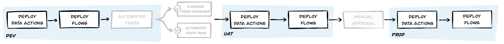
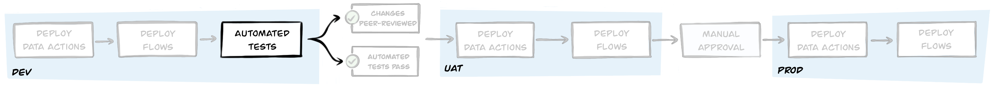

OVO Tech aims to reduce the feedback loop as much as possible to maintain quality when developing chatbots. A short feedback loop means that OVO Tech quickly adapts to customers' responses. Automation is used to ensure the quality of productivity is maintained and increased. This article explains the automation pipeline process that I created to help you get started.



The automated pipeline, formally known as a [CI/CD pipeline](https://en.wikipedia.org/wiki/CI/CD  "Goes to the CI/CD Pipeline page"), is triggered against every change and:

- Automatically deploy the bot and its dependencies to test the environments
- Run automated tests to assert the behavior of the new functionality and catch any regressions in the existing functionality
- Enforce that automated tests are passed, and changes are peer-reviewed before you proceed
- Once approved, it automatically deploys changes to a User Acceptance Testing (UAT) environment
- Notifies a QA engineer to do exploratory testing
- Once approved by a QA engineer, automatically deploy changes to production

The automation pipeline provides the following benefits:

- Reducing the feedback loop from hours/days to seconds/minutes
- Chatbots deployments and their dependencies that are identical across environments; if it works in UAT, it works in Prod
- Assurance of quality through automated tests. No matter the change, it is subjected to over 40 end-to-end tests, which take less than two minutes and run simultaneously

## Implementation
Let's examine the automation pipeline.

### Source-control
For more information about flows, chatbots, dependencies, tests, and pipeline definition, see the [GitHub](https://github.com/  "Goes to the GitHub page")  repository.

The automated pipeline is triggered when a repository update or a revert change occurs; the source-control tracks it. The changes are advanced to production when all the pipeline checks pass.

### Pipeline


The following pipeline configuration is defined in the human-readable language, YAML, and is executed by CircleCI:

```yaml
# Job definitions redacted

workflows:
  development:
    jobs:
      - terraform-autoapply-dev:
          filters: *ignore-main-branch
          context:
            - aws-dev
            - genesys-dev
      - test-web-messaging:
          filters: *ignore-main-branch
          requires:
            - terraform-autoapply-dev
      - test-ivr-flow:
          filters: *ignore-main-branch
          requires:
            - terraform-autoapply-dev
  main:
    jobs:
      - terraform-autoapply-uat:
          filters: *only-main-branch
          context:
            - aws-uat
            - genesys-uat
      - manual-testing:
          type: approval
          requires:
            - terraform-autoapply-uat
      - terraform-apply-prod:
          filters: *only-main-branch
          context:
            - aws-prod
            - genesys-prod
          requires:
            - manual-testing
```

### Deploy using Terraform


[Terraform](https://www.terraform.io/ "Goes to the Terraform page") offers defined resources that you want to deploy declaratively. This way, you know that the deployments always match what is in the source-control.

 Since many [Providers](https://registry.terraform.io/browse/providers "Goes to the Terraform Providers page") support Terraform, we can define everything in one place, from chatbots, flows, and data-actions to backend services. The following illustration is an example of a Terraform definition:

```terraform
resource "genesyscloud_integration_action" "create_survery_data_action" {
  # Prevent any change that creates a new UUID
  lifecycle {
    prevent_destroy = true
  }
  name           = "Create Survey (created via Terraform)"
  category       = "Web Services Data Actions"
  integration_id = var.integration_id
  secure         = false
  config_request {
    // ...
  }
  config_response {
    // ...
  }
  contract_input = <<DEFINITION
        // ...
        DEFINITION
  contract_output = <<DEFINITION
        // ...
        DEFINITION
}

resource "genesyscloud_flow" "flow" {
  filepath          = var.flow_file
  file_content_hash = filesha256(var.flow_file)

  substitutions = {
    flow_name     = "${var.flow_name} - (created via Terraform)"
    flow_division = var.flow_division
    data_action_name = genesyscloud_integration_action.create_survery_data_action.name
  }
}

data "genesyscloud_webdeployments_configuration" "config" {
  name = var.web_deployments_configuration
}

resource "genesyscloud_webdeployments_deployment" "survey_deployment" {
  name              = "Survey - (created via Terraform)"
  flow_id           = genesyscloud_flow.flow.id
  allow_all_domains = true

  configuration {
    id      = data.genesyscloud_webdeployments_configuration.config.id
    version = data.genesyscloud_webdeployments_configuration.config.version
  }
}
```

### Automated testing


OVO Tech uses the following open-source tools for automated chatbot testing:

- [Web Messenger Tester](https://github.com/ovotech/genesys-web-messaging-tester "Goes to the Web Messenger Tester page") - Used for testing Inbound Message flows via a Web Messenger Deployment.
    - Since WhatsApp integration uses Incoming Message Flows, you can test WhatsApp-specific chatbots for testing IVR flows using the [IVR Tester](https://github.com/SketchingDev/ivr-tester "Goes to the IVR Tester page") tool. 
    - This tool can test our IVR-based chatbot flows by impersonating a customer that calls OVO Tech, interpreting what it hears, and responding accordingly to pass through the journey. Any unexpected response is flagged.

These tools define file tests that can be stored alongside the chatbots in source-control and act as living documentation. The following illustration is an example of the open-source tool: 

```yaml
scenarios:
  "Customer asked to score experience if they say yes":
    - say: Thank you, bye
    - waitForReplyContaining: Before you go, could you answer a quick survey?
    - say: yes
    - waitForReplyContaining: How satisfied or dissatisfied are you with our company?
    - say: "10"
    - waitForReplyContaining: We thank you for your time spent taking this survey. Your response has been recorded.
  "Conversation ended if they say no":
    - say: Thank you, bye
    - waitForReplyContaining: Before you go, could you answer a quick survey?
    - say: no
    - waitForReplyContaining: We hope you have a nice day, goodbye
```

## Conclusion
This article has provided enough information about the automation pipeline for you to start. If you have any questions or want to share your implementation, contact [@SketchingDev](https://twitter.com/SketchingDev "Goes to Lucus' home page") on Twitter.
