Greetings everyone! It had been a while since I posted an article.

Recently, as these questions were periodically popping up on the Genesys Cloud Developer forum, I have thought that it would be good to clarify *what we exactly support and what happens when trying to answer a voice call using the Platform API* (same when initiating a voice call using the Platform API).

In this article, we will consider two possible Contact Center Agent's user interfaces: [**Genesys Cloud Web or Desktop app**](https://help.mypurecloud.com/?p=49607) and [**Genesys Cloud Embeddable Framework**](https://help.mypurecloud.com/?p=196909).

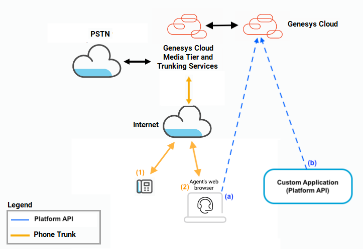

***Table of Contents***:
* [What's available in the Platform API?](#whats-available-in-the-platform-api)
    - [Specific to Genesys Cloud Embeddable Framework](#specific-to-genesys-cloud-embeddable-framework)
* [Factors influencing Answer Call and Make Call via Platform API](#factors-influencing-answer-call-and-make-call-via-platform-api)
    - [1. OAuth Authorization Type](#1-oauth-authorization-type)
    - [2. Phone Type](#2-phone-type)
    - [3. Maintain Persistent Connection setting](#3-maintain-persistent-connection-setting)
* [Support by Phone Type and User Interface](#support-by-phone-type-and-user-interface)
    - [Using Genesys Cloud WebRTC Phones](#using-genesys-cloud-webrtc-phones)
    - [Using Managed SIP Phones or Generic SIP Phones (with Broadsoft Extensions support)](#using-managed-sip-phones-or-generic-sip-phones-with-broadsoft-extensions-support)
    - [Using Remote Phones or Generic SIP Phones (no remote answer support)](#using-remote-phones-or-generic-sip-phones-no-remote-answer-support)
* [Closing Thoughts](#closing-thoughts)
* [Appendix A: Sample "*ForceDisconnect*" Architect Inbound Call flow](#appendix-a-sample-forcedisconnect-architect-inbound-call-flow)
* [Appendix B: In details Phone Type and settings](#appendix-b-by-phone-type-and-settings)
    - [With Genesys Cloud WebRTC Phones](#with-genesys-cloud-webrtc-phones)
    - [With Managed Phones (SIP)](#with-managed-phones-sip)
    - [With Remote Phones](#with-remote-phones)
    - [With Generic SIP Phone (Unmanaged) supporting of Broadsoft Extensions](#with-generic-sip-phone-unmanaged-supporting-of-broadsoft-extensions)
    - [With Generic SIP Phone (Unmanaged)](#with-generic-sip-phone-unmanaged)


## What's available in the Platform API?

***Request Answer Call:*** There are Platform API endpoints which purpose is to request a call to be connected (i.e. answered):
- [PATCH /api/v2/conversations/calls/{conversationId}/participants/{participantId}](/devapps/api-explorer#patch-api-v2-conversations-calls--conversationId--participants--participantId-) with `"state": "connected"`, while the conversation is alerting (*i.e. ringing*) at the Contact Center Agent's level.  
*participantId* refers to the agent (agent's participant) receiving this conversation.
- [PATCH /api/v2/conversations/{conversationId}/participants/{participantId}](/devapps/api-explorer#patch-api-v2-conversations--conversationId--participants--participantId-) with `"state": "connected"` can also be used for the same purpose.

***Request Make Call:*** There are Platform API endpoints which purpose is to request a call to be initiated (i.e. dialing):
- [POST /api/v2/conversations/calls](/devapps/api-explorer#post-api-v2-conversations-calls) to create a call conversation between the Contact Center Agent and another participant (another user, an ACD Queue, an external number).
- [POST /api/v2/conversations/calls/{conversationId}](/devapps/api-explorer#post-api-v2-conversations-calls--conversationId-) to place a new call as part of a callback conversation.

:::{"alert":"warning","autoCollapse":false}
**Note:** The fact that an API endpoint exists (e.g. to request a call to be answered) doesn't automatically imply that this request will be processed successfully in all possible scenario (e.g. with a remote phone). This will be described in more details later in this article.
:::

### Specific to Genesys Cloud Embeddable Framework:

Genesys Cloud Embeddable Framework implements another interface that you can use to answer calls or to initiate calls programmatically.

***Answer Call:***
[`Interaction.updateState`](/platform/embeddable-framework/actions/Interaction/Interaction.updateState) updates the state of an interaction.  
Using `action=pickup` on an alerting interaction will trigger a request to answer the call.

***Make Call:***
[`clickToDial`](/platform/embeddable-framework/actions/clickToDial) initiates a phone call, an SMS message, or an email.  
Using `type=call` will initiate a phone call.

:::{"alert":"primary","autoCollapse":false}
Genesys Cloud Embeddable Framework actions are equivalent to the user clicking on answer call or initiating a call from the user interface.  
I.e. An `Interaction.updateState(action=pickup)` is equivalent to a "manual" answer in Genesys Cloud Embeddable Framework.
:::


## Factors influencing Answer Call and Make Call via Platform API

One important thing to understand is that there are different factors which influence how and if calls can be answered or initiated via Platform API:
1. the type of [OAuth 2 Authorization Grant flow](/authorization/platform-auth/#authorization-types) which will be used to request an access token (for the Platform API requests). You'll need to [create the corresponding OAuth client](https://help.mypurecloud.com/?p=188023) in the Genesys Cloud configuration.
2. the type of phone used by the Contact Center Agent: [Genesys Cloud WebRTC Phone, Managed Phone (SIP), Remote Phone, Unmanaged Phone (Generic SIP)](https://help.mypurecloud.com/?p=76409)
    - for Unmanaged Phones (Generic SIP), if the phones support Broadsoft Extensions SIP Event Package for remote talk/hold (*SIP NOTIFY - Event: talk/hold*).
3. if the phone is configured to [maintain a Persistent Connection (Genesys Cloud feature)](https://help.mypurecloud.com/?p=134672) or not.

The type of user interface used by the Contact Center Agents - Genesys Cloud Web/Desktop app or Genesys Cloud Embeddable Framework - also matters.  
Indeed, if your agents are using Genesys Cloud Embeddable Framework as user interface, the Interaction.updateState and clickToDial actions will provide additional programmatic possibilities.


### 1. OAuth Authorization Type:

***Why is it important?***

Because at this time, **only the user** who is associated with the phone (the phone receiving the call) can invoke the Platform API Answer Call or Make Call.

:::{"alert":"primary","title":"User oriented token","autoCollapse":false}
What does that imply?  
The access token, used in the Platform API request, must be obtained via an [Implicit Grant, Authorization Code Grant, PKCE Code Grant or SAML2 Bearer Grant flow](/authorization/platform-auth/#authorization-types).  
**The access (bearer) token MUST be associated with the user receiving the call or making the call** (the token must correspond to a user who is an active participant in this conversation).
:::

:::{"alert":"warning","autoCollapse":false}
**It is NOT possible to invoke these Platform API endpoints using an OAuth Client Credentials Grant token.**  
Invoking the Platform API Answer Call and Make Call will result in an HTTP Error (400).  
It means: **it is NOT possible to answer the call or to make a call, through a [Genesys Cloud Data Action](https://help.mypurecloud.com/?p=144553) invoked in a [Script](https://help.mypurecloud.com/?p=54284).** The Genesys Cloud Data Actions can only leverage an OAuth Client Credentials Grant type.
:::

### 2. Phone Type:

***Why does the phone type matter?***

This is because answering a call remotely is not something trivial and is not supported by design and by default on all phones and on all types of networks (PSTN/PLMN, SIP).

Let's imagine a call initiated by an external participant (the caller), to a destination's phone (the called party), and whose signaling (at least) is exchanged via an intermediate server (in our case, it would be Genesys Cloud).

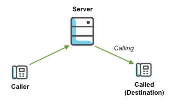

The following is just theoretical.  
Requesting to answer a call via an API would then translate in two possible approaches:

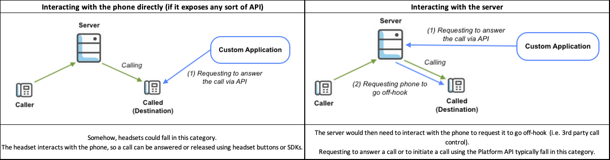

This sounds great in principle. But that doesn’t mean it is implemented and possible with all type of phones.

***So beyond theory, how would this work with Genesys Cloud?***

When it comes to SIP Phones, Genesys Cloud supports the Broadsoft Extensions SIP Event Package for remote talk/hold.

**Answer Call:**  
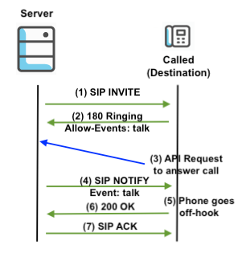

A phone can advertise support for remote answer in the 180 Ringing, adding "Allow-Events: talk" header.
If a custom application requests the server to answer the call, the server will request the phone to go off-hook sending a SIP NOTIFY with "Event: talk" header.  
***The Genesys Cloud Managed Phones support the Broadsoft Extensions for remote talk.***

**Initiate Two-Way Call:**  
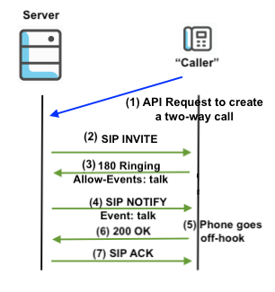

When requesting to create a two-way call, the server will create a leg to the agent's phone first, sending a SIP NOTIFY with "Event: talk" automatically on 180 Ringing.

:::{"alert":"primary","autoCollapse":false}
Genesys Cloud WebRTC Phone is a specific case. WebRTC does not include and define a protocol for the management of sessions (to create, maintain or terminate a session between users).
The approach for answering call via API will be a combination of interacting with the phone directly (as it is embedded in Genesys Cloud Web/Desktop app) and with the server.
:::


### 3. Maintain Persistent Connection setting:

The ability to [maintain a persistent connection](https://help.mypurecloud.com/articles/terminate-persistent-connection-genesys-cloud-webrtc-phone/) is a Genesys Cloud feature that can be enabled at the phone (or phone base settings) level.

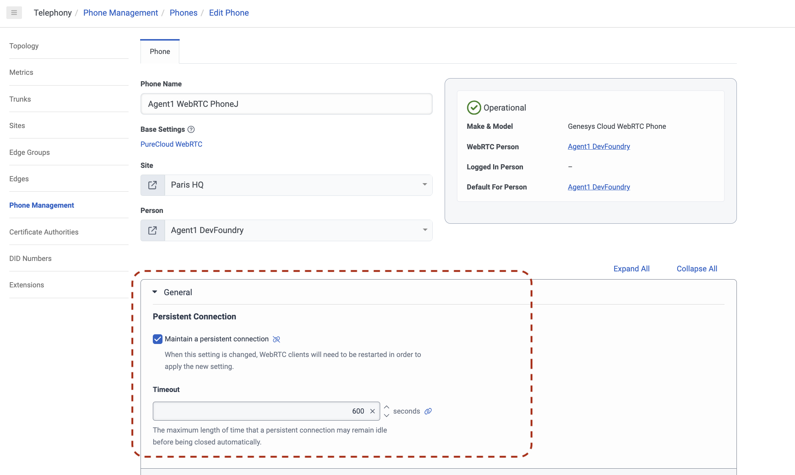

*"The persistent connection feature is designed to improve Genesys Cloud’s ability to process subsequent calls. More specifically, when a call comes in to an agent, Genesys Cloud establishes a connection to the agent’s Genesys Cloud WebRTC phone and then passes the call to the agent. Once the call is complete and the agent hangs up, Genesys Cloud terminates the call, but leaves the connection to the agent’s WebRTC phone intact."*

What it means is that the agent's phone remains connected to Genesys Cloud once the conversation with the customer is completed (i.e. when the agent requests to end the conversation via Genesys Cloud Web/Desktop app or Platform API, or when the customer hangs up).   
From a Platform API perspective, there is no active "conversation (if the logged in user invokes [GET /api/v2/conversations](/devapps/api-explorer#get-api-v2-conversations), no Genesys Cloud conversation context will be returned).  
But from a telephony standpoint, there is still an active call/session between Genesys Cloud and the agent's phone.

***Note that the connection will be terminated if no new conversation is received before the Persistent Connection timeout elapses.***


:::{"alert":"warning","autoCollapse":false}
Unfortunately, at this time, there is no Platform API endpoint which allows retrieving the status of a persistent connection for a given phone.
:::

Please note that although the ability to maintain a persistent conection was developped with the use of WebRTC endpoints in mind, this feature is also available when using other phone types: Managed Phone, Remote Phone, Generic SIP Phone (Unmanaged).

When using a Genesys Cloud WebRTC Phone with Genesys Cloud Web app or with Genesys Cloud Embeddable Framework, the ability to terminate a persistent connection is made available in the user interface.

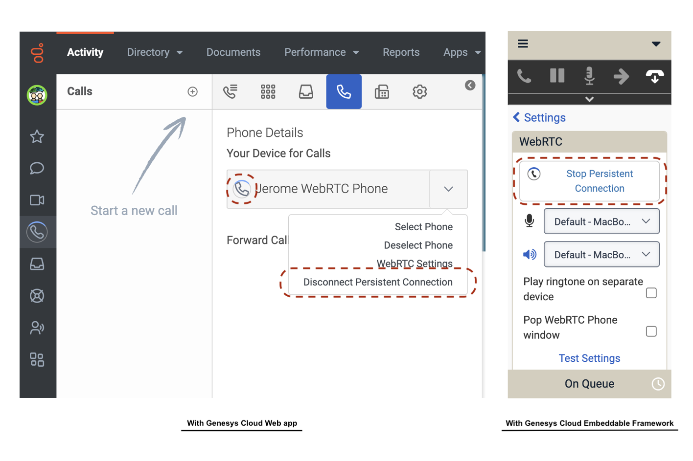


## Support by Phone Type and User Interface

### Using Genesys Cloud WebRTC Phones

1. Genesys Cloud Web/Desktop app and Allow Placing Calls with another app

:::{"alert":"warning","autoCollapse":false}
***When using the Genesys Cloud Web/Desktop app along with a Genesys Cloud WebRTC Phone*** and initiating a call via Platform API (from a custom application), it is required to [allow the user to place calls with another app](https://help.mypurecloud.com/articles/allow-apps-to-place-calls/).  
:::

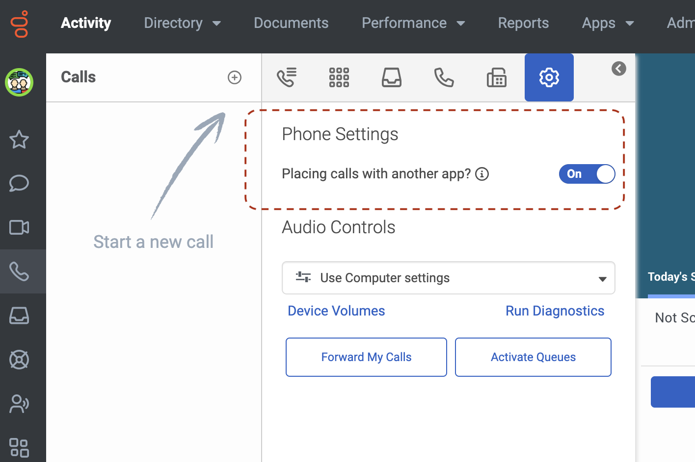

This setting is not managed centrally using the Genesys Cloud Admin UI. Each user must enable this setting from his Genesys Cloud Web/Desktop app.  
Please also note that the setting is saved in browser's cookies. It will remain set (until/unless the cookie expire or is removed).

2. Platform API and "*Maintain Persistent Connection*" setting

If "*Maintain Persistent Connection*" setting is **disabled**, it will **NOT** be possible to answer a call using the Platform API (when the endpoint is the embedded Genesys Cloud WebRTC Phone).

If "*Maintain Persistent Connection*" setting is **enabled**, answering a call using the Plaform API is **only** possible while there is an active persistent connection (i.e. the WebRTC Phone is already connected to Genesys Cloud over a voice session). Trying to answer the call outside of an active persistent connection will also fail.  
A workaround to reduce the possibility that a user does not have an active persistent connection would to be periodically and programmatically generate calls (when the user is not involved on an ACD voice conversation/when the user is inactive on voice channel). The call would be generated to a destination than answers and automatically disconnects the call (so the user side program only needs to care about creating a call periodically).  

This is explained in more details below with the [use of the "*FrceDisconnect*" Architect sample flow](#appendix-a-sample-forcedisconnect-architect-inbound-call-flow).

3. Support

The following settings and behavior are required to support answering a call or placing a call using Platform API:
- User's Phone/Phone Base Settings: Enable "Maintain Persistent Connection" at the phone or the phone base settings level (Genesys Cloud centralized configuration)
- User's Genesys Cloud Web/Desktop app: Allow "Placing calls with another app" (Genesys Cloud Web/Desktop app - local/cookie setting)
- Custom code: Periodically generate calls (it can be to a destination that will disconnect almost immediately - e.g. an Architect Inbound Call flow) to maintain a persistent connection active.

If you are using **Genesys Cloud Embeddable Framework**, it is strongly recommended to leverage `Interaction.updateState(action=pickup)` and `clickToDial(type=call)` actions, as this **will provide full support for programmatic answer call or make call** (*"Maintain Persistent Connection" setting can be Enabled or Disabled*).


### Using Managed SIP Phones or Generic SIP Phones (with Broadsoft Extensions support)

Answering a call or placing a call using Platform API **is fully supported** (*"Maintain Persistent Connection" setting can be Enabled or Disabled*).  
This is applicable to Genesys Cloud Embeddable Framework and to Genesys Cloud Web/Desktop app.

If you are using Genesys Cloud Embeddable Framework, the use of `Interaction.updateState(action=pickup)` and `clickToDial(type=call)` actions **is fully supported** as well (*"Maintain Persistent Connection" setting can be Enabled or Disabled*).


### Using Remote Phones or Generic SIP Phones (no remote answer support)

Answering a call using Platform API **is NOT supported** (to be more specific, it is only supported while the phone is on an active persistent connection - the request will not be processed otherwise).  
Placing a call using Platform API is supported but it will still require the agent to manually answer the incoming call on the phone (Two-way call generated from Genesys Cloud).  
This is applicable to Genesys Cloud Embeddable Framework and to Genesys Cloud Web/Desktop app.

If you are using Genesys Cloud Embeddable Framework, `Interaction.updateState(action=pickup)` action **is NOT supported** (to be more specific, it is only supported while the phone is on an active persistent connection - the request will not be processed otherwise).  
And placing a call using `clickToDial(type=call)` action will still require the agent to manually answer the incoming call on the phone (Two-way call generated from Genesys Cloud).


## Closing Thoughts

You should now have the necessary information to understand when a call can be answered or initiated using the Platform API, and when it is not possible.

Thank you and have fun!

---
---

## Appendix A: Sample "*ForceDisconnect*" Architect Inbound Call flow

:::{"alert":"primary","autoCollapse":false}
As mentioned in [Using Genesys Cloud WebRTC Phones](#using-genesys-cloud-webrtc-phones), there is a limitation when requesting to answer a call using Genesys Cloud Platform API and when there is no active persisted connection.  
In order to force the user to be in a persistent connection, a 3rd party application could periodically initiate a call (Platform API request to make a call) to a device, which would automatically disconnect this call.
:::

The "device" that we could call is an Architect Inbound Call flow.  
This Architect Inbound Call flow (e.g. named "ForceDisconnect" here) would contain a short silence and a Disconnect action in it.

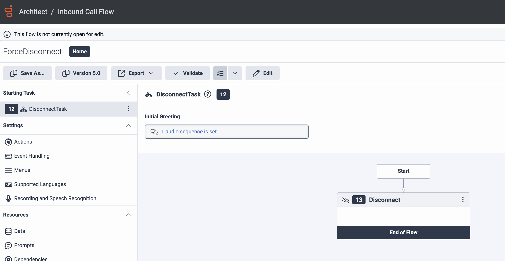

*Note: I still recommend to set a 3 seconds silence so that the call is long enough and not to create side effects for being too short.*

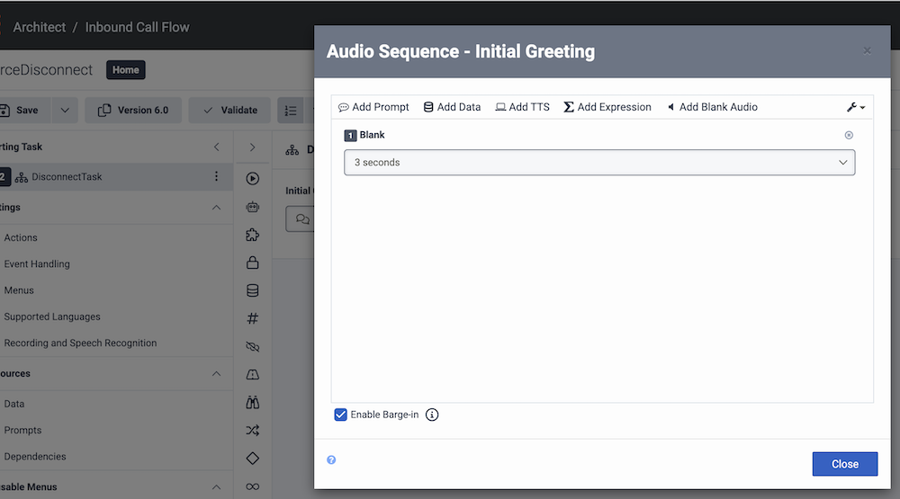

And periodically initiating calls to *ForceDisconnect@localhost* (i.e. URI encoded name of the flow) using [POST /api/v2/conversations/calls](/devapps/api-explorer#post-api-v2-conversations-calls). The call will automatically be disconnect by the Architect flow - as it is a non-ACD call, wrapup-up code do not need to be set to terminate the conversation).

```{"language": "json"}
POST /api/v2/conversations/calls
{
    "phoneNumber":"ForceDisconnect@localhost"
}
```

---
---

## Appendix B: In details Phone Type and settings

The tables presented below describe different modes for answering or for initiating a call (e.g. answer in Genesys Cloud Web/Desktop app, answer on the phone, [Auto-Answer enabled for the agent (Genesys Cloud feature)](https://help.mypurecloud.com/?p=84007), ...).  
The purpose here was not to decide whether one mode made sense or didn't - but rather to be as exhaustive as possible so you understand how each mode would affect a voice conversation.


### With Genesys Cloud WebRTC Phones

#### Answer Call

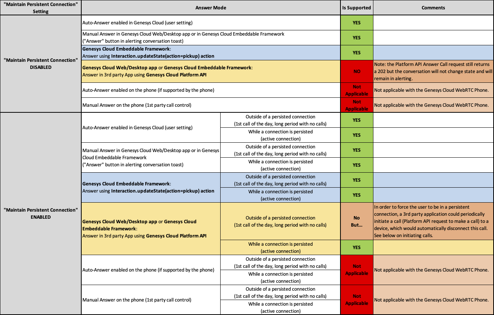

If "*Maintain Persistent Connection*" setting is **enabled**, answering a call using the Plaform API is **only** possible while there is an active persistent connection (i.e. the WebRTC Phone is already connected to Genesys Cloud over a voice session). Trying to answer the call outside of an active persistent connection will also fail.  
A workaround to reduce the possibility that a user does not have an active persistent connection would to be periodically and programmatically generate calls (when the user is not involved on an ACD voice conversation/when the user is inactive on voice channel). The call would be generated to a destination than answers and automatically disconnects the call (so the user side program only needs to care about creating a call periodically).  
This is explained in more details below with the [use of the "*ForceDisconnect*" Architect sample flow](#appendix-a-sample-forcedisconnect-architect-inbound-call-flow).

#### Make Call

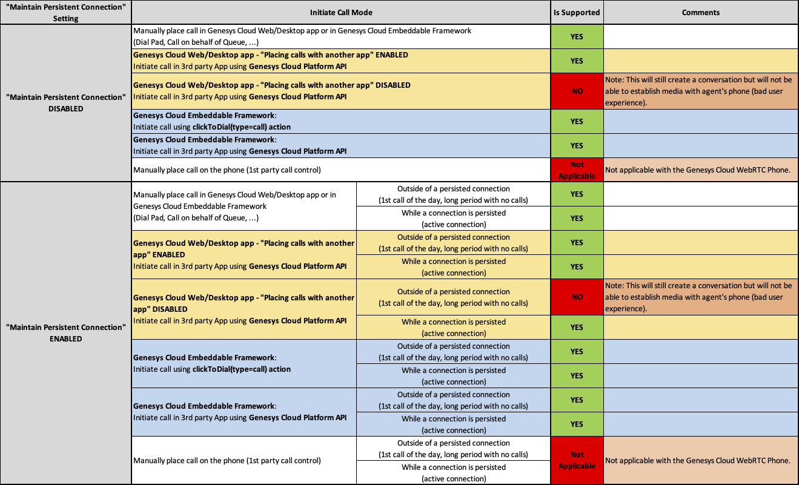


### With Managed Phones (SIP)

#### Answer Call

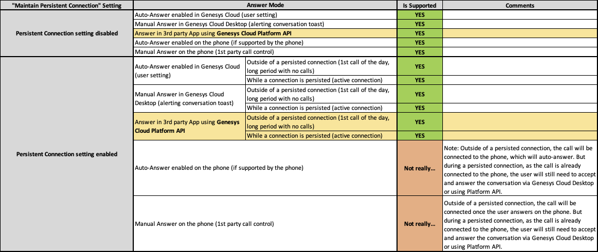

#### Make Call


### With Remote Phones

#### Answer Call

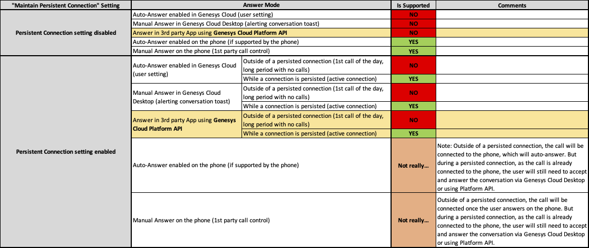

#### Make Call

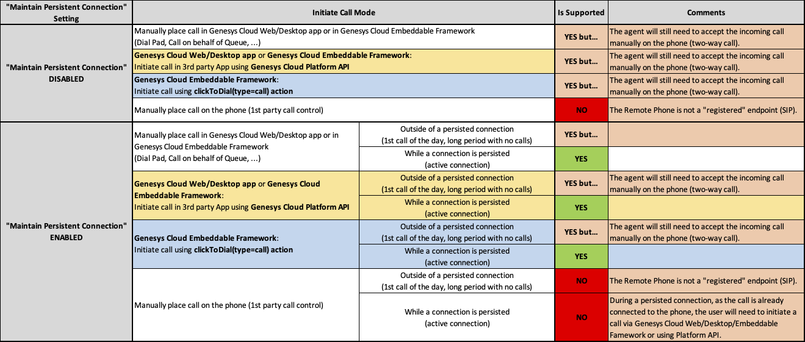


### With Generic SIP Phone (Unmanaged) supporting of Broadsoft Extensions

#### Answer Call

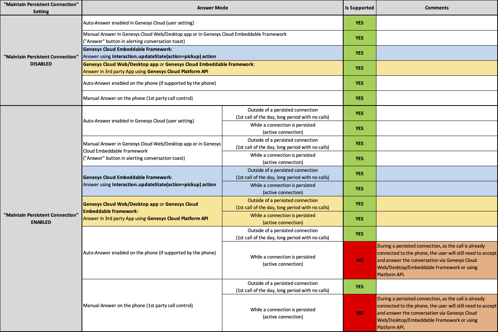

#### Make Call


### With Generic SIP Phone (Unmanaged)

#### Answer Call

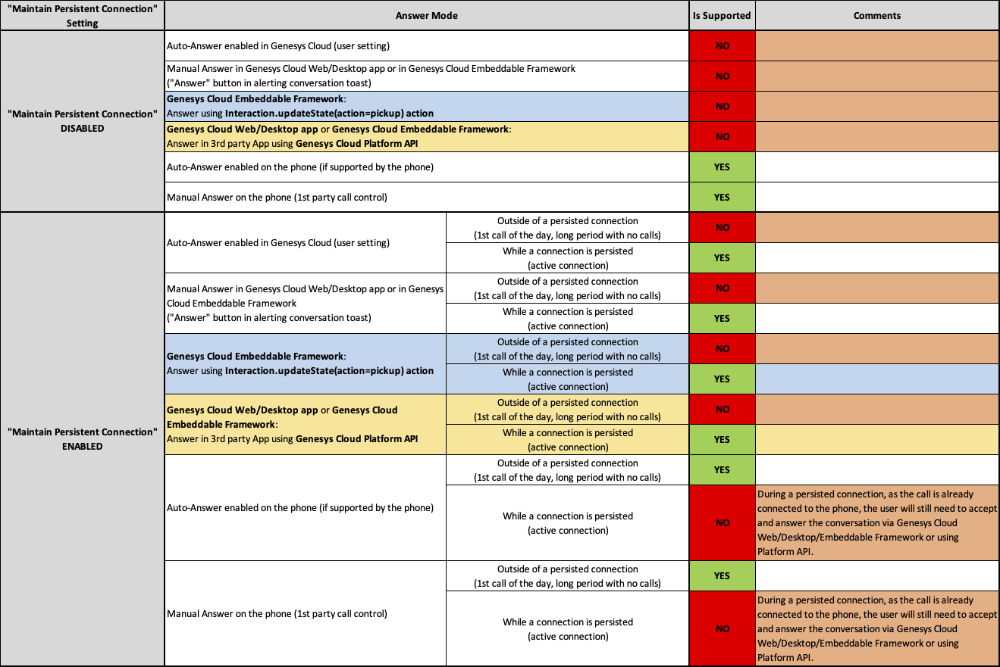

#### Make Call

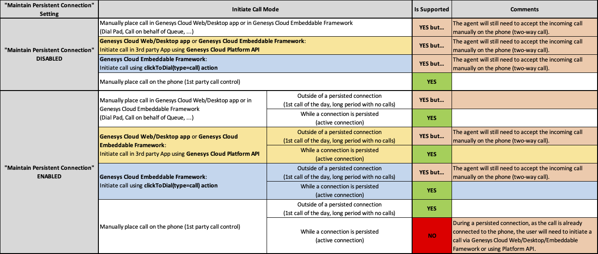


