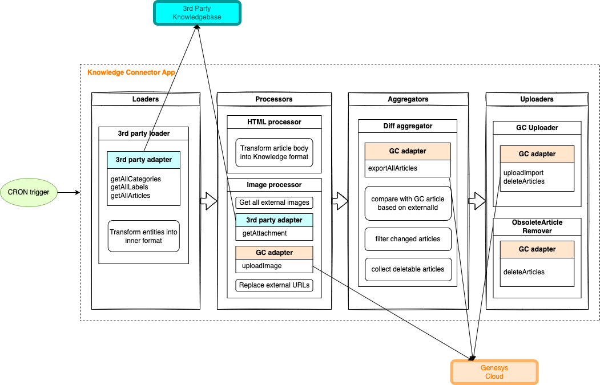

## Overview

This open source Node.js application provides a sample implementation for syncing data into Genesys Knowledge.
You can customize it to create your custom connectors between your own knowledge management solution and Genesys Knowledge.

## Common use cases:
- Sync articles from 3rd party Knowledge Bases to Genesys Knowledge
- Sync from one Genesys Organization to the other

## Features
- The sample data loader implementations can be used as starting points to implement your own
- HTML converter that converts articles from HTML to Genesys Knowledge's JSON format
- Image uploader for transferring attachments from the source solution to Genesys Assets Management service
- Syncing only the new and updated entities

## How it works

### Configuration
The configuration contains data for connecting to the source system and Genesys Cloud's API as well.
For API-based systems, you need to configure the base URL of the API and Client ID, Client Secret for authentication.

[Configuration](https://github.com/MyPureCloud/knowledge-connector-app/wiki/Configuration)

### Execution
When the app is run, it performs the following actions:

1. Fetches data from source system
2. Transforms data into Genesys Knowledge format
3. Uploads new images
4. Uploads new and updated articles to the target Knowledge Base
5. Removes articles from target Knowledge Base which have been deleted from the source system since the last run of the app

[Run the app](https://github.com/MyPureCloud/knowledge-connector-app/wiki/Run)

## Using with your own Knowledge Management System

For using this application to sync data from your Knowledge Management System, you need to create
a data loader class that implements the Loader interface. You can find sample implementations in the repository.

[How to create your own Loader](https://github.com/MyPureCloud/knowledge-connector-app/wiki/Loader)

## Structure

## Resources
- Open source project repository: https://github.com/MyPureCloud/knowledge-connector-app
- Project documentation: https://github.com/MyPureCloud/knowledge-connector-app/wiki
