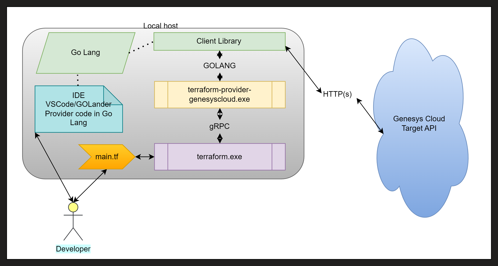
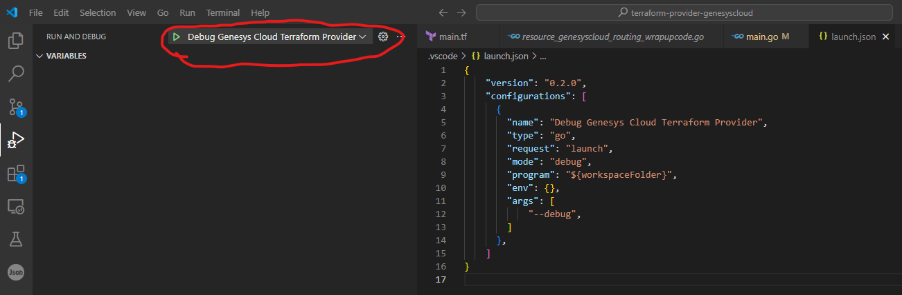
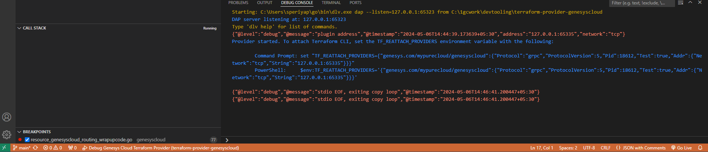
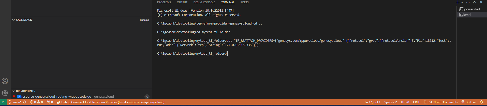
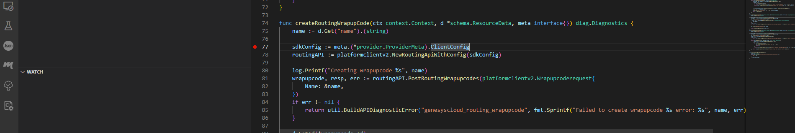
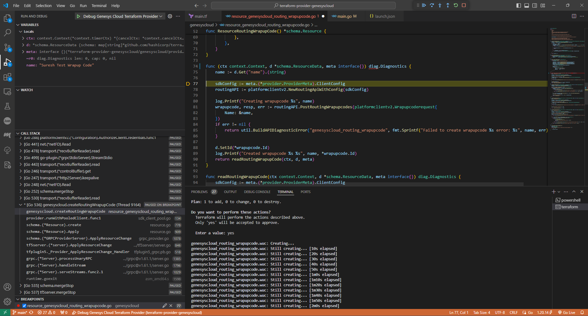

Greetings, everyone! In this blog post, I will demonstrate how to live debug the Genesys Terraform Provider source code alongside Terraform Core.

## Overview

When started with the task of debugging Terraform, our initial reflex is often to seek out methods for enabling logging and tracing through the generated logs. This instinctive approach reflects a common starting point for troubleshooting within the Terraform environment. That is very obvious method and that is absolutely correct for QuickStart approach. However, one notable challenge in this approach is the abundance of logs generated by [Terraform Core](https://developer.hashicorp.com/terraform/plugin/how-terraform-works#terraform-core), which can sometimes complicate the debugging process. But, our primary objective is to debug the code of the [custom Terraform provider plugin](https://developer.hashicorp.com/terraform/plugin/how-terraform-works#terraform-plugins) that we've developed. There are multiple ways for debugging the custom provider plugin code. These include: 1) Enabling Terraform Provider plugin level logging, 2) Conducting live debugging of the provider plugin "terraform-provider-genesyscloud in our case", and 3) Running acceptance testing to trace logs and confirm results.

## Enabling Logging

Enabling logging is a straightforward process. Depending on our requirements, we simply need to set the appropriate environment variable(s). For example, to enable logging for both Terraform Core and the Provider Plugin, we set the "TF_LOG" variable. Alternatively, to enable logging specifically for the Provider Plugin, we set the "TF_LOG_PROVIDER" environment variable. For further guidance, please consult the Terraform documentation on [Managing Log Output](https://developer.hashicorp.com/terraform/plugin/log/managing).


## Live Debugging with VS Code

Live debugging involves multiple components, including the Go language (with the recommended version being go1.20.14 for the Genesys provider), Terraform Core, the debugger Delve, and an integrated development environment (IDE) such as VSCode or GoLander. Additionally, a sample main.tf file is required for testing and debugging. For detailed guidance on plugin development, please refer the [provider resource](https://developer.hashicorp.com/terraform/plugin).

### Components



### Setup
To begin, clone the source code from the GitHub repository at https://github.com/MyPureCloud/terraform-provider-genesyscloud. Next, install the Go Lang version (go1.20.14) from the Archived version list, accessible through this link: https://go.dev/dl/, as the Genesys provider is specifically built with this version. Additionally, choose an IDE—either VSCode or GoLand—for your work. In this blog post, I have used VSCode for the demonstration.

### Genesys Cloud Terraform Provider Document
The Genesys Cloud provider implements resources to interact with the Genesys Cloud Public API. For more details [refer here](https://registry.terraform.io/providers/MyPureCloud/genesyscloud/latest/docs).

### Main Terraform file

```terraform
terraform {
  required_providers {
    genesyscloud = {
      source  = "genesys.com/mypurecloud/genesyscloud"
      version = "0.1.0"
    }
  }
}

provider "genesyscloud" {
  oauthclient_id     = <--->
  oauthclient_secret = <--->
  aws_region         = "<region>"
  sdk_debug          = true
}

resource "genesyscloud_routing_wrapupcode" "wuc" {
  name = "Test Wrapup Code"
}
```

### Source Code (main function from main.go file)

Ensure that the code in the main function in the main.go file is set for debugging:

```go
func main() {
    var debugMode bool
    flag.BoolVar(&debugMode, "debug", false, "set to true to run the provider with support for debuggers like delve")
    flag.Parse()
    providerResources = make(map[string]*schema.Resource)
    providerDataSources = make(map[string]*schema.Resource)
    resourceExporters = make(map[string]*resourceExporter.ResourceExporter)
    registerResources()
    opts := &plugin.ServeOpts{ProviderFunc: provider.New(version, providerResources, providerDataSources)}
    if debugMode {
        opts.Debug = true
        //opts.ProviderAddr = "registry.terraform.io/mypurecloud/genesyscloud"   //<- comment this line of code
         opts.ProviderAddr = "genesys.com/mypurecloud/genesyscloud"               //<- add this new line of code. Make sure that the value of the "source" field in your main.tf file is matching with this line. This is the line enables to debug your code in the debugger with break points after setting TF_REATTACH_PROVIDERS the environment variable.
    }
    plugin.Serve(opts)
}
```

### Build the source code

Go to the path where "terraform-provider-genesyscloud" is cloned, then run the command 1) `make build` 2) then run `make sideload`. Now your latest changes have been completed and the provider plugin has been copied into the terraform plugin path.

### Debugging

Load VSCode with the "terraform-provider-genesyscloud" source, Next, create a launch.json file in VSCode and add a new debug configuration:

```json
{
    "version": "0.2.0",
    "configurations": [
      {
        "name": "Debug Genesys Cloud Terraform Provider",
        "type": "go",
        "request": "launch",
        "mode": "debug",
        "program": "${workspaceFolder}",
        "env": {},
        "args": [
            "--debug",
        ]
      },
    ]
}
```
**Note:** make sure you save launch.json file, now you will see something as below in your VSCode, all set to trigger the debugger with your provider code.



Click on the **Debug Genesys Cloud Terraform Provider** on the debugger explorer, it will take few seconds to load the source with delve debugger in your VSCode environment. 

Choose DEBUG CONSOLE window as shown below.



Then copy the line that has TF_REATTACH_PROVIDERS environment variable based on the OS is which you are working.

Open new terminal window in VSCode itself as shown below and set the environment variable TF_REATTACH_PROVIDERS.



Set break point in to any file that you want to debug **e.g.resource_genesyscloud_routing_wrapupcode.go** in the `createRoutingWrapupCode` as our code in `main.tf` is to created new *wrap-up* code.



Run the `terraform init`
Then run `terraform apply` 
Now you will see the break point has been hit by the debugger :)



Happy Debugging! Thanks for reading!

