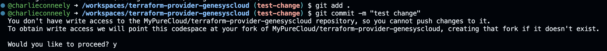

Greetings, all! Welcome back to another Genesys Cloud developer blog. Today, I’ll walk you through the process of adding a field to one of our Terraform resources.

New fields are often added to the request bodies of endpoints in our public API, and we frequently get questions like, “*When will this field be available in the relevant Terraform resource?*” Unlike our SDKs, the Terraform provider code isn’t generated automatically; we update it manually. As a result, new fields can only be added when our team has the time and resources to do so.

But here’s the good news: **CX as Code is open source!** That means you can contribute these changes yourself and get the resource updated in no time.

In this blog, I’ll guide you through every step of the process.

For the purpose of this tutorial, let’s imagine we’re adding a new field, `bar`, to the fictional resource `genesyscloud_foo`. Here’s a breakdown of the main components. 

1. [Getting set up](#dependencies)
1. [Adding the field to the resource schema](#schema)
1. [Including the field in POST & PUT requests](#build)
1. [Reading the field back into our Terraform state](#read)
1. [Updating the docs](#docs)
1. [Testing](#testing)
1. [Ensure code quality](#commands)
1. [Open a pull request](#pr)
1. [Conclusion](#conclusion)

<h2 id="dependencies"> Getting set up </h2>

There are two ways you can set up your dev environment to contribute:

<h4> Option A: Cloning the project and installing the dependencies </h4>

1. Install [Go 1.23](https://go.dev/dl/) and [Terraform](https://developer.hashicorp.com/terraform/tutorials/aws-get-started/install-cli) on your machine. 
1. Fork [our repository](https://github.com/MyPureCloud/terraform-provider-genesyscloud) (Unselect "Copy the main branch only"). 
1. Clone your forked repo locally.
1. Checkout the `dev` branch. You're work should either be done on the `dev` branch, or on another branch that is based off the `dev` branch. 

<h4> Option B: Using GitHub Codespaces </h4>

By using codespaces, you won't have to worry about installing any dependencies—you can just spin up a VM on your browser and get coding.

1. Open the [dev branch](https://github.com/MyPureCloud/terraform-provider-genesyscloud/tree/dev) in your browser. 
1. Select the "Code" dropdown.
1. Click "Create codespace on dev" 

**Note:** At the time of writing this article, we are working off a dev branch branch before merging to main and releasing. This may have changed. If you don't see a branch called `dev` on [terraform-provider-genesyscloud](https://github.com/MyPureCloud/terraform-provider-genesyscloud), you can go ahead and work off of main and select main as the target branch for your pull request.

<h2 id="schema"> Adding the field to the resource schema </h2>

Since we’re adding a field to the `genesyscloud_foo` resource, start by locating the `genesyscloud/foo` package. Within this package, you’ll find the `resource_genesyscloud_foo_schema.go` file. The resource schema is defined as a map where the key is the field name (a string), and the value is a Schema object that describes the field. Refer to the [Terraform Schema documentation](https://pkg.go.dev/github.com/hashicorp/terraform/helper/schema#Schema) to identify the attributes that best fit your use case.

In this blog, we will walk through adding a simple field to a schema, but Terraform also supports more complex types, such as TypeSet and TypeList. 
Here are some examples of more complex fields and their implementation in the Genesys Cloud Terraform provider codebase:

* List of objects: [genesyscloud_architect_datatable - properties](https://github.com/MyPureCloud/terraform-provider-genesyscloud/blob/main/genesyscloud/integration/resource_genesyscloud_integration_schema.go#L45)
* Set of objects: [genesyscloud_architect_user_prompt - resources](https://github.com/MyPureCloud/terraform-provider-genesyscloud/blob/main/genesyscloud/architect_user_prompt/resource_architect_user_prompt_schema.go#L101)
* List of strings: [genesyscloud_outbound_dnclist - dnc_codes](https://github.com/MyPureCloud/terraform-provider-genesyscloud/blob/main/genesyscloud/outbound_dnclist/resource_genesyscloud_outbound_dnclist_schema.go#L57)
* Set of strings: [genesyscloud_architect_ivr - dnis](https://github.com/MyPureCloud/terraform-provider-genesyscloud/blob/main/genesyscloud/architect_ivr/resource_genesyscloud_architect_ivr_schema.go#L63)
* Using a list to represent an object: [genesyscloud_telephony_providers_edges_site - edge_auto_update_config](https://github.com/MyPureCloud/terraform-provider-genesyscloud/blob/main/genesyscloud/telephony_providers_edges_site/resource_genesyscloud_telephony_providers_edges_site_schema.go#L232) (When developing for Terraform, use TypeList or TypeSet with `MaxItems` set to `1` to represent fields in a request body that are JSON objects.)

(Refer to the [Terraform Plugin docs](https://developer.hashicorp.com/terraform/plugin/sdkv2/schemas/schema-types#types) to better understand the types.)

For this example, `bar` is a simple, optional string. Now let's add it to our schema.

```diff
func ResourceFoo() *schema.Resource {
	return &schema.Resource{
		Description: "Genesys Cloud Foo",

		CreateContext: provider.CreateWithPooledClient(createFoo),
		ReadContext:   provider.ReadWithPooledClient(readFoo),
		UpdateContext: provider.UpdateWithPooledClient(updateFoo),
		DeleteContext: provider.DeleteWithPooledClient(deleteFoo),
		Importer: &schema.ResourceImporter{
			StateContext: schema.ImportStatePassthroughContext,
		},
		SchemaVersion: 1,
		Schema: map[string]*schema.Schema{
			"name": {
				Description: "The name of the foo.",
				Type:        schema.TypeString,
				Required:    true,
			},
+			"bar": {
+				Description: "The bar.",
+				Type:        schema.TypeString,
+				Optional:    true,
+			},
		},
	}
}
```

<h2 id="build"> Including the field in POST & PUT requests </h2>

Now that we have added the field to our schema, we want to build it in our create and update functions to be sent to the API. These functions can be found in the file `genesyscloud/foo/resource_genesyscloud_foo.go` 

These functions read data from the Terraform resource, build the request body in the form of a Go struct, and then invoke the relevant POST/PUT endpoint using our Go platform SDK. 

The `name` field is already being built. Now we just need to include `bar`.

```diff
func createFoo(ctx context.Context, d *schema.ResourceData, meta interface{}) diag.Diagnostics {
	// ...

	// Defining an instance of the struct 
	var foo platformclientv2.Foo 

	name := d.Get("name").(string)
	foo.Name = &name

+	// Setting the value for Bar, if the Terraform user provided one
+	bar, _ := d.Get("bar").(string)
+	if bar != "" {
+		foo.Bar = &bar
+	}

	responseBody, apiResponse, err := p.createFoo(foo)
	// ...
}
```

Now repeat the above in the `updateFoo` function. 

<h2 id="read"> Reading the field back into our Terraform state </h2>

The function `readFoo` will do the opposite. We just created or updated a Foo instance in the API. Now we want to read it back and convert the response body (in the form of a Go struct) to Terraform resource data. 

```diff
func readFoo(ctx context.Context, d *schema.ResourceData, meta interface{}) diag.Diagnostics {
	// ...

	_ = d.Set("name", *foo.Name)

+	if foo.Bar != nil {
+		_ = d.Set("bar", *foo.Bar)
+	}

	// ...
} 
```

**Note:** To take care of all the repetitive nil-checking, we often use functions defined in the `resourcedata` package that utilise generics in Go. With generics, the change will look like this:

```diff
+	resourcedata.SetNillableValue(d, "bar", foo.Bar)
```

<h2 id="docs"> Updating the docs </h2>

This part is really simple. You just need to run `make docs` from the root of the project. All of our docs exist in the `docs` folder and are generated by running this command. 

<h2 id="testing"> Testing </h2>

You’ll find the tests in the file `genesyscloud/foo/resource_genesyscloud_foo_test.go`. These tests use an array of TestStep objects, each containing a config—a string representation of a Terraform configuration. The terraform apply command is executed against these configurations to deploy them. After deployment, the tests verify that the Terraform state values match expectations.

To test your new field, simply add it to the configuration along with a check to validate that everything is working as expected.

```diff
func TestAccResourceFoo(t *testing.T) {
	var (
		resourceLabel = "foo"
		nameAttr      = "test name " + uuid.NewString()
+		fooAttr       = "test foo"
+
+		nameAttrUpdate = "test name update value" + uuid.NewString()
+		fooAttrUpdate  = "a test foo update value"
	)

	resource.Test(t, resource.TestCase{
		PreCheck:          func() { util.TestAccPreCheck(t) },
		ProviderFactories: provider.GetProviderFactories(providerResources, providerDataSources),
		Steps: []resource.TestStep{
			// Create
			{
				Config: generateFoo(
					resourceLabel,
					nameAttr,
+					fooAttr, // add new field to the config 
				),
				Check: resource.ComposeTestCheckFunc(
					resource.TestCheckResourceAttr("genesyscloud_foo."+resourceLabel, "name", nameAttr),
+					resource.TestCheckResourceAttr("genesyscloud_foo."+resourceLabel, "foo", fooAttr), // verify its value after a TF deployment
				),
			},
			// Update
			{
				Config: generateFoo(
					resourceLabel,
					nameAttrUpdate,
+					fooAttrUpdate,
				),
				Check: resource.ComposeTestCheckFunc(
					resource.TestCheckResourceAttr("genesyscloud_foo."+resourceLabel, "name", nameAttrUpdate),
+					resource.TestCheckResourceAttr("genesyscloud_foo."+resourceLabel, "foo", fooAttrUpdate),
				),
			},
			{
				// Import/Read
				ResourceName:       "genesyscloud_foo." + resourceLabel,
				ImportState:       true,
				ImportStateVerify: true,
			},
		},
		CheckDestroy: testVerifyFooDestroyed,
	})
}

func generateFoo(
	resourceLabel string,
	name string,
+	foo string,
) string {
	return fmt.Sprintf(`resource "genesyscloud_foo" "%s" {
	name = "%s"
+	foo  = "%s"	
-}`, resourceLabel, name)
+}`, resourceLabel, name, foo)
}
```

<h2 id="commands">Ensure code quality</h2>

Inside [MyPureCloud/terraform-provider-genesyscloud](https://github.com/MyPureCloud/terraform-provider-genesyscloud), we defined a GitHub Actions workflow to run a few verification commands. To ensure this workflow will pass after merging your PR, run these commands:

```bash
# If any of these commands produce any changes, commit them. 
make docs
go mod download
go mod tidy
go fmt ./...
```

```bash
# If this command highlights any mistakes in the code, fix and commit them. 
go vet ./...
``` 

```bash
# Run unit tests and ensure none have broken 
export TF_UNIT: '*'
export ENABLE_STANDALONE_CGR: 'true'
export ENABLE_STANDALONE_EMAIL_ADDRESS: 'true'
go test ./genesyscloud/... -v -run TestUnit
```
 
<h2 id="pr">Open a pull request</h2>

If you opened a codespace and do not have write access to our repository, git will ask if you want to create a fork when you are trying to commit your changes. 



After entering yes, you can commit and push your changes to your newly forked repository. 

Next, go to GitHub and open a new pull request from your forked repository. Select `dev` as the target branch. Reviewers will be added to the PR automatically.

<h2 id="conclusion">Conclusion</h2>

In this guide, we've walked through the process of adding a new field to a Terraform resource, including schema updates, integrating the field into create, update, and read operations, and testing your changes. By following these steps, you can help enhance the Genesys Cloud Terraform provider and ensure it stays up to date. 

Keep in mind that adding new functionality to a Terraform provider isn’t always straightforward. If you encounter uncertainties, don’t hesitate to ask for advice or guidance when opening your pull request. The community and maintainers are here to help you succeed and bring your contribution to life. Your contributions are invaluable—thank you for making CX as Code even better!

