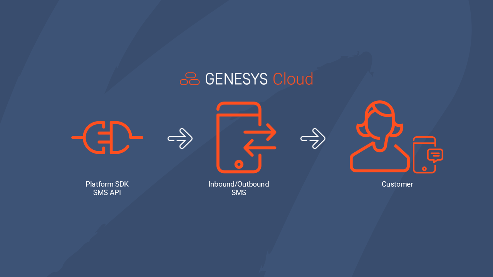

Hello everyone! It's been a while since I last posted a blog.

It came to our attention that using the Agentless SMS API can be a little difficult to understand. This blog will show you how you can send an SMS via the Platform SDK.

## Overview


## Requirements
Before you can use APIs to send SMS messages, you'll need these first:
1. **SMS Number** - You have to purchase an SMS number from Genesys.
2. **Register SMS** - You need to register the SMS number. Read more about it [here](https://help.mypurecloud.com/articles/required-regulatory-documentation-for-sms-number-purchase/).
3. **OAuth** - You need to authenticate as a user using Implicit Grant or Authorization Code Grant.

## What APIs can I use?

### Create an outbound message using *POST /api/v2/conversations/messages*
This endpoint will create an outbound messaging conversation. If there is an existing conversation between the remote address and the address associated with the queue then the result of this request depends on the state of that conversation and the useExistingConversation. If the existing conversation is in alerting or connected state, then the request will fail. If the existing conversation is disconnected but still within the conversation window then the request will fail unless useExistingConversation is set to true.

#### Request Body
The request body consists of the following:
- **queueId** *(required)* - The ID of the queue to be associated with the message. This will determine the fromAddress of the message, unless useUserFromAddress is true and the queue is configured to use the agent's Direct Routing address as the fromAddress.
- **toAddress** *(required)* - The messaging address of the recipient of the message. For an SMS messenger type, the phone number address must be in E.164 format. E.g. +13175555555 or +34234234234. For open messenger type, any string within the outbound.open.messaging.to.address.characters.max limit can be used. For whatsapp messenger type, use a Whatsapp ID of a phone number. E.g for a E.164 formatted phone number `+13175555555`, a Whatsapp ID would be 13175555555.
- **toAddressMessengerType** *(required)* - The messaging address messenger type. In this case, `SMS`.
- **useExistingConversation** - An override to use an existing conversation. If set to true, an existing conversation will be used if there is one within the conversation window. If set to false, create request fails if there is a conversation within the conversation window.

  ```json
  {
    "queueId": "a1b23c4d-ab12-1abc-1234-1a23b4c56789",
    "toAddress": "+631234567890",
    "toAddressMessengerType": "sms",
    "useExistingConversation": true
  }
  ```

#### Response
A response will be as follows:

```json
{
  "id": "a1b23c4d-ab12-1abc-1234-1a23b4c56789",
  "selfUri": "/api/v2/conversations/messages/a1b23c4d-ab12-1abc-1234-1a23b4c56789"
}
```
:::{"alert":"warning","title":"Return status","autoCollapse":false} If the SMS message is sent, it returns a 202. A data action does not expose a 200 or 202.  It just returns successful. :::

### Get conversation details using *GET /api/v2/conversations/messages/{conversationId}*
To check the status of the conversation or SMS message, you can check the conversation using this API. The `conversationId` is the ID returned in the previous API endpoint.

```json
{
  "id": "a1b23c4d-ab12-1abc-1234-1a23b4c56789",
  "participants": [
    {
      ...
      "purpose": "agent",
      "state": "connected",
      "direction": "outbound",
      ...
      "messages": [
        {
          "messageId": "abc12345-ab12-1abc-1234-1a23b4c56789",
          "messageStatus": "delivery-success",
          ...
        }
      ],
      ...
    },
    {
      ...
      "purpose": "customer",
      ...
      "peer": "def67890-ab12-1abc-1234-1a23b4c56789",
      ...
    }
  ],
  ...
}
```

### Get message details using *GET /api/v2/conversations/messages/{conversationId}/messages/{messageId}*
To get the message text and status, you will need this endpoint. The `messageId` can be found in the previous API endpoint under the agent participant.

```json
{
  ...
  "messengerType": "sms",
  "textBody": "testing",
  "status": "delivery-success",
  ...
}
```

### Send outbound SMS message using *POST /api/v2/conversations/messages/{conversationId}/communications/{communicationId}/messages*
To send an outbound SMS message, to the customer, use this API endpoint. The `communicationId` can be found in the get conversation details API endpoint in the `peer` value under the customer participant.

#### Request body

```json
{
  "toAddressMessengerType": "sms",
  "toAddress": "+631234567890",
  "queueId": "a1b23c4d-ab12-1abc-1234-1a23b4c56789",
  "textBody": "Hello world!"
}
```

## About Message Status
The message will transition through several statuses.
1. **Queued** - The request's message has passed initial validation and is being processed.
2. **Sent** - The message is sent to the carrier.
3. **Delivery-success/failure** - The final state of that message.

:::The time between Queued and Sent is typically seconds. The time between Sent and Delivery-success/failure can be minutes, hours or days. Every status is published publicly to a notification topic, as well as being visible directly with a GET conversation request. Delivery-failures also show an error body to help explain why it failed. :::