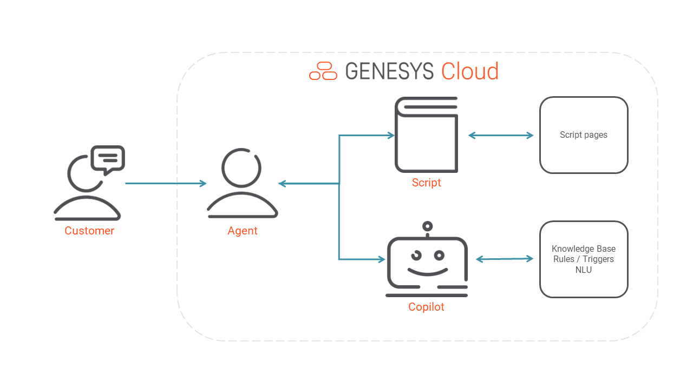

Hello everyone! Did you know you can setup Agent Copilot via API? This way, you can build your own Agent Assist where you can use Genesys to do the base and customize information with additional context from other LLMs.

## Overview

## Prerequisites
- **Add-ons and License:** Genesys Cloud CX 1, Genesys Cloud CX 1 Digital Add-on II, Genesys Cloud CX 1 WEM Add-on II, Genesys Cloud CX 2, Genesys Cloud CX 2 Digital, Genesys Cloud CX 2 WEM Add-on I, Genesys Cloud CX 3, or Genesys Cloud CX 3 Digital license
- **Role:** Agent Copilot Admin

## What APIs to use

1. Configure Assistant / Copilot
  - [POST /api/v2/assistants](/devapps/api-explorer#post-api-v2-assistants) - Create an Agent Assistant.
  - [PUT /api/v2/assistants/{assistantId}/copilot](/devapps/api-explorer#put-api-v2-assistants--assistantId--copilot) - Configure advanced features of a Copilot, on an assistant (this is only available for Agent Copilot Admin role, this sub-resource of an assistant can be seen and edited only by users licensed for Copilot).
  - [GET /api/v2/assistants](/devapps/api-explorer#get-api-v2-assistants) - Get all assistants. (`?tier=Copilot|AgentAssist` can filter for the proper tier product).
  - [GET /api/v2/assistants/{assistantId}](/devapps/api-explorer#get-api-v2-assistants--assistantId-) - Gets an assistant config. Use with `?expand=copilot` to get all config of an Agent Copilot, this will include the advanced feature config as well.
 
2. Attach Copilot to a queue
  - [PATCH /api/v2/assistants/{assistantId}/queues](/devapps/api-explorer#patch-api-v2-assistants--assistantId--queues) - Attach an assistant / copilot to queues. One assistant can be attached to many queues, but one queue can only have one assistant. If you attach assistant B to queue that has already assistant A, then assistant B will replace assistant A on that queue.
  - [GET /api/v2/assistants/{assistantId}/queues/{queueId}](/devapps/api-explorer#get-api-v2-assistants--assistantId--queues--queueId-) - Gets queues of an assistant
  - [GET /api/v2/routing/queues/{queueId}/assistant](/devapps/api-explorer#get-api-v2-routing-queues--queueId--assistant) - Gets an assistant (if any) of a queue.

3. Runtime
  - You need to have a digital or voice conversation on a queue, which has agent assist or copilot attached, and generate messages between a customer and agent participant. Agent Assist / Copilot is reacting to `ConversationEvent` and `VoiceTranscriptEvent`, and generating it’s own suggestion events in response.

4. Get suggestions API
  - [GET /api/v2/conversations/{conversationId}/suggestions](/devapps/api-explorer#get-api-v2-conversations--conversationId--suggestions)

5. Get summaries API
  - GET /api/v2/conversations/{conversationId}/summaries *(Coming soon)*

6. Agent Engagement with a suggestion
  - [POST /api/v2/conversations/{conversationId}/suggestions/{suggestionId}/engagement](/devapps/api-explorer#post-api-v2-conversations--conversationId--suggestions--suggestionId--engagement) - Only used by Copilot. Giving feedback on a suggestion, and flagging that a suggestion was `opened`, `copied` or `dismissed`. This changes the status of the suggestion (GET API will tell the updated status), and also fires a new Kafka event with the updates status. Our Copilot panel only listens to **Suggested** status, while e.g. scripter listens to `ScriptSuggestionEvent` with **Accepted** status, that’s how other UI components can also listed to the same suggestions, or to a specific state of them (e.g. when the agent already clicked on it).

7. Knowledge feedback
  - [POST /api/v2/knowledge/knowledgebases/{knowledgeBaseId}/documents/{documentId}/feedback](/devapps/api-explorer#post-api-v2-knowledge-knowledgebases--knowledgeBaseId--documents--documentId--feedback) - Agent Assist only uses this feedback endpoint to send it to knowledge (Knowledge Optimizer, etc), and Copilot is also sending it in case of using knowledge related suggestions.

8. Hawk events
  - Agent Assist suggestions:
    - **v2.conversations.{id}.suggestions**  – Contain multiple knowledge suggestions per event.
  - Agent Copilot suggestions:
    - **v2.conversations.{id}.suggestions.intent** *(Coming soon)* – An update on the active intent, and intents / slots recognized so far in the conversation by copilot.
    - **v2.conversations.{id}.suggestions.knowledge.search** – A single knowledge article (with answer highlight) suggestion, from “fallback” rule: knowledge search.
    - **v2.conversations.{id}.suggestions.knowledge.article** – A single knowledge article (with answer highlight) suggestion, triggered by a rule.
    - **v2.conversations.{id}.suggestions.knowledge.response** – A single canned response suggestion, triggered by a rule.
    - **v2.conversations.{id}.suggestions.knowledge.script** – A single script navigation suggestion, triggered by a rule.
  - Other events for both Agent Assist & Copilot:
    - **v2.conversations.{id}.transcripts** – Real-time transcript events.
    - **v2.users.{id}.conversations.summaries** – Event about a generated summary. Some fields are only filled for copilot.

:::primary
Although we don’t send data to scripter (e.g. for form fill) on the ui yet, the above suggestions make it available to use entity recognition as well.
:::

### Demo
See Agent Copilot in action in the demo below:

<video src="images/demo.mp4" controls></video>

## Additional resources 
1. [API Explorer](/devapps/api-explorer-standalone)
2. [About Genesys Agent Copilot](https://help.mypurecloud.com/articles/about-genesys-agent-copilot/)
3. [Work with Genesys Agent Copilot](https://help.mypurecloud.com/articles/work-with-genesys-agent-copilot/)