Hello everyone! Something really cool and pretty useful is about to be released in January - Genesys Cloud Functions!!!

This blog aims to introduce you to this new Genesys Cloud Functions integration and a couple of [Genesys Function examples we have made available for you this github repo](https://github.com/MyPureCloud/quick-hits-javascript/genesys-functions).

_**Table of Contents:**_
* [What is this new Genesys Cloud Functions integration?](#what-is-this-new-genesys-cloud-functions-integration-)
* [Pre-requisites](#pre--requisites)
* [Starting integration setup](#starting-integration-setup)
* [Enable access to Genesys Cloud Function Data Actions](#enable-access-to-genesys-cloud-function-data-actions)
* [Constraints and Limits](#constraints-and-limits)
    - [Supported Runtimes](#supported-runtimes)
    - [Function Requirements](#function-requirements)
    - [Function Restrictions](#function-restrictions)
    - [Function Security](#function-security)
    - [API Rate Limits](#api-rate-limits)
* [Function Inputs](#function-inputs)
    - [Event](#event)
    - [Context](#context)
* [Function Error Handling](#function-error-handling)
* [Creating a Genesys Function Data Action for JWE Encrypt and Decrypt](#creating-a-genesys-function-data-action-for-jwe-encrypt-and-decrypt)
    - [Create and prepare the data action (contract and configuration)](#create-and-prepare-the-data-action--contract-and-configuration-)
    - [Create your code, test it and package it](#create-your-code--test-it-and-package-it)
    - [Explaining example](#explaining-example)
    - [Finalize Data Action Function Configuration](#finalize-data-action-function-configuration)
    - [Upload the function zip](#upload-the-function-zip)
    - [Ready to test your new Data Action](#ready-to-test-your-new-data-action)
    - [JWE Encrypt and Decrypt - Variation with Status](#jwe-encrypt-and-decrypt--variation-with-status)
* [Closing thoughts](#closing-thoughts)
* [Additional resources and references](#additional-resources-and-references)


## What is this new Genesys Cloud Functions integration?

You may already be familiar with one of [the Genesys Cloud Data Actions integrations](https://help.mypurecloud.com/?p=209478), and you may have used one of them, being the Web Services Data Actions integration, or the Genesys Cloud Data Actions integration, or the AWS Lambda one.

*So what is different with the Genesys Cloud Functions integration?*

Genesys Cloud customers can now save, invoke and **run their own function code** (NodeJs at the time of this blog post), in their Genesys Cloud environment, using the standard Data Action mecanisms (invoked from an Architect Flow, from a Script, or via API).  
This is achieved using AWS Lambda to run such code. **The Genesys Cloud customers do not need to have their own AWS account to run the Genesys Cloud Functions. This is transparently managed in your Genesys Cloud Environment.**

You can therefore do a lot with them - encryption/decryption, access to a 3rd party Web Services and reformating XML response or managing errors in the lambda function code, sending multiple requests to a 3rd party via a single Genesys Cloud Function invocation, ...  
Some limits are still imposed when using such functions - maximum execution time, max input/output length, ... - as listed later in this blog.

## Pre-requisites

***Genesys Cloud Knowledge***

Persons wishing to use Function Data Actions should be familiar with Data Actions, and the mechanisms for creating and managing them. Function Data Actions are an extension of Data Actions implemented very similar to Data Actions using the Lambda integration.

Here are several useful references to get you started:
* [About the data actions integrations](https://help.mypurecloud.com/?p=209478) is the general starting point for any data action integration development.
* [About the AWS Lambda data actions integration](https://help.mypurecloud.com/?p=178553) documents our interface mechanism for executing Lambda Functions running from the customers AWS account. Much of this information is applicable to a Function Action because both are AWS Lambdas, they are just managed and run in different environments and accounts. The structure of Lambdas are the same in both use cases.

We also have a pretty cool set of videos on this topic if you prefer to listen to John's mellow voice rather than reading this blog:
* [DevDrop 30: Introduction to Genesys Cloud Functions](https://www.youtube.com/watch?v=0q2lDfteFzk)
* [DevDrop 31: Configuring your Genesys Cloud Function](https://www.youtube.com/watch?v=GEMaP3cPrIk)
* [DevDrop 32: Writing a Genesys Cloud Function Locally](https://www.youtube.com/watch?v=rNjbzeaxv_g)
* [DevDrop 33: Uploading your Genesys Cloud Function](https://www.youtube.com/watch?v=2m92ZJ6HYUE)
* [DevDrop 34: Testing a Genesys Cloud Function](https://www.youtube.com/watch?v=w-4MZfGrNkQ)

***Genesys Cloud Organization (Account) Requirements***

The customer organization must have a GC1, GC2, or GC3 plan to access the Data Actions.

## Starting integration setup

Function Data Actions are actions that run customers' Lambda code in a Genesys Cloud environment. These actions are tied to a new Integration Type, Function Data Actions.

We first need to add a new integration, looking for "Function Data Actions" tile, and give it a name.

*Add a new integration*

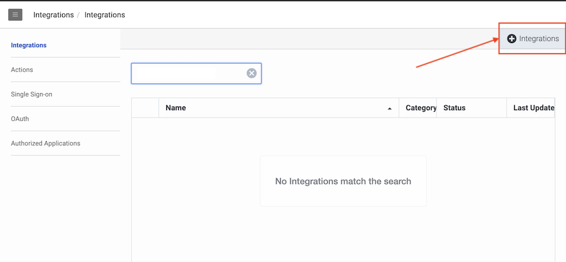

*Select Genesys Cloud Function Data Actions*

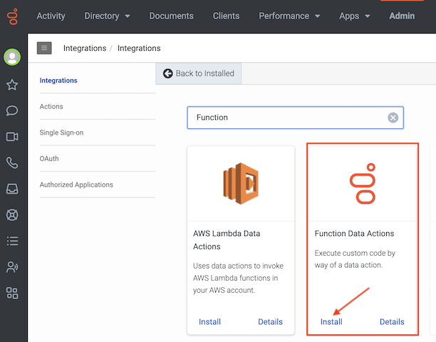

*Give a name to the Genesys Cloud Functions integration*

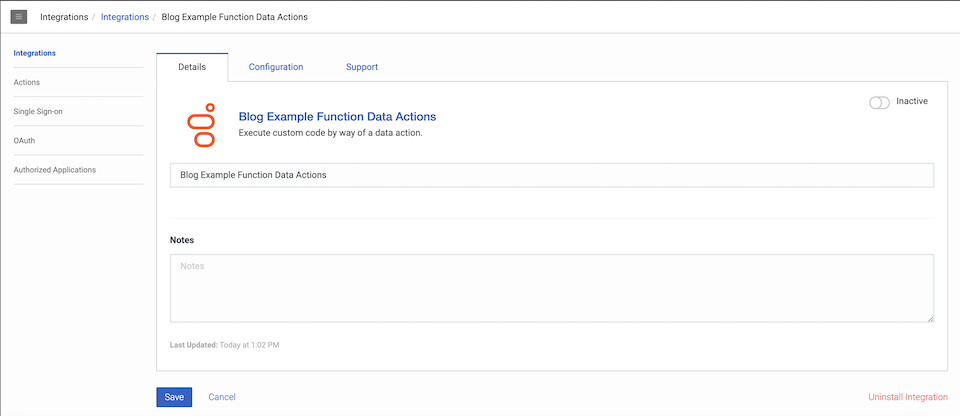

***What else can we do at the integration's configuration level?***

Function Data Action integrations allow custom credentials to be defined at the integration level, and made available to all child Data Actions.

You can indeed store credentials, or a specific API Key, that can you use in your Data Action Request Configurations. But in essence, it does not need to be credentials. It can be any custom variable that you need or want to share across all Data Actions that are tied to this integration.  
Let's give an illustration of this with a Genesys Cloud Function Data Action that will encrypt or decrypt text using JWE (JSON Web Encryption).  

*We will store the Public Key and Private Key, that we will use for JWE Encryption and Decryption, as custom credentials in 'Configuration - Credentials'*


*We need to create 2 new custom Credential Fields - PUBLIC_KEY and PRIVATE_KEY - that we will leverage in our Data Actions.*

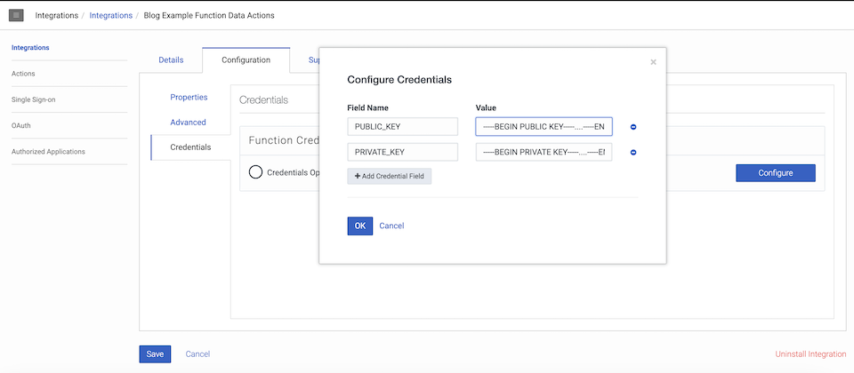

*Once done, we need to activate the integration.*

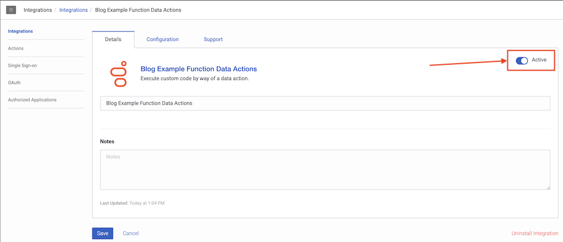

Actions created using the Function Data Action integration will invoke a function via the Genesys Cloud AWS Lambda architecture.  
In most regards a Function Data Action is configured and executed just like all other actions types.

## Enable access to Genesys Cloud Function Data Actions

***Required Permissions***

The following permissions must be set for any role used to create/edit actions in the organization.  
This is done in the Admin user interface Roles editing.

The following pre-existing permissions are required for CRUD, (Create, Update, Delete), and execute of actions including Function based actions.
* *integrations:action:add*
* *integrations:action:view*
* *integrations:action:edit*
* *integrations:action:delete*
* *integrations:action:execute*

*This will allow "Execute" of any Function based action created with the Function CRUD endpoints.*

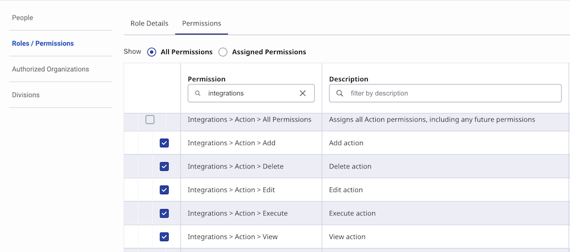

These new permissions are required to use CRUD paths for functions.
* *integrations:actionFunction:view*
* *integrations:actionFunction:edit*

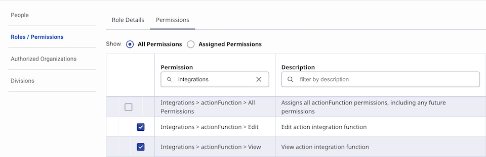

## Constraints and Limits

### Supported Runtimes

NodeJS 18 and 20 are currently supported.  
New runtimes will be supported and old ones deprecated over time.

***Determining Current Runtime Support***

The status of supported runtimes is available via Public API endpoint: `GET /api/v2/integrations/actions/functions/runtimes`.

Example Function Runtimes:

```json
[
    {
        "name": "nodejs20.x",
        "description": "AWS provided Node.js 20.x runtime",
        "status": "Available"
    },
    {
        "name": "nodejs18.x",
        "description": "AWS provided Node.js 18.x runtime",
        "status": "Available"
    },
    {
        "name": "nodejs16.x",
        "description": "AWS provided Node.js 16.x runtime",
        "status": "Deprecated",
        "dateEndOfLife": "2024-06-12"
    }
]
```

***Runtime Deprecation Policy***

We will mark a runtime deprecated 3 months before AWS starts their Phase 1 deprecation ([AWS lambda deprecation policy](https://docs.aws.amazon.com/lambda/latest/dg/lambda-runtimes.html#runtime-support-policy)).

Existing functions can operate until Amazon makes the runtime unavailable. This includes being able to make configuration and code changes.

Functions cannot be created or updated to use a deprecated runtime.  
Functions can be modified to use a new runtime.  
If a function is using an "Unavailable" runtime, the only configuration change that may be made is to use an "Available" runtime.

### Function Requirements

The details of editing the Function are very specific to the Runtime being used but there are several things that are in common.  
All functions must conform to the AWS Lambda interface requirements for serverless deployment. This will include having an invocation handler that conforms to the AWS invocation specification for the runtime chosen.

The resulting function will be a set of source files in a directory structure along with dependencies. The function file directory must be packaged into a ZIP file that will allow it to be deployed and executed. The package will have a module and function that is the handler for the invocation.

### Function Restrictions

**The implementation of the environment used to execute the functions impose restriction on the operation of the functions.**

:::{"alert":"warning","autoCollapse":false}
* Streamed responses are not supported.
* **The maximum function request and response payload size is 732KB (750.000 bytes).** Keeping responses below 256KB is recommended.
* No AWS services or resources are available to the function.
* Anything the function must access will have to be available over the public internet.
* The function is responsible for using credential provided from the invocation to authenticate and secure any public internet API usage.
* Any runtime change might require code changes.
* Memory is restricted to 1536MB of RAM and one virtual CPU.
* **Maximum execution time is 15 seconds (at the time of this blog post).** Function will be aborted if it exceeds the Data Action configured timeout.
:::

### Function Security

***Networking***

Functions will be able to make outbound requests over the public internet.  
They will have no special access back to the Genesys Cloud platform except via the Genesys Cloud Public API.  
Functions do not provide static outbound IPs.

***Security***

Functions are explicitly denied implicit (IAM) access to all AWS resources.  
Authentication to third parties must be handled by function code.

### API Rate Limits

:::{"alert":"warning","autoCollapse":false}
Genesys Cloud Function Data Actions are subject to rate limits.  
You can find a list of limits applicable to Data Actions on the [Limits page](/organization/organization/limits#data-actions).
:::

Some limits are specific to the Genesys Cloud Functions:
* *actions.function.concurrent.executions.max* - The maximum number of action function invocation concurrent executions. This is a subset of actions.concurrent.executions.max, i.e. all actions consume actions.concurrent.executions.max first, and only if not exceeding that limit will actions.function.concurrent.executions.max be consumed.
* *actions.function.configuration.requests.rate.per.second* - The rate limit for function configuration, publish and delete requests allowed per second.
* *actions.function.response.bytes.max* - The maximum function response size in bytes allowed for the function response from a function response.

## Function Inputs

When defining the function keep in mind that the inputs for the invocation will have to be expressed as a JSON body that will be passed from the Function Data Action to the invocation handler. The Function Data Action will need to create the expected JSON input.

A function handler will typically have three major components, the event, the context and a callback. The event and the context are both ways data from the Function Data Action invocation will be received when the handler is called.

:::{"alert":"info","autoCollapse":false}
Note: As we will see later in this blog and in the samples, you can raise/throw an error instead of making use of the callback function.
:::

### Event

The event will be the main object containing the attributes passed by the calling Data Action.

The following is an example input contract used in the Data Action for JWE Encrypt or Decrypt.
```json
{
  "title": "ProcessingRequest",
  "type": "object",
  "required": [
    "jweAction",
    "textInput"
  ],
  "properties": {
    "jweAction": {
      "type": "string",
      "description": "Select ENCRYPT or DECRYPT",
      "enum": [
        "ENCRYPT",
        "DECRYPT"
      ]
    },
    "textInput": {
      "description": "Text to process",
      "type": "string"
    }
  },
  "additionalProperties": false
}
```

We will have 2 input parameters:
* *jweAction* - as I wanted to have a single Data Action for both encrypt and decrypt. This will define if the text (second parameter) needs to be encrypted or decrypted.
* *textInput* - the text to either encrypt or decrypt.

In the associated Request Configuration (used in the Data Action for JWE Encrypt or Decrypt) we have defined.
```json
{
    "requestType": "POST",
    "headers": { },
    "requestUrlTemplate": "<Redacted>",
    "requestTemplate": "{ \"jweKey\": \"#if($!{input.jweAction} == 'ENCRYPT')$!{credentials.PUBLIC_KEY}#{else}$!{credentials.PRIVATE_KEY}#end\", \"jweAction\": \"$!{input.jweAction}\",  \"textInput\": \"$!{input.textInput}\" }"
}
```

:::{"alert":"info","autoCollapse":false}
The *requestUrlTemplate* is managed by the Function service. The function identifier is auto-populated when the draft is created and the value is immutable. The *requestUrlTemplate* is not user editable.
:::

This means that if we want to encrypt the following text: "This is the text to encrypt". The Event object will contain:
```json
{
    "jweKey": "THE PUBLIC_KEY WE STORED AT INTEGRATION LEVEL",
    "jweAction": "ENCRYPT",
    "textInput": "This is the text to encrypt"
}
```

### Context

Also included on invocation is the context object. This contains several environmental values set by the environment and the invocation.

The function service will also add several default value and the headers configured in the action to the context nested in the "clientContext" of the context.

```json
{
    "callbackWaitsForEmptyEventLoop": true,
    "functionVersion": "$LATEST",
    "functionName": "99999999-9999-9999-9999-9999999999",
    "memoryLimitInMB": "1536",
    "logGroupName": "/aws/lambda/99999999-9999-9999-9999-9999999999",
    "logStreamName": "2024/02/28/[$LATEST]661aa4f70d6843e688cd25f294c1e4d8",
    "clientContext": {
        "ININ-Correlation-Id": "99999999-9999-9999-9999-9999999999",
        "ININ-Organization-Id": "99999999-9999-9999-9999-9999999999",
        "ININ-User-Id": "99999999-9999-9999-9999-9999999999"
    },
    "invokedFunctionArn": "arn:aws:lambda:us-east-1:266141603908:function:99999999-9999-9999-9999-9999999999:$LATEST
    "awsRequestId": "99999999-9999-9999-9999-9999999999"
}
```

***Common Client Context Attributes***

Values that would normally be sent to web request based data actions as headers are passed to function invocations as the "clientContext".

* **ININ-Correlation-Id** - Unique value used within the Genesys Cloud system to track a request.
* **ININ-Organization-Id** - The organization ID of the Data Action invoker.
* **ININ-Home-Organization-id** - Home organization. Usually same as inin-organization-id, but may be different if there organization delegation in use.
* **ININ-User-Id** - If the invocation has a user context within the system it will be reflected with this value. This value may not be present for many of the invocation because there is no "end user" context when running via many of the internal mechanisms that run data actions.

***Header based Client Context Attributes***

Any headers defined in the Data Actions Request Configuration (config.request.headers) will passed in the context.clientContext.

In the JWE Encrypt and Decrypt example, we are not leveraging the Client Context and Request Configuration headers.  
But in other Genesys Function integrations you will build, you could have a use for this.

As an example, a Data Action's Request Configuration like the one below would propagate the *x-gc-id*, *x-gc-secret* and *x-gc-region* headers into the context.clientContext.

A Data Action's Request Configuration making use of headers:
```json
{
      "requestType": "POST",
      "headers": {
        "x-gc-id": "$!{credentials.GC_CLIENT_ID}",
        "x-gc-secret": "$!{credentials.GC_CLIENT_SECRET}",
        "x-gc-region": "$!{credentials.GC_REGION}"
      },
      "requestTemplate": "{ \"inputType\": \"$!{input.inputType}\",  \"inputId\": \"$!{input.inputId}\",  \"conversationId\": \"$!{input.conversationId}\",  \"mediaType\": \"$!{input.mediaType}\" }"
```

Resulting context:
```json
{
    "callbackWaitsForEmptyEventLoop": true,
    "functionVersion": "$LATEST",
    "functionName": "99999999-9999-9999-9999-9999999999",
    "memoryLimitInMB": "1536",
    "logGroupName": "/aws/lambda/99999999-9999-9999-9999-9999999999",
    "logStreamName": "2024/02/28/[$LATEST]661aa4f70d6843e688cd25f294c1e4d8",
    "clientContext": {
        "ININ-Correlation-Id": "99999999-9999-9999-9999-9999999999",
        "ININ-Organization-Id": "99999999-9999-9999-9999-9999999999",
        "ININ-User-Id": "99999999-9999-9999-9999-9999999999",
        "x-gc-id": "<REDACTED>",
        "x-gc-secret": "<REDACTED>"
        "x-gc-region": "<REDACTED>",
    },
    "invokedFunctionArn": "arn:aws:lambda:us-east-1:266141603908:function:99999999-9999-9999-9999-9999999999:$LATEST
    "awsRequestId": "99999999-9999-9999-9999-9999999999"
}
```

:::{"alert":"warning","autoCollapse":false}
There are length limits on the clientContext so the requestTemplate will have to be used to pass any certificates from the integration credentials.  
**The Client context is supplied on the Function invoke with a size limit of 3,584 Bytes of base-64-encoded data.**  
This size limit might make it impractical to send large credential data as headers. Due to these limits certificates configured in credentials should be sent to function in the body of the request (i.e. event), which does not have this limit.
:::

## Function Error Handling

Any throw() or callback() of an error in the handlers will result in a HTTP 500 return for the action. The detail of the error response will include any message from the error for the throw() or callback().

## Creating a Genesys Function Data Action for JWE Encrypt and Decrypt

Now that we have created a Genesys Cloud Function integration with custom credentials (storing PUBLIC_KEY and PRIVATE_KEY), that we are familiar with constrains and limits, we can continue with the configuration and the coding of the Data Action and its associated function.

The sample we are discussing below is the [JWE encrypt-decrypt example](https://github.com/MyPureCloud/https://github.com/MyPureCloud/quick-hits-javascript/genesys-functions/jwe-encrypt-decrypt/encrypt-decrypt).

The repository contains different samples related to JWE Encrypt or Decrypt (*encrypt-only*, *decrypt-only*, *encrypt-decrypt*, *encrypt-decrypt-with-status*). You are not obliged to create a function that does both encrypt and decrypt. You can implement separate Data Action functions or only use the encrypt or decrypt functions based on your needs.

The repository also contains a variation of this example in [JWE encrypt-decrypt-with-status](https://github.com/MyPureCloud/https://github.com/MyPureCloud/quick-hits-javascript/genesys-functions/jwe-encrypt-decrypt/encrypt-decrypt-with-status). This is to illustrate the fact that instead of raising an error in the function code (or invoking the callback function) and getting an error back in your Data Action invocation, you can also "intercept" and manage these errors in your code, and send a successful response back to Genesys Cloud, along with custom fields that give the status of the request and an error message.

### Create and prepare the data action (contract and configuration)

Let's now create the Data Action to define its contracts (input and output) and its configurations (request and response).

:::{"alert":"warning","autoCollapse":false}
The Import and Export of Genesys Function Data Actions from the Genesys Desktop Admin UI will not be supported in the initial release. This will come in a next stage.
:::

In the sample's repository, you can find a `ACTION-README.md` file which contains the description of the contracts and of the configuration for this example. We can simply copy the values from that file into the Data Action's page (in the Genesys Desktop Admin UI).

*Add a new Data Action*


*Select the integration we just created (Blog Example Function Data Actions)*

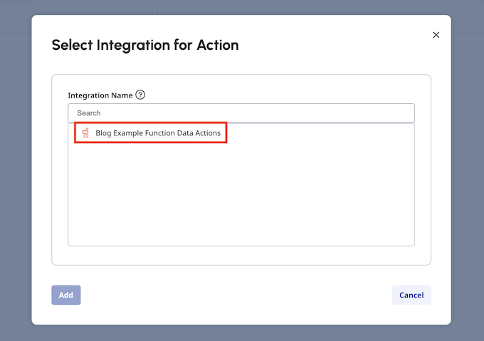

*Give a name to this new Genesys Cloud Function Data Action*


*Once the Data Action is created, we can define its contract and its configuration*

The new Function Data Actions displays an Invalid state. It is expected as we have not defined the Contracts, the Configuration and the Function Configuration yet.


In the Action's Setup tab, select *Contracts*.

*Copy the Input Contract from the ACTION-README.md*


*Copy the Output Contract from the ACTION-README.md*

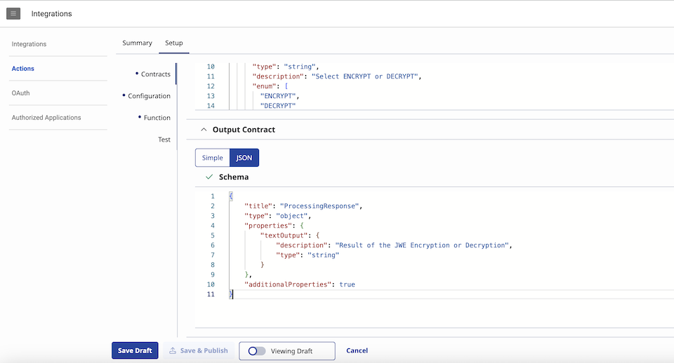

In the Action's Setup tab, select *Configuration*.

*You can see the auto-populated requestUrlTemplate, assigned when the draft is created*

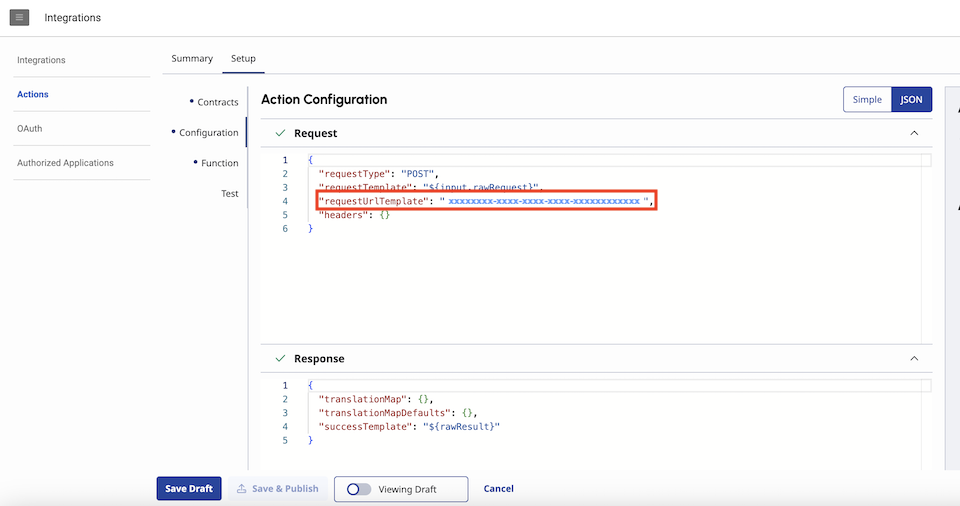

*Copy the Request and Response Configuration from the ACTION-README.md*

You can omit the *requestUrlTemplate* or include it with any value. It is not important as the *requestUrlTemplate* will automatically revert to the value that the Genesys Cloud Function Service automatically assigned to this Data Action.

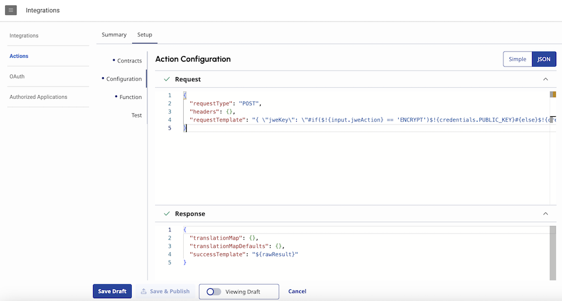

*Once done, click on Save Draft*

The Function Data Actions still displays an Invalid state. It is expected as we have not defined the Function Configuration yet.

***Input and Output contracts***

We have already seen that *jweAction* and *textInput* are defined in the Input contract as input parameters.
```json
{
  "title": "ProcessingRequest",
  "type": "object",
  "required": [
    "jweAction",
    "textInput"
  ],
  "properties": {
    "jweAction": {
      "type": "string",
      "description": "Select ENCRYPT or DECRYPT",
      "enum": [
        "ENCRYPT",
        "DECRYPT"
      ]
    },
    "textInput": {
      "description": "Text to process",
      "type": "string"
    }
  },
  "additionalProperties": false
}
```

In the output contract, we define a *textOutput* property - which will contain the encrypted or decrypted result.
```json
{
  "title": "ProcessingResponse",
  "type": "object",
  "properties": {
    "textOutput": {
      "description": "Result of the JWE Encryption or Decryption",
      "type": "string"
    }
  },
  "additionalProperties": true
}
```

In this Genesys Cloud function,if an error occurs in the code (missing or unset parameters, wrong keys, ...), the code will throw an exception - interepreted as a Data Action failure (HTTP 500) as we have seen earlier in this blog (Error Handling paragraph).

***Request and Response configurations***

Let's now have a look at the example Request and Response configurations.

*Request configuration:*

```json
{
    "requestType": "POST",
    "headers": { },
    "requestTemplate": "{ \"jweKey\": \"#if($!{input.jweAction} == 'ENCRYPT')$!{credentials.PUBLIC_KEY}#{else}$!{credentials.PRIVATE_KEY}#end\", \"jweAction\": \"$!{input.jweAction}\",  \"textInput\": \"$!{input.textInput}\" }"
}
```

In addition to the input we have seen earlier (*jweAction* and *textInput*), you can see above that we also set a *jweKey* in the request body.  
We are in fact referencing the PUBLIC_KEY or PRIVATE_KEY variables that we had defined at the integration level.

You can reference variables defined in the input contract using `$!{input.MY_VARIABLE_INPUT_NAME}`.  
And you can reference variables stored at the integration level using `$!{credentials.MY_INTEGRATION_VARIABLE_NAME}`.

What I have done above can be simplified. This is show that you can leverage velocity as well in your Request configuration. If *jweAction* is set to ENCRYPT, the PUBLIC_KEY will be sent in *jweKey*. If *jweAction* is set to DECRYPT, the PRIVATE_KEY will be sent in *jweKey*.

Let's say we want to encrypt the following text: "This is the text to encrypt". The Event object (`event` in your function handler) will contain:
```json
{
    "jweKey": "THE PUBLIC_KEY WE STORED AT INTEGRATION LEVEL",
    "jweAction": "ENCRYPT",
    "textInput": "This is the text to encrypt"
}
```

*Response configuration:*

We do not need to perform additional processing in the Response configuration, although it would be possible to also leverage velocity macros there.  
We will structure the response directly in our function hadler (sending back a *textOutput* property).
```json
{
    "translationMap": {},
    "translationMapDefaults": {},
    "successTemplate": "${rawResult}"
}
```

:::{"alert":"info","autoCollapse":false}
Note: JSONPath expressionns and the [Velocity macros](https://help.mypurecloud.com/?p=149841) are also available in the Genesys Cloud Function Data Actions.
:::

### Create your code, test it and package it

Let's now have a look at the function code we will upload for this Data Action, and what is also available in the [JWE encrypt-decrypt directory](https://github.com/MyPureCloud/https://github.com/MyPureCloud/quick-hits-javascript/genesys-functions/jwe-encrypt-decrypt/encrypt-decrypt).

`encrypt-decrypt` directory contains:
* *genesysFunctionActionJWEEncryptDecrypt.json* - Data Action contract and configuration
* *function_js* subdirectory (function project in javascript)
* *function_ts* subdirectory (function project in typescript)
* *test* subdirectory (context and event test data for local test)


#### Example Code
*function_js* contains the example code written in javascript (use handler = `src/index.handler`).  
*function_ts* is the same example code written in typescript. The typescript code will need to be transpiled to javascript, building it locally, before creating the zip file (use handler = `dist/index.handler`).  
Developping your function code in javascript or in typescript, is up to you. Your preference.

#### Example package.json
In order to package the code into a zip file that fits AWS lambda needs, we are leveraging the [Serverless Framework (3rd party)](https://www.serverless.com/framework/docs/providers/aws/guide/intro/).  
It is included as a dev dependency in the package.json file. If you prefer to install Serverless Framework globally, it is of course also possible. Again, your preference.

A couple of npm commands are also included in the package.json file, to create the package (the zip) or to test your code.  
`sls package` and `sls invoke local` are commands related to the Serverless Framework.

In package.json:
```json
  "devDependencies": {
    "serverless": "^3.39.0"
  }
```

Installing Serverless globally:
`npm install -g serverless@3`

:::{"alert":"info","autoCollapse":false}
Don't be worried about the Serverless Framework if you are not familiar with it. We are only using it as a tool to create the zip package, that AWS and the Genesys Cloud Functions expect. If you already know how to create such zip for AWS Lambda, without using the Serverless Framework, you can continue to use your preferred method.  
The Serverless Framework is not used inside the Genesys Cloud Function code. This is why you do not need to know a lot about it - only the fact that `sls package` and `sls invoke local` are commands you can use to create the package or test the function locally (given that you have created a serverless.yml file which is leveraged by the Serverless Framework).
:::

#### Example serverless.yml
The serverless.yml file is necessary for the Serverless Framework package process.  
These settings are not leveraged on Genesys Cloud side (you will define them later through the Genesys Desktop Admin UI) but are necessary to create the package. They are also of use when testing the function code locally using the Serverless Framework (`sls invoke local`).

Make sure to define handler and runtime:
* With the javascript example - handler: src/index.handler
* With the typescript example - handler: dist/index.handler
* runtime: nodejs20.x

What you define in name will be used to create/name the zip package.
* name: function-jwe-encrypt-decrypt-action-nodejs

What matters in this file:
```yml
## Define all Functions and Resources in-line
functions:
  echo:
    handler: src/index.handler
    name: function-jwe-encrypt-decrypt-action-nodejs
    description: Genesys Cloud Function for JWE Encrypt and Decrypt
    ## Runtime may be deprecated and need to be updated when using the example.
    runtime: nodejs20.x
```

#### Example Steps

Steps for *function_js*:
* Make sure that you are using NodeJS 20 runtime (the code was built with this runtime version)
* Navigate to the *function_js* directory
* Type: `npm install`
* To package the code and create the zip, type: `npm run package`
This will invoke `sls package`as defined in my package.json file.

Steps for *function_ts*:
* Make sure that you are using NodeJS 20 runtime (the code was built with this runtime version)
* Navigate to the *function_ts* directory
* Type: `npm install`
* To build: `npm run build`
* To package the code and create the zip, type: `npm run package`
This will invoke `sls package`as defined in my package.json file.

Serverless Framework will create a zip and will store it in a `.serverless` subdirectory. This is the file you will need to upload in Genesys Cloud.  
On MAC ".serverless" might will be a hidden directory, use "ls -al" to see in terminal, or (shift-cmd-period) to see in finder.

#### Testing function locally with Serverless Framework

The Serverless Framework has a `sls invoke local` command, allowing to test your function locally (on your computer), before you create the package and upload it. Testing locally will be much easier to troubleshoot errors in the function code.

The `sls invoke local` takes input parameters to set a sample **Context** and a sample **Event** for the function (you can have a look at the package.json to see how the command is invoked).  
The Json files which are included in the `test` subdirectory contain sample values for **Context** and **Event**.  
I have included commands in the package.json so you can test your function with the *context.json* and *data.json*.

With the current JWE Encrypt and Decrypt example, I have defined "aliases" in the package.json so you can run:
* To Encrypt: `npm run localtest1` (an alias to invoke: *sls invoke local --function echo --path ../test/data1.json --contextPath ../test/context.json*)
* To Decrypt: `npm run localtest2` (an alias to invoke: *sls invoke local --function echo --path ../test/data2.json --contextPath ../test/context.json*)

### Explaining example

***The function handler and the function inputs***

Below is the function handler and the gathering of the function inputs in [JWE encrypt-decrypt example](https://github.com/MyPureCloud/https://github.com/MyPureCloud/quick-hits-javascript/genesys-functions/jwe-encrypt-decrypt/encrypt-decrypt).

In the javascript version of the example, we can declare the function handler with *event*, *context* and *callback* - even if we are only going to leverage the *event*.  
All of the necessary inputs of the JWE Encrypt and Decrypt example are sent via the *event*, as we defined them in the Data Action's Request Configuration. That is what we retrieve at the beginning of the function handler (*jweKey*, *jweAction* and *textInput*).
```javascript
exports.handler = async (event, context, callback) => {
    // Retrieve Data Action inputs From Event
    let jweKey = event.jweKey;
    let jweAction = event.jweAction;
    let textToProcess = event.textInput;
```

Typescript is more strict. As we are only leveraging *event*, we need to remove the other function handler's parameters (*context* and *callback*).
```javascript
export const handler: Handler = async (event) => {
    // Retrieve Data Action inputs From Event
    let jweKey = event.jweKey;
    let jweAction = event.jweAction;
    let textToProcess = event.textInput;
```

***Successful Processing***

The example then leverages the methods to encrypt or to decrypt the text content which has been sent via *event*.

What is returned by the fonction must match what you have declared in your Data Action's Response Configuration and Output Contract.  
In this example, we decided not to do any additional processing (i.e. velocity or JsonPath) in the Data Action's Response Configuration. The function response will then need to match what we have declared in our Data Action's Output Contract - a JSON object with a *textOutput* string property.

This is what we can see in the code with:
```javascript
let encrypted = await jweEncrypt(jweKey, textToProcess);
            
return {
    textOutput: encrypted
};
```

***Reporting Error***

If you want to report a Data Action failure (HTTP 500), you can either throw an error. Or you can invoke the *callback* method. This is equivalent.

With an error:
```javascript
    } catch (error) {
        // >> START jwe-encrypt-decrypt-typescript-step-3
        // Alternative to callback to return an error
        // This is for irremediable uncaught errors - we can try to send status via successful response otherwise
        console.error("Handler failed: " + error);
        throw error;
        // >> END jwe-encrypt-decrypt-typescript-step-3
    }
```

With callback:
```javascript
    } catch (error) {
        // >> START jwe-encrypt-decrypt-javascript-step-3
        // Example of using the callback to return an error
        // This is for irremediable uncaught errors - we can try to send status via successful response otherwise
        console.error("Handler failed: " + error);
        callback(error);
        // >> END jwe-encrypt-decrypt-javascript-step-3
    }
```

### Finalize Data Action Function Configuration

Once your package is prepared, we can finalize the Data Action configuration updating the Function Configuration through the Genesys Desktop Admin UI.

In the Action's Setup tab, select *Function*.


Make sure to set your handler:
* the *function_js* example will expect a value of: `src/index.handler`
* the *function_ts* example will expect a value of: `dist/index.handler` (the source code is built/transpiled to javascript into a dist folder)

And to select the proper runtime: `nodejs20.x` (with these JWE Encrypt Decrypt examples)

Set the Data Action timeout: 15 seconds is the maximum allowed (at the time of this blog post).


### Upload the function zip

You can then upload the zip file which has been created using the Serverless Framework package command (`sls package` - zip file created in ".serverless" project's subdirectory).

*Click on the Upload zip button (Function Configuration) and select the function's zip package you have just created.*


*Click on Upload and wait for a few seconds (it takes some time to update the function zip and lambda configuration - be patient)*

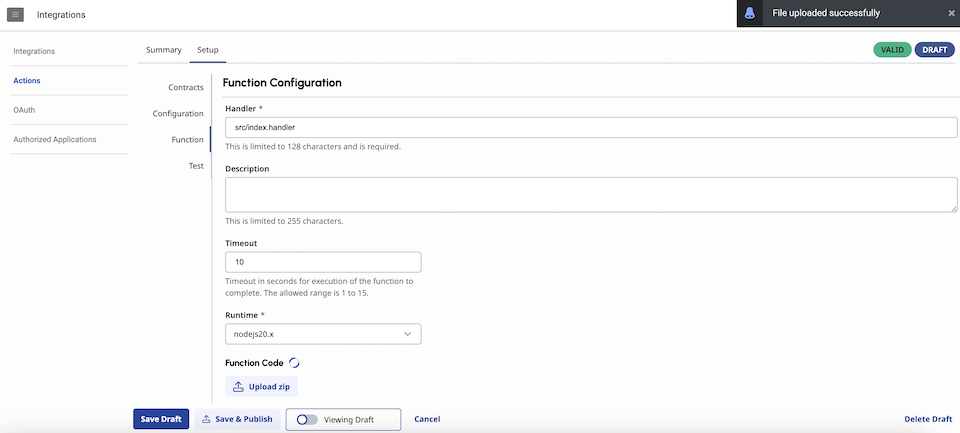

*Once all is updated, the Function code status will be displayed*


*The Function Configuration and status will also be displayed in the Summary tab*

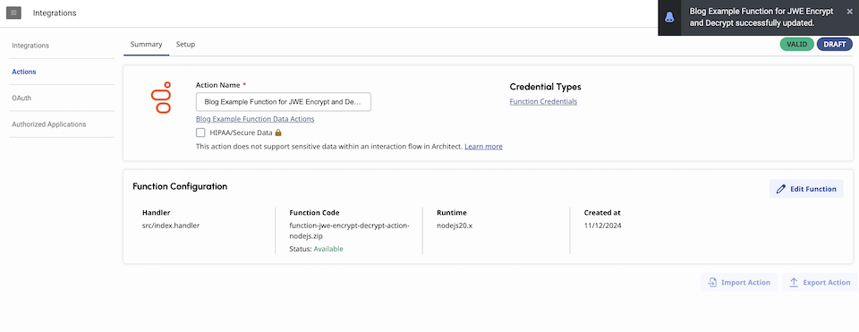

### Ready to test your new Data Action

You are now ready to test your function from the Genesys Desktop Admin UI.

In the Action's Setup tab, select *Test*.

Set the values for your *jweAction* and *textInput* input parameters and click on the *Run Test* button.

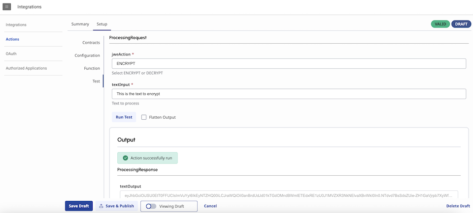

If all went fine, the page will display that the *Action successfully run*.

### JWE Encrypt and Decrypt - Variation with Status

The repository also contains a variation of the example - [JWE encrypt-decrypt-with-status](https://github.com/MyPureCloud/https://github.com/MyPureCloud/quick-hits-javascript/genesys-functions/jwe-encrypt-decrypt/encrypt-decrypt-with-status).

***What is different with this example?***

As I mentionned earlier in this blog, if you have a need for this, you could report errors in your function using a successful Data Action response, instead of raising an error (or invoking the callback method).  
Indeed, when a Data Actions fails (HTTP 500), you don't always have access to the error message and reason from an Architect flow or from a Script.  
If the type of error or the error message are important for the logic you have implemented in your Architect flow or in your Script, you can take the following approach.

Define additional properties in your Data Action's Output Contract (*status* as boolean, and *errorMessage* as string):
```json
{
  "title": "ProcessingResponse",
  "type": "object",
  "properties": {
    "status": {
      "description": "Status of the JWE Encryption or Decryption (false if failed)",
      "type": "boolean"
    },
    "textOutput": {
      "description": "Result of the JWE Encryption or Decryption",
      "type": "string"
    },
    "errorMesssage": {
      "description": "Error Message if JWE Encryption or Decryption failed",
      "type": "string"
    }
  },
  "additionalProperties": true
}
```

In your function code, you would report a successful processing (*status = true*) with something like this:
```javascript
let encrypted = await jweEncrypt(jweKey, textToProcess);
            
return {
    status: true,
    errorMesssage: '',
    textOutput: encrypted
};
```

And you would report an error (*status = false*) with something like this:
```javascript
    } catch (error: unknown) {
        // Example of sending status via successful response otherwise
        if (error instanceof Error) {
            return {
                status: false,
                errorMesssage: error.message,
                textOutput: ''
            };
        } else {
            return {
                status: false,
                errorMesssage: 'Unexpected error',
                textOutput: ''
            };
        }
    }
```

You could then evaluate the *status* variable returned by your Data Action, in your Architect flow or in your Script, to determine if all went fine or if an error occured.

## Closing thoughts

You should be ready now to start playing with the new Genesys Function Data Actions integration and create your own functions and code!

Enjoy!!!

## Additional resources and references
1. [API Explorer](/devapps/api-explorer-standalone)
2. [Genesys Cloud SDK](/devapps/sdk/)
3. [AWS Lambda Function Handler in Node.js](https://docs.aws.amazon.com/lambda/latest/dg/nodejs-handler.html)
4. [Serverless Framework Intro](https://www.serverless.com/framework/docs/providers/aws/guide/intro/)
5. [Serverless CLI reference](https://www.serverless.com/framework/docs/providers/aws/cli-reference)
